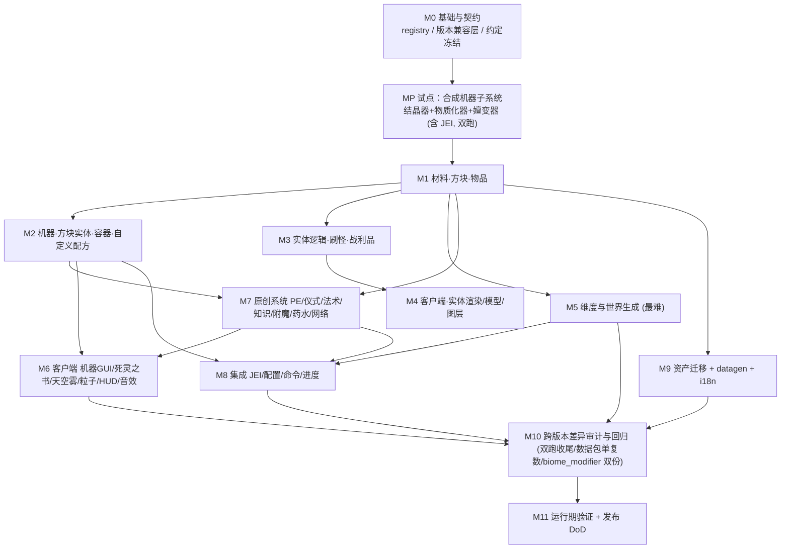

# AbyssalCraft 1.12.2 → 1.20.1 + 1.21.1 移植 — 设计案 (Design Doc)

> 目标：把 AbyssalCraft（Forge 1.12.2, 2.0.0-BETA-7, 884 Java + ~2205 资产）以**单源多加载器**方式重写到 Minecraft **1.20.1 Forge** 与 **1.21.1 NeoForge**。
> 范围内：全部游戏内容与系统的功能对等移植（方块/物品/装备/机器/实体/4 维度/PE 势能/仪式/法术/知识·死灵之书/扰动/附魔/药水/JEI）。
> **非目标 (Non-goals)**：不做美术重制（沿用旧贴图/模型/音效，仅做格式适配）；不做玩法再平衡（先求对等，平衡另立任务）；不移植 1.12 的 InvTweaks/Thaumcraft 软桩（现代版生态已变，降级为可选、后置）；不追加 Fabric 加载器。
> 约束：Stonecutter 0.9.6 + Architectury Loom 1.11 + Gradle 9；Forge 节点 Java 17、NeoForge 节点 Java 21；官方 Mojang 映射 (Yarn/MCP 不用)。

- 关联文档：[总任务表](01-porting-task-plan.md) · [平行任务表](02-porting-parallel-tasks.md) · [子系统规格索引](../spec/README.md)（子系统详细设计写此，不入本设计案）
- 旧版只读源码：`docs/AbyssalCraft-1.12.2/`　详细清单：`docs/index/AC-1.12.2-index.md`
- 开发状态唯一事实来源：仓库根 `DEVELOPMENT.md`
- 通用技能库（动手前先读对应 reference）：`MC_Dev_Skills/references/01..14-*.md`（在 `C:\Users\12044\Documents\EX\IDEA_PROJECT\MC_Dev_Skills`）

---

## 1. 背景 / 问题

AbyssalCraft 是 1.12.2 时代体量最大的克苏鲁主题模组之一：4 个自定义维度、21 个生物群系、大量实体与 BOSS、一套 PE 势能能量网络、仪式/法术/知识（死灵之书）三大原创系统、8 套护甲、5 台自定义机器。

从 1.12.2 到 1.20.1 是 Minecraft 模组史上跨度最大的迁移之一，**不是升级而是重写**。核心断裂点：

- **注册**：`GameRegistry`/`@ObjectHolder`/静态实例 → `DeferredRegister` + 事件总线。
- **扁平化**：元数据/damage 值彻底消失（1.13 The Flattening），metadata 方块/物品需拆成独立方块状态或独立物品。
- **世界生成**：`WorldProvider`/`BiomeProvider`/`ChunkGenerator`/`GenLayer` 全部废弃 → 数据包驱动的 `noise_settings`/`density_function`/`surface_rule`/`multi_noise`/`dimension_type`/`dimension` + `Holder`/`Registry` 代码。**这是本次移植最大、风险最高的部分。**
- **实体渲染**：`ModelBase`/`RenderLiving` → `EntityModel`/`ModelPart`/`LayerDefinition` + `EntityRenderer`，且模型需在 `EntityRenderersEvent` 注册。
- **方块实体/容器/GUI**：`TileEntity`→`BlockEntity`；`Container`→`AbstractContainerMenu`+`MenuType`；`GuiContainer`→`AbstractContainerScreen`。
- **配方**：自定义配方需 `RecipeType`+`RecipeSerializer`；原版配方 JSON 结构小改。
- **网络**：`SimpleNetworkWrapper` → `SimpleChannel`(Forge) / Payload+`PayloadRegistrar`(NeoForge)。
- **能力/配置/药水/附魔**：Capability API 改版；`Configuration`→`ForgeConfigSpec`/`ModConfigSpec`；`Potion`→`MobEffect`；附魔在 1.21 变为数据驱动。
- **数据包目录**：1.20.1 复数 (`loot_tables/`/`advancements/`/`recipes/`/`structures/`)，1.21 单数 (`loot_table/`…)。
- **1.20.1 → 1.21.1 二次断裂**：原版重命名 `new ResourceLocation`→`ResourceLocation.fromNamespaceAndPath`、`AttributeModifier(UUID,…)`→`(ResourceLocation,…)`、`appendHoverText(…,Level,…)`→`(…,Item.TooltipContext,…)`、BE `saveAdditional(tag)`→`(tag,HolderLookup.Provider)` 等。

现状：多加载器脚手架已搭好，两节点 `gradle build` 出 jar（编译/打包/元数据展开已核实），但**运行期加载尚未验证**，且尚无任何注册骨架（`src` 下仅有 `AbyssalCraft.java` 主类）。

## 2. 方案 / 核心原则

**单一 Java 源码树 + Stonecutter 预处理**：绝大多数游戏逻辑跨加载器/跨版本共享，只有真正分叉处用 `//? if forge { … //?} else { … //?}` 隔离。1.20.1↔1.21.1 的原版重命名集中到 3~5 个 helper（`ACRef` 造 `ResourceLocation`、属性/tooltip 适配层），版本升级只碰这几处。

**内容分层、契约先行、按依赖拓扑推进**：先冻结注册/命名/资源目录/接口签名等横切契约（M0），再从"叶子内容"（物品/方块）向"聚合系统"（机器→实体→维度→原创系统→客户端→集成）逐层展开。每一层内部尽量做到文件不重叠，便于多 agent 并行（详见平行任务表）。

**对等优先，先跑通再补全**：以"功能等价 + 能进游戏"为里程碑验收标准，美术/平衡/长尾内容随后迭代。以 `runClient`/`runServer` 无头验证（`MC_Dev_Skills/references/12`）而非"编译通过即完成"作为每个里程碑的真实门槛。

**延后须有硬理由并落为显式任务（已定，2026-07-22）**：**除非有非常必要的原因，否则禁止延后任务。** 允许延后的"硬理由"仅限：①跨版本/加载器的真实深分叉技术风险（如即时模式渲染管线重写）；②未移植的前置内容依赖（发射方/所需物品/实体尚不存在）；③跨 owner 文件归属（须他人 CR 协调）。凡延后**必须**同时满足：(a) 文档写明「延后原因 + 依赖 + 已就位物料」；(b) 分离为**显式可跟踪的后续任务**（如 `PH-xb`）并进总任务表/平行任务表、从父任务反向指针链接；(c) 绝不只留一句"延后"。"能做但麻烦""可能不够完美"**不**构成延后理由——先按对等做出来（这是"先跑通再补全"的边界：可迭代的"补全"项也须是显式任务，而非模糊延后）。

**全程双跑 + 版本兼容层优先（已定，2026-07-20）**：不再"先 forge 后 neoforge"，而是每个 Gate 两节点同时 `build`+`run`。为此把**所有加载器/版本差异收敛到独立的兼容层（compat layer）类**中，常规代码只调用兼容层包装后的接口，绝不直接触碰 Forge↔NeoForge 或 1.20↔1.21 的分叉 API；`//? if forge / >=1.21` 分叉**只允许出现在兼容层内部**（唯一例外是主类 `@Mod`/构造）。兼容层是 M0 的头等交付，是"全程双跑"可行的地基。

**子系统试点优先（已定，2026-07-20）**：M0 之后先**完整交付一个自成一体的子系统 = 自定义合成机器（结晶器+物质化器+嬗变器）**——端到端打通注册/方块实体/菜单/屏幕/自定义配方/JEI 配方+燃料分类/datagen/资产/双加载器，作为后续所有内容的模板与回归基线（里程碑 MP）。验证通过后再按既有里程碑广度铺开。JEI 纳入本轮范围并前移到该试点。

## 3. 架构与关键决策

### 3.1 目标包结构（新建，镜像但现代化旧结构）

```
com.shinoow.abyssalcraft
├─ AbyssalCraft.java              主类（已存在；M0 扩展为注册总装）
├─ platform/                      版本/加载器兼容层（ACRef/ModRegistrar/NetworkChannel/CapabilityAccess/
│                                 EventBuses/MenuCompat/TooltipCompat/AttributeCompat/BlockEntityCompat/
│                                 SideExecutor/DataDirs）——所有加载器/版本分叉只准出现在此
├─ registry/                      DeferredRegister 汇总：ModBlocks/ModItems/ModEntities/
│                                 ModBlockEntities/ModMenus/ModEffects/ModEnchantments/
│                                 ModParticles/ModSounds/ModRecipes/ModCreativeTabs/ModWorldgen…
├─ content/
│  ├─ block/    (baseblocks 族 + 功能方块 + itemblock)
│  ├─ item/     (材料/工具/护甲/杂项/晶体)
│  ├─ blockentity/ + menu/ + recipe/   (机器)
│  └─ entity/   (mob/anti/demon/ghoul/shoggoth/boss/misc/projectile + ai)
├─ world/                         维度/群系/噪声/地表规则/区块生成器/结构/特征/传送门
├─ system/
│  ├─ energy/ (PE 势能 + disruption + 结构 places-of-power)
│  ├─ ritual/ spell/ knowledge/   (三大原创系统 + necronomicon)
│  └─ enchant/ effect/            (附魔 + 药水效果)
├─ net/                           SimpleChannel / Payload 消息
├─ client/                        渲染/模型/图层/屏幕/粒子/天空雾/HUD/字体
├─ integration/jei/              JEI 可选集成
├─ data/                          datagen providers（模型/方块态/配方/战利品/标签/语言/进度）
└─ config/                        ForgeConfigSpec / ModConfigSpec
```

### 3.2 分层依赖（数据/控制流）



关键权衡：

| 决策点 | 选项 | 采纳 | 理由 |
|---|---|---|---|
| 世界生成实现 | (a) 纯数据包 JSON (b) 代码 `ChunkGenerator`/`BiomeSource` (c) 混合 | **(c) 混合**：常规群系/地形走 JSON `noise_settings`+`multi_noise`；确需特殊逻辑（如 Darklands 结构散布、Omothol 平坦城域）保留自定义生成器 | 纯 JSON 覆盖不了 AC 的特殊地形；纯代码违背 1.20 数据驱动方向、维护差 |
| 结构 (36 nbt) | (a) 数据包 jigsaw/`structure` (b) 程序化 `StructureType` | **默认 (a)**，无法用模板表达者退 (b) | 1.20 结构以数据包为主；nbt 模板可复用 |
| metadata 方块拆分 | 拆独立方块 vs 方块状态属性 | **按语义**：同族变体（颜色/朝向）用 `BlockState` 属性；异质方块拆独立注册 | 对齐扁平化，模型/战利品更清晰 |
| 版本/加载器差异 | 散写 `//?` vs 集中兼容层 | **集中兼容层**（`platform/` 一组 compat 类，常规代码只调包装接口，`//?` 只在层内） | 用户已定；全程双跑可行的地基，版本升级只碰一处（`MC_Dev_Skills/ref14` 黄金规则） |
| 迁移顺序 | 广度（所有类型骨架）vs 子系统试点（一个完整子系统先跑通） | **子系统试点优先**：M0 后先完整交付合成机器子系统（MP），作模板与回归基线，再广度铺开 | 用户已定；一次性验证全工具链（含 JEI/双跑），产物供后续复用 |

### 3.3 试点子系统 (MP) 与最小冒烟

M0 末先用"1 方块+1 物品+创造标签进游戏"跑通两节点 `runClient` 做契约冒烟；随后 **MP 完整交付合成机器子系统**（结晶器+物质化器+嬗变器）作为首个可玩子系统与全工具链模板：注册→方块实体→菜单→屏幕→自定义配方+序列化器→JEI 配方/燃料分类→datagen→资产→双加载器兼容层，一次打通。此后各里程碑按此模板批量铺开、全程双跑。

## 4. 依赖

- **硬依赖**：Forge 47.4.4 (MC 1.20.1) / NeoForge 21.1.193 (MC 1.21.1)；Stonecutter；Architectury Loom；Gradle 9 wrapper；JDK 17 与 21（forge 节点的 JDK17 由 foojay 自动下载）。
- **软 / 可选**：JEI（1.20.1 与 1.21.1 各自坐标，`modRuntimeOnly`/`modCompileOnly`，用 `//?` + 反射/软隔离，缺失不影响加载，见 `MC_Dev_Skills/ref10`、`ref11`）。InvTweaks / Thaumcraft 旧软桩**暂不移植**（非目标）。
- **构建期**：datagen（`runData`）产出模型/方块态/配方/战利品/标签/进度，减少手写资产。

## 5. 接口 / 契约（草案 — 将在平行任务表 §2 冻结）

> 以下为跨任务共享面，M0 定稿后其余任务只读、不改。

- **命名 / ID**：沿用旧注册名（保存兼容），如 block `abyssalnite_ore`、item `dreadium_ingot`、entity `depths_ghoul`、dimension `abyssalcraft:abyssal_wasteland`。i18n key：`block.abyssalcraft.*`/`item.abyssalcraft.*`/`entity.abyssalcraft.*`。
- **目录 / 包**：见 §3.1。资产按 1.20 规范：`assets/abyssalcraft/{textures,models,blockstates,lang,sounds,particles,font}`，数据包 `data/abyssalcraft/{loot_tables,advancements,recipes,structures,worldgen,tags}`（1.20.1 复数；1.21 由 datagen 自动出单数）。
- **注册入口**：每类一个 `Mod*` 类持 `DeferredRegister`，统一 `register(modBus)`；主类 `init(IEventBus)` 顺序挂载（对齐旧 `ILifeCycleHandler` 阶段序）。
- **版本/加载器兼容层（冻结签名，业务只调此层）**：`ACRef`(ResourceLocation) · `ModRegistrar`(DeferredRegister/注册表) · `NetworkChannel`(SimpleChannel↔Payload) · `CapabilityAccess`(能力) · `EventBuses`(MOD/GAME 总线) · `MenuCompat`(MenuType) · `TooltipCompat`(appendHoverText) · `AttributeCompat`(AttributeModifier+Operation) · `BlockEntityCompat`(save/load+HolderLookup) · `SideExecutor`(端分派) · `DataDirs`(数据包单复数)。规则：常规代码禁止直接触碰 Forge↔NeoForge 或 1.20↔1.21 分叉 API，一律走兼容层；`//?` 只在层内（主类 @Mod 除外）。
- **网络协议 key**：沿用旧 23 条消息语义；新用 `SimpleChannel`(forge)/`Payload`(neoforge) 双实现同一逻辑。
- **能力 key**：`item_transfer`、`necrodata`（对齐旧 `caps`）。
- **职责边界**：跨全部并行单元的"总装"（注册聚合、主类挂载、JEI 分发、维度装配）集中到各自里程碑的**串行集成任务**，不塞进并行阶段。

## 6. 风险与边界

| 风险 | 级别 | 缓解 |
|---|---|---|
| 世界生成整套废弃、AC 4 维度地形/群系逻辑复杂 | **H** | M5 独立里程碑；先读 `MC_Dev_Skills/ref05/06/07`；先做一个迷你维度竖切；混合方案（JSON+必要代码）；每步 `runServer`+`/data get` 验证 |
| 结构 (36) 从代码生成迁到数据包/jigsaw | **H** | 优先 nbt 模板 jigsaw；复杂逻辑结构退程序化 `StructureType`；可分批，非阻塞主线 |
| 实体渲染全部重写（28 模型/54 渲染/18 图层） | **M** | 模型可用 Blockbench/工具半自动；先注册逻辑（M3）与渲染（M4）解耦，渲染缺失不影响服务端 |
| 1.20.1↔1.21.1 原版重命名蔓延 | **M** | 全部差异收敛到兼容层（业务只调包装接口）；全程双跑每 Gate 两节点验证；每引入一处新 API 就查 `ref14` 差异矩阵 |
| PE 势能/知识/仪式三大原创系统与旧 MC hook 深度耦合 | **M** | 系统逻辑（纯 Java）尽量原样保留，只换 MC 面（注册/事件/能力/网络）；M7 专门里程碑 |
| 运行期加载尚未验证（脚手架仅编译过） | **M** | M0 首要任务即 `runClient`/`runServer` 冒烟；`neoforge.mods.toml` 的 `loaderVersion` 待运行期核实 |
| 资产扁平化（metadata 方块/物品拆分）导致模型/配方/战利品错位 | **M** | 尽量用 datagen 生成而非手改；拆分规则在契约层统一 |
| 多 agent 并行改同一文件冲突 | **L** | 平行任务表文件归属矩阵，同阶段文件不重叠 |
| JEI 等软依赖 dev 运行期坑（remap/JiJ） | **L** | `modRuntimeOnly`、按 `ref11` 处理；JEI 已纳入并前移到 MP 试点先打通，缺失走软隔离不崩 |

**边界 — 明确不做**：不重制美术；不改数值平衡；不移植 InvTweaks/Thaumcraft 集成；不加 Fabric；不保证旧存档可直接升级（datafix 仅尽力，非目标）；不承诺一次到位——按里程碑分批交付、可玩优先。

## 7. 验证状态

| 事项（事实 / API / 假设） | 状态 | 来源 / 如何确认 |
|---|---|---|
| 多加载器脚手架两节点 `gradle build` 出 jar、元数据展开正确 | 已验证 | `DEVELOPMENT.md` §7（解包 jar 核实） |
| 运行期加载（服务端 `runServer` 进游戏，两节点） | **已验证 2026-07-21** | 两节点 `runServer` 均 mod 构造（`AbyssalCraft … starting up`）+ 全注册表启动 + `Done`（判据 = run 日志/退出码）；客户端 `runClient` 仍待跑 |
| `neoforge.mods.toml` `loaderVersion="[4,)"` | **已验证 2026-07-21**（R4） | NeoForge 21.1.193 / FML loader 4.0.41 运行期接受，mod 正常加载至 `Done (4.093s)` |
| 1.20 数据包复数目录 / 1.21 单数 | 已验证（技能库实测） | `MC_Dev_Skills/ref07`、`ref14` |
| 1.21 原版重命名清单（ResourceLocation/AttributeModifier/appendHoverText/BE save） | 已验证（技能库实测） | `MC_Dev_Skills/ref14` |
| 世界生成 JSON schema（noise_settings/surface_rule/multi_noise） | 部分待验证 | 逐维度按 `ref05/06` 实做 + `runServer` 验证 |
| AC 自定义 `ChunkGenerator` 能否降级为纯数据包 | 待验证 | M5 逐维度评估，默认混合 |
| 结构能否全部用 nbt jigsaw 表达 | 待验证 | M5 逐结构评估 |
| DeferredRegister/MenuType/EntityModel/MobEffect 等现代 API 签名 | 待验证（逐处） | 实做时对照 `ref02/03/08/13/14` + 编译器 |

> 说明：本设计案是**移植计划**，非"已完成/已跑通"的陈述。除"脚手架构建"外，任何"能加载/能运行"均以后续 `runClient`/`runServer` 为准。

## 8. 待决问题（需用户或调研拍板）

> 2026-07-20 用户已定 1–3；4–5 默认待确认。

1. **交付优先级** —【已定】**子系统试点优先**，首个完整交付 = 自定义合成机器子系统（MP：结晶器+物质化器+嬗变器）。
2. **两加载器节奏** —【已定】**全程双跑**，差异全部收敛到 M0 版本兼容层（业务只调包装接口）；原 M10 降为审计/回归。
3. **JEI / 软依赖** —【已定】**纳入本轮**，前移到 MP 试点先打通，其余分类 M8 补齐。
4. **存档兼容 / datafix**：是否需要 1.12→1.20 存档迁移的尽力支持？（默认否，待确认）
5. **美术**：确认沿用旧贴图/模型/音效仅做格式适配（默认是，待确认）。

## 9. 关键骨架（最高风险处）

```java
// platform/ACRef.java — 集中原版重命名，版本升级只碰这里
public final class ACRef {
    public static ResourceLocation id(String path) {
        //? if >=1.21 {
        /*return ResourceLocation.fromNamespaceAndPath(AbyssalCraft.MODID, path);
        *///?} else {
        return new ResourceLocation(AbyssalCraft.MODID, path);
        //?}
    }
}
```

```java
// registry/ModBlocks.java — 冻结的注册模式（其余 Mod* 类照此）
public final class ModBlocks {
    public static final DeferredRegister<Block> BLOCKS =
        DeferredRegister.create(BuiltInRegistries.BLOCK, AbyssalCraft.MODID);
    public static final DeferredHolder<Block, Block> ABYSSALNITE_ORE =
        BLOCKS.register("abyssalnite_ore", () -> new ACOreBlock(/* props */));
    public static void register(IEventBus bus) { BLOCKS.register(bus); }
}
```

维度链（M5）最小骨架顺序：`dimension_type` JSON → `noise_settings` JSON → `BiomeSource`(multi_noise 或自定义) → `ChunkGenerator`(优先 `NoiseBasedChunkGenerator` 子类) → `dimension` JSON → `DimensionSpecialEffects`（注册 key 必须等于 `dimension_type` 的 `effects` 字段，`ref09`）→ 传送门/`Teleporter`。

## 修订日志

- 2026-07-20 — 修订（用户决策落地）：①子系统试点优先 → 新增 MP 里程碑（合成机器子系统，含 JEI）；②全程双跑 + 版本兼容层优先（差异全收敛到 `platform/` compat 层，业务只调包装接口，`//?` 只在层内）；③JEI 纳入并前移到 MP。原 M10"neoforge 拉平"降级为"跨版本审计与回归"。
- 2026-07-20 — 初稿：确立分层里程碑 M0–M11、混合世界生成方案、集中式 1.21 重命名 helper、最小竖切先行策略。
