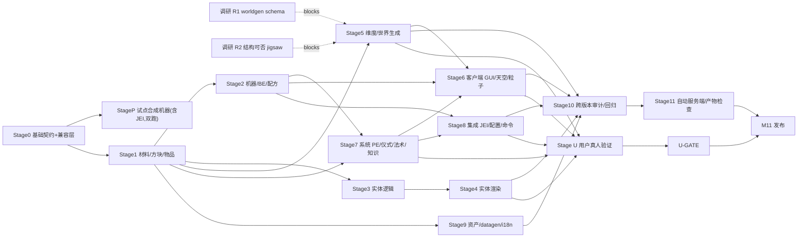

# AbyssalCraft 1.12.2 → 1.20.1 + 1.21.1 移植 — 总任务表 (Master Task Plan)

> 来源：[设计案](00-porting-design.md)。范围：AbyssalCraft 全内容与系统的功能对等移植到 1.20.1-forge + 1.21.1-neoforge。
> 状态图例：☐ 未完成 · ☑ 已完成 · ⛔ 阻塞。复杂度：S / M / L。**不给时间估算**（用复杂度 + 依赖表达工作量）。
> 并行执行细则见：[平行任务表](02-porting-parallel-tasks.md)；必须由真人完成的交互/视觉/听觉验收统一见：[用户验证车道](03-user-validation-plan.md)。旧版参考（只读）：`docs/AbyssalCraft-1.12.2/`。
> 路径中 `.../` 均为规划中的新路径，根 `src/main/java/com/shinoow/abyssalcraft/`。
> 子系统详细设计 / 记忆见：[子系统规格索引](../spec/README.md)；本表只留任务勾选 / 验收 / 依赖 / 文件归属，不复制子系统细节。
>
> **状态审计规则（2026-07-23）**：不再使用“部分完成”。原任务同时包含已落地框架/试点与未落地内容时，原 ID 收窄为可独立验收的已完成切片，剩余范围拆为 `b/c/...` 后缀待办；标题屏加载、注册成功、占位实现和 self-test 不替代原版功能、游戏内交互或视觉验收。
>
> **用户验证隔离规则（2026-07-27）**：Agent 实现任务和 R4-R7 自动/代码 Gate 不依赖任何 `U-*`。真人矩阵只依赖已完成的 AUTO/CODE Gate，并仅汇入最终 `U-GATE`；失败时新建 `FIX-U-*` 交回源码 owner，修复后重跑自动 Gate 与原用户矩阵，不把依赖箭头倒回原实现任务。

## 交付策略（已定，2026-07-20）

1. **子系统试点优先**：M0 之后先完整交付 **MP · 自定义合成机器子系统**（结晶器+物质化器+嬗变器，含 JEI），作为全工具链模板与回归基线；再按 M1→M11 广度铺开。
2. **全程双跑**：每个 Gate 两节点（1.20.1-forge + 1.21.1-neoforge）同时 `build`+`run`，不延后 neoforge。
3. **版本兼容层优先**：所有加载器/版本差异收敛到 M0 的独立 compat 层类，常规代码只调包装接口，`//?` 分叉只在 compat 层内部。因此原 M10 由"neoforge 拉平"降级为"跨版本差异审计与回归收尾"。
4. **JEI 纳入**本轮范围（前移到 MP，其余分类在 M8 补齐）。
5. **真人验收独立**：用户不拥有生产文件；Agent 可在用户尚未测试时继续后续实现阶段，只有发布 M11 必须等待 `U-GATE`。

## 里程碑 (Milestones)

| 里程碑 | 目标（可交付、可验证） | 阶段 |
|---|---|---|
| M0 | 脚手架运行期跑通 + **版本兼容层** + 注册/契约骨架 + 最小冒烟（1 方块+1 物品进游戏，双跑） | Stage 0 |
| **MP** | **试点：自定义合成机器子系统**（结晶器+物质化器+嬗变器）端到端完整交付（BE/菜单/屏幕/自定义配方/**JEI**/datagen/资产/双加载器）——全工具链模板与回归基线 | Stage P |
| M1 | 材料·建材方块·矿石·装饰·工具·护甲·物品 + 配方/标签，创造栏可取用 | Stage 1 |
| M2 | 机器框架泛化 + 剩余机器（研究桌/顺序酿造台）+ 方块实体 + 容器菜单 + 5 类自定义配方 + 物品转移能力（3 台合成机器已在 MP 交付） | Stage 2 |
| M3 | 全部实体注册/属性/AI/刷怪/战利品（服务端可生成） | Stage 3 |
| M4 | 全部实体/护甲/BE 渲染（客户端可见） | Stage 4 |
| M5 | 4 维度 + 21 群系 + 地表/噪声 + 结构 + 特征 + 传送门（可传送、可生成） | Stage 5 |
| M6 | 机器 GUI + 死灵之书 + 天空雾 + 粒子 + 音效 + HUD | Stage 6 |
| M7 | PE 势能 + 扰动 + 仪式 + 法术 + 知识 + 附魔 + 药水 + 网络（系统可玩） | Stage 7 |
| M8 | JEI + 配置 + 命令 + 进度集成 | Stage 8 |
| M9 | 全资产迁移 + datagen + 8 语言 i18n | Stage 9 |
| M10 | 跨版本差异审计与回归收尾（因全程双跑，仅审计兼容层无遗漏 / 数据包单复数 / biome_modifier 双份 / 两节点回归） | Stage 10 |
| U-GATE | 全部真人交互、视觉、听觉与最终客户端矩阵 | Stage U（独立非代码车道） |
| M11 | 两节点运行期验证矩阵 + 发布 DoD + 回写 DEVELOPMENT.md | Stage 11 |

---

## Stage 0 · 基础与契约 → M0

| ID | 任务 | Cx | 依赖 | 验收标准 | 文件 |
|---|---|---|---|---|---|
| ☑ T0.1 | 脚手架运行期冒烟：两节点 `runClient`/`runServer` 加载，核实 `neoforge.mods.toml` loaderVersion | M | — | forge+neoforge 服务端抵 `Done`，客户端抵标题屏；不声称已建世界或完成可视交互 | build.gradle.kts, META-INF/*.toml（如需修） |
| ☑ T0.2 | **版本/加载器兼容层**：ACRef/ModRegistrar/NetworkChannel/CapabilityAccess/EventBuses/MenuCompat/TooltipCompat/AttributeCompat/BlockEntityCompat/SideExecutor/DataDirs（业务只调包装接口，`//?` 只在层内） | L | — | 两加载器编译；各 compat 类各出正确结果；业务代码零直接分叉 API | platform/** |
| ☑ T0.3 | 注册骨架：注册聚合 `ModRegistries.ALL` + 主类挂载（各内容 `Mod*` 随其任务落地） | M | T0.2 | `./gradlew :1.20.1-forge:build` 通过；主类 `init` 挂载所有 register | registry/Mod*.java, AbyssalCraft.java |
| ☑ T0.4 | 创造模式标签 `CreativeModeTab`（替换旧 `ACTabs`） | S | T0.3 | 游戏内出现 AC 标签页（空） | registry/ModCreativeTabs.java |
| ☑ T0.5 | 配置骨架 `ForgeConfigSpec`/`ModConfigSpec`（替换旧 `ACConfig`） | M | T0.2 | 已验证：两节点 `runServer` 生成 `abyssalcraft-common.toml`，默认值可读回 | config/ACConfig.java + platform/ConfigCompat.java |
| ☑ T0.6 | 资源约定：pack.mcmeta、数据包目录骨架、`en_us.json` 起点 | S | — | 资源包被识别，无 pack 报错 | src/main/resources/** |
| ☑ T0.7 | 最小竖切代码/资产加载（历史验证，生产已退役） | M | T0.3,T0.4,T0.6 | M0 时曾以 demo 验证注册/模型/lang 链；正式内容闭合后已移除 demo registrar、代码、创造页、资产、loot 与语言键，生产引用=0 | 历史证据见 DEVELOPMENT/CR-5 |
| ☑ T0.8 | datagen 基建：`GatherDataEvent` + 各 Provider 空壳 | M | T0.3 | `./gradlew :1.20.1-forge:runData` 成功产出示例文件 | data/*.java |

> Gate M0 ☑：两节点 build/runServer/runClient 加载链与最小竖切资源成立，兼容层契约冻结；可视放置归最终人工矩阵。

## Stage P · 试点：自定义合成机器子系统 → MP

> 首个完整交付的自成一体子系统；端到端打通全工具链，作为后续所有内容的模板与回归基线。**全程双跑**，JEI 纳入。

| ID | 任务 | Cx | 依赖 | 验收标准 | 文件 |
|---|---|---|---|---|---|
| ☑ TP.1 | 试点材料/晶体物品最小集 | S | M0 | `pilot_crystal`、`pilot_fuel` 已注册，模型与名称资源存在 | content/item/crystal/*, assets models/lang |
| ☑ TP.2 | 共享 3 槽机器 BE 框架 + 三机器类型/tick/NBT 字段 | M | M0 | 三机器 BlockEntityType 注册，服务端 tick 与基础槽位/计时字段可编译加载 | content/blockentity/base/*, content/machine/{crystallizer,materializer,transmutator}/* |
| ☑ TP.2b | 三机器持久化引擎与服务端重启验证 | M | TP.2 | 三机器槽位/NBT schema、计时与 XP ledger 双端 self-test；NeoForge 远区块卸载→重启→冻结后精确恢复 `Progress=80/BurnTime=2321` 与输入槽 | 三机器 BE + `MachineSelfTest` |
| ☑ TP.2c | 双端活会话持久化矩阵 | M | TP.2b,TP.4c | Forge+NeoForge 均以联网玩家在加工中关闭 GUI、离开并卸载区块、断线、停服重启、同名重连重开 GUI；Neo `129/200`、`672/2400` 与 Forge `80/200`、`2121/2400` 的槽位/计时/XP ledger 在重启前后逐字段一致 | 双端联网验证矩阵 |
| ☑ TP.3 | 三类试点 `RecipeType`/serializer（单输入→单输出） | M | TP.2 | 三类 ID/serializer 已注册，试点 JSON 可 `/reload` 且机器可查询 | content/recipe/base/*, registry/ProcessingRecipes |
| ☑ TP.3b | 恢复三类旧版完整配方形状 | L | TP.3 | 结晶双输出+XP、物质化 1–5 counted crystal 输入、嬗变 XP 已集中注册；双端 codec/stream codec、`runData` self-test 与服务端加载通过 | content/recipe/*, platform/*RecipeSerializer |
| ☑ TP.4 | 三机器 MenuType、共享菜单与三个 Screen 注册 | M | TP.2 | 三菜单/屏幕接线存在，客户端资源可加载 | content/menu/*, client/screen/machine/* |
| ☑ TP.4b | 三机器专用菜单、槽位/shift-click 规则与同步代码 | M | TP.4,TP.3b | 两计时机输出拒绝插入、燃料白名单与 recipe-input 路由；Materializer 2+18+36 槽/分页；四计时字段同步与客户端注册双端编译/烘焙通过 | content/menu/*, client/screen/machine/* |
| ☑ TP.4c | 三机器活玩家 GUI/shift-click/XP 验收 | M | TP.4b,T2.4c,T2.5c | 两节点真实联网 Screen 均完成 Bag/三机器逐槽手放、shift-click、Materializer 结果页、网络取出、玩家 XP 与火焰/箭头同步；重启后 Crystallizer Screen 比例与服务端 NBT 精确一致 | 双端联网客户端矩阵 |
| ☑ TP.5 | JEI 三处理分类 + 催化剂 + 软依赖接线 | M | TP.3 | 3 处理分类已注册，缺 JEI 不崩 | integration/jei/* |
| ☑ TP.5b | JEI 燃料分类与完整机器布局 | M | TP.3b,TP.4b | 12 分类自动目录覆盖 3 处理类、两燃料、rending、仪式与 spell；布局/催化剂/转移决策由永久 JEI Gate 冻结，真人可见性归 U-JEI | integration/jei/* |
| ☑ TP.6 | 试点 datagen/资产基础 | M | TP.2,TP.3 | 27 条双目录试点配方、基础 blockstate/model/item model、loot/lang 已存在并可加载 | data/gen/MachineRecipeData, assets/* |
| ☑ TP.6b | 三机器忠实资产与完整数据 | M | TP.3b | 三机器 block/model/state 与完整配方进入全局资产/数据闭包；`machines=3`、资产/数据 `missing=0` | data/gen/Pilot*, assets/* |
| ☑ TP.7 | 双加载器启动/注册/资源烘焙冒烟 | M | TP.1-TP.6 | 两节点 build/runClient 历史记录显示三机器与 JEI 插件可加载、模型烘焙无错 | 验证记录 |
| ☐ TP.7b | 双加载器试点全流程真人矩阵别名 | M | TP.2b,TP.4b-TP.6b | 由 U-GUI/U-JEI 统一执行；本行不作为任何 Agent Gate 前置 | 用户验证车道 U-GUI/U-JEI |

> Gate MP-BASE ☑：三机器试点代码、注册、资源与 JEI 加载链已形成可复用模板。  
> Gate MP-FUNCTIONAL ☐：TP.2c/4c/5b/6b/7b 全部完成后，三机器忠实功能与双端交互方可验收。

## Stage 1 · 材料·方块·物品 → M1

| ID | 任务 | Cx | 依赖 | 验收标准 | 文件 |
|---|---|---|---|---|---|
| ☑ T1.1 | 材料/晶体物品注册切片 | M | M0 | 39 基础材料 + 26×3 crystal/shard/fragment = 117 物品已注册并有名称/基础模型 | content/item/material/* |
| ☑ T1.1b | 26 个 crystal cluster 方块与 BlockItem | M | T1.1 | 26 cluster 注册、形状、染色/命名、创造栏、双目录 loot/tag 与 52 条往返配方齐全；双端 `runData`/客户端烘焙通过 | content/block/material/*, data/gen/CrystalClusterRecipeData |
| ☑ T1.2 | 食物属性与杂项物品注册 | M | M0 | 15 食物 + 9 杂项已注册；nutrition/saturation 经 `FoodCompat` | content/item/misc/* |
| ☑ T1.2b | 食物特殊效果与完整物品交互 | M | T1.2,T7.10b | Forge/Neo 真实 ServerLevel 覆盖 8 种效果食物与 2 种解毒剂、10 剂量及最终玻璃瓶 | content/item/misc/*, system/effect/* |
| ☑ T1.3 | 建材方块注册与基础模型切片 | L | M0 | 86 核心块 + 16 ctor 分叉变体已注册；基础 blockstate/model datagen 可解析 | registry/BaseBlocks, data/gen/BaseBlockData, platform/BlockFactory |
| ☑ T1.3b | 建材专属行为与状态契约 | M | T1.3,T5.5 | 两树苗实际长成对应 AC log；门/栅栏门/按钮/压板使用对应 vanilla 行为类，树叶与轴向状态/模型契约双端通过 | registry/BaseBlocks, platform/BlockFactory, world/feature/* |
| ☐ T1.3c | 建材双端活玩家矩阵别名 | S | T1.3b | 由 U-CONTENT 统一执行；本行不作为任何 Agent Gate 前置 | 用户验证车道 U-CONTENT |
| ☑ T1.4 | 13 矿注册 + 基础掉落/采集标签 | M | T1.1 | 13 矿、BlockItem、基础 loot 与 pickaxe/iron/diamond 标签存在并可加载 | content/block/ore/*, data tags/loot |
| ☑ T1.4b | 矿石忠实掉落与采集矩阵 | M | T1.4,T1.6b | 13 矿普通/Silk Touch、6 材料矿 Fortune III、数量边界与正确/错误工具矩阵均以真实 `Block.getDrops` 双端通过 | data/gen/OreLootData, data tags/block/* |
| ☑ T1.5 | 29 装饰/素功能方块注册与方向状态 | L | M0 | 17 FACING + 10 素块 + 2 植物及其 BlockItem 已注册 | content/block/deco/* |
| ☑ T1.5b | 装饰方块专属形状/存活/功能 | L | T1.5 | 墓碑/雕像/mural 形状、草退化传播阈值、muck 0.8 水平减速、植物土壤与 thorn 护甲判定按旧版实现；多面草沙/tint 与 29 套基础模型双端烘焙、自测通过 | content/block/deco/*, data/gen/DecoBlockData |
| ☐ T1.5c | 装饰行为双端活玩家矩阵别名 | S | T1.5b | 由 U-CONTENT 统一执行；最终雕像/墓碑高保真几何仍归 T9.2b；本行不作为任何 Agent Gate 前置 | 用户验证车道 U-CONTENT |
| ☑ T1.6 | 20 工具注册、属性、耐久与修理料 | M | T1.1 | 4 tier×5 工具已注册，基础数值取自旧 API | content/item/tool/*, platform/ToolCompat |
| ☑ T1.6b | 工具真实采集分级数据 | M | T1.4 | 1.21 四级 `incorrect_for_*` 与 Forge harvest tier 映射区分 4 个 AC tier；13 矿×tier 标签矩阵双端 PASS | platform/ToolCompat, data tags/block/* |
| ☐ T1.6c | 工具逐级活玩家挖矿矩阵别名 | S | T1.6b | 由 U-CONTENT 统一执行；本行不作为任何 Agent Gate 前置 | 用户验证车道 U-CONTENT |
| ☑ T1.7 | 7 套材料 + 28 护甲物品属性注册 | L | T1.1 | 防御/韧性/耐久/修理料按旧定义注册；渲染另见 T4.5* | content/item/armor/*, platform/ArmorCompat |
| ☑ T1.8 | 当前内容方块的普通 `BlockItem` 注册 | S | T1.3,T1.5 | 已注册方块均有对应普通 BlockItem（非物品化方块除外） | registry/BaseBlocks, content/block/{ore,deco}/* |
| ☑ T1.8b | `ItemBlockColorName` 现代内容等价颜色命名 | S | T1.8 | 旧版清单中现代已注册的 25 个对象由 `ColoredBlockItem` 保留 BLUE/AQUA/DARK_AQUA/DARK_RED 语义；双端精确 self-test 通过 | content/block/item/*, lang |
| ☑ T1.8c | `odb_core` 颜色命名 | S | T1.8b,T7.5b | 真实 `OblivionDeathbombCoreBlock` 与 primed 实体已注册，BlockItem 使用 `DARK_RED`，并由 `ContentSelfTest` 精确核对名称颜色 | content/block/item/*, system/disruption/* |
| ☑ T1.9 | 4 材料存储块往返配方（8 条） | S | T1.1,T1.3 | 8 条 shaped/shapeless 配方双目录存在，两端 JSON 格式可加载 | data/abyssalcraft/{recipe,recipes}/* |
| ☑ T1.9b | 旧版 crafting JSON 对账与迁移 | L | T1.1-T1.8 | 401 个有效配方四态闭包：339 迁移/61 替代/1 阻塞/0 淘汰；唯一阻塞为需明确现代实体选择语义的通用 spawn egg；第 402 个 JSON 为 constants 输入；所有可迁移项双端真实 RecipeManager 通过 | data/gen/LegacyCraftingRecipeData, docs/spec/rr-data-crafting-audit.csv |
| ☑ T1.9c | 代码注册的 smelting/回收配方迁移 | M | T1.9b | 53 项四态闭包：52 迁移/1 替代/0 阻塞；多产物与护甲回收在双端真实 RecipeManager 通过 | data/gen/CookingRecipeData, docs/spec/rr-data-smelting-audit.csv |
| ☑ T1.10 | 13 矿基础采集标签 | S | T1.4 | pickaxe + needs_iron/diamond 标签双目录资源存在 | data tags/block/* |
| ☑ T1.10b | 完整 M1 方块/物品标签 | M | T1.3-T1.5 | 181 个逻辑 tag生成351文件；公共tag双写、11个loader专属tag仅写对应目录；完整覆盖并经注册表/配方消费校验 | data/gen/ACTagData, data tags/* |

> Gate M1-BASE ☑：当前材料、方块、工具、护甲注册与 7 个创造栏分组已形成基础内容集。  
> Gate M1-CONTENT ☐：T1.*b/c 清零，全部内容、配方、标签、掉落与交互才算完成。

## Stage 2 · 机器·方块实体·容器·自定义配方 → M2

> **结晶器/物质化器/嬗变器已在 MP 完整交付**；本阶段复用 MP 的"机器竖切模板"做框架泛化 + 剩余机器（研究桌/顺序酿造台）+ 物品转移能力。T2.3–2.5 归口 MP。

| ID | 任务 | Cx | 依赖 | 验收标准 | 文件 |
|---|---|---|---|---|---|
| ☑ T2.1 | `BlockEntityType` 注册 + 基类（TEDirectional / 单例库存等价） | M | M1 | BE 注册、tick 生命周期正常 | content/blockentity/base/*, registry/ModBlockEntities |
| ☑ T2.2 | 5 个自定义配方 type ID；anvil/rending 完整 serializer | L | T2.1 | 五类 ID 可发现，anvil/rending JSON 与网络 serializer 可加载 | content/recipe/*, registry/ModRecipes, platform/*RecipeSerializer |
| ☑ T2.2b | 三试点配方集中化与完整形状 | L | T2.2,TP.3b | 三类 type/serializer 由 `ModRecipes` 唯一持有，不再由 `ProcessingRecipe` alias 自持；完整 shape/XP/codec 双端通过 | content/recipe/*, registry/ModRecipes |
| ☑ T2.3 | 3 槽炉式试点 Crystallizer | M | T2.1,T2.2 | 方块/BE/菜单/屏幕/单输出加工链存在（映射 TP.2-TP.4） | content/machine/crystallizer/* |
| ☑ T2.3b | 忠实 Crystallizer 引擎 | L | T2.2b | 4 槽双输出、专用燃料/remainder、sided hopper+双 loader capability、FACING/LIT、按 recipe ID 的双输出 XP ledger、槽校验与 NBT 已实现；Neo 实际加工双输出通过 | content/machine/crystallizer/* |
| ☑ T2.3c | Crystallizer 自动化与菜单回归 | M | T2.3b | 结果槽拒绝插入、fuel shift-click、双输出 XP ledger 单次消费、自动提取消耗 ledger、上/侧/下槽面与双 loader capability 由生产路径 self-test/build 覆盖 | content/machine/crystallizer/*, MachineSelfTest |
| ☑ T2.3d | Crystallizer 活玩家/视觉矩阵 | S | T2.3c,TP.4c | 两节点真实 Screen 普通放入输入、shift-click 燃料、双输出网络取出并获得 XP，进度/燃烧视觉与重开同步通过；输出堵塞、remainder、hopper/双 loader capability 由同一生产路径 self-test 补齐 | 联网客户端矩阵 + MachineSelfTest |
| ☑ T2.4 | 3 槽炉式试点 Materializer | M | T2.1,T2.2 | 方块/BE/菜单/屏幕/单输入加工链存在 | content/machine/materializer/* |
| ☑ T2.4b | 忠实 Materializer 引擎 | L | T2.2b | 旧 550 真义重构为 bag/book 2 真实槽 + 18 虚拟结果分页（无 548 上限）；四级 Bag 数据层、1–5 晶体事务扣除、recipe-ID 重验、专用菜单/Screen 与旧三槽安全迁移已双端 self-test | content/machine/materializer/*, content/item/bag/* |
| ☑ T2.4c | Materializer 可玩输入链与菜单回归 | M | T2.4b,T2.8b | Crystal Bag 独立入口、bag/book shift-click、1–5 晶体事务扣除、分页/普通与批量代码路径、迁移与重载持久化双端 self-test 通过 | content/item/bag/*, content/machine/materializer/* |
| ☑ T2.4d | Materializer 活玩家矩阵 | S | T2.4c,TP.4c | 两节点真实 Screen 均以普通点击放 Bag、shift-click 放 Necronomicon，并从虚拟结果槽经网络制作；分页、普通/批量与并发事务重验由生产菜单 self-test 覆盖，Bag 关闭重开与重连持久化通过 | 联网客户端矩阵 + MachineSelfTest |
| ☑ T2.5 | 3 槽炉式试点 Transmutator | M | T2.1,T2.2 | 方块/BE/菜单/屏幕/单输出加工链存在 | content/machine/transmutator/* |
| ☑ T2.5b | 忠实 Transmutator 引擎与已注册燃料 | L | T2.2b | 三槽 200 tick、固体燃料白名单、容器返还、sided hopper+双 loader capability、FACING/LIT、recipe-ID XP ledger、槽校验/NBT 已实现；任意物品/煤拒绝，Neo stone→darkstone 实际加工通过 | content/machine/transmutator/* |
| ☑ T2.5c | 缺失燃料内容与 Transmutator 自动化回归 | M | T2.5b,T1.1b | Liquid Coralium source/flowing/block/bucket/capability、10 次 Transmutation Gem 与 carbon cluster 已注册；精确 burn/remainder、fuel shift-click、XP ledger、槽面/capability 双端 self-test 与客户端资源 smoke 通过 | content/item/material/*, platform/LiquidCoraliumCompat, MachineSelfTest |
| ☑ T2.5d | Transmutator 活玩家/视觉矩阵 | S | T2.5c,TP.4c | 两节点真实 Screen 普通放入输入、shift-click Liquid Coralium bucket、网络取出 20 输出、空桶返还与玩家 XP 通过，进度/燃烧视觉同步通过；其余新增燃料、hopper/双 loader capability 由精确生产路径 self-test 补齐 | 联网客户端矩阵 + MachineSelfTest |
| ☑ T2.6 | Research Table 方块/BE/零内容槽菜单 | M | T2.1 | 旧容器同样只有玩家背包；现代方块、BE 与菜单链已接入 | content/machine/researchtable/* |
| ☑ T2.6b | Research Table 专用 GUI 与交互验收 | M | T2.6 | 176×238 专用布局、朝向/形状/亮度/粒子与旧资源已恢复；Forge/Neo 真实联网 Screen、36 槽玩家库存往返点击、截图目视与标题对比度通过 | content/machine/researchtable/*, client/screen/machine/researchtable/*, assets research_table |
| ☑ T2.6c | Research Table 羽毛 BER | S | T2.6 | 羽毛按方块朝向在桌面上方忠实渲染；Forge/Neo 总场景四朝向模型烘焙与游戏内视觉通过 | client/render/block/* |
| ☑ T2.7 | Sequential Brewing Stand 8 槽核心与输出链 | M | T2.1 | vanilla brewing + 每 20t 向朝向邻机传递输出的代码与存档字段存在 | content/machine/brewing/* |
| ☑ T2.7b | 顺序酿造完整语义 | M | T2.7 | 8 槽约束、WorldlyContainer 面、容器余留物、brewing hook、输出堵塞与 400t GUI 已恢复；双端连续两级酿造 820t、真实 Screen shift-click/燃料/进度/产出通过 | content/machine/brewing/* |
| ☑ T2.8 | MenuType/菜单基类 + 五台机器菜单 | M | T2.1 | `ContainerMenuBase`、`ItemContainerMenu`、五机器菜单与泛化 open buffer API 已注册 | content/menu/*, registry/ModMenus |
| ☑ T2.8b | Crystal Bag 物品容器 | M | T2.8 | 四级 18/36/54/72 Bag 右键入口、专用菜单/Screen、仅晶体槽、宿主槽锁定、shift-click、服务端持久化与升级容量回归双端通过 | content/item/bag/*, client/screen/item/* |
| ☑ T2.8c | Spirit Tablet 物品容器 | M | T2.8,T2.9 | 5 槽过滤入口、专用菜单/Screen、主手宿主槽锁定、两种过滤开关、组件/耐久语义与服务端持久化完整；双端真实主副手重开和按钮/槽位网络矩阵通过 | content/item/transfer/*, client/screen/item/SpiritTabletScreen |
| ☑ T2.8d | Spellbook 物品容器 | M | T2.8,T7.7b | 手持 Necronomicon 打开的 7 槽菜单（卷轴+5试剂+只读输出）、专用 Screen、无序试剂/parent/knowledge/tier 服务端重验、原子取出、关闭返还、源书手/槽锁定与 shift-click 已完成；双端 `runData` Gate=`spellbook=14` | content/menu/spellbook/*, client/screen/item/SpellbookScreen |
| ☑ T2.9 | 中性物品转移引擎与配置数据面 | M | T2.1 | `ItemTransfer`、`ContainerItemView`、配置 NBT 与 `ItemTransferHost` 接口存在，纯逻辑自测通过 | system/transfer/*, platform/CapabilityAccess |
| ☑ T2.9b | 全 BE 转移附件 + Spirit Altar 调度 | L | T2.8c,T2.9 | Forge capability/Neo attachment 给全部 BE 持久化 route/filter/facing/running；Tablet 同维配置、嵌套库存拒绝、Altar 16 格扫描/20t 调度完整，原版箱子双端 seed→restart 3/1→2/2 通过 | platform/ItemTransferAttachmentCompat, system/transfer/*, content/{item,block}/transfer/* |
| ☑ T2.9c | State Transformer + Stone Tablet | L | T2.9b | 50 槽输入/释放、Stone Tablet 库存封装、200 tick、sided automation、菜单/Screen 与持久化完成；永久 Gate=`slots=50 duration=200 roundtrip=49` | content/machine/statetransformer/*, content/item/tablet/* |
| ☑ T2.9d | Rending Pedestal 完整机器 | L | T2.9b,T7.3b,T2.10b,T4.6c | 能量输入/Staff/四输出、四类 essence ledger、实体撕裂、菜单/Screen/BER 与自动提取完成；永久 Gate=`recipes=4 slots=6 pe=5000 ledgers=4` | content/machine/rendingpedestal/*, system/energy/*, client/render/block/* |
| ☑ T2.10 | 三试点机器 27 条示例配方 datagen | M | T2.2 | 7 crystallization + 9 materialization + 11 transmutation 双目录双格式产出 | data/gen/MachineRecipeData |
| ☑ T2.10b | 旧 223 个机器配方调用对账与迁移 | L | T2.2b,T2.3b-T2.7b | 223 项四态闭包为 142 MIGRATED / 77 REPLACED / 4 RETIRED / 0 BLOCKED，219 executable 配方由双端真实 RecipeManager 精确加载 | data recipes, docs/spec/machine-subsystem.md |

> Gate M2-BASE ☑：BE/menu/transfer/recipe 框架与五台现代机器试点已接线。  
> Gate M2-FUNCTIONAL ☑：T2.*b 全部完成；机器配方、菜单、自动化、持久化、State Transformer、Rending 与实际双端流程均通过对应自动/活玩家矩阵。

## Stage 3 · 实体逻辑·刷怪·战利品 → M3

| ID | 任务 | Cx | 依赖 | 验收标准 | 文件 |
|---|---|---|---|---|---|
| ☑ T3.1 | 实体注册/属性/基础类/地面刷怪放置框架 | L | M1 | registrar、属性事件、`ACMob`、pilot 与双 loader `registerGroundMonster` 管线存在 | content/entity/base/*, registry/ModEntities, platform/{EntityAttribute,SpawnPlacement}Compat |
| ☑ T3.1b | 其余 placement 类型与全实体消费 | M | T3.1,T3.10a | 44 个精确 EntityType ID 覆盖地面/动物/蝙蝠/水生 placement；双端目录 invariant 与专服启动通过 | platform/SpawnPlacementCompat, content/entity/* |
| ☑ T3.2 | 11 个 anti 类型/属性/基础 AI/蛋 | L | T3.1 | 11 类型可 summon，vanilla 基础行为与 11 个蛋已接入 | content/entity/anti/* |
| ☑ T3.2b | anti 专属行为 | M | T3.2,T7.10b | 湮灭、AntiGhoul 变身、anti 后代及配置门控与旧版一致 | content/entity/anti/* |
| ☑ T3.3 | 8 个 demon/evil 类型与死亡替身 | M | T3.1 | 4 demon + 4 evil 基础敌对 AI、属性、loot 与 evil→demon 替身存在 | content/entity/demon/* |
| ☑ T3.3b | demon/evil 专属行为 | M | T3.3,T8.2c | 火焰/遇水、剪毛变身、月相/配置、evil sheep 归属网络与例外行为完整 | content/entity/demon/* |
| ☑ T3.4 | 5 ghoul + 3 shoggoth 注册与基础行为 | L | T3.1 | 8 类型、属性、蛋、基础战斗与 wall-climber 导航存在 | content/entity/{ghoul,shoggoth}/* |
| ☑ T3.4b | Shoggoth 完整 AI/变体 | L | T3.4,T3.7,T7.10b | 酸击/喷酸、腐蚀、进食、ooze、建碑、膜拜、多部件与 5 TYPE 变体生效 | content/entity/shoggoth/* |
| ☑ T3.4c | Ghoul 家族专属行为 | M | T3.4,T7.10b | Depths 水生呼吸/placement、plague 命中、命名变体与稀有头颅掉落恢复 | content/entity/ghoul/* |
| ☑ T3.5 | 5 projectile + 10 misc 类型与最小生命周期 | L | T3.1 | 15 类型注册；基础飞行/碰撞、ODB fuse、黑洞/implosion 引力存在 | content/entity/{misc,projectile}/* |
| ☑ T3.5b | misc 完整逻辑 | M | T3.5,T5.7b,T7.1b | PSDL 目标飞行、Spirit 路线、Essence 物品、portal 生命周期与关联玩法完整 | content/entity/misc/* |
| ☑ T3.5c | projectile 完整命中效果 | M | T3.5,T7.10b | 5 投射物自定义伤害、药水/区域云、方块腐蚀等效果恢复 | content/entity/projectile/* |
| ☑ T3.6 | 12 个 boss/elite 类型、属性与 4 个血条 | L | T3.1,T3.4 | 12 类型/蛋可 summon，属性与 `ServerBossEvent` 更新链存在 | content/entity/boss/* |
| ☑ T3.6b | BOSS/elite 招牌行为 | L | T3.6,T7.* | Chagaroth/Jzahar/Sacthoth/Dragon 阶段技能、多部件飞行、召唤链、Remnant 交易/剪毛完整 | content/entity/boss/* |
| ☑ T3.7 | 可复用 AI goal 与导航类 | M | T3.1 | Worship/Swell goal 与 ground/wall-climber 导航类存在；现代 vanilla 等价项有明确复用 | content/entity/{ai,pathfinding}/* |
| ☑ T3.7b | 特殊 AI 实体接线与行为验证 | M | T3.4b,T3.6b | Worship、酸近战、建碑等由目标实体实际注册并通过行为测试 | content/entity/* |
| ☑ T3.8 | 当前 34 个唯一实体 loot 表基础 | M | T3.2-T3.6 | 已有表在单双目录可解析；其中 9 个漏实体表由 datagen 双目录生成，不代表旧 69 表覆盖 | data/abyssalcraft/loot_table(s)/entities/* |
| ☑ T3.8b | 旧 69 个实体 loot 全量对账 | L | T3.10a | 建立 69→现代 ID 映射，普通/稀有/变体/BOSS 掉落逐表完成并实测 | data loot_table(s)/entities, docs/spec/entity-subsystem.md |
| ☑ T3.9 | 原有 31 个刷怪蛋 + Forge ghoul modifier 基线 | M | T3.1 | 首批 31 egg item/model 存在；Forge ghoul modifier 与旧主世界权重子集存在 | content/entity/*, data/abyssalcraft/forge/biome_modifier/* |
| ☑ T3.9b | 补 17 个旧版刷怪蛋 | M | T3.10a | 8 demon/evil + 9 漏实体蛋已补齐；精确 invariant 与 datagen 均确认旧 48 蛋及 48 模型 | content/entity/*, assets models/item/* |
| ☑ T3.9c | 双加载器自然刷怪数据定义 | L | T3.1b,T3.10a,T5.2-T5.4 | Forge/Neo 各 9 个镜像 spawn modifier，权重/组大小一致且无 overworld 占位；双端启动与 `/reload` 零解析错 | data biome_modifier |
| ☑ T3.9d | 双加载器自然刷怪行为矩阵 | M | T3.9c,T5.8b | 在主世界、四 AC 维度及 AW/DL `Y<=5` 场景采样实际自然生成，核对类型、权重趋势、组大小、placement 与候选表 | validation/entity-spawn |
| ☑ T3.10a | 9 个漏实体目录与资产 | L | T3.1 | 9 EntityType、属性/尺寸/分类、基础 AI、蛋、loot、placement/spawn 定义齐全；两端 9 `/summon` 与 63-ID invariant 通过 | content/entity/legacy/*, data/gen/LegacyEntityLootData |
| ☑ T3.10b | 9 个漏实体核心服务端行为 | L | T3.10a,T7.10 | Coralium/Dread plague、Squid 墨弹、Dread 攀爬/远程/5→1/分裂/周期生成、Shadow breath/死亡转化、Abyssal Zombie 日晒/幼体/Normal-Hard 转化与 NBT 主干落地 | content/entity/legacy/*, content/entity/projectile/*, platform/GameHooksCompat |
| ☑ T3.10c | 9 个漏实体剩余保真与行为矩阵 | M | T3.10b,T3.9d | 补 Abyssal Zombie 着火传递/装备规则、Shadow 粒子与节日装备等旧细节；双端实测 Squid 墨弹、Shadow breath/转化、周期生成、plague 与重载持久化 | content/entity/legacy/*, validation/entity-behavior |

> Gate M3-BASE ☑：基础阶段 54 个内容类型（另有 pilot）可注册/召唤；T3.10a 已将目录扩至旧 63 类型。  
> Gate M3-CATALOG ☑：旧 63 类型、48 蛋、44 placement 与 9 个漏实体 loot/核心服务端行为已形成双端可加载目录。  
> Gate M3-CONTENT ☑：旧 69 loot 全量、所有实体族专属 AI/细节、双端 11 场真实自然刷怪、69 死亡路径与持久化重启矩阵均已通过；现代 loot 仅由数据表生成，不保留 Java 硬编码死亡掉落。

## Stage 4 · 客户端 实体/护甲/BE 渲染 → M4

| ID | 任务 | Cx | 依赖 | 验收标准 | 文件 |
|---|---|---|---|---|---|
| ☑ T4.1 | 实体 renderer/model layer/BER 注册管线 | M | M3 | `EntityRendererCompat`、分派器、model layer、AddLayers 与 BER sink 已接入；按 namespace 自动覆盖全部 EntityType | platform/EntityRendererCompat, client/render/ACEntityRenderers, registry/ModModelLayers |
| ☑ T4.2 | 当前模型实现切片 | L | T4.1 | anti/demon 复用 vanilla 模型；ghoul/shoggoth Java 几何；12 boss 由 10 geo + dragon Java 模型/动画覆盖 | client/model/entity/*, client/render/entity/boss/*, assets geo/animations/* |
| ☑ T4.2b | 全模型忠实对位与漏实体模型 | L | T4.2,T3.10a | Forge/Neo 总场景覆盖全部实现模型的比例/姿势/UV/动画；9漏实体与 misc 专属模型目视通过 | client/model/entity/*, assets geo/* |
| ☑ T4.3 | 初始 54 内容类型 renderer 分派覆盖 | L | T4.1,T4.2 | 初始 54 类型进入族 renderer；标题屏注册验证无 missing renderer；新增九实体忠实分派归 T4.3c | client/render/entity/* |
| ☑ T4.3b | 替换 12 个 stand-in renderer | M | T4.3 | 8 misc + 4 projectile 已改 billboard/fixed-item/ODB/Implosion/Compass 专用 renderer；`ACStandInRenderer` 与 STANDIN 层删除 | client/render/entity/{Misc,Projectile}Renderers |
| ☑ T4.3c | 9 漏实体 renderer/贴图 | M | T3.10a,T4.2b | 9 实体均有非占位 renderer/model/texture，双端注册与 layer bake 通过；精确观感仍归 T4.2b | client/render/entity/*, textures/model/* |
| ☑ T4.4 | ghoul/shoggoth 基础发光眼层 | S | T4.2,T4.3 | `SimpleEyesLayer` 已接入目标 renderer | client/render/entity/layers/* |
| ☑ T4.4b | 其余动态渲染层 | L | T4.2b,T4.3b | 羊毛/持物/头/eyes、Dread carrier、玩家触手、Shadow alpha、Boss 长死亡/rays 在 Forge/Neo 总场景真实触发并目视通过 | client/render/entity/layers/* |
| ☑ T4.5 | 28 标准护甲材质路径与 14 张 layer 贴图 | M | T4.1,T1.7 | 双版本 `ArmorCompat` 解析到 7 套 layer1/layer2 资源 | platform/ArmorCompat, textures/models/armor/* |
| ☑ T4.5b | 标准护甲实际穿戴视觉矩阵 | S | T4.5 | 7套×4槽在 Forge/Neo 实际 humanoid/单槽样本穿戴，UV/透明/层/槽位正确 | 人工验证 |
| ☑ T4.5c | 自定义玩家/怪物护甲模型层 | L | T4.5,T4.4b | Samurai、Depths inner/outer/glint、Ghoul/Dreadguard、ArmorStand与Anti宿主双端目视通过；Goliath按用户要求不渲染甲且骨架完整 | client/render/armor/*, client/render/entity/layers/* |
| ☑ T4.6 | projectile/item renderer 子集 + BER 注册框架 | M | T4.1 | Coralium Arrow、SpiritItem/Essence 有具体 renderer；BER 注册 API/relay 存在 | client/render/entity/{Projectile,Misc}Renderers, client/render/block/ACBlockEntityRenderers |
| ☑ T4.6b | misc/projectile 忠实渲染 | M | T4.3b | ODB/portal/tracker/black-hole/implosion/CompassTentacle 与4飞行弹体在 Forge/Neo 总场景完成朝向/fuse/代表状态目视 | client/render/entity/* |
| ☑ T4.6c | 现有宿主 BlockEntityRenderer | M | T4.6,T2.6c | Research Table 四朝向羽毛与 Ritual Pedestal item/block offering 在 Forge/Neo 总场景目视通过 | client/render/block/* |
| ☑ T4.6d | BlockEntityRenderer 宿主闭包 | M | 对应内容宿主 | 当前 25 个实际 BlockEntityType 全量分类：4 个需要 BER、21 个无需 BER；5 个 legacy renderer 由现代视觉替代，0 个真实宿主延后，禁止为旧名称虚构宿主 | client/render/block/*, 对应 content/* |

> Gate M4-BASE ☑：64 个 AC EntityType（63 内容 + pilot）均有 renderer，stand-in=0，主要族模型与护甲资源链可加载。  
> Gate M4-FIDELITY ☑：Forge/Neo 总场景已目视通过 T4.2b/4.4b/4.5b-c/4.6b-c；T4.6d 又以注册表驱动审计闭合全部 25 个实际 BlockEntityType（4 BER + 21 no-BER）。未来只有新增真实宿主时才重开，不以 legacy renderer 名称虚构内容。
> 2026-07-25：RR-RENDER-VISUAL 双端完成；临时命令、属性入口、setter与生命周期豁免清零，production JAR残留=0。

## Stage 5 · 维度与世界生成 → M5（最难，见设计案 §6 风险 H）

| ID | 任务 | Cx | 依赖 | 验收标准 | 文件 |
|---|---|---|---|---|---|
| ☑ T5.1 | worldgen 契约 + mini 维度竖切 | L | M1 | mini 的 dimension/type/noise/biome/feature 链存在，ID/兼容策略已冻结 | world/*, registry/ModWorldgen, data worldgen/* |
| ☑ T5.2 | Abyssal Wasteland 数据维度基础 | L | T5.1 | 5 群系、基础块、surface rule 与 multi-noise 分布可加载/定位 | data worldgen/.../abyssal_wasteland |
| ☑ T5.2b | Abyssal Wasteland 现代混合保真地形 | L | T5.2,T5.5b,T5.5c,T5.8b | 真实 liquid coralium 海、plateau>base>lake 高度关系、洞穴/峡谷与保留 5 AW 群系的明确替代策略双端成立 | data worldgen/.../abyssal_wasteland |
| ☑ T5.2c | Abyssal Wasteland 自动性能矩阵 | M | T5.2b | Forge/Neo 固定 seed 新世界与重启均完成 19 坐标 FULL chunk 路线，p50 <= 100 ms、p95 <= 500 ms 且无 Gate 警告；人工观感归 U-WORLD | validation/world-performance |
| ☑ T5.3 | Dreadlands 数据维度基础 | L | T5.1 | 4 群系、dreadstone 地形、基础地表与 multi-noise 分布可加载 | data worldgen/.../dreadlands |
| ☑ T5.3b | Dreadlands 现代混合保真地形 | L | T5.3,T5.5c,T5.8b | mountains>base>ocean、高层无 lava 海、低层洞腔 lava、第五 Darklands 与 cave/dread cave/ravine 双端成立 | data worldgen/.../dreadlands |
| ☑ T5.3c | Dreadlands 自动性能矩阵 | M | T5.3b | Forge/Neo 固定 seed 新世界与重启均完成 19 坐标 FULL chunk 路线，p50 <= 100 ms、p95 <= 500 ms 且无 Gate 警告；人工观感归 U-WORLD | validation/world-performance |
| ☑ T5.4 | Omothol/Dark Realm 数据维度基础 | L | T5.1 | 两维度 fixed biome、目标基础块与暗天 dimension_type 可加载 | data worldgen/.../{omothol,dark_realm} |
| ☑ T5.4b | Omothol/Dark Realm 现代混合保真地形 | L | T5.4,T5.5c | Omothol 悬空岛体；Dark Realm 固定 seed 洞腔、洞穴/峡谷与 world-seed 无关 hash 双端成立 | world/density/*, data worldgen/.../{omothol,dark_realm} |
| ☑ T5.4c | 旧噪声 oracle | M | T5.4b | 1.12.2 基线经 SHA-256 冻结，Dark Realm 固定样本 `matches=28 mismatches=0 samples=28 positive=8`；Omothol/Dark Realm 人工观感归 U-WORLD | validation/world-oracle |
| ☑ T5.5 | feature/carver 定义基础 | L | T5.1 | 3 代码 Feature、8 configured/placed feature、3 configured carver 与 replaceable tags 可解析 | world/feature/*, data worldgen/{configured,placed}_feature |
| ☑ T5.5b | 特征真实材料 | M | T5.5,T1.* | 两湖使用真实 coralium/antimatter 流体，dead tree 使用专属 dead log | data worldgen/configured_feature/*, content/block/* |
| ☑ T5.5c | carver 实际群系挂接 | M | T5.5 | 3 configured carver 挂入对应 biome 并双端自然生成 | data worldgen/biome/* |
| ☑ T5.6 | 3 个简化程序化结构 smoke | L | T5.1 | graveyard/abyruin/dark_shrine 的 5×5 stand-in 可 place/locate，loot 箱引用可解析 | world/structure/*, data worldgen/structure* |
| ☑ T5.6b | 36 NBT 壳体 + 其余结构拓扑 | L | T5.6 | 36 模板确定性转换与显式 palette/marker 审计；第 37 House、Chains、全模板布局、Mineshaft/Stronghold 现代拓扑/AC palette/loot 可 place/locate | world/structure/*, scripts/legacy-structure*, data worldgen/structure*, structure(s)/*.nbt |
| ☑ T5.6c | 结构动态内容与 fixture 保真 | L | T5.6b,对应内容宿主 | 37 模板+2程序结构、532 palette、121665 blocks、405 markers 与 6/6 marker hosts 完成资源及真实 ServerLevel 对账；人工旋转/拼缝归 U-WORLD | world/structure/*, content/*, validation/structure-fixture |
| ☑ T5.7 | 显式目标维度的实体传送核心 | L | T5.2-T5.4 | `TeleportCompat` + `DimensionTeleport` + portal 实体能双端把实体送入目标维度 | world/portal/*, platform/TeleportCompat |
| ☑ T5.7b | 玩家可用传送门实现链 | L | T5.7,T7.6b | Anchor/BE、三 Gateway Key+Silver Key、Portal Ritual、持久 UUID 关联、目标同步/renderer、Home 传送与 `RR_PORTAL_SELF_TEST_OK dimensions=7 edges=6 keyTiers=4` 已通过自动 Gate；真人往返/破坏/重启归 U-R4/U-WORLD | world/portal/*, content/block/portal/* |
| ☑ T5.8 | 7 feature 的双加载器 biome_modifier | M | T5.5 | 7 个 placed feature 各有 Forge/Neo add_features 镜像并可自然生成子集 | data/abyssalcraft/{forge,neoforge}/biome_modifier/feature_* |
| ☑ T5.8b | 双加载器自然刷怪生态定义 | L | T3.9c,T5.2-T5.4 | 所有现有 AC 群系的 9 组 spawn 表在 Forge/Neo 镜像，AW/DL 低层 Shadow 候选与 Dreadlands Darklands 候选由事件补充；双端可加载 | data biome_modifier/spawn_*, platform/SpawnCandidateCompat |
| ☑ T5.8c | 5 个 Darklands 群系与主世界注入 | L | T5.1 | darklands/forest/plains/hills/mountains 经 required TerraBlender Region、surface rule 与树特征注入主世界；双端五群系可定位，AW 负测、DL 基础 Darklands 正测通过 | world/darklands/*, data worldgen/biome/darklands* |
| ☑ T5.8d | 自然刷怪生态运行期统计 | M | T3.9d,T5.8b | Forge/Neo 真实 ServerLevel 经官方 PotentialSpawns 路径执行 11 场景，覆盖 5 维度、目标群系/Y、2 个 shadow context，精确断言候选、权重与组大小 | validation/world-entity-spawn |
| ☑ T5.8e | Coralium Infested Swamp 与六群系收口 | M | T5.8c,T1.* | 注册 `coralium_infested_swamp`、真实 antimatter 湖/Coralium ore/植被与主世界注入，双端可定位 | world/darklands/*, data worldgen/biome/* |
| ☑ T5.9 | RR-WORLD 自动化矩阵 | M | T5.2b-T5.8e | 双端四维地形/材料/carver/六群系/feature/结构 place+locate+loot、生产 JAR 与 Neo 保存重载通过 | 验证记录 |
| ☑ T5.9b | 世界生成最终自动矩阵 | M | T5.2c,T5.3c,T5.4c,T5.6c,T5.8d | 固定 seed 双节点新世界+持久化重启四阶段通过：oracle、37结构/6宿主、11自然刷怪场景及 AW/DL 固定性能路线全部闭包；观感与玩家 Portal 归 U-WORLD/U-R4 | validation/world-final |

> Gate M5-BASE ☑：四维度数据壳、当前特征/结构子集与实体传送 smoke 成立。  
> Gate M5-WORLD-AUTO ☑：现代混合保真地形、真实材料/carver、六 Darklands、37 模板壳体与结构拓扑已通过双端自动化矩阵。  
> Gate M5-FIDELITY-AUTO ☑：旧噪声 oracle、动态 marker 真实玩法、固定性能路线与最终自然生态均由双节点新世界+重启矩阵闭合。
> 用户验收不阻塞后续 Agent：结构/地形视觉归 U-WORLD，玩家正常制作、激活与往返传送门归 U-R4/U-WORLD，并最终汇入 U-GATE。

## Stage 6 · 客户端 GUI/死灵之书/天空雾/粒子/音效/HUD → M6

| ID | 任务 | Cx | 依赖 | 验收标准 | 文件 |
|---|---|---|---|---|---|
| ☑ T6.1 | 5 个现有机器 Screen 注册 | M | M2 | Crystallizer/Materializer/Transmutator/ResearchTable/BrewingStand Screen 已接 `ACClientSetup` | client/screen/machine/* |
| ☐ T6.1b | 5 机器 Screen 实际交互/视觉别名 | M | T2.*b,T6.1 | 由 U-GUI 统一执行；本行不作为任何 Agent Gate 前置 | 用户验证车道 U-GUI |
| ☑ T6.1c | 其余机器/物品容器 Screen 实现 | L | T2.8b,T7.3b | 13 个 Screen 全部注册，覆盖 Crystal Bag/Spellbook/Spirit Tablet、energy/depositioner/rending/state transformer 与 Facebook；资源审计通过，真人交互归 U-GUI | client/screen/* |
| ☑ T6.1d | Facebook Screen | S | M1 | Book of Many Faces 物品入口、服务端 20 条快照、Menu/open data 与 4 页 Screen 完成；`RR_FACEBOOK_SELF_TEST_OK entries=20 pages=4 pageSize=5` | client/screen/facebook/* |
| ☑ T6.2 | 死灵之书导航框架 + 5 书入口 + 8 常驻条目 | L | T7.8 | 递归分类/返回、只读门控 API、5 书右键入口及 8 摘要条目存在 | client/necronomicon/*, content/item/book/* |
| ☑ T6.2b | 死灵之书研究与专用内容页 | L | T7.8b,T7.6b,T7.7b | 401 页全部 ACTIVE/actionable，研究门控、5 book tier、recipe/ritual/spell/PoP 目录与 server action 重验闭包 | client/necronomicon/* |
| ☑ T6.2c | 忠实书页布局与贴图实现 | M | T6.2b,T9.*b | next/previous、image/item/recipe renderer、75 image texture 与五书资源自动加载通过；真人翻页/视觉归 U-GUI | client/necronomicon/*, assets textures/gui/* |
| ☑ T6.3 | 4 维 `DimensionSpecialEffects` 与雾色 | M | M5 | effects key、雾色实现及 3 张天空资源已接入 | client/sky/*, data dimension_type/* |
| ☑ T6.3b | 4 维自定义天空盒 | M | T6.3 | AW/Dreadlands/Omothol/Dark Realm 经 `DimensionSkyCompat` 绘制 tinted 六面天空盒（双端 compile/runData/build/JAR）；四维双端目视归 T6.3c | client/sky/*, platform/DimensionSkyCompat |
| ☐ T6.3c | 天空/雾双端视觉矩阵别名 | S | T6.3b | 由 U-FX 统一执行；本行不作为任何 Agent Gate 前置 | 用户验证车道 U-FX |
| ☑ T6.4 | 粒子注册/provider 基础 + `abyssal_fx` | M | M0 | 单一 fade 粒子类型、provider、描述符可加载 | client/particle/*, registry/ModParticles |
| ☑ T6.4b | BlueFlame/PEStream/ItemRitual 粒子完整链 | L | T7.1c,T7.3b,T7.6b | BlueFlame+ItemRitual 由仪式基座发射（RR-CLIENT-FX），PEStream 由 RR-NET（PEUtils 发送/`ClientNetworkEffects.peStream` 渲染）；三目标齐全，双端 compile/runData/build | client/particle/*, client/ritual/*, net/client/* |
| ☑ T6.5 | 45 SoundEvent + 106 ogg + 基础实体声音接线 | M | M0 | sounds.json/字幕/音频可加载；ghoul/shoggoth 与部分 boss/anti 生命周期音 override 存在 | registry/ModSounds, resources sounds/*, content/entity/* |
| ☑ T6.5b | 行为/技能/仪式声音接线 | M | T3.*b,T7.6b | 45/45 事件均有生产触发（补 shoggoth.step、修正 jzahar.shout 字幕键）；Jzahar/BOSS 技能、chant、remnant、compass 全接线，双端 runData 字幕闭包 | content/entity/*, system/ritual/* |
| ☐ T6.5c | 客户端听觉验证矩阵别名 | S | T6.5b | 由 U-FX 统一执行；本行不作为任何 Agent Gate 前置 | 用户验证车道 U-FX |
| ☑ T6.6 | HUD/reload 基础 + 手持 PE meter | M | T7.3 | overlay/reload listener 已注册；手持能量物品绘制 PE 条 | client/hud/*, platform/ClientHooksCompat |
| ☑ T6.6b | 其余 HUD 与 5 keybind | M | T2.9b,T7.7b | PE、Spirit Tablet route/filter/path 与实时维度 HUD 共 3 overlay；staff/cage/tablet 三类共 5 keybind 均有生产 handler | client/hud/*, client/input/* |
| ☑ T6.6c | 忠实 Aklo glyph 与实际消费者 | M | T6.2b | `abyssalcraft:aklo` 位图字体已由 Aklo 页通过 `Style.withFont` 实际渲染，不再使用 default font 占位 | client/font/*, assets font/* |
| ☑ T6.6d | 完整 clientvars 与热重载消费者 | M | T6.3b,T6.4b | 94/94 字段均有生产消费者，reload listener 原子替换配置；天空、晶体、实体/效果颜色按帧读取当前值 | client/hud/*, assets clientvars.json |
| ☐ T6.6e | HUD/字体/reload 真人矩阵别名 | S | T6.6b-T6.6d | 由 U-GUI 统一执行；本行不作为任何 Agent Gate 前置 | 用户验证车道 U-GUI |

> Gate M6-INFRA ☑：现有 Screen、雾 effects、单粒子、声音资产与 PE meter 注册链可加载。  
> Gate M6-CONTENT ☑：全部 GUI/书页/天空/粒子/声音/HUD 实现与自动资源门禁完成；不等待真人矩阵。
> M6 真人视觉、交互与听觉统一归 U-GUI/U-FX，并只阻塞最终 U-GATE/M11。

## Stage 7 · 原创系统 PE/扰动/仪式/法术/知识/附魔/药水/网络 → M7

| ID | 任务 | Cx | 依赖 | 验收标准 | 文件 |
|---|---|---|---|---|---|
| ☑ T7.1 | 23 消息注册与 primitive 编解码 | L | M0 | 23 ID/方向/codec 已注册，字节往返 self-test 基线存在 | net/*, platform/NetworkChannel |
| ☑ T7.1b | necrodata 三消息 book-open 同步链 | M | T7.1,T7.2 | Sync/ShouldSync/PrepareSync handler 与 client apply 已接线 | net/{client,server}/*Necro*, client/necronomicon/ClientNecroSync |
| ☑ T7.1c | 其余消息 handler 生产闭包与自动门禁 | L | T7.3b,T7.5b,T7.6b,T7.7b,T7.8b,T7.10b,T7.11b | 24 消息为 19 MIGRATED / 5 REPLACED / 0 BLOCKED；方向拒绝 24、codec round-trip 28，生产 handler/权限/线程契约双端 Gate 通过；真人收发归 U-NET | net/*, client/network/* |
| ☑ T7.2 | necrodata 跨加载器存储 + NBT 数据层 | M | M0 | Forge capability/Neo attachment、copy-on-death 配置与 `NecroData` save/apply API 存在 | platform/PlayerDataCompat, system/cap/necrodata/* |
| ☑ T7.2b | necrodata mutation、持久与同步实现 | M | T7.1b,T7.2 | Forge capability/Neo attachment、死亡复制配置、全部 mutation 变化检测、协议 v2 增量/全量 handler、登录/重生/换维延迟同步与开书配置已接线；双端 compile/runData/server/build 通过 | system/cap/necrodata/*, net/*, platform/PlayerDataCompat |
| ☐ T7.2c | 活玩家死亡/重连/实网同步矩阵别名 | M | T7.2b | 由 U-NET 统一执行；本行不作为任何 Agent Gate 前置 | 用户验证车道 U-NET |
| ☑ T7.3 | PE 接口/算术 + 能量物品 store + 单 statue pilot | L | M2 | PEUtils、ItemStack NBT store、Necronomicon 容量与 1 个充能 statue 存在 | system/energy/*, content/block/energy/* |
| ☑ T7.3b | 完整 PE 方块/BE/四级网络 | L | T7.3,T2.9b | 21网络块（四族各基础+四tier、depositioner）、7 statue、32 charm、idol与采集→传输→存储→消费/持久化闭环完成；Stone Tablet处理仍由T2.9c负责 | system/energy/*, content/block/energy/* |
| ☑ T7.4 | Places of Power 接口与注册表 | M | T7.3 | PoP/component/base 接口、StructureHandler 与 bookType 门控逻辑存在 | system/energy/structure/* |
| ☑ T7.4b | Basic/Totem Pole/Archway 多方块 | L | T7.3b,T7.4 | 三 PoP 的成员/主 BE、形状、书本成型、拆除解绑、RANGE加成、renderData 与周期validate完成 | system/energy/structure/*, content/block/energy/* |
| ☑ T7.5 | Disruption 框架 + 10 个 vanilla-only 扰动 | L | T7.3 | handler/deity 过滤与 lightning、5 potion、4 player 扰动已注册 | system/energy/disruption/* |
| ☑ T7.5b | 扰动触发器 + 当前可实现内容 | L | T7.3b,T7.5 | statue/depositioner tolerance已接触发；旧27项中22项MIGRATED并逐项审计，服务端反馈完成 | system/energy/disruption/* |
| ☑ T7.5c | 外部依赖扰动5项 | M | T3.9d,T7.5b | ooze 使用真实分层 `shoggoth_ooze` 半径2-5；randomSwarm/randomSpawn 使用当前群系加权 MONSTER 池生成4/1只；两 invisibleSwarm 各生成2-5只隐身II 12000 tick Enderman；27 MIGRATED / 0 BLOCKED | system/energy/disruption/* |
| ☑ T7.6 | Ritual 框架 + altar/pedestal + 1 infusion pilot | L | T7.1,T7.2 | 8 基座扫描、offerings、书 PE 扣除与 nether_star+diamond pilot 产物链存在 | system/ritual/*, content/block/ritual/* |
| ☑ T7.6b | 旧仪式内容与 ceremony | L | T7.1,T7.3b,T7.8b | 旧版 **62 个注册项**逐条冻结：40 infusion+3 creation+1 transformation+18 specialized；持久 ceremony、20t PE、活祭、research、原子供品、失败扰动、18/18 行为、客户端法阵/祭品粒子与结果反馈完成；双端 Gate=`rituals=62 handlers=18` | system/ritual/*, content/block/ritual/* |
| ☑ T7.7 | Spell 框架 + `SpellUtils` + Life Drain staff pilot | L | T7.1,T7.3 | registry/reagent/book tier/scroll type、服务端 raytrace/PE 扣除与单一 Life Drain 注册存在 | system/spell/*, content/item/staff/* |
| ☑ T7.7b | 其余 13 法术 + scroll/staff/spellbook | L | T7.1,T7.3b,T7.8b | 14 法术 manifest/真实效果、六卷轴、即时/50t蓄力、多容器PE回滚、绝对法术伤害/PvP门、MobSpell目标提示+服务端重验、7槽Spellbook、旧版统一铭文overlay与29模型资源Gate完成；旧版无“可选法术Staff”生产契约，现代 `spell_staff` 保持明确 Life Drain pilot | system/spell/*, content/item/{scroll,staff}/*, content/menu/spellbook/* |
| ☑ T7.8 | Knowledge/Research/Condition 框架 + 10 处理器 | L | T7.2 | registry/gate、10 类处理器、NecroData 持久层与同步基座存在 | system/knowledge/* |
| ☑ T7.8b | 42 research + 42 conditions + 核心触发/目录 | L | T7.2b,T3.10b,T5.* | 旧目录 42 research、42 conditions（33 内联+9 运行期）、type 5/6、11 offerings、杀怪/维度/群系/plague/book 触发、分类研究目录/状态/hint 与 8 语言闭合；永久 Gate=`42/42/11` | system/knowledge/*, common/handlers/*, client/necronomicon/* |
| ☑ T7.8c | artifact/page/whisper 与完整旧书消费实现 | L | T7.8b,T6.2b,T7.6b,T7.7b | artifact/page/whisper 生产触发、401 页 recipe/ritual/spell/PoP 内容、正文与 server-authoritative page actions 均通过目录/资源门禁；真人门控归 U-SYSTEM | system/knowledge/*, content/item/*, client/necronomicon/* |
| ☑ T7.9 | 5 个跨版本附魔定义/加载路径 | M | M1 | Forge 代码附魔与 Neo 数据驱动 JSON 均有 5 个 key，加载 schema 成立 | system/enchant/*, platform/EnchantmentCompat, data enchantment/* |
| ☑ T7.9b | 5 附魔全部可获得/适用 | M | T7.7b | 五附魔权重/等级/成本与 5 target 冻结；multi_rend/sapping 精确覆盖四级 Staff of Rending | system/enchant/*, data tags/item/* |
| ☑ T7.9c | 5 附魔效果 | M | T7.11b,T3.10b | iron_wall、blinding_light、light_pierce、multi_rend、sapping 均接生产 hook，并由 `effects=5` 矩阵逐项断言 | common/handlers/*, system/enchant/* |
| ☑ T7.10 | 5 MobEffect + 7 Potion + 基础伤害 tick | M | M0 | 五效果/七药水注册；三 harmful 基础 tick 可造成伤害 | system/effect/*, platform/MobEffectCompat |
| ☑ T7.10b | plague/antidote/antimatter 核心语义 | M | T7.10,T8.2b,T3.10b | 三 DamageType、传播/cloud/on-hit/death、carrier/immunity、两解毒、唯一死亡转化、Purged 六类交互、现有实体/食物施加点与 6 brewing mix 已实现；双端 damage/Antimatter 专服 smoke 通过 | system/effect/*, common/handlers/*, platform/PotionBrewingCompat |
| ☑ T7.10c | Dreadlands 动态扩散与剩余宿主集成 | M | T7.10b,T3.4c,T3.5c,T5.3b | 高阶 Dread Plague 按实时 `no_dreadlands_spread`/hardcore/amplifier 在服务端改写 3x3 quart columns；6 biome 与 8 host 生产矩阵通过 | system/effect/*, content/entity/*, world/* |
| ☑ T7.11 | SavedData 结构 + 杀怪/换维知识 hook | M | T7.8 | ≤20 快照 save/load 结构与两类事件 hook 存在 | system/data/*, platform/{SavedData,GameHooks}Compat, common/handlers/KnowledgeHooks |
| ☑ T7.11b | SavedData 生产 + 知识/Plague/Purge hooks | M | T7.8b,T7.10b | 命名非 Boss Mob 死亡快照、≤20 淘汰、crystal size、真实压缩 NBT 落盘与同世界重启通过；biome/plague/Purge/mutation hooks 已接线 | system/data/*, common/handlers/*, platform/GameHooksCompat |
| ☑ T7.11c | 剩余 page/附魔 hooks + 复活自动矩阵 | M | T7.11b,T7.6b,T7.8c,T7.9c | page 与 5 附魔生产事件闭合；Resurrection snapshot/3 crystal size/4-10 劣化/failure retain/success clear 通过矩阵，真实 spawn 与重启 fixture 通过 | system/data/*, system/ritual/*, common/handlers/* |

> Gate M7-FRAMEWORK ☑：网络 codec、能力存储及 PE/PoP/扰动/仪式/法术/知识/附魔/药水/SavedData 的框架或 pilot 已落地。  
> Gate M7-CODE ☑：全部 `T7.*b/c` 的生产实现与自动门禁清零；系统活会话、附魔/复活/知识交互仍独立归 U-NET/U-SYSTEM。

## Stage 8 · 集成 JEI/配置/命令/进度 → M8

| ID | 任务 | Cx | 依赖 | 验收标准 | 文件 |
|---|---|---|---|---|---|
| ☑ T8.1 | JEI 软依赖 + 3 机器/anvil 共 4 分类 | L | M2,M7 | 4 RecipeType、催化剂与 optional JEI 接线存在；缺 JEI 不崩 | integration/jei/* |
| ☑ T8.1b | 其余 JEI 分类 | L | T2.*b,T7.6b,T7.7b | 永久 Gate 冻结 12 分类：两燃料、rending、ritual/creation/transformation、spell 与处理分类均完整 | integration/jei/* |
| ☐ T8.1c | JEI 真人交互矩阵别名 | M | T8.1b | 由 U-JEI 统一执行；本行不作为任何 Agent Gate 前置 | 用户验证车道 U-JEI |
| ☑ T8.2 | 130 个标量配置定义 | M | T0.5 | 126 COMMON + 4 CLIENT bool/int/double 定义可生成 TOML | config/ACConfig, platform/ConfigCompat |
| ☑ T8.2b | 非标量配置定义/解析服务 | M | T8.2 | String/list/map 黑名单、carrier/immunity/转化/维度映射/RGB/矿参数已定义、校验为不可变快照并在本模组 common config load/reload 时刷新 | config/*, platform/ConfigCompat |
| ☑ T8.2c | 配置消费者与 GUI 实现 | L | T8.2b | 145/145 保留配置均指向非审计生产消费者，0 BLOCKED；Mod List 配置 Screen 注册，校验/save/reload/行为读取自动门禁通过；真人编辑体验归 U-SYSTEM | config/*, client/screen/config/*, 各业务系统 |
| ☑ T8.3 | `/acunlockallknowledge` 命令实现 | S | T7.8 | Brigadier 注册、level 2 权限门与服务端 necrodata toggle 存在 | system/command/* |
| ☑ T8.3b | 活玩家命令与客户端同步验收 | S | T7.2b,T8.3 | Forge真实联网验证无权限拒绝、OP解锁/重锁、已打开书即时刷新与同名重连持久化；双端协议/Gate通过 | system/command/*, 人工验证 |
| ☑ T8.4 | 9 个进度 JSON 双目录 | M | M1,M3 | advancement(s) 双目录各 9 个 JSON 可解析 | data advancements |
| ☑ T8.4b | 进度实际触发与知识联动 | M | T7.8b,T8.4 | 双端9项资源加载零错；Forge真实玩家依父链触发9项并即时同步独立Progression书页、重复幂等、登录回填/重连持久化 | data advancements, common/handlers/* |
| ☑ T8.4c | IMC handler + `IACPlugin` API | M | T3.4b,T2.10b | ServiceLoader/显式API双端实现并由外部fixture消费；Forge五项旧实体IMC实测，13项旧运行时配方/贴图key文档化迁移 | integration/* |

> Gate M8-BASE ☑：4 个 JEI 分类、130 标量定义、命令代码与 9 进度资源存在。  
> Gate M8-INTEGRATION ☑：命令/进度/IMC/API、12 JEI 分类与转移决策、145 配置消费者及配置 GUI 自动契约全部收口；真人 JEI/配置体验归 U-JEI/U-SYSTEM。

## Stage 9 · 资产迁移 + datagen + i18n → M9

| ID | 任务 | Cx | 依赖 | 验收标准 | 文件 |
|---|---|---|---|---|---|
| ☑ T9.1 | 51 张确定性贴图迁移 tranche | M | M1 | 41 item + 10 block 按 name-chain 迁移并逐字节校验 | assets/.../textures/**, run/_texreport_* |
| ☑ T9.1b | 余贴图迁移与全引用自动审计 | L | T1-T8 | 旧 644 PNG 全部归档为 504 MIGRATED / 131 REPLACED / 9 RETIRED / 0 BLOCKED；533 当前纹理及全引用 `missing=0`，真人紫黑/观感归 U-ASSET | assets/.../textures/** |
| ☑ T9.2 | 基础建材 blockstate/model datagen | L | T1.3 | `BaseBlockData`/`BlockModelGen` 可生成 cube/slab/stairs/column/wall/fence 等基础模型 | data/gen/BaseBlockData, platform/BlockModelGen |
| ☑ T9.2b | 复杂方块模型/状态 | L | T9.1b | 42 个复杂宿主全部 ACTIVE，layered 矿、多面机器/草沙、雕像/墓碑及朝向/工作态的 blockstate/model/texture 引用闭包；真人几何观感归 U-ASSET | data providers, assets models/block, blockstates |
| ☑ T9.3 | 174 个基础物品模型 datagen | M | T1.* | `ModelItemData` 为已有贴图物品/spawn egg 生成基础模型且不覆盖手写项 | data/gen/ModelItemData, platform/ItemModelGen |
| ☑ T9.3b | 余物品模型 | M | T9.1b | demo 退役后的 560 个注册物品逐项具有已有、生成或 BlockItem owner；全局模型/贴图引用 `missing=0` | assets models/item, data/gen/ModelItemData |
| ☑ T9.4 | 8 语言 419 键同步基线 | M | M1-M8 | 8 个 JSON 在 419 键基线上通过解析/映射校验 | assets lang |
| ☑ T9.4b | 当前语言键集合全量同步 | S | T9.4 | 8 个语言文件均为 1361 键且 keyset/占位符同构；永久 Gate 逐项覆盖 232 Block + 560 Item 的真实 description ID，JEI 40 键亦冻结 | assets lang |
| ☑ T9.5 | 当前 datagen/静态数据 tranche | M | M1-M3 | 当前手写双目录 loot/recipe/advancement、27 机器配方与 140 个单目录生成 block loot 已产出 | data providers, data resources |
| ☑ T9.5b | 全局 loot/tag/recipe 汇总 | L | T1.*b,T2.10b,T3.8b | demo loot 退役后全仓 2617 个 JSON / 1628 个逻辑资源完成 serializer、输出、tag、loot、advancement、worldgen 与双目录引用闭包，`missing=0` | data providers, data resources |

> Gate M9-BASE ☑：已有贴图 tranche、基础模型 provider、419 键语言基线与当前数据 provider 可运行。  
> Gate M9-COMPLETE ☑：T9.*b 清零，双节点资源/编译与 Forge `runData` 通过；644 旧纹理、42 复杂模型、560 item owner、8×1361 语言键及全局引用闭包；雕像逐面 OBJ UV、晶簇动画帧与势能分层模型已加入永久 Gate，真人观感归 U-ASSET。

## Stage U · 用户真人验证（独立非代码车道）

全部剩余真人任务集中在 [03-user-validation-plan.md](03-user-validation-plan.md)。`U-*` 不拥有生产文件，不作为 R4-R7 Agent 任务或自动 Gate 的前置；它们可以在各自 AUTO/CODE Gate 后随时执行。失败只产生交回原源码 owner 的 `FIX-U-*`，修复后重跑自动 Gate 和原矩阵。仅最终 `U-GATE` 阻塞 M11。

## Stage 10 · 跨版本差异审计与回归收尾 → M10

> 因全程双跑 + 兼容层，各版本/加载器差异已在前序阶段随做随平；本阶段只做**审计与回归收尾**，不是延后的大补做。

| ID | 任务 | Cx | 依赖 | 验收标准 | 文件 |
|---|---|---|---|---|---|
| ☑ T10.1 | Stonecutter 指令位置盘点 | S | M8 | 已识别当前 53 个含指令文件及 platform/main 外的例外线索 | 全仓扫描记录 |
| ☑ T10.1b | 兼容层完整审计与违规清零 | M | M8 | 永久 Gate `RR_COMPAT_AUDIT_OK symbols=89 loader=60 version=49 businessLoaderReferences=0 businessVersionForks=62 mixinExceptions=1 documented=89`，报告见 `compat-audit.md` | platform/*, 各处 //? |
| ☑ T10.2 | 原版重命名/加载器差异回归核对（ResourceLocation/AttributeModifier/appendHoverText/BE save-load/事件总线/config/capability/Payload） | M | M8 | demo loot 退役后永久 Gate `RR_RENAME_AUDIT_OK json=2619 paired=1186 recipes=1364 mappings=49 stale=0`，Forge datagen 与双节点 compile 通过 | platform/* |
| ☑ T10.3 | 手写 recipe/loot/advancement 与生成 recipe 双目录基线 | S | M9 | 已有手写数据与 MachineRecipeData 双目录先例存在 | data resources/providers |
| ☑ T10.3b | 全数据包叶子目录双形态核对 | M | T9.5b | 全仓逻辑/物理资源对与 loader 专属目录由 datagen closure 审计，2617 JSON、1628 logical、`missing=0`；双节点专服加载通过 | data providers |
| ☑ T10.4 | 7 个 feature modifier Forge/Neo 镜像 | S | T5.8 | 7 feature modifier 双份存在 | data forge/biome_modifier, neoforge/biome_modifier |
| ☑ T10.4b | spawn biome_modifier 双份与结构一致 | M | T3.9c,T5.8b | 9 对 Forge/Neo spawn 文件逐项镜像，loader type 之外权重/组大小一致；双端启动与 `/reload` 可解析 | data forge/biome_modifier, neoforge/biome_modifier |
| ☑ T10.4c | spawn modifier 运行期行为对等 | M | T3.9d,T5.8d | Forge/Neo 官方 PotentialSpawns API 各触发 11 个场景，精确验证最终候选、权重、组大小、5 维度与 Y 上下文 | validation/entity-spawn |
| ☑ T10.5 | 两节点 `build`+`runClient` 全量回归 | M | T10.1b,T10.2,T10.3b,T10.4c | Forge/Neo 全量 build 通过；隔离 gameDir 客户端各连续 2 tick 抵 TitleScreen 后正常退出，`RR_CLIENT_SMOKE_RUNNER_OK nodes=2`，真人视觉/交互不在此 Gate | 验证 |

> Gate M10 ☑：双节点 build 与隔离客户端 TitleScreen smoke 全绿，compat/rename 审计无遗漏；真人视觉、音频与交互仅归 `U-*`。

## Stage 11 · 运行期验证 + 发布 DoD → M11

| ID | 任务 | Cx | 依赖 | 验收标准 | 文件 |
|---|---|---|---|---|---|
| ☐ T11.1 | 两节点全内容真人客户端矩阵别名 | L | M10 | 由 U-FINAL 统一执行；本行不作为任何实现任务前置 | 用户验证车道 U-FINAL |
| ☑ T11.2 | `runServer` 世界生成/结构/刷怪/战利品验证矩阵 | M | M10 | Forge/Neo 固定 seed 新世界+持久化重启共四阶段通过；4 AC 维度加载、37 结构、11 自然刷怪场景、97 live loot、219 machine recipes 与 AW/DL 固定路线性能全绿 | validation/server, validation/world, docs/validation/R8-AUTOMATION-REPORT.md |
| ☐ T11.3 | 回写 `DEVELOPMENT.md` §7/8/9 + 更新 `docs/index` | S | U-GATE,T11.2 | 文档反映自动与真人状态 | DEVELOPMENT.md, docs/index/* |
| ☐ T11.4 | 发布产物核对（jar 元数据/依赖/许可/版本） | S | U-GATE,T11.2 | jar 内元数据/许可/版本正确，生产验证残留为 0 | build 产物 |

> Gate M11 = 自动发布检查 + `U-GATE` Definition of Done（见下）。

---

## 依赖图 (Dependency Graph)

**关键路径**：S0（含版本兼容层）→ **SP 试点合成机器子系统**（全工具链验证）→ S1 → S5（维度/世界生成，风险 H、体量 L）→ S8/S9 → S10（审计）→ S11。次关键路径：S1 → S2 → S7（原创系统）→ S6/S8。S3+S4（实体+渲染）、S6（客户端）可与 S5 并行推进。**全程双跑**：每 Gate 两节点 `build`+`run`。

## 阻塞调研 / 待核实 (Blocking Research / To-Verify)

| ID | 事项 | 阻塞 | 如何解决 |
|---|---|---|---|
| ☑ R1 | 4 维度的 noise_settings/surface_rule/multi_noise 具体 schema 与 AC 地形还原度 | T5.2-5.4 | **已解 2026-07-22（G0/CR-39，两节点 `runServer` 竖切）**：数据驱动维度全链路 schema 打通（noise_settings/自定义 `final_density`/depth-gated surface_rule/biome/dimension）；跨版本坑 `monster_spawn_light_level` IntProvider 1.20.1↔1.21 分叉→共享 JSON 用纯 int。结论 + ID 冻结见平行表 §5；逐维度地形还原度 G1 逐个 `runServer` 双端迭代 |
| ☑ R2 | 36 结构能否全部用 nbt jigsaw 表达，哪些需程序化 `StructureType` | T5.6 | **已解并于 2026-07-25（RR-WORLD/CR-68）复核**：36 NBT 已是 DataVersion 1343 的 Name/Properties palette，无需人工结构方块重存；须以确定性转换器显式映射旧 AC ID/property/BE/marker，未知 ID 硬失败。模板结构走 `TemplateStructurePiece`；ethaxium_house 编为第37模板，chains 为 Feature，abyssal_stronghold/dreadlands_mineshaft 使用 vanilla 拓扑+AC palette/loot。见 worldgen spec §14 |
| ☑ R3 | AC 自定义 `ChunkGenerator` 能否降级为纯数据包（哪些必须保留代码生成器） | T5.2-5.4 | **已解 2026-07-22（G0/CR-39）**：G0 竖切证纯数据包（vanilla `minecraft:noise`+自定义 noise_settings+fixed/multi_noise）足生成自定义地形 → 简单维度（Omothol/Dark Realm）纯数据包；多群系（AW/DL）首选 `multi_noise` 数据包逼近、还原不足再退代码 `BiomeSource`（Codec↔MapCodec 分叉→platform/）。默认混合、逐维度双端评估。见 §5 |
| ☑ R4 | `neoforge.mods.toml` `loaderVersion="[4,)"` 与 NeoForge 21.1.193 运行期契约 | T0.1,T10.5 | **已解 2026-07-21**：`:1.21.1-neoforge:runServer` mod 正常加载至 `Done (4.093s)`；FML loader 4.0.41 接受 `[4,)` |
| ☑ R5 | 1.21 附魔数据驱动化对 5 个自定义附魔的表达能力 | T7.9 | **技术调研已解**：Forge 代码附魔 + Neo 数据驱动 JSON 已实现于 `EnchantmentCompat`/`data/.../enchantment`；可获得性/效果仍分别归 T7.9b/c |
| ☑ R6 | JEI 1.20.1 与 1.21.1 坐标与 dev 运行期 remap/JiJ 坑 | T8.1 | **技术调研已解**：分节点 JEI 15/19 坐标 + `modCompileOnly`/`modLocalRuntime` 软依赖可编译加载；分类/交互仍归 T8.1b/c |
| ☑ R7 | 能力系统（item transfer / necrodata）在 Forge↔NeoForge 的 API 差异 | T7.2 | **技术调研已解**：`PlayerDataCompat` 与 `CapabilityAccess` 已吸收 capability/attachment/item handler 分叉；宿主与活玩家验收仍归 T2.9b/T7.2b |

## 风险登记（对应设计案 §6）

| 风险 | 级别 | 缓解 | 相关任务 |
|---|---|---|---|
| 世界生成整套重写、4 维度复杂 | H | 独立里程碑 M5、迷你竖切先行、混合方案、逐步 runServer | T5.* / R1,R3 |
| 结构从代码迁数据包 | H | 优先 nbt jigsaw、复杂退程序化、可分批 | T5.6 / R2 |
| 实体渲染全重写 | M | 逻辑(M3)与渲染(M4)解耦、工具辅助建模 | T4.* |
| 1.20↔1.21 原版重命名蔓延 | M | 集中 helper、M10 统一拉平 | T10.1 / R5,R7 |
| 三大原创系统与旧 hook 深耦合 | M | 保留纯逻辑、只换 MC 面 | T7.* |
| 运行期未验证 | M | M0 首任务冒烟、每里程碑 Gate 跑 run* | T0.1,T11.* / R4 |
| 资产扁平化错位 | M | datagen 生成、拆分规则契约化 | T1.*,T9.* |
| 多 agent 改同文件冲突 | L | 文件归属矩阵（平行表 §6） | 全体 |
| JEI 软依赖 dev 坑 | L | modRuntimeOnly、软隔离、后置 | T8.1 / R6 |

## Definition of Done

- ☐ `./gradlew build` 两节点全绿并产出 remap jar（元数据/许可/版本正确）。
- ☐ 两节点 `runClient` 进游戏，M11 冒烟清单逐项通过（创造栏/放置/机器 GUI/实体渲染/4 维度传送/仪式/法术/PE/知识）。
- ☐ `runServer` 世界生成/结构/刷怪/战利品验证矩阵全绿。
- ☐ `runData` 全绿，无缺失翻译键 / missing model / missing texture。
- ☐ 1.20.1-forge 与 1.21.1-neoforge 行为对等（差异仅限有意的加载器/版本隔离）。
- ☐ 非目标项（美术重制/再平衡/InvTweaks·Thaumcraft/Fabric/存档迁移）明确未纳入，且已在文档标注。
- ☐ `DEVELOPMENT.md` §7/8/9 与 `docs/index` 已回写至真实状态。

> 建议交付顺序：先交付**最小可玩集**（M0→M1→[M2 或单个子系统]→对应客户端 M4/M6 子集），验证端到端后，再按关键路径推进 M5 维度与 M7 系统，最后 M8/M9/M10/M11 收口。逐里程碑可发预览版。
