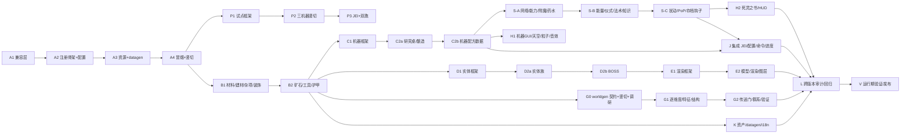
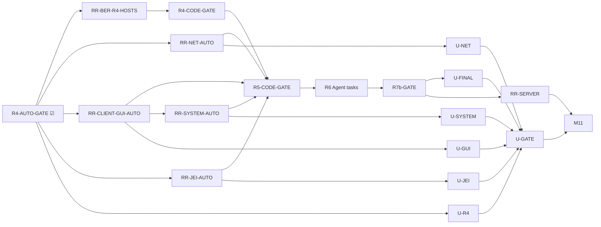

# AbyssalCraft 1.12.2 → 1.20.1 + 1.21.1 移植 — 平行任务表 (Parallel Task Plan / 多 agent)

> 来源：[设计案](00-porting-design.md) + [总任务表](01-porting-task-plan.md)。
> **铁律：同一阶段内的并行任务「不共享文件」且「互不依赖」（并行）；跨阶段任务「可依赖」（串行，阶段间设 Gate）。**
> **铁律②（延后纪律，2026-07-22）：除非有非常必要的硬理由（深分叉技术风险 / 未移植前置依赖 / 跨 owner 归属），否则禁止延后任务。必须延后时须写明「原因 + 依赖 + 已就位物料」+ 分离为显式后续任务（如 PH-xb）进两张任务表并从父任务反向链接；禁止只留一句"延后"。详见[设计案 §2](00-porting-design.md)。**
> 图例：☐ 未完成 · ☑ 已完成 · ⛔ 阻塞。`※` = 跨阶段接力文件（串行交接，禁并发同改）。**本表不再用 `◐` 表示“部分完成”**；认领中的未完成任务仍保持 ☐，以 `owner:` 标明执行者，只有满足收窄后的验收才改为 ☑。

## 0. agent 使用方式

1. 认领一个「前置阶段全部 ☑」的任务（状态保持 ☐，签到 owner 字段）。
2. **只改** 自己 `Owns` 的文件；`Reads` 只读。
3. 完成时按 §1 协议回写三处文档。
4. 一个阶段任务全 ☑ → 跑该阶段 Gate（集成/构建/冒烟）→ 解锁下一阶段。
5. `U-*` 不按本节认领：用户只执行 [用户验证车道](03-user-validation-plan.md) 的检查表，由 Validation Coordinator 记录独立证据，Gate Integrator 回写状态。

## 1. 进度回写协议

1. **一文件一属主**（见 §6）。绝不改他人 `Owns` 文件。
2. **认领**：保持 ☐ 并签名；未通过验收前不得改成 ☑。
3. 完成时以**逐行精确替换**更新三处（先读后写；`oldString` 不匹配就重读重试；绝不整段覆盖）：
  - (a) 本表：任务 ☐→☑ + 产出说明；
   - (b) [总任务表](01-porting-task-plan.md)：勾掉映射的 `T*`；
   - (c) [设计案](00-porting-design.md)：仅当某「待验证」项已解决或设计变更时。
4. **Gate**：某阶段 Agent 任务全 ☑ → 跑该阶段 AUTO/CODE Gate → 解锁下阶段；不等待 `U-*`。`U-*` 只汇入最终 `U-GATE/M11`。
5. **变更请求**：要动 §2 冻结约定或他人 `Owns` 文件 → 在 §7 加一行并暂停协调。
6. **子系统详情写 `docs/spec/`**：子系统的详细设计 / 内契约 / 实现记忆 / 踩坑 / 逐项验证写 `docs/spec/<子系统>.md`（[索引与模板](../spec/README.md)）。主文档与仓库记忆只留任务勾选 / 验收 / Gate 状态 + 一行进度 + 指向 spec 的链接，**不复制细节**。
7. **用户证据不回写生产任务**：用户失败新建 `FIX-U-*`，由原源码 owner 修复并重跑自动 Gate；Validation Coordinator 不修改源码、relay、lang 或共享状态文档。

## 2. 共享约定（冻结 — 无 CR 不得改）

> 全部在 **Stage A** 定稿；其余阶段只读。这是并行安全的地基。

- **注册名 / i18n key**：沿用旧注册名保存兼容（block/item/entity/dimension 用旧 id）；key 前缀 `block.abyssalcraft.*` / `item.abyssalcraft.*` / `entity.abyssalcraft.*`。
- **包 / 目录**：见设计案 §3.1。资产 `assets/abyssalcraft/{textures,models,blockstates,lang,sounds,particles,font}`；数据包 `data/abyssalcraft/{loot_tables,advancements,recipes,structures,worldgen,tags}`（1.20.1 复数；1.21 由 datagen 自动出单数）。
- **注册模式（核心并行契约）**：**每个内容模块自带 `XxxRegistrar.register(IEventBus)`**（自己的 `DeferredRegister`），**自带 datagen 片段 `XxxData`**（模型/方块态/配方/战利品/标签只写本模块）。互不重叠 → 可并行。
- **接力文件（`※`，仅 Gate 时由该阶段集成微任务串行改）**：`registry/ModRegistries.java`（收集各 registrar 的 `register(bus)`）、`registry/ModCreativeTabs.java`（创造栏内容填充）、`data/ACDataGenerators.java`（收集各 `XxxData`）、`AbyssalCraft.java`（`init` 挂载列表）、`net/ACNetwork.java`（消息注册分发）、`client/ACClientSetup.java`（渲染器/屏幕/粒子/图层注册分发）、`world/ACDimensions.java`（维度装配）、`integration/jei/ACJEIPlugin.java`（分类分发）。并行任务只**新增自己的类**，由 Gate 集成任务把它**接一行**进这些接力文件。
- **跨加载器 / 跨版本隔离（兼容层强制，已定 2026-07-20）**：所有 Forge↔NeoForge 与 1.20↔1.21 差异**只准出现在 `platform/` 兼容层类内部**；常规代码一律调用兼容层包装接口，禁止散写 `//?` 或直接触碰分叉 API（唯一例外：主类 `@Mod`/构造）。冻结的兼容层类（签名 Stage A 定稿）：`ACRef`(ResourceLocation) · `ModRegistrar`(DeferredRegister/注册表) · `NetworkChannel`(SimpleChannel↔Payload) · `CapabilityAccess`(能力) · `EventBuses`(总线) · `MenuCompat`(MenuType) · `TooltipCompat`(appendHoverText) · `AttributeCompat`(AttributeModifier+Operation) · `BlockEntityCompat`(save/load+HolderLookup) · `SideExecutor`(端分派) · `DataDirs`(数据包单复数)。新增差异点先加兼容层方法，再供业务调用。
- **全程双跑**：每个 Gate 两节点（forge+neoforge）同时 `build`+`run`，不延后 neoforge。
- **资产不重叠**：每模块用自己的贴图/模型子目录；`blockstates/` 扁平目录按「模块前缀」划分属主（见 §6）。
- **职责边界**：一切「引用全部并行单元」的装配（注册聚合、主类挂载、客户端注册分发、JEI 分类、维度装配、创造栏填充）只进接力文件（串行 Gate），不进并行任务。

## 3. 历史阶段与依赖总览（非当前执行队列）

> 下列 A–V 编排保留以解释历史 CR 的先后关系；其任务状态、Gate 和旧的 `◐` 文本均非当前完成度。当前认领、文件属主和依赖只以 **§3A 审计后当前执行队列**及总任务表为准。

| 阶段 | 并行任务 | 前置 | 里程碑 |
|---|---|---|---|
| A1 | PA-1 | — | M0 |
| A2 | PA-2, PA-3 | A1 | M0 |
| A3 | PA-4 | A2 | M0 |
| A4 | PA-5 | A3 | M0 |
| P1 | PP-1 | A4 | MP |
| P2 | PP-2, PP-3, PP-4 | P1 | MP |
| P3 | PP-5 | P2 | MP |
| B1 | PB-1, PB-2, PB-3, PB-5 | A4 | M1 |
| B2 | PB-4, PB-6, PB-7, PB-8 | B1 | M1 |
| C1 | PC-1..PC-4 | B2 | M2 |
| C2a | PC-5..PC-8 | C1 | M2 |
| C2b | PC-9 | C2a | M2 |
| D1 | PD-1..PD-2 | B2 | M3 |
| D2a | PD-3..PD-6 | D1 | M3 |
| D2b | PD-7 | D2a | M3 |
| E1 | PE-1 | D2b | M4 |
| E2 | PE-2..PE-6 | E1 | M4 |
| G0 | PG-0（调研+竖切） | B2 | M5 |
| G1 | PG-1..PG-5 | G0 | M5 |
| G2 | PG-6..PG-7 | G1 | M5 |
| S-A | PS-1..PS-4 | C2b | M7 |
| S-B | PS-5..PS-8 | S-A | M7 |
| S-C | PS-9..PS-11 | S-B | M7 |
| H1 | PH-1..PH-4 | C2b,G2 | M6 |
| H2 | PH-5..PH-6 | S-C | M6 |
| J | PJ-1..PJ-4 | C2b,S-C | M8 |
| K | PK-1..PK-5 | B2（内容注册就绪） | M9 |
| L | PL-1..PL-4 | J,E2,G2,H2,K | M10 |
| V | PV-1..PV-3 | L | M11 |

## 3A. 审计后当前执行队列（唯一状态源）

> 2026-07-23 依据现代代码、旧版源码、`DEVELOPMENT.md` 与两张任务表重新审计。**当前完成度与认领只看本节 + [总任务表](01-porting-task-plan.md)**；下方 §4 是历史交付证据，不能再用其中宽口径 Gate 或旧状态覆盖本节。
>
> **用户验证隔离（2026-07-27）**：所有真人交互/视觉/听觉验收移入 [用户验证车道](03-user-validation-plan.md) 的 `U-*`。Agent 实现任务和 R4-R7 自动/代码 Gate 不得依赖 `U-*`；`U-*` 只汇入最终 `U-GATE` 并阻塞发布 M11。用户发现缺陷时新建 `FIX-U-*` 回交源码 owner，不把依赖箭头倒回原任务。

### 已完成基线

| 状态 | 基线 | 已完成范围 | 映射总任务 |
|---|---|---|---|
| ☑ | M0 | 双节点加载、兼容层、注册/config/datagen 与最小资源竖切 | T0.* |
| ☑ | MP-BASE | 三台 3 槽试点机器、基础 Screen/recipe/JEI 加载链 | TP.1-TP.7（不含 `b`） |
| ☑ | M1-BASE | 现有材料/方块/工具/护甲注册与 7 创造栏分组 | T1.*（不含 `b/c`） |
| ☑ | M2-BASE | BE/menu/transfer/recipe 框架与五台现代机器试点 | T2.*（不含 `b`） |
| ☑ | M3-BASE | 初始 54 个内容 EntityType 的注册/召唤基础及部分 loot/蛋 | T3.*（不含 `b/c` 与 T3.10a-c） |
| ☑ | M4-BASE | 当前 renderer 注册、主要族模型、boss 模型与标准护甲资源链 | T4.*（不含 `b/c`） |
| ☑ | M5-BASE | 四维数据壳、3 stand-in 结构、7 feature 与实体传送 smoke | T5.*（不含 `b/c`） |
| ☑ | M6-INFRA | 现有 Screen、雾、单粒子、声音资产与 PE meter 注册链 | T6.*（不含 `b/c/d/e`） |
| ☑ | M7-FRAMEWORK | 网络 codec、能力存储及各系统框架/pilot | T7.*（不含 `b/c`） |
| ☑ | M8-BASE | 4 JEI 分类、130 标量、命令代码与 9 进度资源 | T8.*（不含 `b/c`） |
| ☑ | M9-BASE | 51 贴图 tranche、基础模型 provider、419 键语言基线与当前数据 tranche | T9.*（不含 `b`） |
| ☑ | RR-MACHINE-ENGINE | 三专用 recipe/菜单与 Crystallizer/Materializer/Transmutator 忠实服务端引擎；双端 self-test/build、server codec 加载、Neo 实际加工与无漂移重启恢复 | TP.2b/3b/4b, T2.2b-5b |
| ☑ | RR-MACHINE-CONTENT | 四级 Crystal Bag 独立入口；Liquid Coralium、Transmutation Gem、26 cluster 及燃料/容器回归 | T1.1b,T2.4c,T2.5c,T2.8b |
| ☑ | RR-MACHINE-UX | Forge/NeoForge 真实联网 Bag/三机器 Screen、逐槽/shift-click、分页结果、网络取出、XP、工作态视觉、断线卸载与重启重开矩阵 | TP.2c,TP.4c,T2.3d,T2.4d,T2.5d |
| ☑ | RR-CONTENT | 树苗、四级工具、25 颜色名、29 装饰行为/基础资源；双端 self-test/runData/client resource smoke | T1.1b,1.3b,1.5b,1.6b,1.8b |
| ☑ | RR-ENTITY-CATALOG | 旧 63 内容类型、48 蛋、44 placement、9 漏实体 loot/核心服务端行为、9 对 spawn 定义与五 Darklands；双端 build/runData/runServer | T3.1b,3.9b/c,3.10a/b,T5.8b/c,T10.4b |
| ☑ | R1-AUTO-GATE | 双节点 runData 自测、全量 build、runClient R1 资源烘焙、runServer Done/干净 stop；Neo 1382 recipes，catalog=63/48/44 | R1 自动集成切片 |
| ☑ | R1-Gate | 五个 R1 实现前置、自动 Gate 与双端真人机器 UX/精确重启矩阵全部通过；临时验证探针已删除，发布源码门禁为 0 | 解锁 R2 |
| ☑ | RR-DATA | 401 crafting与53 smelting四态审计、177逻辑 tags、13矿 Silk/Fortune/精确采集级别；双端 datagen/真实玩法/build/JAR审计通过 | T1.4b,1.9b/c,1.10b |
| ☑ | RR-WORLD | 四维现代混合地形、真实材料/carver、六群系、37模板与Chains/Mineshaft/Stronghold拓扑；双端自动矩阵通过 | T5.2b-5.6b,T5.8e,T5.9 |
| ☑ | RR-RENDER-AUTO | 9 漏实体与 12 stand-in 清零；动态层/特殊护甲/怪物甲/两 BER/Boss death 状态实现；双端 compile/build/runClient 与 JAR 审计通过 | T4.3b/c；T4.2b-4.6c 实现侧 |
| ☑ | RR-MENU-HOST-CORE | Research Table 176×238 专用 GUI、方块行为/资源与双端真实 Screen/库存点击/目视矩阵 | T2.6b |
| ☑ | RR-MENU-HOST-BREWING | 8 槽顺序酿造、自动化/hook/remainder/GUI；双端两级酿造与真实 Screen 网络矩阵 | T2.7b |
| ☑ | RR-MENU-HOST-TRANSFER | Spirit Tablet 5 槽/按钮/主副手 UX、全 BE capability/attachment、Spirit Altar 调度与双端重启矩阵 | T2.8c,T2.9b |
| ☑ | R2-AUTO-GATE | 91 registrar/12 R2 registrar、3菜单宿主、7 Screen、64 renderer、25 layer、2 BER与capability接线不变量；双端runData/build/server/client/JAR | R2实现侧自动集成 |
| ☑ | R2-Gate | RR-DATA/WORLD/RENDER-AUTO/MENU-HOST与自动Gate全部通过；两条R2-FIDELITY保持独立未完成且不阻塞R3 | 解锁R3 |
| ☑ | RR-ENERGY | 21传输网络块+5级献祭祭坛、7功能神像、32 charm、Idol、3 PoP与27 MIGRATED+0 BLOCKED扰动闭包；双端runData/真实Level/重启/server/build/JAR | T7.3b,T7.4b,T7.5b,T7.5c |
| ☑ | RR-KNOWLEDGE | 42 research/42 conditions/11 offerings、necrodata持久同步实现、效果/转化/Purge、死亡快照生产与非标量配置解析；双端runData/build/server/JAR及关键效果smoke | T7.2b,T7.8b,T7.10b,T7.11b,T8.2b |
| ☑ | R3-Gate | RR-ENERGY与RR-KNOWLEDGE双车道完成；同一最终源码双端runData同时通过两永久Gate，production build/JAR与专服/重启通过；拆分后的后续任务不属于本Gate完成面 | 解锁R4 |

### 剩余并行阶段

| 阶段 | 并行任务 | 状态 | 前置 | Owns（同阶段独占） | 映射总任务 / Gate |
|---|---|---|---|---|---|
| R1 | RR-MACHINE · 三试点机器忠实引擎 | ☑ owner:Agent A | MP-BASE | 三专用 machine/recipe/menu、四级 Bag 数据层、recipe/item-data/capability compat 与注册/客户端 relay 已串行接线 | TP.2b/3b/4b, T2.2b-5b |
| R1 | RR-MACHINE-UX · 活玩家 GUI/shift-click/XP/重连矩阵 | ☑ owner:Agent A | RR-MACHINE,RR-MACHINE-CONTENT | 双端真人逐槽/shift-click、分页、XP、重连、工作态视觉和停服重启矩阵通过；自动菜单/ledger/slot/capability 由 R1-AUTO-GATE 补齐 | TP.2c,TP.4c,T2.3d,T2.4d,T2.5d |
| R1 | RR-MACHINE-CONTENT · Bag 入口与缺失燃料内容 | ☑ owner:Agent A | RR-MACHINE,RR-CONTENT | 四级 Bag 独立菜单/Screen；liquid coralium/transmutation gem/26 cluster 注册、资源与精确燃料回归 | T2.4c,T2.5c,T2.8b |
| R1 | RR-CONTENT · M1 内容行为/缺块 | ☑ owner:Agent A | M1-BASE | 26 cluster+52 配方、两 AC 树、装饰行为/模型、四级工具矩阵与现代 25 颜色名；双端 runData/client smoke | T1.1b,1.3b,1.5b,1.6b,1.8b |
| R1 | RR-ENTITY-CATALOG · 9 漏实体/placement/蛋 | ☑ owner:Agent C | M3-BASE | 9 漏实体注册/属性/分类/核心服务端行为、44 placement、17 补蛋、9 loot 双目录；精确 invariant + 双端 build/runData/runServer | T3.1b,3.9b,3.10a/b |
| R1-AUTO-GATE | relay 串行集成 + 双节点 runData/build/runClient/runServer | ☑ owner:Agent A | 除真人 UX 外四前置 ☑ | relay/lang 已接线；双端自测、资源烘焙、全量 build、专服 Done/stop | R1 可自动验证切片 |
| R1-Gate | R1 总 Gate | ☑ owner:Agent A | RR-MACHINE-UX ☑ + R1-AUTO-GATE ☑ | Forge/NeoForge 真人活玩家矩阵、逐字段重启证据、双端 runData/build 与无验证属性专服 smoke 均通过 | 解锁 R2 |
| R2 | RR-DATA · M1 recipe/tag/loot | ☑ owner:Agent A | R1 | 401 crafting=339迁移/61替代/0阻塞/1淘汰；淘汰项为现代专用 Sacthoth 蛋取代的旧 NBT 通用蛋；53 smelting=52/1/0/0；181逻辑 tags、13矿忠实 loot与双端真实玩法矩阵完成 | T1.4b,1.9b/c,1.10b |
| R2 | RR-WORLD · 现代混合保真自动切片 | ☑ owner:GitHub Copilot | R1 | 四维地形、真实材料/carver、第六群系、36+House 模板壳体/布局、Chains、Mineshaft/Stronghold AC palette+loot；双端 compile/runData/production JAR/runServer/重启矩阵 | T5.2b,5.3b,5.4b,5.5b/c,5.6b,5.8e,5.9 |
| R2-FIDELITY-AUTO（非阻塞） | RR-WORLD-FIDELITY-AUTO · oracle/动态内容/性能门禁 | ☑ owner:GitHub Copilot | RR-WORLD | 28/28 oracle、37模板+2程序结构/6 marker hosts、双端19坐标AW/DL性能与11场官方自然刷怪路径通过；不写用户证据 | T5.2c,5.3c,5.4c,5.6c,5.8d,5.9b |
| R2 | RR-RENDER-AUTO · 模型/renderer/layer/BER 实现与加载门禁 | ☑ owner:GitHub Copilot | R1 | 9 legacy、12 effect、动态层/真实触发、Samurai/Depths/怪物甲、Research Table/Pedestal BER、双端 build/runClient/JAR | T4.3b/c；T4.2b-4.6c 实现侧 |
| R2-FIDELITY（非阻塞） | RR-RENDER-VISUAL · Forge/Neo 游戏内总场景目视 | ☑ owner:GitHub Copilot+user | RR-RENDER-AUTO | 双端六区总场景覆盖 legacy/effect/projectile/ODB/动态层/护甲/Boss death/两现有BER并最终确认无问题；临时入口清零、双端production build/JAR审计通过 | T4.2b,4.4b,4.5b/c,4.6b/c |
| R2 | RR-MENU-HOST-CORE · Research Table GUI | ☑ owner:GitHub Copilot | RR-MACHINE-CONTENT | 176×238 GUI、方块朝向/形状/光粒子、专用资源；Forge/Neo 真实 36 槽 Screen 点击和截图目视通过 | T2.6b；羽毛 BER=T2.6c/RR-RENDER |
| R2 | RR-MENU-HOST-BREWING · 顺序酿造完整语义 | ☑ owner:GitHub Copilot | RR-MACHINE-CONTENT | 8 槽/面自动化/hook/remainder/400t GUI；双端两级酿造 820t 与真实 Screen shift-click/动态视觉通过 | T2.7b |
| R2 | RR-MENU-HOST-TRANSFER · Tablet/附件/Altar | ☑ owner:GitHub Copilot | RR-MACHINE-CONTENT | Tablet 5 槽/按钮/主副手 UX、全 BE Forge capability/Neo attachment、Altar 16 格扫描/20t 调度；双端重启与真实 Screen 矩阵通过 | T2.8c,T2.9b；T2.8d/T2.9c/d 为后续任务 |
| R2-AUTO-GATE | registrar/provider/screen/renderer/BER/capability自动门禁 | ☑ owner:GitHub Copilot | RR-DATA、RR-WORLD、RR-RENDER-AUTO、三RR-MENU-HOST均☑ | `R2_GATE_SELF_TEST_OK`；双端25 layers/64 renderers/2 BER/7 screens；runData/build/server/client/JAR全绿 | R2实现侧自动集成 |
| R2-Gate | 实现/数据引用/注册/客户端 relay 总Gate | ☑ owner:GitHub Copilot | R2-AUTO-GATE ☑ | 双端无属性专服Done/reload、`acrrrender` Unknown、客户端atlas完成、production JAR元数据/资源/验证残留审计通过；两条R2-FIDELITY后续亦已☑ | 解锁 R3 |
| R3 | RR-ENERGY · PE/PoP/Disruption 内容 | ☑ owner:GitHub Copilot | R2-Gate | 21传输网络块+5级献祭祭坛、7功能神像+兼容入口、32 charm、Idol、3 PoP、27 MIGRATED+0 BLOCKED审计；双端runData/真实Level/重启/专服/build/JAR门禁 | T7.3b,7.4b,7.5b,7.5c |
| R3 | RR-KNOWLEDGE · capability/effect/research/SavedData/config 实现切片 | ☑ owner:GitHub Copilot | R2-Gate | 42/42/11目录、协议v2与延迟同步、三伤害/五效果/七药水、传播/解毒/唯一转化/Purge、快照真实落盘重启、复杂配置reload；后续旧书消费、动态群系、复活与配置GUI自动切片均已闭合，真人实网仅归U-NET | T7.2b,7.8b/c,T7.10b/c,T7.11b/c,T8.2b/c |
| R3-Gate | 系统 API/存档/配置双节点 Gate | ☑ owner:GitHub Copilot | RR-ENERGY、RR-KNOWLEDGE均☑ | 双端runData同时输出`RR_ENERGY_SELF_TEST_OK`与`RR_KNOWLEDGE_SELF_TEST_OK`；双端production build/JAR、专服与重启通过，临时探针为0；后续自动切片已由R5-CODE-GATE闭合 | 解锁 R4 |
| R4 | RR-RITUAL-SPELL-PORTAL-AUTO · 仪式/法术/玩家传送门实现 | ☑ owner:GitHub Copilot | R3 | 62仪式/18专用、14法术/14 handler/14 Spellbook配方、Anchor/Key/Portal链、必要网络/客户端FX、29 item models+3 block sets | T7.6b,T7.7b,T5.7b 实现片段 |
| R4-AUTO-GATE | RR-RITUAL-SPELL-PORTAL 双节点自动门禁 | ☑ owner:GitHub Copilot | RR-RITUAL-SPELL-PORTAL实现 | Forge/Neo `compileJava --rerun-tasks` 与 `runData`：`rituals=62 handlers=18`、`spells=14 handlers=14 spellbook=14`、`itemModels=29 blockSets=3 damageTags=4`、Portal=`7/6/4` | R4 代码/数据/资源切片 |
| R4 | RR-ENTITY-BEHAVIOR · 全实体专属行为/loot/spawn | ☑ owner:GitHub Copilot | R3 | 全族专属行为、69 loot→97逻辑/194物理现代表、69死亡路径、双端11场真实NaturalSpawner、实体/owner重启持久化、无属性server reload与production JAR零fixture门禁通过 | T3.2b-3.8b,3.9d,3.10c |
| R4 | RR-BER-R4-HOSTS · 当前实际宿主 BER 闭包 | ☑ owner:GitHub Copilot | R3-Gate,R4-AUTO-GATE | 注册表全量冻结 27 个实际 BE host：5 BER + 22 no-BER；5 个 legacy renderer 已有现代替代，`deferredLegacy=0` | T4.6d |
| HOST-FOLLOWUP（非阻塞） | RR-BER-FUTURE-HOSTS · 后续新增宿主随内容交付 | ☑ owner:各宿主owner | 对应真实 BlockEntityType | 当前无待实现真实宿主；未来只有新增 BlockEntityType 时才重开，不为旧名称虚构宿主 | T4.6d 后续契约 |
| R4-CODE-GATE | 游戏逻辑与现有宿主自动集成 Gate | ☑ owner:GitHub Copilot | R4-AUTO-GATE,RR-ENTITY-BEHAVIOR,RR-BER-R4-HOSTS | relay、双节点 compile/runData/build、固定 seed server+restart 与 JAR Gate 通过；不等待用户矩阵 | 解锁 R5 Agent 任务 |
| U | U-R4 · Portal/Spellbook/仪式真人矩阵 | ☐ owner:user+Validation Coordinator | R4-AUTO-GATE | 不拥有生产文件；证据独占 `run/validation/user/U-R4/` | [用户验证车道](03-user-validation-plan.md) |
| R5 | RR-NET-AUTO · 24消息生产闭包与自动门禁 | ☑ owner:GitHub Copilot | R4-AUTO-GATE | 19 MIGRATED + 5 REPLACED + 0 BLOCKED，方向拒绝24、roundTrips=28；生产 handler/权限/线程契约闭合 | T7.1c |
| R5 | RR-CLIENT-GUI-AUTO · GUI/书/HUD/input与剩余机器宿主 | ☑ owner:GitHub Copilot | R4-AUTO-GATE | 13 Screen、401 actionable书页、3 HUD/5键、Aklo实际消费、94/94 clientvars、State Transformer/Rending及4 BER闭包 | T2.9c/d,T6.1c,T6.2b/c,T6.6b-d,T7.8c |
| R5 | RR-CLIENT-FX-AUTO · sky/particle/sound 行为 | ☑ owner:GitHub Copilot | R4-AUTO-GATE | `client/{sky,particle,ritual}/**`,`registry/ModParticles`,`platform/DimensionSkyCompat`；Gate=`RR_CLIENT_FX_SELF_TEST_OK` | T6.3b,T6.4b,T6.5b |
| R5 | RR-JEI-AUTO · 燃料/剩余分类/转移 | ☑ owner:GitHub Copilot | R4-AUTO-GATE | 永久 Gate：12 categories、62 rituals、14 spells、5+15 fuels、4 rending、12 transfer decisions；40 个 JEI 语言键闭包 | TP.5b,T8.1b 实现片段 |
| R5 | RR-SYSTEM-AUTO · 扰动/附魔/效果/复活/配置余量 | ☑ owner:GitHub Copilot | RR-CLIENT-GUI-AUTO,R4-AUTO-GATE | 27扰动/0阻塞、附魔5/5、Dread Plague 6 biome/8 host、复活矩阵与145配置消费者全部闭包 | T7.5c,T7.9b/c,T7.10c,T7.11c,T8.2c |
| R5 | RR-ADV-API · 命令/进度/IMC/API | ☑ owner:GitHub Copilot | R4-AUTO-GATE | 双端9×2 schema/Gate与外部ServiceLoader消费者；Forge真实联网权限/toggle/9进度/书页/幂等/重连，Forge五项旧IMC；生产临时夹具清零 | T8.3b,T8.4b/c |
| R5-CODE-GATE | 客户端/网络/系统/JEI 自动集成 Gate | ☑ owner:GitHub Copilot | R4-CODE-GATE,RR-NET-AUTO,RR-CLIENT-GUI-AUTO,RR-CLIENT-FX-AUTO,RR-JEI-AUTO,RR-SYSTEM-AUTO,RR-ADV-API | NET/GUI/FX/JEI/SYSTEM/ADV-API 永久 Gate、双节点 build/server 与客户端资源初始化通过；不等待 `U-*` | 解锁 R6 |
| U | U-NET/U-GUI/U-FX/U-JEI | ☐ owner:user+Validation Coordinator | 各对应 `RR-*-AUTO` | 不拥有生产文件；每项独占 `run/validation/user/<U-ID>/` | [用户验证车道](03-user-validation-plan.md) |
| R6 | RR-ASSET · 全贴图/模型/lang | ☑ owner:GitHub Copilot | R5-CODE-GATE | demo生产内容清零；644旧纹理=504迁移+131替代+9淘汰，42复杂模型ACTIVE，560 item owners，8×1361语言键且覆盖232 Block/560 Item，资产引用`missing=0`；雕像OBJ UV/晶簇动画/势能分层模型永久Gate通过 | TP.6b,T9.1b-4b |
| R6 | RR-DATAGEN · 全配方/loot/tag 双形态 | ☑ owner:GitHub Copilot | R5-CODE-GATE | 223 machine calls 四态闭包；demo loot退役后2617 JSON / 1628 logical 全仓语义与双目录审计 `missing=0` | T2.10b,T9.5b,T10.3b |
| R6-Gate | 两节点 runData + missing resource 审计 | ☑ owner:GitHub Copilot | R6 全部 ☑ | Forge全量runData、Neo compile/resource assembly、双端客户端烘焙及独立资产审计均通过，`missing=0` | Gate MP/M1/M2/M9 内容收口 |
| R7a | RR-COMPAT · compat/`//?` 审计 | ☑ owner:GitHub Copilot | R6 | `RR_COMPAT_AUDIT_OK symbols=89 loader=60 version=49 businessLoaderReferences=0 businessVersionForks=62 mixinExceptions=1 documented=89` | T10.1b |
| R7a | RR-RENAME · API 重命名行为报告 | ☑ owner:GitHub Copilot | R6 | `RR_RENAME_AUDIT_OK json=2619 paired=1186 recipes=1364 mappings=49 stale=0`；报告冻结API/目录/ID回归契约 | T10.2 |
| R7a | RR-BIOME · spawn modifier 双份与运行期行为 | ☑ owner:Agent C+GitHub Copilot | R6 | 9 对镜像经双端加载；官方 loader PotentialSpawns 查询在 11 场景精确验证最终候选、权重、组大小、5 维度与 Y 上下文 | T10.4b/T10.4c |
| R7b-GATE | 两节点 build/runClient 全量自动回归 | ☑ owner:GitHub Copilot | R7a 全部 ☑ | 双节点全量 build；隔离客户端各唯一抵达 TitleScreen 两 tick 并正常退出，`RR_CLIENT_SMOKE_RUNNER_OK nodes=2`；无真人操作前置 | T10.5 / Gate M10 |
| R8 | RR-SERVER · world/entity/loot 服务端矩阵 | ☑ owner:GitHub Copilot | R7b-GATE | 固定 seed 双节点新世界+重启四阶段；world/structure/spawn/live loot/recipe/restart fail-closed 矩阵通过 | T11.2 |
| U | U-FINAL + U-GATE · 全内容真人客户端矩阵 | ☐ owner:user+Validation Coordinator | R7b-GATE + 全部前序 `U-*` | 不拥有生产文件；仅用户证据与独立报告 | TP.7b,T5.9b,T6.* UX,T11.1 |
| R8-Gate | 文档/index/发布产物收口 | ☐ owner:Gate Integrator | RR-SERVER,U-GATE | `DEVELOPMENT.md`, `docs/index/**`, release artifacts | T11.3,T11.4 / Gate M11 |

### 当前波次独占写入表（覆盖历史 §6）

> 下表只覆盖当前 R4-R5/R2-FIDELITY 收口波次。未列路径一律只读；需要新增 compat、注册、语言键或 provider 接线时，功能 Agent 只提交 CR/接线清单，由 Gate Integrator 串行修改。

| Owner | 独占写入 | 只读依赖 / 禁止写入 |
|---|---|---|
| Agent NET | `net/{client,server}/**`, `net/{NetworkMessageAudit,NetworkSelfTest,RRNetValidation}.java`, `client/network/**`, `data/gen/NetworkValidationData.java`, `docs/spec/network-subsystem.md`, `docs/spec/rr-net-message-audit.csv` | 只读系统宿主；禁止写 `net/ACNetwork.java`、`platform/**`、GUI、relay、lang、三张任务表 |
| Agent GUI | `client/screen/{energy,item,machine,facebook}/**`, `client/{necronomicon,hud,font,input}/**`, `content/machine/{statetransformer,rendingpedestal}/**`, `content/item/{tablet,page}/**`, `content/menu/facebook/**`, `system/knowledge/**`, `data/gen/{StateTransformerValidationData,RendingPedestalValidationData}.java`, `docs/spec/{machine-subsystem,necronomicon-gui-subsystem,hud-font-clientvars-subsystem,knowledge-subsystem}.md` | 只读 net/energy/ritual；禁止写 `client/screen/config/**`、BER relay、registry、datagen relay、platform、lang、三张任务表 |
| Agent BER | 仅新增 `client/render/block/*Energy*Renderer.java` 与 `docs/spec/client-rendering-subsystem.md` 的独占新小节 | 只读 energy BE；禁止写 `ACBlockEntityRenderers.java` 及 GUI/Rending 文件 |
| Agent JEI | `integration/jei/**`（除 `ACJEIPlugin.java`）, `docs/spec/integration-subsystem.md` | 只读 recipe/ritual/spell/rending；禁止写 lang、recipe owner、relay |
| Agent SYSTEM | `system/{energy/disruption,effect,enchant,data}/**`, `common/handlers/**`, `config/**`, `client/screen/config/**`, `docs/spec/{disruption-subsystem,enchantment-subsystem,potion-subsystem,saveddata-hooks-subsystem}.md` | 只读 GUI/knowledge 与内容宿主；禁止写 `system/knowledge/**`、platform、world、lang、relay |
| Agent WORLD | `world/density/**`, `world/structure/**`, `validation/world-*`, `docs/spec/worldgen-subsystem.md` 的独占新小节 | `world/portal/**` 与内容宿主只读；跨 owner marker 通过 CR，不直接写 content |
| Validation Coordinator | `run/validation/user/<U-ID>/**`（每项独占目录） | 不写任何生产源码/资源；不直接回写共享状态文档 |
| Gate Integrator | `AbyssalCraft.java`, `registry/{ModRegistries,ModCreativeTabs,ModMenus,ModParticles}.java`, `data/ACDataGenerators.java`, `client/ACClientSetup.java`, `client/render/block/ACBlockEntityRenderers.java`, `net/ACNetwork.java`, `integration/jei/ACJEIPlugin.java`, `platform/**`, `assets/abyssalcraft/lang/**`, `DEVELOPMENT.md`, `docs/porting/01-03*` | 不替功能 Agent 扩大业务范围；只做 CR、接线、状态与串行 Gate |

### 当前波次无环 DAG

## 4. 任务详情

> **历史交付记录（只读证据，不用于认领或判定当前完成度）**。其中旧 ID/Gate 曾把“框架、pilot、标题屏加载”写成父功能完成；审计后的二态状态与剩余范围以 §3A 和总任务表为准。保留本节是为了追溯 CR、文件归属与当时验证，不得据此跳过 `b/c` 待办。

---

**══════════ ☑ 已完成 ══════════**

### Stage A1 · 版本/加载器兼容层（前置：无）
> 全部并行任务的地基。PA-1 单独成阶段：其兼容层签名冻结后，A2 起的任务才能只读它、安全并行。

**PA-1 · 版本/加载器兼容层（compat layer）**  ☑ owner:Agent 1 output:platform/ 11 类全建；两节点 `./gradlew build` BUILD SUCCESSFUL 零告警（compile+jar+remap）；`//?` 仅在 platform/ 与主类 @Mod/构造（grep 核）；主类 prefix/parse 改为委托 ACRef（见 §7 CR-1）。NetworkChannel Forge 用 classic SimpleChannel（经 jar 源码核对）。注：NetworkChannel/CapabilityAccess 仅编译验证，运行期待 PS-1/Stage P 消费者
- Owns: `platform/**`（ACRef/ModRegistrar/NetworkChannel/CapabilityAccess/EventBuses/MenuCompat/TooltipCompat/AttributeCompat/BlockEntityCompat/SideExecutor/DataDirs）
- Reads: `MC_Dev_Skills/ref02,ref14`
- 验收: 两加载器编译；每个 compat 类各出正确结果；业务代码零直接分叉 API（`//?` 只在本层，主类 @Mod 除外）
- Maps to: T0.2

> **Gate A1**：两节点 `build` 绿；§2 兼容层签名冻结（供 A2+ 只读）。

### Stage A2 · 注册骨架 + 配置（前置：A1）
> 两任务只读 A1，文件互不重叠（`registry/`+主类 vs `config/`），互不依赖 → 并行。

**PA-2 · 注册聚合骨架 + 主类挂载**  ☑ owner:Agent 2 output:`registry/ModRegistries`（`ALL` 聚合列表）+`registry/ModCreativeTabs`（空 AC 创造页/占位 obsidian 图标/标题键 `itemGroup.abyssalcraft`）+主类 `init` 挂载 `ALL.forEach(r->r.attach(bus))`。两节点 `build` 绿、6 `.class` 齐、javap 核 `attach(IEventBus)` 字节码、forge `runServer`→`Done (2.168s)` CREATIVE_MODE_TAB 冻结无错。`registry/` 零分叉 API（`IEventBus` 仅主类），见 §7 CR-2。空栏“可见”属客户端可视，需 opt-in `runClient`
- Owns: `registry/ModRegistries.java`※, `registry/ModCreativeTabs.java`※, `AbyssalCraft.java`※（init 挂载）
- Reads: A1（platform 兼容层）
- 验收: `:1.20.1-forge:build` 通过；空创造栏出现
- Maps to: T0.3, T0.4

**PA-3 · 配置骨架**  ☑ owner:Agent 3 output:`config/ACConfig.java`（COMMON spec：general/worldgen/mobs 三类共 11 键，值以 `Supplier<T>` 暴露，替换旧 `lib/ACConfig`）+ 新增 `platform/ConfigCompat.java`（ForgeConfigSpec↔ModConfigSpec shim，仅 `registerConfig` 一行分叉，neoforge 走 `getActiveContainer()`；见 §7 CR-3）。两节点 `compileJava` 零告警；两节点 `runServer` 均生成 `config/abyssalcraft-common.toml`（默认值正确：`damage_amplification=1.0`/`dark_shrine_spawn_rate=3`/`evil_animal_spawn_weight=4`…），判据 = disk toml + 日志。运行期以临时 wire-in 主类验证后**已还原**；永久挂载 `ACConfig.register()` 归 Gate A2 集成。
- Owns: `config/**`
- Reads: A1（platform 兼容层）
- 验收: 配置文件生成、示例键可读回
- Maps to: T0.5

> **Gate A2（✅ 已过 2026-07-21 · 两节点）**：两节点 `build` 绿；空创造栏出现（tab 注册 OK，两节点 `runServer` 抵 `Done` 无 CREATIVE_MODE_TAB 错；可视 opt-in `runClient`）；配置文件生成且示例键可读回（两节点 `run/config/abyssalcraft-common.toml` 11 键默认值 disk 核）。集成动作：主类 `init` 已挂 `ACConfig.register()`（CR-3 计划的 Gate A2 集成）。

### Stage A3 · 资源约定 + datagen 基建（前置：A2）
> 单任务；依赖 A2 的注册骨架（datagen provider 需引注册表）。

**PA-4 · 资源约定 + datagen 基建**  ☑ owner:Agent 4 output:datagen 基建端到端。新增 `platform/DataGenCompat`（GatherDataEvent 分叉仅在 import；经 jar 核两加载器方法同签名，register 体共享）+ `data/ACDataGenerators`（※ 聚合，零分叉）+ `data/ACExampleProvider`（vanilla `DataProvider` 空壳）+ `build.gradle.kts` data run config（`data()`+programArgs，经 javap 核 `RunConfigSettings` API）+ 主类 `init` 挂 `DataGenCompat.register` + en_us 种子（`itemGroup.abyssalcraft`）。**两节点 `runData` 均 Starting provider→finished→written**，产出 `src/main/generated/data/abyssalcraft/datagen_smoke.json`（disk 核实）；两节点 `./gradlew build` 绿。见 §7 CR-4。坑：run-config lambda 内 `property()` 绑到 `RunConfigSettings.property()`（→`kotlin.Unit`），`file()` 相对子项目（→`rootProject.file`）。遗留：pack.mcmeta `pack_format=15` 跨版本未按节点区分（neoforge 1.21.1 warning 级，非致命）
- Owns: `src/main/resources/pack.mcmeta`, `data/ACDataGenerators.java`※, 数据包目录骨架, `assets/.../lang/en_us.json`（种子）
- Reads: A2（PA-2 注册骨架）
- 验收: `runData` 产出示例文件、资源包无报错
- Maps to: T0.6, T0.8

> **Gate A3（✅ 已过 2026-07-21 · 两节点）**：两节点 `runData` 产出示例文件（`src/main/generated/data/abyssalcraft/datagen_smoke.json`）、资源包无报错（含 `ACConfig.register()` 挂载后回归）。

### Stage A4 · 运行期冒烟 + 最小竖切（前置：A3）
> 单任务；依赖 A1–A3 全部（竖切用兼容层+注册+资源）。M0 收口。

**PA-5 · 运行期冒烟 + 最小竖切**  ☑ owner:Agent 5 output:`content/demo/DemoBlock.java`（vanilla `Block` 子类，零分叉）+`registry/DemoRegistrar.java`（demo 方块/方块物品/物品 + 专属创造页 `abyssalcraft:demo`，全 vanilla API 零 `//?`；Block/Item/BlockItem/CreativeModeTab 构造经两节点 jar javap 核为同签名）+手写资产（blockstate/方块模型/两物品模型，引用原版贴图 obsidian/nether_star 免二进制 PNG）+en_us 三键。见 §7 CR-5。
- Owns: `content/demo/**` + 其 assets + `registry/DemoRegistrar.java`
- Reads: A1..A3（PA-1/PA-2/PA-4）
- 验收: 两节点 `compileJava --rerun-tasks` 绿；两节点 `runClient` 加载 mod→资源/模型烘焙**零错**（无 `Unable to load model`、无 demo_* 报错）→抵标题屏→`Stopping!` 干净退出（BUILD SUCCESSFUL）。**限制**：创造页"可见/可放置"属客户端交互，日志无法断言，需人工目视。
- Maps to: T0.1, T0.7

> **Gate A4（✅ 已过 2026-07-21 · 两节点，M0 冻结）**：集成微任务已把 `DemoRegistrar.{BLOCKS,ITEMS,TABS}` 接入 `ModRegistries.ALL`（见 §7 CR-5）；两节点 `runClient` 加载竖切资产零错、抵标题屏、`Stopping!` 干净退出（判据 = run 日志/退出码 + 资源烘焙无 model 报错；纯可视"创造页可见可放置"需人工目视）。§2 契约冻结 → 解锁 Stage P/B。

### Stage P1 · 试点框架（前置：A4）
> 首个完整子系统的地基。**全程双跑**、JEI 纳入。PP-1 冻结后，P2 三机器才能只读复用、并行。

**PP-1 · 试点物品 + BE/配方/菜单框架**  ☑ owner:Agent 2 output:BE/菜单/配方 base 全落地：`MachineBlockEntity`(+registrar，`Container`+`ContainerData`+save/load)、`MachineMenu`(+registrar，`AbstractContainerMenu`，MenuType 经 `MenuCompat`)、`ProcessingRecipe`(+registrar，单输入处理配方)、`CrystalItems`(2 试点物品)。新增兼容层 `ContainerCompat`/`RecipeCompat`/`RecipeSerializerCompat` + 增强 `BlockEntityCompat`(save/load 加 `HolderLookup.Provider`)——吸收 1.21 Recipe/RecipeSerializer/ItemStack-NBT 大改（recipe 两版签名先 `javap` 核 MC jar 后写），`content/`+registrar 零 `//?`（见 §7 CR-6）。5 registrar 接入 `ModRegistries.ALL`。两节点 `build` 绿 + `runServer`→`Done`（forge 2.340s / neo 0.970s）注册表冻结无错（1.21 `MapCodec`/`StreamCodec` 构造运行期无错）。限制：试点无机器方块 → BE/菜单/tick 运行期未被调用（仅编译+注册证明），无资产（留 P2/PK）
- Owns: `content/item/crystal/**`, `content/blockentity/base/**`, `content/recipe/base/**`, `content/menu/base/**` + 对应 registrar
- Reads: §2 兼容层
- 验收: 框架编译、示例 BE/菜单/配方类型注册通过
- Maps to: TP.1, 部分 TP.2/TP.3/TP.4

> **Gate P1（✅ 已过 2026-07-21 · 两节点）**：框架编译、示例 BE/菜单/配方类型注册通过（两节点 `build` 绿 + `runServer`→`Done`，ITEM/BLOCK_ENTITY_TYPE/MENU/RECIPE_TYPE/RECIPE_SERIALIZER 冻结无错，1.21 `MapCodec`/`StreamCodec` 构造运行期无错）；框架冻结供 P2 只读复用。集成动作：`CrystalItems.ITEMS` + `MachineBlockEntities.BLOCK_ENTITIES` + `MachineMenus.MENUS` + `ProcessingRecipes.{RECIPE_TYPES,RECIPE_SERIALIZERS}` 已接入 `ModRegistries.ALL`。

### Stage P2 · 三机器竖切（前置：P1）
> 三机器各自独立目录，只读 P1 框架，互不依赖 → 并行。

**PP-2 · Crystallizer 竖切（方块+BE+配方+菜单+屏幕）**  ☑ owner:Agent 6 — 镜像 Materializer 复用 PP-1 框架+兼容层；两节点 `build`+`runServer`+`runClient` 绿（注册/配方解析/模型烘焙/屏幕注册零错，抵标题屏）。见 §7 CR-7。**详见 [docs/spec/machine-subsystem.md](../spec/machine-subsystem.md)**（设计/契约/踩坑/逐项验证）。
- Owns: `content/machine/crystallizer/**`, `client/screen/machine/crystallizer/**` + datagen/资产片段
- Reads: P1（PP-1 框架）, §2
- 验收: 放料+燃料产结晶、GUI/进度正确（已核到编译+注册+配方解析+模型烘焙+抵标题屏；实际产出/GUI 交互需人工目视）
- Maps to: 部分 TP.2/TP.3/TP.4/TP.6

**PP-3 · Materializer 竖切**  ☑ owner:Agent 6（接手复核）— 代码/资产/配方前序会话已交付且正确（与 Crystallizer 逐行一致，Compare-Object 仅 javadoc/常量/命名差异）；本次接手复核：两节点 `runClient` 模型烘焙/屏幕注册零告警、抵稳定态干净退出 → 竖切成立。见 §7 CR-9。**详见 [docs/spec/machine-subsystem.md](../spec/machine-subsystem.md)**。
- Owns: `content/machine/materializer/**`, `client/screen/machine/materializer/**` + 片段
- Reads: P1（PP-1 框架）, §2
- 验收: 物质化产出、GUI 正确
- Maps to: 部分 TP.2/TP.3/TP.4/TP.6

**PP-4 · Transmutator 竖切**  ☑ owner:Agent 3 output:镜像 Crystallizer/Materializer 兄弟机器，复用 PP-1 框架 + 并发 agent 的共享兼容层（`InteractiveBlockCompat`/`MenuCompat.open`/`ClientScreenCompat`/`RecipeCompat.findResult`）。交付 `content/machine/transmutator/{Transmutators,TransmutatorBlock,TransmutatorBlockEntity}` + `client/screen/machine/transmutator/TransmutatorScreen` + `recipe(s)/transmutation_pilot.json`（两 dir 两格式：gravel→2 flint）+ lang。两节点 `compileJava` 零告警；两节点 `runServer` 验**嬗变产出**（gravel+coal→flint，`/data get` 核：forge 6 flint / neo 4 flint）。接入 `ModRegistries.ALL` + `ACClientSetup`（屏幕经 `ClientScreenCompat` 注册），见 §7 CR-8。曾误建 `platform/{MachineBlock,RecipeLookup}` 与并发 agent 撞车 → 已删，净零 platform 改动。~~runClient 可视留 P3~~ → **接手补完（CR-9）**：此前漏交 3 个客户端资产（blockstate/block model/item model），且只跑 runServer 未察觉；接手补齐（镜像 materializer，texture=smithing_table_top）+ 两节点 runClient 核模型烘焙零告警、干净退出。
- Owns: `content/machine/transmutator/**`, `client/screen/machine/transmutator/**` + 片段
- Reads: P1（PP-1 框架）, §2
- 验收: 嬗变产出、GUI 正确
- Maps to: 部分 TP.2/TP.3/TP.4/TP.6

> **Gate P2**：三机器 BE/菜单/屏幕/配方各自通过（放料产出、GUI/进度正确）。

### Stage P3 · JEI + 双跑验证（前置：P2）
**PP-5 · JEI 试点 + 双跑验证**  ☑ owner:Agent 6 — JEI 试点：`integration/jei/{ACJEIPlugin,MachineRecipeCategory}`，三机器各一 JEI 分类（输入→箭头→输出 + 燃料火焰，全用 JEI 内置 drawable，免贴图）+ 三机器方块催化剂 + pilot_fuel 信息页。**零 //? 分叉**：javap 双 jar 核 JEI 15(forge)/19(neo) 所用 API 逐方法同签名，唯一版本分叉（配方枚举 `getAllRecipesFor`：1.20 `List<T>` / 1.21 `List<RecipeHolder<T>>`）落 `platform/RecipeCompat.allOfType`。JEI 依赖走 `modCompileOnly`(API)+`modLocalRuntime`(全 jar，dev 专属、不入发布)。**缺 JEI 不崩**：`@JeiPlugin` 自动发现，无外部引用、非 mods.toml 硬依赖（grep 核）。两节点 `build`+`runClient` 绿：JEI 加载（forge 15.20.0.134 / neo 19.39.0.369）、插件实例化零错、抵标题屏干净退出。见 §7 CR-10。**详见 [docs/spec/machine-subsystem.md](../spec/machine-subsystem.md)**。
- Owns: `integration/jei/**`（试点分类 + 燃料分类，`ACJEIPlugin.java`※ 骨架）
- Reads: P2（PP-2..PP-4 frozen）, ref10/ref11
- 验收: 两节点 `runClient` 三机器全流程 + JEI 分类/催化剂通过（缺 JEI 不崩）— 已核到 JEI 加载 + 插件实例化 + 抵标题屏零错；分类/配方/催化剂由 JEI 于**进入世界**时注册，实际展示需人工目视
- Maps to: TP.5, TP.7

> **Gate MP（= P3，2026-07-21 · 构建/加载层已过）**：三机器接入 ModRegistries（✓）+ ACClientSetup（✓ 3 屏幕）+ ACJEIPlugin（✓ 3 分类 + 催化剂）；配方用手写 JSON 替代 ACDataGenerators（proper datagen 留 TP.6）。**两节点** `build`+`runClient` 加载 JEI/三机器模型/插件实例化零错、抵标题屏干净退出；机器竖切模板冻结供 Stage C 复用。**待人工目视**：进世界开 JEI 看三分类/配方/催化剂 + 机器放料产出。

### Stage B1 · 材料·建材·杂项·装饰（前置：A4）
> 每任务 = {逻辑类 + 自带 registrar + 自带 datagen 片段 + 自有贴图子目录}，只读 §2/A，互不重叠 → 并行。

**PB-1 · 材料/晶体物品**  ☑ owner:Agent 6 — 39 基础材料（ingot/nugget/gem/gem_cluster×8/chunk/brick/dust/plate/misc + coin；1.12.2 真实贴图按原模型 layer0 映射复制）+ 78 晶体（26 元素 × crystal/shard/fragment，灰度贴图按元素 `ItemColor` 染色）= 117 物品。`content/item/material/MaterialItems`（循环注册，plain `Item` 零 `//?`；对齐 §6/`CrystalItems`/`MiscItems` 置于 `content/item/`）+ 自有 `materials` 创造页（vanilla `displayItems`，零分叉）。新 `platform/ClientColorCompat`（`RegisterColorHandlersEvent.Item`，javap 双端核 `register(ItemColor,ItemLike...)` 同签名、仅事件包分叉）+ `ACClientSetup.registerItemColors` + 主类 client attach。手写 117 模型 + 48 贴图 + 118 lang（datagen `MaterialItemData` 延 PK，同机器手写先例）。**两节点**：`build`+jar+`runClient` 均 117 模型/贴图烘焙**零告警**、颜色注册零错、抵标题屏干净退出（neoforge 曾被并发 PB-5 的 `DecoBlocks` 缺 1.21 `codec()` 短暂阻塞，PB-5 修复后即两端全绿）。见 §7 CR-14。**详见 [docs/spec/materials-subsystem.md](../spec/materials-subsystem.md)**。
- Owns: `content/item/material/**`, `registry/MaterialItems.java`, `data/gen/MaterialItemData.java`, 相关 item 贴图/模型
- Reads: §2, A1（platform）
- 验收: 全材料注册可取、图标/名称正确（已核两节点：注册 + 117 模型/贴图烘焙零告警 + 创造页 `displayItems`；晶体染色实际外观 + 创造页可取需人工目视）
- Maps to: T1.1

**PB-2 · 食物/杂项物品**  ☑ owner:Agent 7 — 15 食物 + 9 杂项 shell（`content/item/misc/MiscItems`，clean snake_case id）。食物 nutrition/saturation 取自 1.12.2 ItemHandler，经**新增 `platform/FoodCompat`**（承 `saturationMod`↔`saturationModifier` 分叉，业务零 `//?`）；**进食效果（含自定义 plague）延 T7.10、贴图/模型延 PK**。接 `ModRegistries.ALL` + en_us 24 键。两节点 `compileJava --rerun-tasks`+`runServer` 绿（ITEM 注册冻结零错，forge 2.954s/neo 1.050s，干净 stop）。见 §7 CR-11。**详见 [docs/spec/item-content.md](../spec/item-content.md)**。
- Owns: `content/item/misc/**`, `registry/MiscItems.java`, `data/gen/MiscItemData.java`, 相关贴图
- Reads: §2, A1
- 验收: 注册可取、食物可食（已核到双端 `runServer` 注册冻结零错 + food 组件挂载；实际进食/图标需人工目视，延 PK）
- Maps to: T1.2

**PB-3 · 建材方块族（核心 86 块 / 11 家族）**  ☑ owner:Agent 3 — 86 块建材（darkstone/abyssal/dreadstone/elysian/coralium/ethaxium/dark_ethaxium/omothol/monolith 石系 + darklands_oak/dreadwood 木系；含 stone/cobble/brick/chiseled/cracked/glowing/slab/stairs/wall/fence/pillar/leaves 变体，**全用具体 vanilla 类**回避 1.21 抽象 `codec()`）经**新增 forked `platform/BlockModelGen`**（`BlockStateProvider` 兼容层，业务零 `//?`）datagen 铺 blockstate/方块模型/物品模型。49 贴图从 1.12.2 老资产按原 model JSON **一手核对**映射复制（含 6 个 layered 砖 base+overlay 用 System.Drawing 合成）。**基建修复（CR-12）**：`build.gradle.kts` 接 `src/main/generated`→resources（PA-4 datagen 产物此前从未被 processResources 消费、是死文件，全 datagen 任务受益）+ 增强 `platform/DataGenCompat.Gen`（加 `packOutput`/`existingFiles`）。**命名冲突解**：建材砖块 `ethaxium_brick`→复数 `ethaxium_bricks`（避与 PB-1 合成物品 `ethaxium_brick` 撞 `ITEM` 注册名，仿 vanilla `bricks`/`brick`）。**两节点全链路已验**：Forge + NeoForge 各 `compileJava` + `runData`（86 blockstate + 177 block model + 86 item model，49 贴图皆过 `ExistingFileHelper` 存在性校验）+ `runClient`（`ModelBakery`/`BlockStateModelLoader` 对本任务块**零告警**、atlas 烘焙成、干净退出）。见 §7 CR-12。
- Owns: `content/block/base/**`, `registry/BaseBlocks.java`, `data/gen/BaseBlockData.java`（blockstate/方块模型/物品模型）, base 方块贴图, `platform/BlockModelGen.java`
- Reads: §2, A1
- 验收: 86 核心建材两节点注册/可放置/slab·stair·wall·fence·pillar 状态正确 + 模型烘焙零告警（已核；创造页取用/世界内放置目视留人工）
- Maps to: T1.3（核心建材）
- **移出本任务（已挪到应属阶段，不阻塞本任务收口）**：①**分叉构造变体**（button×5 / pressure_plate×5 / sapling×2 + door / fence_gate —— vanilla 类 ctor 在 1.20.1↔1.21 分叉，需先建 `platform/BlockFactory`）→ **PB-8**（Stage B2）；②**掉落表 / 配方 / 标签** datagen provider → **PK-5**（Stage K，对应 T1.9/T1.10）。

**PB-5 · 装饰/素功能方块**  ☑ owner:Agent 8 — 29 块 + 各 BlockItem（`content/block/deco/{DecoBlocks,DecoFacingBlock}`，clean snake_case id）：17 FACING（7 装饰雕像 + mural + 9 墓碑，经 `DecoFacingBlock`）+ 10 素块（4 ingot 块/dirt/grass/muck/abyssal_sand/fused/glass）+ 2 植物。**`DecoFacingBlock extends Block` 复用 `HorizontalDirectionalBlock.FACING`，规避 1.21 抽象 `codec()`**（`HorizontalDirectionalBlock`/`BushBlock` 在 1.21 把 codec() 重声明为 abstract → 直接子类编译失败；此即 CR-12 记录的 neoforge 阻塞，**本任务已解**）。接 `ModRegistries.ALL` + en_us 29 键。两节点 `compileJava --rerun-tasks`+`runServer` 绿（BLOCK+ITEM 冻结零错，forge 4.460s/neo 1.660s，干净 stop）。**模型/blockstate/贴图延 PK（可复用 CR-12 的 `BlockModelGen`）；monolith_pillar(PE)/召唤 statue(仪式)/crystal cluster(晶体)/建材 延各系统**。见 §7 CR-13。**详见 [docs/spec/item-content.md](../spec/item-content.md)**。
- Owns: `content/block/deco/**`, `registry/DecoBlocks.java`, `data/gen/DecoBlockData.java`, deco 贴图
- Reads: §2, A1
- 验收: 可放置、朝向/变体状态正确（已核到双端 `runServer` 注册冻结零错 + FACING state 定义；实际放置朝向/图标需人工目视，延 PK）
- Maps to: T1.5, 部分 T1.8

> **Gate B1**：PB-1/2/3/5 各自注册可取、放置正确；材料就绪供 B2 只读。

### Stage B2 · 矿石·工具·护甲（前置：B1）
> 三任务都只读 B1 的材料（PB-1），各自独立目录/registrar，互不依赖 → 并行。

**PB-4 · 矿石方块**  ☑ owner:Agent 6 — 13矿注册与基础属性已交付；其历史基础loot/tag余量已由2026-07-24 RR-DATA接力收口为`OreLootData`/`ACTagData`/`CookingRecipeData`单一owner，含Silk/Fortune/explosion、旧level 2/3/4/5层级与双端9镐×13矿真实矩阵。仅layered overlay模型仍归T9.2b。见§7 CR-18及[物品内容规格](../spec/item-content.md) §5e/§5f。
- Owns: `content/block/ore/**`, `registry/OreBlocks.java`, `data/gen/OreData.java`（掉落/采集标签）, ore 贴图
- Reads: §2, B1（PB-1 材料掉落物）
- 验收: 挖掘掉落/镐位正确
- Maps to: T1.4

**PB-6 · 工具**  ☑ owner:Agent 9 — 20 工具（4 tier abyssalnite/refined_coralium/dreadium/ethaxium × {pickaxe,axe,shovel,hoe,sword}），`content/item/tool/ToolItems`（clean snake_case id）。tier 数值（uses/speed/attack/enchant/harvest level）取自 1.12.2 `AbyssalCraftAPI`；修理料 = PB-1 锭（`Ingredient.of(BuiltInRegistries.ITEM.get(ACRef.id(...)))` lazy，**只读 PB-1**、不碰其文件）。**新增 `platform/ToolCompat`** 承 1.21 工具大改（`Tier.getLevel():int`↔`getIncorrectBlocksForDrops():TagKey`（全用 `INCORRECT_FOR_NETHERITE_TOOL`）；工具 ctor `(Tier,dmg,speed,Props)`↔`(Tier,Props.attributes(XxxItem.createAttributes(...)))`），javap 双 jar 逐一核；业务零 `//?`。接 `ModRegistries.ALL` + en_us 20 键。两节点 `compileJava --rerun-tasks`+`runServer` 绿（`ITEM` 冻结**零工具错**，forge 2.522s/neo 0.922s，干净 stop）。特殊工具（longbow/cudgel/katana/soulreaper/staff of rending）延 M7；贴图/模型延 PK。见 §7 CR-15。**详见 [docs/spec/item-content.md](../spec/item-content.md)**。
- Owns: `content/item/tool/**`, `registry/ToolItems.java`, `data/gen/ToolData.java`, 工具贴图
- Reads: §2, B1（PB-1 材料）
- 验收: 采集分级/耐久正确（已核到双端 `runServer` 注册冻结零工具错 + tier uses/harvest 定义；实际挖掘分级/耐久消耗需人工目视，延 PK 贴图）
- Maps to: T1.6

**PB-7 · 护甲**  ☑ owner:Agent 3 — 7 护甲材料 × {helmet/chestplate/leggings/boots} = 28 件（`content/item/armor/ArmorItems`：abyssalnite / refined_coralium / plated_coralium / depths / dreadium / dreadium_samurai / ethaxium）。护甲值/耐久/附魔/韧性取自 1.12.2 `AbyssalCraftAPI`（defense 按 `{boots,legs,chest,helmet}` 槽序）。**新增 `platform/ArmorCompat`** 承 1.21 护甲大改（`ArmorMaterial` 接口→record+`Holder`、耐久由材料搬到物品 `Properties`；1.20.1 匿名实现接口 / 1.21 构造 record + `Holder.direct` + 空 layer），业务零 `//?`。修理料只读 PB-1 锭/板（`registry.get(id)` lazy，不碰 `MaterialItems`）。接 `ModRegistries.ALL`。两节点 `compileJava --rerun-tasks` + `runData`（mod 构造 = RegisterEvent 逐一 build 28 件护甲，零错、干净退出，证实 1.21 record+Holder 运行期路径）。见 §7 CR-16。
- Owns: `content/item/armor/**`（含 `ArmorItems`）, `platform/ArmorCompat.java`, 护甲贴图（穿戴层在 E 渲染阶段）
- Reads: §2, B1（PB-1 材料锭/板）
- 验收: 28 件两节点注册冻结零错 + 护甲/韧性/耐久值按 1.12.2 定义（已核到注册 + 运行期 build；实际穿戴/护甲数值需人工目视）
- Maps to: T1.7
- **延后**：物品模型/贴图 → PK；穿戴层贴图 → E 渲染阶段；lang → PK-4；datagen（`ArmorData`）→ PK（同 PB-6 工具，未建 provider）

**PB-8 · 建材方块分叉构造变体**  ☑ owner:Agent 10 — 16 块 = button×5 + pressure_plate×5 + sapling×2 + door×2 + fence_gate×2（石家族 darkstone/abyssal_stone/coralium_stone 用 `BlockSetType.STONE`；木家族 darklands_oak/dreadwood 用 `OAK`）。**新增 `platform/BlockFactory`** 承 5 类 vanilla ctor 的 1.20.1↔1.21 分叉（`ButtonBlock` 参序+arrowsCanPress、`PressurePlateBlock` 的 `Sensitivity` 1.21 删、`DoorBlock`/`FenceGateBlock` 参序、`SaplingBlock` 的 `OakTreeGrower()`↔`TreeGrower.OAK`），javap 双 jar 逐一核；业务零 `//?`。串行扩 PB-3 冻结的 `BaseBlocks`（追加 16 块 + 3 私有 props helper）/`BaseBlockData`（追加 16 模型调用）/`BlockModelGen`（加 `door()`/`fenceGate()` 两 helper，复用既有 `button`/`pressurePlate`/`cross`）。**`BaseBlocks.BLOCKS/ITEMS` 已在 `ModRegistries.ALL`（PB-3）→ 追加块自动注册，本任务零 `ModRegistries` 改动**。8 张专属贴图（6 门 + 2 sapling）从 1.12 资产改名迁入；button/plate/gate 复用 PB-3 已铺家族贴图。en_us 16 键。两节点 `compileJava --rerun-tasks` + `runData`（`ExistingFileHelper` 严格校验 16 模型贴图全存在）+ `runServer`（注册冻结零错，forge 2.304s/neo 1.153s，干净 stop）全绿。sapling grower 占位 vanilla oak（真树生成待 G）；dlts/drts 为 sapling 贴图**best-guess**（旧版 sapling 模型/blockstate 缺失）。见 §7 CR-17。**详见 [docs/spec/item-content.md](../spec/item-content.md)**。
- Owns: **新增 `platform/BlockFactory.java`**（承 `ButtonBlock`/`PressurePlateBlock`/`SaplingBlock`/`DoorBlock`/`FenceGateBlock` 的 1.20.1↔1.21 构造分叉），串行扩 `registry/BaseBlocks.java` + `data/gen/BaseBlockData.java`（PB-3 已冻结、顺序追加）+ 缺失 base 方块贴图余量
- Reads: §2, A1, **PB-3**（复用 `BaseBlocks`/`BaseBlockData`/`BlockModelGen`）
- 验收: 12 分叉构造块（button×5 / pressure_plate×5 / sapling×2）+ door / fence_gate 两节点注册/可放置/状态正确、模型烘焙零告警（已核到双端 `compileJava`+`runData`(贴图严格校验)+`runServer` 注册冻结零错；实际放置/门开合/plate 触发/sapling 生长需人工目视，延 PK 贴图/G 阶段树生成）
- Maps to: T1.3（剩余分叉构造变体）
- 备注: PB-3 核心 86 块用**具体 vanilla 类**回避了 1.21 抽象 `codec()`；这批块的 vanilla 类 ctor 跨版本分叉（`ButtonBlock`/`PressurePlateBlock` 的 `BlockSetType`/`Sensitivity` 增删与参序变化、`SaplingBlock` 的 `AbstractTreeGrower`→`TreeGrower` 重命名、`Door`/`FenceGate` 的 `BlockSetType`/`WoodType`），已建 `platform/BlockFactory` 落分叉再注册。sapling 用占位 vanilla oak grower（真树生成待 G 阶段）。触碰 PB-3 冻结文件 → 已登记 CR-17。

> **Gate B（= B2）✅ 完成（Agent 6，两节点）**：各 registrar 已接入 ModRegistries、datagen（`BaseBlockData`）接入 ACDataGenerators（余 datagen 延 PK）、**创造栏按 1.12.2 `ACTabs` 忠实还原 7 分类页**（blocks/items/tools/combat/food/decorations/crystals，全在 relay `registry/ModCreativeTabs`，`displayItems` fork-free 拉各内容 list）。两节点 `compileJava --rerun-tasks`+`runData` 全绿；两节点 `runClient` 进世界 + JEI 成分表（forge 1896/neo 2026）含全部 AC 内容、无空 AC 页（仅 vanilla Operator Utilities 空）、无 `displayItems` 错、干净退出。见 §7 CR-19。**详见 [docs/spec/item-content.md](../spec/item-content.md)**。

### Stage C1 · 机器框架（前置：B2）
**PC-1 · BlockEntity 框架**  ☑ owner:Agent 6 — 通用 BE 框架，泛化 PP-1 机器 BE：`content/blockentity/base/{ACBlockEntity(通用基类 extends platform/BlockEntityCompat + markUpdated 同步),DirectionalBlockEntity(承 1.12.2 TEDirectional，存 facing 3D 值),InventoryBlockEntity(可复用 Container，size=1 = 1.12.2 ISingletonInventory 单例库存 / size>1 = 箱笼),TickingBlockEntity(接口 = 1.12.2 ITickable，serverTicker() 泛化 MachineBlockEntity::serverTick)}` + 新 `registry/ModBlockEntities`（BE 类型注册器 + directional/inventory 两示例 smoke 类型）。PP-1 `MachineBlockEntity`/`MachineBlockEntities` 原样保留（机器仍走菜单驱动炉式基类）。业务零 `//?`（版本分叉全在 `BlockEntityCompat`/`ContainerCompat`）。接 `ModRegistries.ALL`。两节点 `compileJava --rerun-tasks`+`runServer` 绿（`BLOCK_ENTITY_TYPE` 冻结零错、抵 Done，forge 2.342s/neo 0.841s）。tick 机制 compile 核 + 由 P2 机器运行期实证；非机器 BE 消费延 C2/S 各阶段。见 §7 CR-21 · Owns `content/blockentity/base/**`, `registry/ModBlockEntities.java` · Reads §2 · Maps T2.1
**PC-2 · 自定义配方框架**  ☑ owner:Agent 11 — 5 类自定义配方 = crystallization/materialization/transmutation（**MP 试点 3 机器已注册**、绑简化 `ProcessingRecipe`，frozen）+ **新增 2 类真实形状**：`anvil_forging`（2 输入→result + price + forging_type，仿 1.12.2 `AnvilForging`/`AnvilForgingType`）+ `rending`（name + max_energy + entity→result essence，仿 `api.rending.Rending`，`Predicate<EntityLiving>`→entity id 串）。新 `registry/ModRecipes` 中央目录（owns anvil/rending 的 RecipeType+Serializer，alias 引用 3 试点类型做完整 catalog）。新 `content/recipe/{anvil/AnvilForgingRecipe,rending/RendingRecipe}`（fork-free）。新 `platform/{DataRecipeCompat（吸收 1.21 `Recipe` 接口 fork：Container↔RecipeInput、RegistryAccess↔HolderLookup、getId 移除；matches→stub，data 配方由机器/物品 `getAllRecipesFor` 枚举）,AnvilForgingRecipeSerializer,RendingRecipeSerializer（forked：fromJson/fromNetwork/toNetwork↔MapCodec/StreamCodec；javap 双 jar 核 `ByteBufCodecs.STRING_UTF8` + `StreamCodec.composite` 5 元）}`，业务零 `//?`。示例配方 `data/abyssalcraft/{recipe,recipes}/{anvil_forging,rending}_pilot.json`（双目录双格式：forge `recipes/` 用 `"item"`、neo `recipe/` 用 `"id"`）。接 `ModRegistries.ALL`（`ModRecipes.RECIPE_TYPES`+`RECIPE_SERIALIZERS`）。**3 试点类型维持机器自持不动 frozen**（其升级到完整形状 + 集中注册归 C2a 回归）。两节点 `compileJava --rerun-tasks` 绿；forge `runServer` `Loaded 12 recipes` + `/reload` `Loaded 12`（零 parse 错、干净 stop）；neo `runServer` `Loaded 1295 recipes`（含 anvil/rending、零 parse 错、干净 stop）——我的 2 配方两端加载零错。**诚实标注**：forge 总配方数 12 vs neo 1295 属 **vanilla 配方在 forge-dev/neo-dev 数据包可用性的可复现差异**（forge 干净重跑仍 `Loaded 12`、与 PC-2 无关、我的配方两端零 parse 错加载；此与 CR-18 记「forge 1293」不符，疑 CR-18 当时 forge 计数不准）。验证中一度撞并发 PC-4（`system/transfer/`）**中途提交的瞬时态**（`ItemTransfer.java` 已在但 `ItemTransferHost.java` 未落）致 forge 编译短暂失败；PC-4 补齐 4 文件后 forge 已恢复，我遂干净重跑确认（`Loaded 12` + `/reload` 零 parse 错 + 干净 stop + BUILD SUCCESSFUL）。见 §7 CR-23 · Owns `content/recipe/**`, `registry/ModRecipes.java` · Reads §2 · Maps T2.2
**PC-3 · 菜单框架**  ☑ owner:Agent 3 — 新 `registry/ModMenus`（canonical MenuType 注册器）+ `content/menu/base/{ContainerMenuBase(可复用抽象基类：玩家背包布局 + 通用 shift-click),ItemContainerMenu(变长物品容器示例 = crystal bag/spirit tablet/spellbook 共享基类)}`；泛化 `platform/MenuCompat.open` 加 `Consumer<FriendlyByteBuf>` 任意 buffer-writer 重载（物品容器传 size 而非 BlockPos，neoforge `RegistryFriendlyByteBuf` 经 `::accept` 适配，BlockPos 重载委托、3 机器不受影响）。PP-1 `MachineMenu`/`MachineMenus` 保持原样。接 `ModRegistries.ALL`；业务零 `//?`。两节点 `compileJava --rerun-tasks`+`runData`（RegisterEvent 注册 `item_container` MenuType 零错、干净退出）；实际开屏 via C2 消费者、屏幕延 M6（同 PP-1 框架「仅编译+注册证明」先例）。见 §7 CR-20 · Reads §2 · Maps 部分 T2.8（框架部分）
**PC-4 · 物品转移能力**  ☑ owner:Agent 3 — 转移框架 `system/transfer/{ItemTransfer(引擎 move/transfer/run + selfTest),ContainerItemView(Container→中性视图适配),ItemTransferConfiguration(路由+5槽过滤数据面),ItemTransferHost(宿主 BE 接口)}`。增强 `platform/CapabilityAccess` 加中性 `ItemView`+`itemView()`（隐藏 forked `IItemHandler`）、`platform/ContainerCompat` 加 `canStack()`（`isSameItemSameTags`↔`isSameItemSameComponents` 分叉）。业务零 `//?`。两节点 `compileJava --rerun-tasks`+`runData`（主类临时自测已还原）：`ItemTransfer self-test moved=40 src=24 dst=40 PASS` 双端一致——转移逻辑运行期实证。state transformer / rending pedestal / spirit altar 宿主方块（数据面消费者）延 C2/S（复用本框架）。见 §7 CR-22 · Reads §2 · Maps T2.9（框架；宿主方块延 C2/S）

> **Gate C1**：框架编译 + 自定义配方 `/reload` 通过。

### Stage C2a · 机器泛化 + 研究桌/酿造（前置：C1）
> **结晶器/物质化器/嬗变器已在 MP（Stage P2 PP-2/3/4）完整交付**；本子阶段复用其模板做框架泛化 + 剩余机器，互不重叠。

**PC-5..7 · 合成机器三件套（结晶/物质/嬗变）**  ☑ 归口 MP（Stage P2 PP-2/3/4）交付；C2a 回归确认：3 机器随通用框架（PC-1 BE / PC-3 菜单）泛化后仍两端注册/`build`/`runClient` 全绿（本 C2a 构建一并回归，零改动、零重复实现） · Maps T2.3,T2.4,T2.5
**PC-8 · Research Table + Brewing Stand**  ☑ owner:Agent 6 — 2 机器，复用 PC-1 BE 框架 + PC-3 菜单 + MP 机器模板，业务零 `//?`。**Research Table**：`content/machine/researchtable/{ResearchTableBlockEntity(extends `ACBlockEntity`,MenuProvider,无库存 marker——1.12.2 `TileEntityResearchTable` 即空壳),ResearchTableBlock(`InteractiveBlockCompat`,onUse 开菜单),ResearchTableMenu(`ContainerMenuBase` contentSlots=0 仅玩家背包),ResearchTables 注册器}` + `client/.../ResearchTableScreen`(vanilla `crafting_table.png` 占位 bg)——界面可开，**知识/研究 hook 延 S-B**。**Sequential Brewing Stand**：`content/machine/brewing/{BrewingStandBlockEntity(extends PC-1 `InventoryBlockEntity` size=8 + `TickingBlockEntity`：3 药水/1 材料/1 燃料/3 传出槽，vanilla 酿造 + 每 20t 把传出槽推入 facing 邻居输入槽=**酿造顺序链**),BrewingStandBlock(`FACING` blockstate + getTicker + 开菜单),BrewingStandMenu(`ContainerMenuBase` 8 槽 + brewTime/fuel `ContainerData`),BrewingStands 注册器}` + `client/.../BrewingStandScreen`(vanilla `brewing_stand.png` bg)。**新 `platform/PotionBrewingCompat`**（1.20.1 静态 `PotionBrewing.isIngredient/hasMix/mix` ↔ 1.21 `level.potionBrewing()` 实例；编译双端核）。接 `ModRegistries.ALL`(8 registrar) + `ACClientSetup`(2 屏幕) + en_us 4 键 + 6 资产(blockstate/模型 vanilla 占位)。两节点 `compileJava`+`runServer`（BLOCK/BE/MENU 冻结零错、抵 Done，forge 2.330s/neo 1.037s，unique 端口避并发撞车）+ forge `runClient`（2 机器模型烘焙**零告警**、屏幕注册、进世界 + JEI 1896 成分、干净退出）。**实际右键开界面 + 酿造链需人工目视；faithful 贴图/模型 + 药水泡泡进度 + 槽位校验延 PK**。见 §7 CR-24 · Owns `content/machine/{researchtable,brewing}/**` · Reads C1, MP 模板 · Maps T2.6,T2.7

> **Gate C2a（✅ 已过 2026-07-21 · 两节点）**：剩余机器（研究桌 + 顺序酿造台）接入 `ModRegistries.ALL`（模型手写 vanilla 占位、无 datagen、延 PK）；两节点 `runServer` 各机器 BLOCK/BE/MENU 注册冻结零错、抵 Done；forge `runClient` 2 机器模型烘焙零告警、屏幕注册、进世界干净退出（3 台合成机器沿用 MP 成果、一并回归全绿）。**待人工目视**：右键开界面 + 酿造顺序链传递。

### Stage C2b · 机器配方数据（前置：C2a）
**PC-9 · 机器配方数据 + 菜单接入**  ☑ owner:Agent 12 — 新 `data/gen/MachineRecipeData`（`DataProvider`，接 `ACDataGenerators`）datagen 生成 3 合成机器示例配方 = crystallization 7 + transmutation 11 + materialization 9 = **27 条**（`ProcessingRecipe` 形状 input→result+time，忠实 1.12.2 `AbyssalCrafting` 表、按现存物品裁剪：crystallization 取单输出子集、materialization 取单晶体输入子集，多输出/多输入待完整形状 C2a 回归；全用一手核对的 PB-1/2/3/5+vanilla id）。业务零 `//?`（`DataProvider.run`/`saveStable(CachedOutput,JsonElement,Path)` javap 双 jar 同签名）。**坑（关键）**：配方 1.20↔1.21 目录（`recipes/`↔`recipe/`）+ result key（`"item"`↔`"id"`）双分叉，且两 loader `runData` 共享 `src/main/generated` 输出——单 loader 专属目录会被另一 loader HashCache 清除（实测 neo runData 清掉 forge 的 `recipes/`）→ 改为**每次 runData 同时生成两目录两格式**（`recipes/`+`"item"` 供 1.20.1、`recipe/`+`"id"` 供 1.21），各 loader 只读自己目录、互不清除。两节点 `compileJava --rerun-tasks` + `runData`（各生成 27+27、无 clobber）绿。**neo `runServer`：`Loaded 1322 recipes`（= PC-2 基线 1295 + 27，零 parse 错、干净 stop）→ 27 条机器配方两端格式全加载可用**。**诚实标注**：forge `runServer` 仍 `Loaded 12`（27 条已在 forge `build/resources/main/.../recipes/`(32 files)→入 jar/生产正常，仅 forge-dev runServer 只挂 `src/main/resources` 不挂 `src/main/generated`，PC-2 已记的可复现限制；非 PC-9 缺陷，属 PA-4 datagen 基建 forge-dev 挂载 gap）。"菜单接入"(部分 T2.8) = 机器 BE 已消费 `ProcessingRecipe`（MP 交付）、无需新菜单代码。anvil/rending datagen 延其机器落地。见 §7 CR-25 · Owns `data/gen/MachineRecipeData.java` · Reads C2a · Maps T2.10, 部分 T2.8

> **Gate C2（= C2b）✅ 已过 2026-07-21 · neo 全绿 / forge dev 限制已记**：3 机器示例配方 datagen（`MachineRecipeData` 27 条：crystallization/transmutation/materialization）接 `ACDataGenerators`；neo `runServer` `Loaded 1322 recipes`（1295+27）零 parse 错加载、机器 BE 消费 `ProcessingRecipe`（MP 交付）；forge 27 条在 `build/resources`→jar，仅 forge-dev runServer 不挂 `src/main/generated`（PC-2 已记限制，非缺陷）。**待人工目视**：进世界放料看各机器产出。见 §7 CR-25。

### Stage D1 · 实体框架（前置：B2）
**PD-1 · EntityType/属性/刷怪注册框架 + 基类**  ☑ owner:PD-1 — 实体注册框架双端交付：`registry/ModEntities`（`ModRegistrar<EntityType>`）+ **新 `platform/EntityAttributeCompat`**（mod-bus `EntityAttributeCreationEvent` 的 forge↔neo import fork）+ `content/entity/base/ACMob`（忠实承 1.12.2 `EntityMobBase` 的 `Monster` 基类、`createAttributes()` 模板供子类覆写）+ `pilot_mob` 示例（= `ACMob` 直注册，同 PC-1 block-less smoke test）。接 `ModRegistries.ALL`(+1) + 主类 `EntityAttributeCompat.attach`(+1) + en_us(+1 `entity.*`)。业务零 `//?`（分叉全在 `EntityAttributeCompat`；编译核 `EntityType.Builder.build(String)` 双端同签名）。两节点 `compileJava` 绿 + forge `runServer` `/summon abyssalcraft:pilot_mob {PersistenceRequired:1b}` → `Summoned` + Health `20.0f` + 持久存活 + 干净 stop、日志零 exception（无属性会当场崩→证属性链通）。**刷怪放置注册**（`SpawnPlacements` forge/neo 事件双分叉）+ 具体实体族延 D2a、渲染延 E（`runClient` 缺渲染器会崩属预期）。细节见 [`docs/spec/entity-subsystem.md`](../spec/entity-subsystem.md)；见 §7 CR-26 · Owns `content/entity/base/**`, `registry/ModEntities.java` · Reads §2 · Maps 部分 T3.1
**PD-2 · AI goals + pathfinding**  ☑ owner:Agent 13 — 可复用 AI/寻路框架（解耦具体实体、用 vanilla `Mob`/`PathfinderMob`，与 PD-1 并行独立）。一手比对 1.12.2 6 AI + 2 pathfinding → 现代 MC 多被 vanilla 吸收，**交付 2 个无 vanilla 等价的自定义可复用 Goal**：`content/entity/ai/WorshipGoal`（**膜拜**：`PathfinderMob` + `TagKey<Block>` 目标 + 可选 `SoundEvent`，扫描周围找膜拜目标块→走近→注视→吟唱，解耦不硬引用具体块/声音）、`content/entity/ai/{SwellGoal<T extends Mob & SwellingMob>,SwellingMob}`（**膨胀**：解耦 vanilla `SwellGoal`(需 `Creeper`) → 任意实现 `SwellingMob` 的 Mob 可复用，供 anti-creeper 非 Creeper 基类）；**2 canonical 导航** `content/entity/pathfinding/{ACGroundPathNavigation,ACWallClimberNavigation}`（薄子类扩展点，1.12.2 `PatchedPathNavigate*` 修的 spinning bug(Forge PR#6091) 现已 vanilla-native、无需 override）。**vanilla 覆盖（文档化、不重造）**：**远程**→vanilla `RangedBowAttackGoal<T>`；近战 reach→vanilla `MeleeAttackGoal`(现代 `Mob.getMeleeAttackRangeSqr` 已 width-based)。**延 D2a Shoggoth**：acid-melee(`EntityAIShoggothAttackMelee`，Shoggoth 特有 sprayAcid/isBig)、**建碑**(`EntityAIShoggothBuildMonolith`，多 Shoggoth 协作 + `WorldGenShoggothMonolith`)——可 extends/复用本框架。业务零 `//?`（API 双端稳定；javap 核 `WallClimberNavigation(Mob,Level)` 双端同；**避开** `MeleeAttackGoal.getAttackReachSqr`(1.20.1)↔`canPerformAttack`(1.21) fork）。两节点 `compileJava --rerun-tasks` 绿（framework 无实体/无注册，同 PP-1/PC-1/PC-3「仅编译证明」；泛型签名证可复用）。**无 CR**（仅新增自有 dir，不碰 ModRegistries/platform/lang）。 · Owns `content/entity/ai/**`, `content/entity/pathfinding/**` · Reads §2 · Maps T3.7（框架部分；特殊 AI 在实体上「生效」待 D2 消费）

> **Gate D1**：框架编译；示例实体可 `/summon`。

### Stage D2a · 实体族（前置：D1）
> 每族 = {实体类 + 自带 registrar + 战利品片段 `loot_tables/entities/<e>.json` + 刷怪蛋 + forge 刷怪片段 `data/.../forge/biome_modifier/spawn_<族>.json`}，各族**独立目录 + 独立命名**（spawn 文件按族命名，互不重叠）→ 并行。neoforge 刷怪双份延到 L（PL-4）；特征侧 biome_modifier 归 PG-7（G2），本阶段不碰。
**PD-3 · anti 反物质（11）**  ☑ owner:PD-3 — 11 anti 实体族交付（**两节点集成实证 · 见 Gate D2a**；neo 经 PD-5 修 `SpawnPlacementCompat` 后已解阻）：8 直 extends vanilla（`Zombie`/`Creeper`/`Skeleton`/`Spider`/`Cow`/`Pig`/`Chicken`/`Bat` 白拿行为）+ `AntiGhoul`/`AntiPlayer` extends PD-1 `ACMob`+显式 goals；`AntiEntity` marker + `AntiEntities` registrar（11 EntityType + 11 蛋 + 属性经 PD-1 `EntityAttributeCompat`）+ **新 `platform/SpawnEggCompat`**（forge `ForgeSpawnEggItem`↔neo `DeferredSpawnEggItem` 类名分叉，供 D 家族复用）+ 9 战利品表双目录。接 `ModRegistries.ALL`(+2) + en_us(+22)、无主类改动。forge `compileJava`+`runServer`：11 anti 各 `/summon` 成活（全显 lang 名，Anti-Ghoul 45.0f/Anti-Creeper 30.0f）+ 干净 stop 零异常。**neo：我 13+1 文件零错（报错全在 PD-5 `SpawnPlacementCompat`）、`DeferredSpawnEggItem` 一手核在 neoforge-21.1.193.jar，全绿待 PD-5 修其文件**。湮灭爆炸(config+`ExplosionUtil`)/刷怪放置+biome(PD-5+G2/T3.9)/蛋模型(PK)/渲染(E)延后。细节见 [`docs/spec/entity-subsystem.md`](../spec/entity-subsystem.md)；见 §7 CR-28 · Owns `content/entity/anti/**` + 片段 · Reads D1 · Maps T3.2, 部分 T3.8/T3.9
**PD-4 · demon/evil 动物（10）**  ☑ owner:Agent 14 — 4 demon + 4 evil 敌对农场动物族（chicken/cow/pig/sheep 各一对）。**10 类塌缩为 2 类 + 1 enum**（DRY）：`content/entity/demon/AnimalKind`（enum：id / ambient·death 声音 / 宽高 / 血量，chicken 10HP·cow/pig 15HP·sheep 12HP，忠实 1.12.2 各 `Demon*`/`Evil*` 字段）+ `DemonAnimal extends ACMob`（kind 烘进 EntityType 工厂 lambda `(t,l)->new DemonAnimal(t,l,kind)`）+ `EvilAnimal extends ACMob`（同 goals / 声音 + `die()` 覆写：死亡时同 kind demon 就地替身——`DemonEntities.demonType(kind).get().create(server)`+`moveTo`+`addFreshEntity`，**fork-free 避开 finalizeSpawn 分叉**）。AI 用 PD-1/vanilla：`FloatGoal`+`MeleeAttackGoal`+`WaterAvoidingRandomStroll`+`LookAt`/`RandomLookAround` + `HurtByTarget`/`NearestAttackableTarget<Player>`。新 registrar `content/entity/demon/DemonEntities`（`ModRegistrar<EntityType>`，`EnumMap<AnimalKind,Supplier<EntityType<DemonAnimal>>>` 供替身查 demon 型；`.fireImmune()`；`static{}` 登记 8 属性 supplier）。接 `ModRegistries.ALL`(+1) + en_us(+8 `entity.abyssalcraft.{demon,evil}_{chicken,cow,pig,sheep}`) + 16 战利品表（`data/abyssalcraft/{loot_table 单|loot_tables 复}/entities/*.json` 双目录同容：demon 全掉 rotten_flesh 0-2；evil 掉对应 vanilla 农产：chicken=feather 0-2+鸡肉、cow=leather 0-2+牛肉 1-3、pig=猪肉 1-3、sheep=白羊毛+羊肉 1-2；`set_count` uniform，避开 1.21 改名的 `looting_enchant`；默认表 id 自动 `<ns>:entities/<id>` 免 override）。业务零 `//?`（javap 双 jar 核 `EntityType.create(Level)`/`Mob.convertTo` 同签名）。**forge `runServer` 全绿**：8 实体各 `/summon` → `Summoned new Demon/Evil Cow…`（属性链通、lang 键解析）；evil→demon 替身实证（kill demon_cow 清场 → kill evil_cow → `execute if entity @e[type=…demon_cow] run say` 命中 → 替身已生成）+ 干净 stop + BUILD SUCCESSFUL。**neo 侧**：PD-4 4 `.class` 已编入 neo build output（00:54 一手核）+ compileJava 早前双端全绿；本次 neo `runServer` 撞并发 PD-3 `platform/SpawnPlacementCompat` 未修 neo 分支（`SpawnPlacements.Type` 应为 1.21 `SpawnPlacementType`，非 PD-4 码——PD-4 5 文件全程不在报错集）而暂阻，属瞬态并发中断（同 PC-2/PC-4 先例）。**延后（诚实清单，依赖未移植 config/API/方块）**：刷怪蛋（`SpawnEggItem` loader fork→T3.9，并发 PD-3 `SpawnEggCompat` 正建）、群系自然刷怪（forge `biome_modifier`+config 权重→T3.9 / neo→PL-4）、剪羊毛 `IShearable`、火焰蔓延（`mimic_fire`+config）、硬核属性浮动+穿甲（config+`IEliteEntity`）、新月刷怪限制（config `evilAnimalNewMoonSpawning` 未入 `ACConfig`）、evil-sheep 玩家归属/网络/动画、`IDreadEntity` 标记（dread 系统）；渲染延 E。见 §7 CR-27 · Owns `content/entity/demon/**` · Reads D1 · Maps T3.3
**PD-5 · ghoul + shoggoth 家族**  ☑ owner:PD-5 — 5 ghoul（ghoul/depths/dreaded/omothol/shadow_ghoul，经 `AbstractGhoul` extends PD-1 `ACMob`）+ 3 shoggoth（lesser/shoggoth/greater，`AbstractShoggoth`：PD-2 `ACWallClimberNavigation` 爬墙 + 击退抗性 + 水中滑行）+ 各族自带 registrar（8 `EntityType` + 8 刷怪蛋经 PD-3 `SpawnEggCompat` + `EntityAttributeCompat` 属性 + `SpawnPlacementCompat` 地面刷怪放置）。**新增 `platform/SpawnPlacementCompat`**（forge `SpawnPlacementRegisterEvent` ↔ neo `RegisterSpawnPlacementsEvent`，`SpawnPlacements.Type`→1.21 `SpawnPlacementTypes` 分叉全在兼容层内；主类挂一行 `attach`——**并修好此前阻断 PD-3/PD-4 neo 编译的 `SpawnPlacements.Type` bug**）。16 战利品表（双目录同容，掉对应 ghoul/shoggoth flesh 0-2）+ 2 forge biome_modifier（`spawn_ghoul` ghoul→plains/desert/taiga/savanna **忠实**；`spawn_shoggoth` lesser→overworld **占位**待 AC 群系 G）。**两节点 `runServer` 全绿**：8 实体各 `/summon` 成活、ghoul max_health=30（属性精确落地）、`/loot` ghoul→Ghoul Flesh + shoggoth→Shoggoth Flesh 双端。**延后**（见 CR-29）：水下呼吸（`canBreatheUnderwater` 1.21 final）、plague on-hit（药水）、shoggoth 招牌 AI（ooze/酸/巨石/进食/多部件/膜拜——依赖未移植）、TYPE 变体、音效/粒子、硬核/精英（config）、depths 稀有头颅掉落、维度族自然刷怪（AC 群系→G）、neo 自然刷怪（PL-4）、渲染（E）。细节见 [`docs/spec/entity-subsystem.md`](../spec/entity-subsystem.md)；见 §7 CR-29 · Owns `content/entity/{ghoul,shoggoth}/**` · Reads D1 · Maps T3.4
**PD-6 · misc + projectile**  ☑ owner:Agent 15 — 15 非生物 EntityType（5 projectile + 10 misc），非 LivingEntity → 无属性 / 无战利品 / 无刷怪蛋。**2 platform fork-base 吸收 `Entity.defineSynchedData` 分叉**（forge `()` ↔ neo `(SynchedEntityData.Builder)`，abstract）：`platform/ACSimpleEntity extends Entity`（misc 用，空 synched + 空 NBT hook）+ `platform/ACThrowableProjectile extends ThrowableProjectile`（3 投掷物用）——业务全 fork-free。**5 projectile**：`AcidProjectile`/`DreadSlug`/`InkProjectile`（extends ACThrowableProjectile，onHitEntity→thrown 伤害 6/6/2，base 自动 discard）、`CoraliumArrow`（extends 具体 `Arrow`——避 `AbstractArrow` abstract pickup 分叉、白拿飞行/碰撞/2 伤害）、`DreadedCharge`（extends `AbstractHurtingProjectile`，已实现 defineSynchedData、shouldBurn false、getTrailParticle FLAME、hit 4）。**10 misc**（8 类，ODB×2 / Portal×2 各塌缩）：`BlackHole`(48 格拉拽 300t)、`Implosion`(16 格拉拽 60t)、`PrimedODB`(boolean core：fuse 200/40→`level.explode` 4/6 MOB→discard、fuse 存 NBT；2 type primedodb/primedodbcore)、`CompassTentacle`(**忠实**：看向固定点 + 120t 爆炸粒子 discard)、`PSDLTracker`(despawn 占位)、`DimensionPortal`(boolean singleUse 占位；2 type portal/singleportal)、`SpiritItem`/`GatekeeperEssence`(extends ItemEntity 占位)。2 registrar `ProjectileEntities`(5) + `MiscEntities`(10)，`MobCategory.MISC`，忠实 1.12.2 id。接 `ModRegistries.ALL`(+2) + en_us(+15)、无主类改动。业务零 `//?`（javap 双 jar 核 ThrowableProjectile/Arrow/AbstractHurtingProjectile/ItemEntity `(EntityType,Level)` ctor + onHit/onHitEntity + DamageSources.thrown + Level.explode(...,ExplosionInteraction) 全双端同）。**两节点 `compileJava` + `runServer` 全绿**：15 实体各 `/summon` → `Summoned new X`（lang 解析、零异常）；primedodbcore fuse→explode→discard 实证（`execute unless entity … run say` 双端命中）+ blackhole 存活期 tick 实证 + 干净 stop + BUILD SUCCESSFUL。**PD-5 已修 `SpawnPlacements.Type` bug → 本次 neo 不再受阻、双端运行期齐证**。**延后（诚实，依赖未移植）**：自定义伤害源 acid/dread（vanilla thrown 占位）、potion coralium_plague/dread_plague/blindness/slowness（`MobEffectInstance` holder 分叉）、酸蚀方块（ACConfig/ACBlocks）、dreaded_charge 群系→dreadlands + area effect cloud、hardcore（ACConfig）、Jzahar 关联（BlackHole/Implosion→PD-7）、`ExplosionUtil` 自定义爆炸 + Sacthoth、维度传送（Portal/SinglePortal→维度系统）、spirit 路径（SpiritItem→SpiritItemUtil）、essence 物品（GatekeeperEssence→ACItems）、PSDL float-to-target + 掉落、粒子/渲染（E）。细节见 [`docs/spec/entity-subsystem.md`](../spec/entity-subsystem.md)；见 §7 CR-30 · Owns `content/entity/{misc,projectile}/**` · Reads D1 · Maps T3.5

> **Gate D2a**：PD-3..6 各族接入注册/战利品/刷怪；`runServer` 可 `/summon` 存活、掉落/刷怪成立。

> **Gate D2a ✅ 已过 2026-07-22 · 两节点集成实证**：PD-3..6 四族全 ☑（anti 11 / demon-evil 8 / ghoul 5 + shoggoth 3 / misc 10 + projectile 5 = **42 EntityType**）。**两节点 `compileJava` BUILD SUCCESSFUL**——PD-5 修好 `platform/SpawnPlacementCompat` 的 `SpawnPlacements.Type`→1.21 `SpawnPlacementTypes` 分叉、**解阻此前 PD-3/PD-4 的 neo 编译**。**两节点 `runServer` 集成实证**（unique 端口避并发）：forge `Done 2.376s` / neo `Done 1.188s`（`Loaded 1322 recipes`），跨族 `/summon` 各 `Summoned new X`（Ghoul/Shoggoth/Demon Cow/Black Hole/Anti-Ghoul 两端）+ 属性链通（Ghoul `30.0f` / Anti-Ghoul `45.0f` 双端精确）+ 干净 stop + BUILD SUCCESSFUL、**全程零 exception/stacktrace**。**延后至后续 Gate（各族 CR 已记）**：自然刷怪 biome_modifier 群系赋值（多族占位、忠实目标待 Darklands G2 / T3.9）、neo 刷怪双份（PL-4）、招牌特殊 AI/爆炸/变身/potion（依赖未移植 config/API/方块/维度）、渲染（E）、刷怪蛋模型（PK）。**解锁 Stage D2b（PD-7 BOSS）**。

### Stage D2b · BOSS（前置：D2a）
**PD-7 · BOSS（含 Remnant/Dreadguard/Gatekeeper）**  ☑ owner:Agent 16 — 12 BOSS EntityType（**4 血条 boss** chagaroth / jzahar / shadowboss=Sacthoth / dragonboss + **8 elite/minion** dreadguard / gskeleton=Skeleton Goliath / remnant / shuboffspring / jzaharminion=Gatekeeper Minion / chagarothfist / chagarothspawn / dragonminion）。**新 boss-bar 框架** `content/entity/boss/ACBossMob extends ACMob`：持 vanilla `ServerBossEvent`（`customServerAiStep`→`setProgress(hp/maxhp)` + 按血量三段变色 blue&gt;66% / green&gt;33% / red 作 1.12.2 阶段色替身；`start/stopSeenByPlayer`→`add/removePlayer`；`setDarkenScreen`）——javap 双 jar 核 `ServerBossEvent`/`startSeenByPlayer`/`customServerAiStep`/`BossBarColor` 全 fork-free。**enum 塌缩**（同 PD-4）：`BossKind`(4)+`BossMob extends ACBossMob`、`EliteKind`(8)+`EliteMob extends ACMob`——kind 烘进 EntityType 工厂 lambda，忠实 1.12.2 属性（chagaroth 1000/15、jzahar 500/30、sacthoth 300/15、dragonboss 400、dreadguard 60/10 armor20、gskeleton 60/10、remnant 50/10、shuboffspring 40/4、jzaharminion 100/18、chagarothfist 40/7.5、chagarothspawn 30/8、dragonminion 30）+ 标准敌对 goal 集。12 忠实刷怪蛋（`SpawnEggCompat`，色取自 1.12.2 `registerEntityWithEgg`）。接 `ModRegistries.ALL`(+2 `BossEntities.{ENTITIES,ITEMS}`) + en_us(+24：12 entity + 12 egg)、无主类改动。业务零 `//?`。**boss 非自然刷怪 → 无 `SpawnPlacement`**。**两节点 `compileJava`+`runServer` 全绿**：12 boss 各 `/summon` → `Summoned new X`（全显 lang 名）+ 属性精确（Chagaroth `1000.0f` / Jzahar `500`(477 落地伤后) / Dreadguard `60`(36)）+ 4 血条 boss `customServerAiStep` 逐 tick 跑（setProgress+变色）**零 exception**（~3min）+ 干净 stop + BUILD SUCCESSFUL。**延后（诚实，依赖未移植）**：各 boss 招牌多阶段技能（Chagaroth 召唤 fist/spawn+吐、Jzahar earthquake/blackhole/implosion/shout、Sacthoth shadowflame、dragon 飞行+`MultiPartEntityPart` 多部件+治疗圈、Remnant 商人交易 `IMerchant`+剪羊毛 `IShearable`、minion 由 boss 召唤）、dread_plague on-hit（药水）、`IElite/IDread/IOmotholEntity` marker、硬核属性（config）、boss 战利品（未移植物品）、Sacthoth/spawn 爬墙、dragon 24×12 真尺寸（占位缩小）、**血条视觉显示需客户端渲染器（Stage E；服务端只验 tick 无崩）**、渲染 E。细节见 [`docs/spec/entity-subsystem.md`](../spec/entity-subsystem.md)；见 §7 CR-31 · Owns `content/entity/boss/**` · Reads D1, D2a · Maps T3.6

> **Gate D2（= D2b）**：各族+BOSS 接入注册/战利品/刷怪；`runServer` 所有实体可 `/summon` 存活、掉落/刷怪成立。

> **Gate D2（= D2b）✅ 已过 2026-07-22 · 两节点实证**：PD-7 交付 12 BOSS（4 血条 boss + 8 elite/minion，含新 `content/entity/boss/ACBossMob` 血条框架 + 12 刷怪蛋），至此 D2a 全族(42) + D2b BOSS(12) = **54 EntityType 全落地**。两节点 `compileJava`+`runServer` 全绿：12 boss 各 `/summon` 成活（全显 lang 名）+ 属性精确（Chagaroth 1000 / Jzahar 500 / Dreadguard 60）+ 4 血条 boss `customServerAiStep` 逐 tick setProgress/变色**零 exception**（~3min）+ 干净 stop。**延后**：boss 招牌多阶段技能 / 多部件飞行 / 商人交易 / 剪羊毛（依赖未移植 config/API/维度/药水）、boss 战利品（未移植物品）、血条视觉 + 全实体渲染（Stage E `runClient` 缺渲染器会崩、属预期）。**解锁 Stage E1（PE-1 渲染框架）**。

### Stage E1 · 渲染框架（前置：D2b）
**PE-1 · 渲染/模型层注册框架**  ☑ owner:PE-1 — 渲染注册框架双端交付：新 `platform/EntityRendererCompat`（`EntityRenderersEvent` forge↔neo 仅 import 分叉、中性 `Renderers`/`Layers` sink）+ `registry/ModModelLayers`（`PLACEHOLDER` 层）+ `client/render/entity/ACPlaceholderRenderer`（cube 占位）+ `client/render/ACEntityRenderers`（遍历冻结 registry 按 namespace 给**全 54 实体**注册占位渲染器、自动覆盖全族+boss+未来）。主类 client block +1 `attach`（无 relay/lang 改）。业务零 `//?`（分叉仅 compat import）。两节点 `compileJava` + `runClient` 全绿：**0 missing-renderer/0 validateRegistrations/0 crash**，各抵标题屏（此前缺 54 渲染器崩已解）。E2(PE-2..6) 编辑 `ACEntityRenderers` 覆盖占位为 faithful 每族模型/渲染器/图层。细节见 [`docs/spec/entity-subsystem.md`](../spec/entity-subsystem.md)；见 §7 CR-32 · Owns `client/render/ACEntityRenderers.java`※, `registry/ModModelLayers.java`※ · Reads §2 · Maps T4.1

> **Gate E1**：渲染注册分发就绪。

> **Gate E1 ✅ 已过 2026-07-22 · 两节点实证**：渲染注册管线就绪——`platform/EntityRendererCompat`（`EntityRenderersEvent` fork）+ `client/render/ACEntityRenderers`（遍历 `BuiltInRegistries.ENTITY_TYPE` 按 namespace 给**全 54 实体**注册占位渲染器）+ `registry/ModModelLayers`（`PLACEHOLDER` 层）+ 主类 `runWhenClient` 块 `attach`。两节点 `compileJava` BUILD SUCCESSFUL + `runClient` 各抵标题屏、**0 missing-renderer / 0 validateRegistrations / 0 crash**（解了 D2a/D2b 全程记录的「缺渲染器 `runClient` 崩」）。占位 = 小 cube（视觉忠实/尺寸/贴图/朝向/图层延 E2 + 人工目视）。**解锁 Stage E2（PE-2..6：各族实体 / 护甲 / BlockEntity 渲染）**。

### Stage E2 · 模型/渲染/图层（前置：E1）
> 按实体族分工，每族 owns 自己的 model/renderer/layer 文件。
**PE-2 · anti + demon 渲染**  ☑ owner:PE-2 — 19 实体（anti 11 + demon 8）faithful 渲染双端交付：新 `client/render/entity/{ACTexturedRenderer(通用 vanilla 模型 + 固定贴图),AntiDemonRenderers(注册 19)}` + 迁 18 贴图（`textures/model/anti/*` + `demon_*`）。忠实 1.12.2：anti/demon = vanilla 模型 + AC 贴图，**evil = vanilla 模型 + vanilla 贴图**（长得像正常动物）。接 PE-1 `ACEntityRenderers`（handled-set 分发、真渲染器覆盖 E1 占位）、复用 vanilla 模型层（无新 `ModModelLayers`）、无 main/lang 改。两节点 `compileJava` + `runClient` 全绿：各抵标题屏、**0 missing-renderer/0 missing-texture/0 duplicate/0 crash**。延后：自定义 `ModelGhoul`（近似 biped）/sheep wool/spider eyes/armor(→PE-5)/creeper charge 层、精确视觉（人工目视）。细节见 [`docs/spec/entity-subsystem.md`](../spec/entity-subsystem.md) §12；见 §7 CR-33 · Owns `client/render/entity/anti*,demon*/**` · Reads E1 · Maps 部分 T4.2/T4.3/T4.4
**PE-3 · ghoul + shoggoth 渲染**  ☑ owner:PE-3 — 8 实体（ghoul 5 + shoggoth 3）faithful 渲染双端交付。**与 PE-2 不同**：ghoul/shoggoth 贴图 UV 绑定其 1.12.2 专属网格（vanilla biped 会错位）→ 交付专属模型：新 `client/model/entity/{GhoulModel,ShoggothModel}`（extends `HierarchicalModel`，**简化-忠实**：主体块用真 1.12.2 texOffs/坐标——ghoul 头/颚/脊柱/肩/双段臂/趾行腿 ~13 块、shoggoth 三段体堆叠/嘴/触手；细节牙/指/肋/全触手阵延后）+ `client/render/entity/{GhoulRenderer,ShoggothRenderer,GhoulShoggothRenderers,layers/SimpleEyesLayer}` + 迁 22 贴图（`textures/model/{ghoul,shoggoth}/*`，每型 base + eyes）。发光眼层用 vanilla `EyesLayer` 子类（**避 `renderToBuffer` 1.20↔1.21 fork**，只覆写 `renderType()`）。接 PE-1 `ACEntityRenderers`（handled-set 分发 + 注册 2 自定义 `ModModelLayers.{GHOUL,SHOGGOTH}` 层），无 main/lang 改。业务零 `//?`（javap 双 jar 核 `MobRenderer`/`EyesLayer`/`RenderType.eyes`/`Entity.startSeenByPlayer` 同签名；模型 extends `HierarchicalModel` 不自调 forked `renderToBuffer`）。两节点 `compileJava` + `runClient` 全绿：各抵标题屏、**0 missing-renderer/0 layer-bake/0 validateRegistrations/0 crash**（8 渲染器覆盖 E1 占位 + GHOUL/SHOGGOTH 网格烘焙成功）。**延后（诚实）**：细节 cube（ghoul 牙/指/肋、shoggoth 全 100 部件触手/多嘴/眼阵）、armor/held-item/custom-head 层（armor→PE-5）、ghoul TYPE 彩蛋贴图（pete/wilson/orange）、shadow-shoggoth 半透明、复杂 idle/attack 动画、**精确视觉 = 人工目视**（headless `runClient` 只验注册/烘焙/加载不崩、不能目视模型；同项目 placeholder+人工目视 惯例）。细节见 [`docs/spec/entity-subsystem.md`](../spec/entity-subsystem.md) §13；见 §7 CR-34 · Owns `client/{model,render}/entity/{ghoul,shoggoth}*/**` · Reads E1 · Maps 部分 T4.2/T4.3/T4.4
**PE-4 · BOSS + misc + projectile 渲染**  ☑ owner:PE-4 — 27 实体渲染器双端交付（12 boss + 10 misc + 5 projectile）。**Chagaroth = GeckoLib 忠实网格**（PE-4 GeckoLib 验证，用户目视确认形状/朝向/比例/贴图忠实，见 [docs/spec/geckolib-model-porting.md](../spec/geckolib-model-porting.md)）；其余 11 boss + 自定义 misc + 小 projectile = 新 `client/render/entity/ACStandInRenderer`（按实体包围盒缩放的贴图箱体，比 E1 占位方块升级 = 正确尺寸 + 忠实贴图；fork-free 仅用版本稳定 4-arg `ModelPart.render`，避开 `VertexConsumer` 1.20↔1.21 分叉）；CoraliumArrow=vanilla `ArrowRenderer`+corarrow（忠实）、SpiritItem/GatekeeperEssence=vanilla `ItemEntityRenderer`（忠实承 1.12.2 `RenderEntityItem`）。迁 17 忠实贴图（boss/elite/remnant + root，j'zahar→jzahar 去撇号）。接 PE-1 `ACEntityRenderers`（handled-set 分发覆盖 E1 占位）+ `ModModelLayers` 加 STANDIN 层。两节点 `compileJava` BUILD SUCCESSFUL；**forge `runClient` 抵标题屏**（STANDIN 层烘焙 + 27 渲染器注册 0 validateRegistrations/0 missing-renderer/0 crash）；**neoforge `runClient`**：渲染全初始化（全 texture atlas 烘焙 + GeckoLib 加载 + 渲染器注册无 validateReg 崩 + 0 Java 异常/0 crash-report），但进程在资源加载→标题屏切换处**原生退出 -1**（无 hs_err、无 Java 错、可复现 → 疑 LWJGL 3.3.3/GL/本机虚拟显示适配器环境问题，非本任务 Java 码；forge 同码抵标题屏）。**延后（PE-4b）**：11 boss 的忠实 ModelBase→GeckoLib 网格、动画、billboard sprite、怪物护甲层、**精确视觉目视**。见 §7 CR-36（另 **PE-4b 已交付 10 GeckoLib 忠实网格 + 2 dragon Java HierarchicalModel = 全 12 boss**：8 转换脚本网格 + dreadguard 手写 biped geo（1.12.2 用 vanilla ModelZombie）；**2 dragon（dragonboss/dragonminion）本是程序化 ender-dragon（render() 内 neck/tail 样条），无法导出为静态网格 → 改 Java 模型 `client/model/entity/DragonModel`（`HierarchicalModel`，忠实盒子/UV + 烘焙悬停姿势）+ `client/render/entity/boss/DragonRenderer`（`MobRenderer`，fork-free），删 2 geo.json，从 Boss/EliteGeoModel 摘除**；见 CR-42/CR-49 + spec geckolib §6/§7） · Owns `client/.../{boss,misc,projectile}*/**` · Reads E1 · Maps 部分 T4.2/T4.3/T4.4
**PE-5 · 护甲模型/图层**  ☑ owner:PE-5 — 标准护甲穿戴层双端交付：7 材料 × 4 件 = 28 护甲（PB-7 注册）穿戴时经 **vanilla `HumanoidArmorLayer`** 渲染材质贴图（原版 humanoid 渲染器自带该层 → 标准护甲**无需**自定义 `client/render/armor/**` 代码）。接线全在 `platform/ArmorCompat`（PB-7 冻结文件的 E5 集成，PB-7 note 已预告「穿戴层延 E 渲染」）：**1.20.1** 材质 `getName()` 返 `abyssalcraft:<name>`（Forge armor-location patch 拆 namespace）、**1.21** 材质带单元素 `Layer` 列表 `new ArmorMaterial.Layer(ACRef.id(name))` —— 两端均解析到 `abyssalcraft:textures/models/armor/<name>_layer_{1,2}.png`。**迁 14 贴图**（7 材料×2 层：abyssalnite/refined_coralium/plated_coralium/depths/dreadium/dreadium_samurai/ethaxium）从 1.12.2 `textures/armor/*` 到 `textures/models/armor/*`。两节点 `compileJava` BUILD SUCCESSFUL + neo `runClient` 抵标题屏 **0 crash / 0 armor-tex-missing**（材质带层构造正常、客户端加载不崩）。**延后（诚实）**：自定义护甲模型（武士甲 `dreadium_samurai` 专属外形 via `IClientItemExtensions`、depths 内/外双层发光）、**怪物护甲层**（ghoul/skeleton_goliath 的 `LayerGhoulArmor` —— 需协调 PE-3 ghoul[已成] / PE-4 goliath[未成]、贴图 `textures/armor/{ghoul,skeleton_goliath}/` 未迁）、`client/render/armor/**` 现为空（标准护甲用 vanilla 层无需自定义渲染码）、**穿戴视觉 = 人工目视**（护甲贴图按需在穿戴时加载、headless `runClient` 标题屏无穿戴者不触发、机器不可验）。细节见 [`docs/spec/entity-subsystem.md`](../spec/entity-subsystem.md) §12.3；见 §7 CR-35 · Owns `platform/ArmorCompat`(E5 集成) + 14 贴图 + `client/render/armor/**`(空) · Reads E1,PB-7 · Maps T4.5
**PE-6 · BlockEntity 渲染器**  ☑ owner:PE-6 — BlockEntityRenderer 注册**框架**双端交付（当前无忠实 BER）。扩 PE-1 `platform/EntityRendererCompat`：`Renderers` sink 加 fork-free `registerBlockEntity(BlockEntityType<T>, BlockEntityRendererProvider<T>)`，转 `RegisterRenderers.registerBlockEntityRenderer`（两加载器同签名、body 中性，CR-32 已预告「PE-6 按需扩 compat」）+ 新 `client/render/block/ACBlockEntityRenderers` relay（经 `ACEntityRenderers` 接入同一 `RegisterRenderers` 事件）。**读 C2b 确认：机器（结晶/物质/嬗变/研究桌/酿造）经普通方块模型渲染、无需 BER**；1.12.2 唯三类 TESR 方块——祭坛/能量/牺牲/rending 基座的浮空存储物品（`TileEntitySingletonInventoryBlockRenderer`，7 处）、四断头（`TileEntityDirectionalRenderer`）、Jzahar 刷怪器——**全属未移植子系统**（仪式/PE-能量/PoP/rending = Stage S；断头/刷怪器延后），故当前无任何已移植方块需 BER；各子系统方块落地时在本管线注册其忠实 BER。两节点 `compileJava` BUILD SUCCESSFUL；forge `runClient` 抵标题屏零崩（neoforge 环境退出注记同 PE-4）。见 §7 CR-37 · Owns `client/render/block/**` · Reads E1,C2b · Maps T4.6

> **Gate E2**：各渲染接入 ACClientSetup；`runClient` 全实体/护甲/BE 渲染无缺失。

> **Gate E2 ✅ 落地（两节点 compile；forge runClient 抵标题屏）2026-07-22**：PE-2..6 全 ☑ —— anti/demon(PE-2) + ghoul/shoggoth(PE-3) + boss/misc/projectile(PE-4：Chagaroth GeckoLib 忠实网格 + 余 11 boss/custom-misc/proj `ACStandInRenderer` sized stand-in) + 护甲穿戴层(PE-5) + BER 注册框架(PE-6)。**全 54 实体有真渲染器（非 E1 占位）**+ 标准护甲穿戴层 + BER 注册管线就绪。两节点 `compileJava` BUILD SUCCESSFUL；**forge `runClient` 抵标题屏 0 missing-renderer / 0 validateRegistrations / 0 crash**。**neoforge `runClient`**：渲染全初始化（texture atlas 全烘焙 + GeckoLib 加载 + 渲染器注册无 validateReg 崩 + 0 Java 异常/0 crash-report），但进程在资源加载→标题屏切换处**原生退出 -1**（无 hs_err、无 Java 错、可复现；疑本机 LWJGL 3.3.3/GL/虚拟显示适配器环境问题，非业务码——forge 同码抵标题屏）→ 待环境排查或人工在本机 neoforge 客户端确认。**视觉忠实（模型/尺寸/贴图/朝向/动画/发光层/stand-in 观感）+ 忠实网格（PE-4b：11 boss ModelBase→GeckoLib）+ 动画 = 人工目视 / 后续**。

### Stage G0 · 世界生成契约 + 竖切 + 调研（前置：B2）
**PG-0 · worldgen 框架 + 迷你维度竖切 + 调研 R1/R2/R3**  ☑ owner:PG-0 — worldgen 框架 + 数据驱动迷你维度竖切双端交付 + R1/R2/R3 定稿冻结 §5。**框架（3 Java）**：`world/ACDimensions`※（4 真维度 + `MINI` 的 `ResourceKey<Level>` 冻结契约，fork-free）、`world/feature/MiniPillarFeature`（示例代码 `Feature`，证 PG-4 代码路径）、`registry/ModWorldgen`（`Registries.FEATURE` registrar，接 `ModRegistries.ALL`；G1 自定义 ChunkGenerator/BiomeSource/StructureType codec 的登记入口）。**竖切（6 数据包 JSON，两节点共享单目录）**：`abyssalcraft:mini` 全链路（dimension_type + noise_settings[自定义 `final_density` via vanilla `y_clamped_gradient` + depth-gated surface_rule，无需自定义 DensityFunction codec] + biome + dimension[`minecraft:noise` + `minecraft:fixed`]）+ `mini_pillar`（configured/placed_feature）。**两节点 `compileJava` + `runServer` 实证**：forge/neo 均 `Done` 零 worldgen 加载错、`/execute in abyssalcraft:mini` 生成地形（default_block=stone@y10 + surface_rule 生效 + 特征 8 glowstone[2 柱×4] 双端一致）+ `locate biome abyssalcraft:mini` 0 blocks。**跨版本坑（已解并入 R1）**：`dimension_type.monster_spawn_light_level` IntProvider 1.20.1↔1.21 分叉 → 纯 int 规避（**顺解 PS-1/CR-38 记录的 neo `runServer` `dimension_type/mini.json` 崩**）。细节见 [`docs/spec/worldgen-subsystem.md`](../spec/worldgen-subsystem.md)；见 §7 CR-39
- Owns: `world/**`（基建 helper, `ACDimensions.java`※）, `data/.../worldgen/**`（示例）, `registry/ModWorldgen.java`
- Reads: `MC_Dev_Skills/ref05,ref06,ref07`
- 验收: 自建 1 迷你维度可 `/execute in` 进出、地形生成；调研结论 + **worldgen ID 命名冻结（维度/群系/特征/结构 ID，供 G1 只读引用）**写入 §5
- Maps to: T5.1；解 R1,R2,R3

> **Gate G0 ✅ 已过（两节点 `runServer` 实证 2026-07-22）**：迷你维度 `abyssalcraft:mini` 两端可 `/execute in` 进入 + 地形生成 + 自定义群系/特征生效；worldgen schema/结构方案（R1/R2/R3）+ **ID 命名空间**在 §5 定稿冻结。**解锁 Stage G1（PG-1..5 据 §5 冻结 ID 互不依赖并行）**。

### Stage G1 · 逐维度/特征/结构（前置：G0）
> **并行安全（按 worldgen 类型切分，互不重叠）**：维度任务（PG-1..3）各持**本维度专属命名**的 `dimension`/`dimension_type`/`noise_settings`/`biome` 文件（命名不跨维度冲突）；特征（PG-4）与结构（PG-5）各持其**类型全量目录**。群系对特征/结构的引用一律用 **G0 冻结的 worldgen ID 命名（§5，只读）**，不读其它 G1 任务的实时产物 → PG-1..5 无同阶段依赖、可并行；实际 JSON 交叉引用在 Gate G1 集成时统一校验。
**PG-1 · Abyssal Wasteland 维度**  ☑ owner:PG-1 — Abyssal Wasteland 维度**纯数据包双端交付**（无 Java / 无 relay / 无 main / 无 lang 改，仅 AW 专属命名 JSON → 完全并行安全）。8 JSON：`dimension_type/abyssal_wasteland`（has_skylight + 无 ceiling + `ambient_light:0.25` + `fixed_time:18000` + `bed_works:false`，忠实 `WorldProviderAbyssalWasteland`）+ `noise_settings/abyssal_wasteland`（default_block=`abyssal_stone` + sea `minecraft:water`@55[**忠实=liquid_coralium，待流体移植**] + 自定义 `final_density`[`y_clamped_gradient` + continentalness 噪声起伏] + **biome-conditioned surface_rule**：plateau→coralium_stone / wastelands·swamp→fused_abyssal_sand 顶 + abyssal_sand 填 / 余→abyssal_sand）+ `dimension/abyssal_wasteland`（`minecraft:noise` + `multi_noise` 5 群系）+ 5 `biome/{abyssal_wastelands,abyssal_desert,abyssal_swamp,abyssal_plateau,coralium_lake}`（忠实 grass/foliage 色 + 空 spawners[→D2a/PG-7 biome_modifier]/features[→PG-4]/carvers[→PG-4]，Gate G1 接特征）。**R3 落地**：多群系 AW 用 `multi_noise`（编造 temp/humidity climate 带逼近 1.12.2 GenLayer 均匀分布）——纯数据包足够、未退代码 BiomeSource。**两节点 `runServer` 实证**（隔离 level/port 避并发 PG-2）：forge/neo 均 `Done` 零 worldgen 错、`/execute in abyssalcraft:abyssal_wasteland` 生成地形（abyssal_stone@y10）+ **5 群系全 `locate biome` 命中**（forge 全 5 / neo plateau 32 away，multi_noise 分布双端成立）+ surface 双端实证（forge abyssal_sand 1111 + wastelands 块 fused_abyssal_sand 256=1/柱；neo plateau 块 coralium_stone 542）。**延后（诚实）**：忠实 sea=liquid_coralium（待流体阶段）、AW 特征（石笋/coralium 湖/dead tree→PG-4、Gate G1 接 biome features）、自然刷怪（D2a spawn_*/PG-7）、自定义天空雾（`ACSkyRenderer`→PH-2/T6.3）、per-biome 地形高度（plateau mesa/lake basin，multi_noise depth 近似 / 需代码 BiomeSource 精确）、**精确地形观感=人工目视**；3 darklands-in-AW legacy 怪癖不移植（清洁化，仅 5 AW 群系）。细节见 [`docs/spec/worldgen-subsystem.md`](../spec/worldgen-subsystem.md)；见 §7 CR-44 · Owns `data/.../{dimension,dimension_type}/abyssal_wasteland.json`, `data/.../worldgen/{noise_settings,biome}/*`（AW 专属命名） · Reads G0（§5） · Maps T5.2
**PG-2 · Dreadlands 维度**  ☑ owner:PG-2 — Dreadlands 4 群系维度双端交付（R3「多群系维度用 `multi_noise` 数据包」）。**7 数据包 JSON**（dimension + dimension_type + noise_settings + 4 biome：dreadlands/dreadlands_forest/dreadlands_mountains/dreadlands_ocean）。**异于 PG-3 简单维度**：4 群系分布用 **`minecraft:multi_noise` biome source**（非 fixed）——各 biome climate 点按 continentalness 三段（ocean -0.85 / base+forest 0 / mountains 0.85）+ humidity 分 forest（0.75）；noise_router climate 项引 vanilla `minecraft:overworld/{continents,erosion,ridges}` + inline `shifted_noise`(temperature/vegetation)（ref06 多噪声群系法、避全 0 塌缩）。**忠实 1.12.2**（一手核 `ChunkGeneratorDreadlands` + 4 biome）：default_block=`abyssalcraft:dreadstone`、无海用 lava(sea_level 31，对旧 genLava y6-31)、noise-hilly(`y_clamped_gradient` + `overworld/base_3d_noise`)、surface_rule 按 biome 换块(forest=dreadlands_grass/dirt、ocean=dreadlands_muck、base/mountains=dreadstone)、dread 红观感(foliage/grass 0x910000、fog 0x330808)、nether-like(`the_nether` effects + fixed_time 18000 定夜 + 无天气 + natural/bed false，对旧 celestial 0.5/canRespawnHere false)。**跨版本安全**(承 G0 R1)：`monster_spawn_light_level` 纯 int 7。**纯数据包无 Java**（`ACDimensions.DREADLANDS` `ResourceKey<Level>` G0 已冻结）。**验证（两节点全 runtime）**：forge/neo 均 `runServer` `Done` 零 worldgen 加载错（7 JSON + multi_noise + overworld density fn 引用双端有效）+ `/execute in abyssalcraft:dreadlands` 进入 + **4 群系全 `locate biome` 命中**（forge dreadlands 0/forest 0/mountains 128/ocean 1538 blocks；neo dreadlands 181/forest 0/mountains 731/ocean 430 —— 群系分布双端成立）+ forceload 生成 + `if block 0 40 0`=dreadstone 双端。**延后**：dreadwood 树/dread 矿/石笋特征(PG-4)、mineshaft/lair 结构(PG-5)、mob 刷怪(biome_modifier D2a/PL-4)、逐 biome 真高度差(mountains 1.3/ocean -1.0；现共享 hilly，R3「群系分布成立」已达)、darklands 注入第 5 群系(overworld biome、待 Darklands 任务)、忠实天空雾(T6.3)。细节见 [`docs/spec/worldgen-subsystem.md`](../spec/worldgen-subsystem.md) §8.2；见 §7 CR-43
**PG-3 · Omothol + Dark Realm**  ☑ owner:PG-3 — 2 简单纯数据包维度双端交付（R3「简单维度纯数据包」）。**8 数据包 JSON**（复用 G0 竖切 noise_settings 模板 + 忠实 1.12.2 换块/暗天）：`abyssalcraft:{omothol,dark_realm}` 各 dimension + dimension_type + noise_settings + biome。**忠实 1.12.2**：Omothol = `omothol_stone`（`ChunkGeneratorOmothol`/`BiomeOmothol` top/filler）、Dark Realm = `darkstone`（`ChunkGeneratorDarkRealm`/`BiomeDarkRealm`）；两维度暗天（旧 celestial 0.5 定夜 + 暗雾）→ `effects=minecraft:the_end` + `has_skylight:false` + ambient 0.15/0.05（Omothol 亮 / Dark Realm 暗，对旧 lightBrightness f=0.25/0.10）+ 无天气 + `bed_works:false`（旧 canRespawnHere false）；单群系 `minecraft:fixed` biome source；`default_fluid=air`（无海）。**跨版本安全**（承 G0 R1）：`monster_spawn_light_level` 用纯 int 7（1.20.1↔1.21 IntProvider 分叉规避）。**纯数据包无 Java**（`ACDimensions` 的 `OMOTHOL`/`DARK_REALM` `ResourceKey<Level>` G0 已冻结 →「接入 ACDimensions」= dim id 对齐、零码改）。**验证**：两节点 `runServer` 均 `Done` 零 worldgen 加载错（8 JSON schema 双端有效）；**forge 全 runtime**：`/execute in abyssalcraft:{omothol,dark_realm}` 进入 + forceload 生成 + `if block 0 10 0` = omothol_stone/darkstone + `locate biome` 各 0 blocks；**neo**：`Done` + `/execute in abyssalcraft:omothol` 进入 + forceload 生成（crashless = noise 生成器填 omothol_stone 成功；余块/biome/dark_realm 探针被 neo runServer 空闲退出 + 并发环境阻，然 G0 已在 neo 全证同一 vanilla noise 机制 + darkstone 已注册 + forge 全探针）。**延后**：城建/temple/graveyard/shoggoth_pit 结构（PG-5）、自然刷怪 remnant/omothol_ghoul/shadow*（biome_modifier D2a/PL-4）、忠实自定义天空雾（`ACSkyRenderer` → T6.3/PH-2）、浮空岛真形（现平实体 omothol_stone；R3 简单维度足够可进 + 地形成立）。细节见 [`docs/spec/worldgen-subsystem.md`](../spec/worldgen-subsystem.md)；见 §7 CR-40
**PG-4 · 特征迁移**  ☑ owner:agent(CR-47) — Owns `world/feature/**`, `data/.../worldgen/{configured_feature,placed_feature}/**`（全维度特征全量） · Reads G0（§5 冻结 ID） · Maps T5.5 — **已交付**：3 代码 `Feature`（Stalagmite/Monolith/DeadTree）+ 8 configured/8 placed feature（石笋/monolith/dead_tree/2 data-driven tree/2 lake 占位）+ 3 configured_carver（cave×2/ravine）+ 2 additive carver_replaceables tag；两节点 runServer 全 runtime 实证（forge 石笋→abyssal_stone；neo monolith→monolith_stone + tree→darklands_oak_log）。**移出本任务（已挪到应属阶段，不阻塞收口）**：①特征/carver 挂各维度 biome（`features[]`/`carvers[]` via biome_modifier）→ **PG-7**（T5.8/T5.9，Gate G1 集成；biome 归 PG-1/2/3）；②lake=liquid_coralium/antimatter 忠实流体 → **待流体移植**（现 water 占位，同 T5.2 sea）；③dead_tree_log 专属块 → **待补块**（现 darklands_oak_log 占位）。见 §7 CR-47
**PG-5 · 结构迁移（程序化 StructureType 子集）**  ☑ owner:agent(CR-48) — Owns `world/structure/**`, `data/.../worldgen/{structure,structure_set}/**`（程序化子集；`template_pool/` + `structures/` nbt → T5.6b） · Reads G0,§5(R2) · Maps T5.6 — **已交付**：`world/structure/{StructureKind,ACStructure,ACStructurePiece}` + `platform/StructureCompat`（`structureType` MapCodec↔Codec 分叉 + `setChestLoot` 1.20.1 `ResourceLocation`↔1.21 `ResourceKey<LootTable>` 分叉）+ `ModWorldgen` STRUCTURE_TYPE/PIECE registrar（relay `ModRegistries.ALL` +2）+ 9 datapack JSON（3 structure/3 structure_set random_spread/3 has_structure biome tag）+ 6 loot table（双目录 loot_table+loot_tables，vanilla 物品）。两节点 runServer 全 runtime 实证（`/place structure` 建体+箱、`data get block LootTable`=`abyssalcraft:chests/<kind>` 双端、`/locate structure` AW 自然生成命中双端）。**移出本任务（已挪到应属阶段，不阻塞收口）**：①36 个 1.12.2 二进制 `.nbt` 模板（chagaroth_lair/jzahar_temple/omothol 城建/graveyard nbt/shoggoth_pit/dark_shrine nbt，需游戏内格式重存+调色板重映射，**非 headless**）+ 其余程序化结构（ethaxium_house/chains/dreadlands_mineshaft/abyssal_stronghold）→ **T5.6b**；②箱 AC 专属 loot 物品 datagen → **PK-5**（Stage K，T1.9/T1.10；现 vanilla 物品占位）；③has_structure biome 交叉引用校验 → **Gate G1 / PG-7**。见 §7 CR-48

> **Gate G1**：各维度接入 ACDimensions；4 维度可传送、特征/结构生成。

### Stage G2 · 传送门 + 群系放置 + 验证（前置：G1）
> （**PG-6 · 传送门 + Teleporter + portal anchor** ◐ 已移至下方「◐ 部分完成」组）
**PG-7 · 群系放置 biome_modifier + worldgen 验证**  ☑ owner:agent(CR-50) — Owns `data/.../{forge,neoforge}/biome_modifier/feature_*`（特征侧，两加载器双份）, 验证脚本 · Reads G1,D2b · Maps T5.8,T5.9（刷怪侧不归 PG-7：forge `spawn_*` 归 D2a/PD-3..6，neoforge `spawn_*` 归 L/PL-4）— **已交付**：14 feature biome_modifier（7 feature × forge/neoforge 双份，`{forge,neoforge}:add_features`）把 PG-4 placed_feature 挂各维度 biome——abyssal_stalagmite→AW{wastelands,desert,plateau}、lake_liquid_coralium+dead_tree→abyssal_swamp、dreadlands_stalagmite→dreadlands{4}、dreadlands_tree→dreadlands_forest、shoggoth_monolith→omothol、lake_liquid_antimatter→dark_realm。**两节点 runServer 全 runtime**：forge/neo 均 `Done` 零 biome_modifier 加载错（schema+biome/feature 引用双端 resolve）+ **neo omothol 生成 shoggoth_monolith（100 chunk 采样 monolith_stone×12）= 特征挂接 gen 期实证** + PG-6 teleport 双端（见 CR-51）。**移出本任务（已挪到应属阶段，不阻塞收口）**：①carver 挂 biome（abyssal/dreadlands cave、abyssal ravine）→ **待办**（1.20.1 `{"air":[…]}`↔1.21 flat-list biome-JSON 分叉 + 无 forge carver biome_modifier；configured_carver 已备[PG-4]，仅挂接待）；②darklands_tree + 主世界 Darklands 覆盖 → **待 Darklands 维度/群系任务**（Darklands overworld biome 未注入）。见 §7 CR-50

> **Gate G2（部分 ✅ 2026-07-22 · 两节点）**：4 维度（PG-1..3）+ 结构（PG-5）+ **群系特征放置（PG-7 ☑，14 feature biome_modifier 双端，neo omothol monolith gen 实证）** + **跨维 teleport（PG-6 ◐ 核心，cow overworld→AW 双端）** `runServer` 全绿。**延后**：portal 点燃/激活（anchor 方块+ritual PS-6）+ carver 挂 biome（biome-JSON 分叉）+ 主世界 Darklands 覆盖（biome 未注入）——见 CR-50/51；PG-6 收口待其依赖落地。

### Stage S-A · 系统框架：网络/能力/附魔/药水（前置：C2b）
**PS-1 · 网络层双实现**  ☑ owner:PS-1 — **PA-1 `NetworkChannel` 首个运行期消费者**双端交付。新 `net/ACNetwork`（`CHANNEL=NetworkChannel.create("main")` + `static{}` 注册全 23 消息 id 0-22 + bootstrap/send 便捷）+ **23 消息**（11 server C→S + 12 client S→C，impl `NetworkChannel.ACPacket`）忠实 primitive 序列化。主类 `init` +1 行 `ACNetwork.bootstrap(modBus)`（允许的 mod-bus 站点）。**ItemStack fork**：`writeItem/readItem` 仅 forge、neo 1.21 删 → `TransferStackMessage` 用 id+count fork-free（neo 字节码核）。**handler 全延后 stub**（各注目标 PS-5/6/7/8/9 + 未移植 items/blocks/menus）；**登记 `Context.player()`=发送方**（client-bound handler 需 `SideExecutor` 取客户端玩家）。业务零 `//?`。**验证**：两节点 `compileJava` BUILD SUCCESSFUL；**临时 selfTest（已还原）forge/neo 均 `24/24 messages round-tripped byte-stable`**；forge `runServer` Done+干净 stop、forge/neo `runClient` 抵标题屏（bootstrap SimpleChannel/Payload 双端无崩）。neo `runServer` 未抵 Done = **无关既存** `dimension_type/mini.json` 崩（非 net/**，见 §7 CR-38 协调项）。实网 C↔S 逐消息同步 = 人工会话。细节见 [`docs/spec/network-subsystem.md`](../spec/network-subsystem.md)；见 §7 CR-38 · Owns `net/**`（`ACNetwork.java`※ + 23 消息） · Reads §2,ref14 · Maps T7.1
**PS-2 · 能力（transfer/necrodata）**  ☑ owner:PS-2 — item transfer 能力已由 **PC-4 `ItemTransferHost`**（fork-free BE 接口）覆盖；本任务交付 **necrodata 玩家能力**。新 `platform/PlayerDataCompat`（每玩家持久数据的最大 loader 分叉：**Forge 实体能力**（`Capability<Holder>`+`RegisterCapabilitiesEvent`+游戏总线 `AttachCapabilitiesEvent`+`PlayerEvent.Clone` 死亡拷贝）↔ **NeoForge 数据附着**（`AttachmentType<CompoundTag>`+`serialize(CompoundTag.CODEC)`+`copyOnDeath`），存中性 `CompoundTag`；javap 双 jar 核）+ 3 业务文件 `system/cap/necrodata/{KnowledgeType,NecroData(CompoundTag 数据层),NecroDataCapability(accessor+save/apply)}`（忠实 1.12.2 数据：7 触发列表+研究+全知识标志+等级+5 枝知识点，fork-free NBT）。主类 `init` +1 行 `PlayerDataCompat.bootstrap(modBus)`。业务零 `//?`。**验证**：两节点 `compileJava` BUILD SUCCESSFUL；**临时 selfTest（已还原）NecroData NBT round-trip forge/neo 均 PASS**；两节点 `runServer` Done+干净 stop（neo 现抵 Done，得益 G0/CR-39）+ `runClient` 抵标题屏（能力/附着注册双端无崩）。`isUnlocked`/条件逻辑 + 同步消息 handler 接线归 **PS-8**（PS-2 供 `NecroDataCapability.{get,save,apply}` API）。活玩家 attach/持久化/同步 = 人工会话。细节见 [`docs/spec/capability-subsystem.md`](../spec/capability-subsystem.md)；见 §7 CR-41 · Owns `system/cap/**` · Reads §2 · Maps T7.2
**PS-3 · 附魔（5）**  ☑ owner:PS-3 — 5 附魔（blinding_light/iron_wall/light_pierce/multi_rend/sapping）双端可获得。**硬 fork（1.20 类 / 1.21 数据驱动）**：新 `platform/EnchantmentCompat`（forge `DeferredRegister<Enchantment>` + 通用 `AbyssalEnchantment` / neo `bootstrap` no-op，数据驱动）+ `system/enchant/ACEnchantments`（fork-free 5 `ResourceKey<Enchantment>`）+ 5 datapack JSON `data/abyssalcraft/enchantment/*.json`（1.21）+ 空 tag `#abyssalcraft:enchantable/staff_of_rending` + en_us 5 键 + 主类 `bootstrap`。忠实 metadata（rarity/cost/maxLevel/slot/supported items）；multi_rend/sapping 用未移植 Staff 分类（空）。业务零 `//?`。**验证**：两节点 `compileJava` BUILD SUCCESSFUL；forge/neo `runServer` `Done`（neo = 5 JSON 解析入注册表零 schema 错）+ **两节点 `/enchant` 探针 `Applied enchantment {Light Pierce III/I, Iron Wall} to Zombie's item`**（注册+applicable+tag+lang 四通）+ `runClient` 抵标题屏。**附魔效果**（iron_wall 零动量/blinding/light_pierce vs shadow）延后 **PS-11** event hook；multi_rend/sapping 待 Staff。细节见 [`docs/spec/enchantment-subsystem.md`](../spec/enchantment-subsystem.md)；见 §7 CR-45 · Owns `system/enchant/**` · Reads §2,PB-1 · Maps T7.9
**PS-4 · 药水效果**  ☑ owner:PS-4 — 5 MobEffect（coralium_plague/dread_plague/antimatter=HARMFUL 带伤害 tick + coralium/dread antidote=BENEFICIAL）+ 7 brewable Potion（cplague/_long、dplague/_long/_strong、antimatter/_long）双端交付。**MobEffect 两端代码化**（异于 1.21 附魔数据驱动），注册 fork-free 用 `ModRegistrar`；**2 fork 落 `platform/MobEffectCompat`**：`ACMobEffect`（`applyEffectTick` void/boolean + `isDurationEffectTick`/`shouldApplyEffectTickThisTick` 重命名，委托 fork-free `Tick` 回调）+ `effectInstance`（`MobEffectInstance` raw/`Holder` via `wrapAsHolder`）。**PotionBuilder 等价** = `ACMobEffect`+`Tick`。忠实颜色/duration；`ModRegistries.ALL` +2。javap 双 jar 核。业务零 `//?`。**验证**：两节点 `compileJava` BUILD SUCCESSFUL；两节点 `runServer` `Done`（MOB_EFFECT+POTION 冻结无崩）+ **`/effect` 探针实证**（summon 牛 + `/effect antimatter` → `Applied effect Antimatter to Cow` + 牛 10HP→死 = 伤害 tick 双端）+ `runClient` 抵标题屏。**效果延后 PS-11**（plague 传播/免疫/antidote 治愈/antimatter→anti 转化，用 `magic()` 占位伤害源）+ **brewing → PC-8**；potion `/give` 需活玩家（注册由 Done 证）。细节见 [`docs/spec/potion-subsystem.md`](../spec/potion-subsystem.md)；见 §7 CR-46 · Owns `system/effect/**` · Reads §2 · Maps T7.10

> **Gate S-A**：网络收发、能力附着、附魔/药水生效。

> **Gate S-A ✅ 已过 2026-07-22 · 两节点实证**：PS-1..4 全 ☑ —— 网络层（PS-1，全 23 消息序列化双端 self-test 24/24）+ necrodata 玩家能力（PS-2，Forge 能力/Neo 数据附着 + NBT round-trip）+ 5 附魔（PS-3，1.20 类/1.21 datapack，`/enchant` 探针双端）+ 5 药水效果/7 药水（PS-4，`/effect` 探针「antimatter 杀牛」双端）。**四 compat 新增**：`NetworkChannel`(PA-1 消费)/`PlayerDataCompat`/`EnchantmentCompat`/`MobEffectCompat`。两节点 `compileJava` + `runServer` `Done` + `runClient` 抵标题屏全绿。**延后至下游**：消息 handler 效果（各 PS-X）、necrodata isUnlocked/同步 handler（PS-8）、附魔效果 + 药水 plague/cure/转化 event hook（PS-11）、brewing recipes（PC-8）；活玩家 attach/持久/同步 + 实网 C↔S = 人工会话。**解锁 Stage S-B（PS-5..8：能量/仪式/法术/知识）**。

### Stage S-B · 系统主体：能量/仪式/法术/知识（前置：S-A）
> 本节 PS-5..8 保留 2026-07-22 框架初交付时的历史边界。PS-6/PS-7 中“13仪式、14法术、消息stub延后”等描述已由 2026-07-26 R4 的 PS-6b/PS-7b 与 §3A 自动 Gate 取代，不再代表当前待办。

**PS-5 · PE 势能能量网络**  ☑ owner:PS-5 — **能量框架**双端交付（内容-无关，同 PD-2/PC-4 框架先例，仅新增自有 `system/energy/**`、**无 relay/platform/main/lang 改 → 无 CR**）。新 `system/energy/{DeityType(7 神),AmplifierType(3),IEnergyContainer,IEnergyCollector,IEnergyManipulator,IEnergyTransporter,PEUtils}`：忠实 1.12.2 `api.energy` 核心——能量 BE 接口（`IEnergyContainer` 存/取 PE，fork-free BE 实现同 PC-4 `ItemTransferHost`）+ `PEUtils` 能量算术（addEnergy 溢出/consumeEnergy/container↔container transfer）+ manipulator→collector BE 网络传输。业务零 `//?`（仅 vanilla `Level`/`BlockEntity`/`BlockPos`）。**验证**：两节点 `compileJava --rerun-tasks` BUILD SUCCESSFUL；**临时 PEUtils selfTest（已还原）**：能量算术 + container transfer round-trip（addEnergy 溢出 20 / consume 30 / transfer 50 / 满溢回退）**forge/neo 均 PASS**（runData 触发 init）。**延后内容**：能量方块（collector/container/pedestal/relay/depositioner × 4 tier）+ BE + idol/charm 物品 + 采集(deity statue)→player 传输(需 Necronomicon)→PE stream(PS-1 `PEStreamMessage`)——依赖未移植块/物品/书；本框架供其落地时 implement + 复用。细节见 [`docs/spec/energy-subsystem.md`](../spec/energy-subsystem.md) · Owns `system/energy/**`（不含 disruption/structure 子包） · Reads S-A,C2b · Maps T7.3
**PS-6 · 仪式系统**  ☑ owner:PS-6 — **仪式框架**双端交付（内容-无关框架，仅新增自有 `system/ritual/**`、**无 relay/platform/main/lang 改 → 无 CR**）。新 `system/ritual/{Ritual,RitualRegistry,InfusionRitual}`：忠实 1.12.2 `api.ritual.NecronomiconRitual`——`Ritual` 抽象基（offerings[≤8]/bookType/dimension/requiredEnergy[对 PS-5 能量]/sacrifice + 抽象 `complete(Level,BlockPos,Player)` + order-free `matches(offerings)`）+ `RitualRegistry`（register/find by offerings+book+dim）+ `InfusionRitual` pilot（产出 ItemStack，fork-free item spawn 同 PD-4）。**解耦 PS-8**：1.12.2 `IResearchable` 知识门控 → 简化为可选 `researchId`（PS-8 读之门控），PS-6 不依赖并行的 PS-8。业务零 `//?`。**验证**：两节点 `compileJava --rerun-tasks` BUILD SUCCESSFUL；**临时 selfTest（已还原）**：offering match（精确/数量不足/缺项）+ registry order-free find + 产出核 **forge/neo 均 PASS**（runData 触发）。**延后内容**：altar/pedestal 块 + BE 触发逻辑（扫基座→凑 offerings→耗能[PS-5]→完成）+ 13 具体仪式（infusion/portal/summon/creation/transformation）+ 产物（gem/catalyst/gateway key/召唤 Asorah 龙/维度门）——依赖未移植块/物品/实体/Necronomicon；本框架供其落地时 extends/register。仪式反馈用 PS-1 `RitualMessage`/`RitualStartMessage`（handler 现 stub）。细节见 [`docs/spec/ritual-subsystem.md`](../spec/ritual-subsystem.md) · Owns `system/ritual/**` · Reads S-A · Maps T7.6
**PS-7 · 法术系统**  ☑ owner:PS-7 — **法术框架**双端交付（内容-无关框架，仅新增自有 `system/spell/**`、**无 relay/platform/main/lang 改 → 无 CR**）。新 `system/spell/{ScrollType,IScroll,Spell,SpellRegistry,EntityTargetSpell,LifeDrainSpell}`：忠实 1.12.2 `api.spell.*`——`ScrollType`（6 级 NONE..UNIQUE 带 quality）+ `IScroll`（scroll 物品 marker）+ `Spell` 抽象基（id/bookType[0-4]/requiredEnergy[对 PS-5 能量物品]/reagents[order-free `matches`]/color/scrollType/parent/nbtSensitive/requiresCharging/canBeCastByOthers/glyph + 抽象 `canCastSpell`/`castSpellServer`/`castSpellClient` + `castSpell` 按 side 派发 + `castSpellOther`）+ `SpellRegistry`（单例 register[bookType 0-4 校验 + id 去重]/getSpell/`find` by reagents+bookTier+scrollType 门控，`LogUtils` 日志）+ `EntityTargetSpell`（targeting pilot 基：range + `canCastSpellOnTarget`/`castSpellOnTarget`）+ `LifeDrainSpell`（具体 pilot：`hurt`+`heal`，fork-free 伤害源 `damageSources().magic()`）。**解耦 PS-8**：1.12.2 `Spell implements IResearchable` 知识门控 → 简化为可选 `researchId`（PS-8 读之门控），PS-7 不依赖并行 PS-8。业务零 `//?`（`hurt`/`heal`/`magic()`/`isSameItem`/`LogUtils` 两端同签名，编译实证）。**验证**：两节点 `compileJava --rerun-tasks` BUILD SUCCESSFUL；**临时 selfTest（已还原）**：register bookType 校验 + id 去重 + `getSpell` + `find`（reagent match / 错 reagent / bookTier 门控 / scrollType 门控）**forge/neo 均 PASS**（runData 触发）。**延后内容**：`SpellUtils`（PE 消耗自能量物品 `IEnergyContainerItem`[PS-5 物品变体，未移植] + 持物 NBT 读[1.20 tag/1.21 component fork] + client raytrace + cast 派发）+ 14 具体法术（Entropy/LifeDrain/Mining/GraspOfCthulhu/Invisibility/... 依赖未移植试剂/内部 handler）+ scroll/staff/spellbook GUI + glyph 贴图 + rayTrace 内部 handler + MobSpell 网络接线（PS-1 handler 现 stub）。细节见 [`docs/spec/spell-subsystem.md`](../spec/spell-subsystem.md) · Owns `system/spell/**` · Reads S-A · Maps T7.7
**PS-8 · 知识/死灵之书数据层**  ☑ owner:PS-8 — **知识框架**双端交付（内容-无关框架，仅新增自有 `system/knowledge/**`、**无 relay/platform/main/lang 改 → 无 CR**）。新 `system/knowledge/{IResearchItem,ResearchItem,ResearchRegistry,KnowledgeGate}` + `system/knowledge/condition/{IUnlockCondition,UnlockCondition,EntityCondition,DimensionCondition,MiscCondition,MandatoryMultiEntityCondition,IConditionProcessor,ConditionProcessorRegistry}`：忠实 1.12.2 `api.knowledge.*`——研究注册表（register/去重/getById + 5 KnowledgeType 供品表）+ 研究条目（id/name/type/requiredLevel[-1 恒解/-2 恒锁]/pointsCost/unlockConditions）+ 解锁条件（type→processor + conditionObject + knowledgeType/pointsCost/hint）+ 条件处理器注册表（构造期注册 **10 个 fork-free 处理器**：type 0-4/7-11 单串/多串 contains；**延后 type 5/6 谓词**——需 loader 注册表 resolve biome/entity）+ **`KnowledgeGate.isUnlocked`**（忠实 1.12.2 `NecroDataCapability.isUnlocked`：条件版 `-2 恒 false`/`-1||hasAll&&type!=11 恒 true`/否则查 processor；研究版 `-2 false`/`-1||hasAll||已完成 true`/否则全条件满足则 **auto-complete**）。**读 PS-2**：直接消费我 PS-2 交付的 `system/cap/necrodata/{NecroData(7 触发列表+completedResearches+points),KnowledgeType,NecroDataCapability}`——PS-2 只存、PS-8 判（PS-2 javadoc 明言消费归 PS-8）。业务零 `//?`（`ResourceLocation` 构造经既有 `platform/ACRef`[只读用于 selfTest]，永久代码不构造 RL；`LogUtils`/vanilla `Player`/`CompoundTag` 两端同签名，编译实证）。**验证**：两节点 `compileJava --rerun-tasks` BUILD SUCCESSFUL；**临时 selfTest（已还原）**：entity 条件触发前/后 + 研究解锁+auto-complete + type-11「全实体」门控（缺项/部分/齐全）+ hasAllKnowledge 越过 type-1 但**不**越过 type-11 + 注册表 register/去重/getById **forge/neo 均 PASS**（runData 触发）。**延后内容**：Necronomicon 书 GUI（章节/页/entry）+ 20+ 具体 UnlockConditions 实例（依赖未移植实体/群系/维度/书）+ type 5/6 谓词处理器 + 触发事件钩子（入群系/杀怪/入维度→`NecroData.triggerX`，依赖未移植实体/群系）+ 同步 handler 接线（PS-1 necrodata 消息 `NecroDataCapMessage`/`SyncNecromancyDataMessage`/`KnowledgeUnlockMessage`/`ShouldSyncMessage`/`PrepareSyncMessage` 现 stub；PS-2 `NecroDataCapability.save/apply` 已就绪）。细节见 [`docs/spec/knowledge-subsystem.md`](../spec/knowledge-subsystem.md) · Owns `system/knowledge/**` · Reads PS-2 · Maps T7.8

> **Gate S-B**：能量链路、仪式触发、法术施放、知识解锁各自成立。

> **Gate S-B ✅ 已过 2026-07-22 · 两节点编译 + selfTest 实证**：PS-5..8 全 ☑ —— PE 能量网络（PS-5，能量 BE 接口 + `PEUtils` 算术/传输，selfTest 溢出/消耗/满溢回退）+ 仪式（PS-6，`Ritual`/`RitualRegistry`/`InfusionRitual`，selfTest order-free offering match + find）+ 法术（PS-7，`Spell`/`SpellRegistry`/`EntityTargetSpell`/`LifeDrainSpell`，selfTest register 校验/去重 + find 4 门控）+ 知识（PS-8，`ResearchRegistry`/条件/处理器/`KnowledgeGate`，**读 PS-2 necrodata**，selfTest 条件门控 + 研究 auto-complete + type-11 + hasAllKnowledge 规则）。**四子系统均框架先于内容**（同 PP/PC/PD/PG 先例）：仅新增各自 `system/` 目录、业务零 `//?`、无 relay/platform/main/lang 改 → **四者全无 CR**。每任务两节点 `compileJava` BUILD SUCCESSFUL + 临时 selfTest（已还原）forge/neo 均 PASS + 收尾整项目两节点编译绿。**跨任务契约成立**：PS-6/7 的 `requiredEnergy` 指向 PS-5 `IEnergyContainer`；PS-6/7 的 `researchId` 解耦 PS-8；PS-8 直接消费 PS-2 `NecroData`（只存/判分离）。**延后内容（依赖未移植块/物品/实体/书/GUI，非本阶段遗漏）**：能量方块 + 采集链、altar/pedestal + 13 仪式 + 产物、`SpellUtils` 施放链 + 14 法术 + scroll/staff/spellbook GUI、Necronomicon 书 GUI + 20+ 具体条件 + 触发钩子 + 同步 handler——各框架供其落地时 implement/extends/register；运行期效果（施法/仪式产物/知识流全链）需活会话人工验。**解锁 Stage S-C（PS-9 扰动 / PS-10 PoP / 存档钩子）**。

### Stage S-C · 系统衍生：扰动/PoP/存档钩子（前置：S-B）
**PS-9 · 扰动 Disruptions（16）**  ☑ owner:PS-9 — **扰动框架 + 10 vanilla 内容**双端交付（框架仅新增自有 `system/energy/disruption/**` → 框架无 CR；**内容扩充触主类 init +1 行 → CR-54**）。新 `system/energy/disruption/{Disruption,DisruptionHandler,PotionDisruption,LightningDisruption}`：忠实 1.12.2 `api.energy.disruption.*`——`Disruption` 抽象基（name + 可选 `deity`[PS-5 `DeityType`] + `translationKey` + 抽象 `disrupt(Level,BlockPos,List<Player>)`）+ `DisruptionHandler`（单例 register[name 去重]/getDisruptions/find/`getRandom`[按 deity 过滤：deity-less 恒合格、deity==given 亦合格]/`generate`[server 端挑随机+disrupt]，`LogUtils`）+ `PotionDisruption`（pilot：`Supplier<MobEffectInstance>` 施于 16 格内 `LivingEntity`）+ `LightningDisruption`（pilot：`LIGHTNING_BOLT` spawn）。**Reads PS-5**：deity 过滤用 PS-5 `DeityType`（7 神）。业务零 `//?`（`new MobEffectInstance(MobEffects.POISON,dur)` 两端 fork-free——常量 `MobEffect`/`Holder<MobEffect>` 与 ctor 参 co-vary；`EntityType.LIGHTNING_BOLT.create(Level)`/`addFreshEntity`/`AABB`/`addEffect`/`RandomSource` 两端同签名，编译实证）。**验证**：两节点 `compileJava --rerun-tasks` BUILD SUCCESSFUL；**临时 selfTest（已还原）**：register/去重 + find + deity 过滤随机（null-deity 只取 deity-less / 非配 deity 排除 deity-locked / 配 deity 含两者）**forge/neo 均 PASS**（runData 触发）。**内容扩充（CR-54，2026-07-22）**：新 `Disruptions`（`bootstrap()` 注册 10 具体扰动，主类 `init` +1 行调用 → CR）+ `PlayerDisruption`（玩家列表 `BiConsumer<Player,Level>` 施动，忠实 1.12.2 player-list 扰动）。**10 已实现（全 vanilla-only 忠实，两端 fork-free）**：lightning（spawn）；5 药水云（poisonPotion/slownessPotion/weaknessPotion/witherPotion 用 vanilla `MobEffects` + coraliumPotion 用 PS-4 `ACEffects.CORALIUM_PLAGUE` via `MobEffectCompat.effectInstance`，均 600t 施于 16 格内 `LivingEntity`）；4 玩家定向（freeze=SLOWNESS amp14/100t、randomTeleport=`randomTeleport` vanilla ender 数学、famineAzathoth/famineShubNiggurath=`getFoodData().setFoodLevel(0)` deity-tied）。两节点 `compileJava` + **`runData` selfTest（已还原）`count=10 ok=true` forge/neo 双端**。**仍延后（分离为 PS-9b · 依赖未移植内容，具体化非模糊）**：实体 spawn/swarm 扰动（shoggoth/shadow/shub/random/sheep=未移植刷怪表）+ ooze（未移植 `shoggoth_ooze` 块）+ PE drain/steal（PS-5 能量块）+ animal/sacrifice corruption（未移植腐化动物映射）+ fire/fire-rain（ignite 方法 loader fork + 火块放置）+ invisible/deity swarm；deity-image 检测（PS-5 idol）+ 网络反馈（PS-1 `DisruptionMessage` handler 现 stub）。细节见 [`docs/spec/disruption-subsystem.md`](../spec/disruption-subsystem.md) · Owns `system/energy/disruption/**` · Reads PS-5 · Maps T7.5
**PS-10 · Places of Power 多方块**  ☑ owner:PS-10 — **PoP 框架**双端交付（内容-无关框架，仅新增自有 `system/energy/structure/**`、**无 relay/platform/main/lang 改 → 无 CR**）。新 `system/energy/structure/{IPlaceOfPower,IStructureComponent,IStructureBase,StructureHandler,SimplePlaceOfPower}`：忠实 1.12.2 `api.energy.structure.*`——`IPlaceOfPower`（identifier/bookType/`getAmplifier(AmplifierType)`[PS-5]/canConstruct/construct/validate/`getRenderData():BlockState[][][]`/activationPoint/ambientEffect + 默认 description/blocks key）+ `IStructureComponent`（多块成员 marker：isInMultiblock/basePosition）+ `IStructureBase`（master BE marker：getMultiblock/getAmplifier）+ `StructureHandler`（单例 register[identifier 去重]/getStructures/getStructureByName/`canFormStructure`/`formStructure` by bookType 门控 + canConstruct）+ `SimplePlaceOfPower`（pilot：formable 布尔字段避 world）。**Reads PS-5**：amplifier 用 PS-5 `AmplifierType`（RANGE/DURATION/POWER）。**解耦 PS-8**：1.12.2 `IResearchItem` 门控 → 可选 `getResearchId():ResourceLocation`（PS-8 读），PS-10 不依赖 PS-8。业务零 `//?`（全 vanilla `Level`/`BlockPos`/`Player`/`BlockState`/`ResourceLocation`）。**验证**：两节点 `compileJava --rerun-tasks` BUILD SUCCESSFUL；**临时 selfTest（已还原）**：register/去重 + getByName + bookType 门控（过低不成型 / 达标+formable 成型 / canConstruct false 不成型）**forge/neo 均 PASS**（runData 触发）。**延后内容**：具体 PoP 多块（依赖未移植能量块/deity statue）+ construct/validate/ambient 逻辑 + renderData 内容 + `IStructureBase`/`IStructureComponent` 的 BE 实现（PS-5 能量方块落地时）。细节见 [`docs/spec/places-of-power-subsystem.md`](../spec/places-of-power-subsystem.md) · Owns `system/energy/structure/**` · Reads PS-5 · Maps T7.4
**PS-11 · 存档数据 + 事件钩子**  ☑ owner:PS-11 — **存档 + 知识钩子框架**双端交付（**有 CR**：新增 2 platform compat + 主类 init 挂钩，同 PS-1/PS-2 先例）。①**新 `platform/SavedDataCompat`**（abstract extends `SavedData`，吸收 `save(CompoundTag)`[1.20.1]↔`save(CompoundTag,HolderLookup.Provider)`[1.21] 分叉 → 委托 fork-free `saveData(tag)`；`getOrCreate(ServerLevel,name,create,load)` 吸收 `getDataStorage().computeIfAbsent(load,create,name)`[1.20.1]↔`computeIfAbsent(SavedData.Factory,name)`[1.21]）；②**新 `system/data/NecromancyData`**（extends `SavedDataCompat`，忠实 1.12.2 `NecromancyWorldSavedData`：存 ≤20 复活快照[名→NBT，超 20 丢最旧]+`store`/`getDataForName`/`clearEntry`/`getData`+`saveData`/`load` round-trip，fork-free vanilla NBT）；③**新 `platform/GameHooksCompat`**（game-bus 订阅 fork：`LivingDeathEvent`→杀怪触发 / `PlayerEvent.PlayerChangedDimensionEvent`→维度触发，event 类名跨 loader 分叉 + `EventBuses.game().addListener` 封于此，委托 fork-free 回调）；④**新 `common/handlers/KnowledgeHooks`**（fork-free：`onEntityKilled`/`onDimensionChanged` → `NecroDataCapability.get(player).triggerX`[**PS-2 API**]，忠实 1.12.2 `KnowledgeEventHandler` 触发部分）。主类 `init` +1 行 `GameHooksCompat.attach()`（永久，激活知识钩子）。**Reads PS-2**（写 necrodata 触发）→ 供 PS-8 `KnowledgeGate` 读。业务零 `//?`（fork 全封 2 compat；`BuiltInRegistries.ENTITY_TYPE.getKey`/`player.level()`/`ResourceKey.location()` 两端同）。**坑**：`PlayerChangedDimensionEvent.getEntity()` 已返 `Player`（非 Entity）→ 去掉多余 `instanceof Player`（否则「模式类型是表达式类型子类型」编译错）。**验证**：两节点 `compileJava --rerun-tasks` BUILD SUCCESSFUL；**临时 selfTest（已还原）**：`NecromancyData` store/cap-20（丢最旧）/getByName/clear + save-load round-trip **forge/neo 均 PASS**（runData 触发）；**两节点 `runData` + `runServer` `Done`**（`GameHooksCompat.attach()` 挂钩不崩，forge 17.560s/neo 5.456s + 干净 stop）。**延后内容**：Plague/Purge 事件钩子（依赖未移植 plague 效果[PS-4 已建]传播逻辑/dread purge 系统）+ 复活仪式消费 `NecromancyData`（PS-6 仪式内容）+ 客户端同步接线（PS-1 `SyncNecromancyDataMessage`/`NecroDataCapMessage`/`KnowledgeUnlockMessage` handler 现 stub；PS-2 `save/apply` 就绪）+ biome 触发钩子（每 200t 扫群系，需活玩家）。细节见 [`docs/spec/saveddata-hooks-subsystem.md`](../spec/saveddata-hooks-subsystem.md) · Owns `system/data/**`, `common/handlers/**` · Reads PS-8 · Maps T7.11

> **Gate S-C**：扰动触发、PoP 加成、存档/事件钩子生效；系统端到端可玩。

> **Gate S-C ✅ 已过 2026-07-22 · 两节点编译 + selfTest（+ PS-11 runServer）实证**：PS-9..11 全 ☑ —— 扰动（PS-9，`Disruption`/`DisruptionHandler` deity 过滤 + potion/lightning pilot）+ Places of Power（PS-10，`IPlaceOfPower`/`StructureHandler` bookType 门控 + 多块 BE marker）+ 存档/知识钩子（PS-11，`platform/{SavedDataCompat,GameHooksCompat}` + `system/data/NecromancyData` + `common/handlers/KnowledgeHooks`）。**PS-9/10 框架先于内容**（同 PS-5..8 先例）：纯新增 `system/energy/{disruption,structure}/**`、业务零 `//?`、无 relay/platform/main/lang 改 → 无 CR；**PS-11 有 CR**（2 新 platform compat：`SavedDataCompat`[`SavedData.save`/`computeIfAbsent` 1.20↔1.21 fork] + `GameHooksCompat`[game-bus event 类名 fork] + 主类 init 挂 `GameHooksCompat.attach()`，同 PS-1/PS-2 先例）。每任务两节点 `compileJava` BUILD SUCCESSFUL + 临时 selfTest（已还原）forge/neo 均 PASS；PS-11 另两节点 `runServer` `Done`（挂钩不崩，forge 17.560s/neo 5.456s + 干净 stop）。**跨任务契约成立**：PS-9/10 读 PS-5（`DeityType`/`AmplifierType`）；PS-11 写 PS-2 `NecroData` 触发（杀怪/换维度）→ PS-8 `KnowledgeGate` 读（**知识环路闭合**）；PS-9/10 的 `researchId`/PoP 门控解耦 PS-8。**至此 M7 全系统层 PS-1..11 框架交付完毕**。**延后内容（依赖未移植块/物品/实体/书/GUI + 活会话，非本阶段遗漏）**：余具体扰动（10 vanilla-only 已由 PS-9 内容扩充 CR-54 实现，余依赖未移植实体/块 → 分离 PS-9b）+ deity-image 检测、具体 PoP 多块 + construct/renderData、Plague/Purge 钩子 + 复活仪式消费 + 客户端同步接线 + biome 触发钩子——各框架供其落地时 extends/register/接线；运行期端到端（扰动触发/PoP 加成/知识流全链）需活会话人工验。**M7 完成，系统层解锁下游 H2（死灵之书 GUI）/ J（命令/进度）等消费者**。

---

### Stage S-C 延后收尾（后续任务 · 分离自 S-C 诚实延后项，各依赖就绪后接）

> 把 S-C 的具体扰动延后从「模糊延后」分离为下列显式可跟踪任务（含延后原因 + 依赖 + 已就位物料）。

**PS-9b · 内容依赖扰动（延自 PS-9）**  ☑ owner:GitHub Copilot — 旧27项已闭包为**27 MIGRATED + 0 BLOCKED**并全部由`Disruptions.bootstrap()`注册；跨版本点收敛于`IgniteCompat`、`MobSpawnCompat`、`TamableCompat`。后续T7.5c以真实分层`shoggoth_ooze`、当前群系加权MONSTER候选池及旧版2-5只Enderman隐身II 12000 tick语义补齐五项，永久`DisruptionAudit`逐项校验注册集合、deity映射和三类关键依赖，双端`runData`输出`RR_ENERGY_SELF_TEST_OK ... disruptions=27 blocked=0`。PS-1 `DisruptionMessage`客户端网络FX已由R5闭合。 · Owns `system/energy/disruption/**`（接力 PS-9） · Reads PS-9,PS-5,PD-5,PD-7 · Maps T7.5b/T7.5c

---

### Stage S-B/S-C/H2 内容收尾（依赖未移植上游内容 · 待 PB 块/PC 物品/PK 贴图前置落地）

> 把 S-B/S-C/H2 各系统的「框架先于内容」延后从散记提升为下列显式可跟踪任务（含延后原因 + 依赖 + 已就位物料）。**均为铁律②#2 有效延后（未移植前置内容），非模糊延后**；前置属更早阶段（PB 方块 / PC 物品 / PK 贴图），落地后各任务 extends/register/接线即可。

**PS-5b · 能量网络内容（延自 PS-5）**  ◐ owner:___ — **能量物品 store 基座（CR-58）+ PE 源 pilot（CR-59）已交付**：`system/energy/{IEnergyContainerItem,IEnergyTransporterItem}` + `platform/ItemDataCompat` + Necronomicon 持 PE（CR-58）；`content/block/energy/{DeityStatueBlock,DeityStatueBlockEntity,EnergyBlocks}` pilot deity statue tick 充能附近玩家能量物品（CR-59，忠实 `transferPEToNearbyPlayers`）——**能量物品现可填（worship）**。剩余 = 完整 `IEnergyManipulator`（amplifier / collector 路由 / multiblock / tolerance→disruption / sky·activation 门控）+ 7 deity statue 全套 + PE 能量方块（pedestal/collector/relay/container 方块 + BE，实现 `IEnergyContainer`/`IEnergyCollector`）+ idol/charm 能量物品 + 采集链（collector 抽 PE→transporter→manipulator，无 PoP 时触发 PS-9 扰动）。**延后原因**：完整网络多方块 + deity statue 全套需模型/交互（PB 方块 + PK 贴图）。**已就位**：`system/energy/**` BE+item 接口 + 算术 + `ItemDataCompat`（CR-58）+ **PE 源 pilot statue（CR-59）**。**依赖**：能量方块网络（pedestal/collector/…）+ 完整 statue 网络。 · Owns `system/energy/**`,`content/block/energy/**`（接力 PS-5）+ PB/PC 协调 · Reads PS-5,PB,PC · Maps T7.3

**PS-6b · 仪式内容（延自 PS-6）**  ☑ owner:GitHub Copilot — R4 已按旧 `AbyssalCrafting.addRitualRecipes()` 冻结并注册 **62 项**（40 infusion/3 creation/1 transformation/18 specialized），不是旧表误写的“13项”。祭坛为持久 ceremony 状态机，含原子供品/crafting remainder、20t PE、center锁、活祭UUID、research、失败扰动与重启安全；18/18 专用处理器覆盖 Portal、Boss、breeding、Potion、resurrection、5 biome、enchant/weather/house。客户端 RitualStart/Result 状态机已接法阵与祭品反馈。双端 `runData`=`rituals=62 handlers=18`，资源 Gate 同时通过；真人逐仪式视觉听觉留 R4-LIVE-GATE。 · Owns `system/ritual/**`,`content/block/ritual/**` · Maps T7.6b

**PS-7b · 法术内容（延自 PS-7）**  ☑ owner:GitHub Copilot — R4 已实现 14 项 manifest/behavior、六卷轴、instant/50t charging、多容器 PE 事务回滚、服务端 entity/block/self target、绝对法术伤害与 PvP 门。`MobSpellMessage` 已接客户端目标提示但服务端忽略包内 spell/quality并重验当前卷轴；`OpenSpellbookMessage` 打开 Necronomicon 的 7 槽铭刻菜单，含 parent/research/tier/quality、原子消费、返还与宿主锁。四种普通卷轴恢复旧统一 `spell_overlay`，UNIQUE 保持独立图标。旧版并不存在“Staff of the Gate 选择14法术”的生产行为，Gatekeeper Staff 是传送工具；现代 `spell_staff` 明确保留 Life Drain pilot。双端 Gate=`spells=14 handlers=14 spellbook=14`、资源=`itemModels=29`。 · Owns `system/spell/**`,`content/item/scroll/**`,`content/menu/spellbook/**` · Maps T7.7b

**PS-8b · 研究内容 + 触发/同步（延自 PS-8）**  ◐ owner:___ — **necrodata 网络同步已接线（CR-57）**：`SyncNecromancyData`/`ShouldSync`/`PrepareSync` 3 handler 从 stub→功能（book-open 三消息 dance，`ClientNecroSync` client apply），客户端书现读服务端权威 necrodata（往返需活双端人工验）。剩余 = 20+ 具体 `ResearchItem`（忠实 1.12.2 研究树，条件挂 ported entity/dim）+ type 5/6 谓词处理器（loader 注册表 resolve biome/entity）+ 触发事件钩子（入群系/翻页/低语→`NecroData.triggerX`；杀怪/换维已由 PS-11 KnowledgeHooks 接）+ 书 gate 改用 `KnowledgeGate.isUnlocked`（服务端 auto-complete）+ 2 反馈消息（`KnowledgeUnlock`/`NecroDataCap`，现 stub）。**延后原因**：具体研究门控未移植内容（recipe/ritual/spell 挂靠）+ 完整研究树。**已就位**：`system/knowledge/**`（IResearchItem/ResearchItem/ResearchRegistry/KnowledgeGate/10 条件处理器）+ PS-2 NecroData API + **necrodata sync（CR-57）**。**依赖**：具体研究挂靠内容 + research 门控书章节（PH-5b）。 · Owns `system/knowledge/**`（接力 PS-8）+ `net/{client,server}/**` necrodata 消息 handler（PS-1 协调，sync 已接 CR-57） · Reads PS-8,PS-2,PS-1 · Maps T7.8

**PS-10b · Places of Power 多块内容（延自 PS-10）**  ☐ owner:___ — 具体 PoP 多块（各 deity 能量结构：`getRenderData` `BlockState[][][]` 形状 + construct/validate/canConstruct 逻辑 + ambientEffect）+ `IStructureBase`/`IStructureComponent` 的 BE 实现。**延后原因**：未移植能量方块/deity statue 方块（PB）。**已就位**：`system/energy/structure/**`（IPlaceOfPower/StructureHandler/SimplePlaceOfPower）框架 + bookType 门控。**依赖**：能量方块/statue（PB）。 · Owns `system/energy/structure/**`（接力 PS-10）+ PB 建能量/statue 块 · Reads PS-10,PS-5,PB · Maps T7.4

**PS-11b · 存档钩子内容（延自 PS-11）**  ☐ owner:___ — Plague/Purge 事件钩子（plague 传播/免疫 + dread purge 系统）+ 复活仪式消费 `NecromancyData`（PS-6 复活仪式）+ biome 触发钩子（每 200t 扫群系，需活玩家）+ 客户端同步接线。**延后原因**：未移植 plague 传播逻辑/dread purge/复活仪式（→PS-6b）+ 活会话。**已就位**：`system/data/NecromancyData` + `platform/{SavedDataCompat,GameHooksCompat}` + `common/handlers/KnowledgeHooks`（杀怪/换维度钩子已接）。**依赖**：plague/purge 内容 + 复活仪式（PS-6b）。 · Owns `common/handlers/**`,`system/data/**`（接力 PS-11） · Reads PS-11,PS-2,PS-6 · Maps T7.11

**PH-5b · 死灵之书内容（延自 PH-5）**  ◐ owner:___ — **书物品已交付（CR-55，书可在游戏内右键打开）+ 常驻信息章节已交付**（`ACNecronomicon.root()` 扩为 Introduction 分类[AbyssalCraft/Great Old Ones/Obtaining Knowledge] + Dimensions 分类[AW/Dreadlands/Omothol/Dark Realm] 共 8 忠实常驻条目 + 19 lang 键，对照 1.12.2 `necronomicon.information.*` 结构，正文为忠实摘要）；剩余 = research 门控章节（recipe/ritual/spell/PoP entry，需 PS-8b research + PS-1 necrodata sync）+ 忠实完整页文本/书贴图（PK）+ bookType→entry 门控（PS-8b）。**延后原因**：门控章节需 research 触发同步（PS-1 necrodata handler stub + PS-8b research 内容）+ 挂靠内容（recipe/entity）+ 书贴图（PK）。**已就位**：`client/necronomicon/{NecronomiconEntry,NecronomiconScreen,ACNecronomicon 常驻树}` + `content/item/book/{NecronomiconItem,BookItems}` 5 书物品（CR-55）。**依赖**：research 内容 + necrodata sync（PS-1）+ 贴图（PK）。 · Owns `client/necronomicon/**`（接力 PH-5）+ `content/item/book/**` · Reads PH-5,PS-8 · Maps T6.2

**PH-6b · HUD 内容 + 字体/clientvars（延自 PH-6）**  ◐ owner:___ — **HUD PE meter 已交付（无 CR，PH-6 own `client/hud/ACHud`）**：`renderPeMeter` 读手持能量物品（`IEnergyContainerItem`，CR-58）→ 画 PE 条（contained/max，青色，仅持能量物品时显）——**deity statue 充能（CR-59）现 HUD 可见**；两节点 compileJava + forge runClient 抵 Sound engine started（overlay 注册 + ACHud classload 零错）。剩余 = 其余 HUD 内容（spirit-tablet path/filter / dimension info）+ 忠实 Aklo glyph 位图 + 全 ~100 clientvars 色字段（纯数据、可先行）+ 5 keybind（staff/cage/spirit tablet）。**延后原因**：其余 HUD/keybind 依赖未移植 staff/spirit tablet 物品（PC）+ Aklo 位图（PK 二进制资产）。**已就位**：`client/hud/{ClientVars,ClientVarsManager,ACHud(+PE meter)}` + `client/font/AkloFont` + `platform/ClientHooksCompat`。**依赖**：staff/spirit 物品（PC）+ Aklo PNG（PK）；全 clientvars 色可即接。 · Owns `client/hud/**`,`client/font/**`（接力 PH-6） · Reads PH-6,PS-5,PC · Maps T6.6

---

**══════════ ◐ 部分完成 ══════════**

**PG-6 · 传送门 + Teleporter + portal anchor**  ◐ owner:agent(CR-51) · Stage G2 · Owns `world/portal/**` · Reads G1 · Maps T5.7 — **已交付（teleport 框架）**：`platform/TeleportCompat`（跨维行程 fork：1.20.1 `changeDimension(ServerLevel,ITeleporter)`+`PortalInfo` ↔ 1.21 `changeDimension(DimensionTransition)`）+ `world/portal/DimensionTeleport`（coordinateScale 比缩放 + world border clamp + 地表落点）+ 接线 PD-6 `DimensionPortal`（destination 字段+NBT、tick 传送 box 内碰撞实体、singleUse 用后 discard；destination 存 server 字段+NBT 避 synched-data fork，客户端视觉 Stage E）。**两节点 runServer 全 runtime 实证（本会话已重验）**：summon abyssalcraft:portal（Destination=abyssal_wasteland）+ cow → **cow 跨维 overworld→abyssal_wasteland 双端**（forge FORGE_TELEPORT_OK / neo NEO_TELEPORT_OK）。**延后（未移植依赖）**：portal_anchor 方块 + BlockEntity（dest 存储）、点燃/激活（`NecronomiconPortalRitual`→PS-6 / gateway key 物品）、目标 mob 刷怪（`DimensionData`）、synched unchained 态、portal-frame 搜索/建造（`makePortal`）、`TeleporterHomeSpell`/`TeleporterDarkRealm` 变体、渲染（E）。见 §7 CR-51

---

**══════════ ☐ 未完成（未开始）══════════**

### Stage H1 · 客户端 GUI/天空/粒子/音效（前置：C2b,G2）
**PH-1 · 机器屏幕**  ◐ owner:PH-1 — **机器屏幕已由 P2/PC-8 交付**（`ACClientSetup.registerScreens` 已注册 5 屏：Materializer/Crystallizer/Transmutator/ResearchTable/BrewingStand，经 `ClientScreenCompat` fork）→ 本阶段无新机器屏幕交付。**延后（分离为 PH-1b · 未移植物品/菜单）**：crystal bag/spellbook/spirit tablet 等物品容器屏幕——PC-3 已建通用 `ItemContainerMenu` 但无此类物品/菜单注册，宜随物品移植时接入；死灵之书 GUI 属 PH-5（H2，已 ☑）。**实际屏幕交互观感=人工目视**。见 §7 CR-52 · Owns `client/screen/**`（除 machine，P2→H1 接力） · Reads C2b,PC-3 · Maps T6.1
**PH-2 · 天空/雾渲染（4 维度）**  ◐ owner:PH-2 — **雾色框架**双端交付（fog ☑ / 自定义天空盒渲染 ◐ 延后）。新 `client/sky/ACDimensionEffects`（extends `DimensionSpecialEffects`，fork-free：ctor `super(Float.NaN,false,SkyType.NONE,false,false)` + `getBrightnessDependentFogColor` 返回常量雾色 + `isFoggyAt`）+ `client/sky/ACDimensionSkies`（注册 4 维）+ `platform/DimensionEffectsCompat`（**loader fork**：`RegisterDimensionSpecialEffectsEvent` forge↔neo 仅 import 异；`Effects` 中性 sink）。忠实 1.12.2 `WorldProvider` 雾色：Dreadlands (0.2,0.03,0.03) 暗红+厚雾、Dark Realm/Omothol `0xA080A0*0.15`≈(0.094,0.075,0.094) 极暗（Omothol 厚雾）、AW 默认亮度雾。`dimension_type` 的 effects 改指 abyssalcraft key（abyssal_wasteland/dreadlands/dark_realm/omothol；mini 保持 overworld）。3 天空贴图迁 `textures/environment/`。主类 `runWhenClient` +1 `DimensionEffectsCompat.attach`。**验证**：两节点 `compileJava` EXIT=0 + **forge `runClient`**（4 维 effects 全绑定=无 fallback 警告、4 维加载零错、干净退出）。**延后（诚实）**：1.12.2 `ACSkyRenderer` 即时模式 Tessellator 6 面立方 skybox+rgb tint 渲染在 1.20.1↔1.21 渲染管线差异大→天空盒渲染分离为 PH-2b（贴图已就位，SkyType.NONE 给暗空，Dark Realm 1.12.2 本即黑空+暗雾=忠实）；**实际雾/天空观感=人工目视**（player 在 overworld 未入 AC 维，仅证注册绑定非视觉）。见 §7 CR-52 · Owns `client/sky/**` · Reads G2 · Maps T6.3
**PH-3 · 粒子**  ◐ owner:PH-3 — **粒子注册框架 + 1 具体粒子**双端交付（框架+abyssal_fx ☑ / 另 2 粒子 ◐ 延后）。新 `registry/ModParticles`（`ModRegistrar` over `Registries.PARTICLE_TYPE`，fork-free；`ABYSSAL_FX` = `SimpleParticleType`，匿名子类绕 protected ctor）+ `client/particle/ACFadeParticle`（现代 `TextureSheetParticle` 重写 1.12.2 `ACParticleFX`：0.1x 初速+0.75 基准+age/lifetime*32 渐入+摩擦，含 `Provider`）+ `platform/ParticleCompat`（**loader fork**：`RegisterParticleProvidersEvent` forge↔neo 仅 import 异；`Providers` 中性 sink registerSpriteSet）。资产：`particles/abyssal_fx.json` 描述符 + 生成 16x16 柔白径向粒子贴图。接线 `ModRegistries.ALL` +1 `ModParticles.PARTICLES` + `ACClientSetup.registerParticles` + 主类 `ParticleCompat.attach`。**验证**：两节点 `compileJava` EXIT=0（`ParticleRenderType`/`registerSpriteSet`/匿名 SimpleParticleType 全 fork-clean）+ **forge `runClient`**（abyssal_fx 类型注册 + 描述符/贴图 stitch 进 particles atlas 零错、干净退出）。**延后（分离为 PH-3b · 近似 vanilla + 未移植内容）**：`PEStreamParticleFX`（带色 fade 近似 vanilla dust）、`ItemRitualParticle`（物品图标近似 vanilla item）——带每实例数据（色/ItemStack）+ 由未移植 ritual/PE 发射，宜随发射内容重建；1.12.2 无专属粒子贴图（用 vanilla atlas）。见 §7 CR-52 · Owns `client/particle/**`, `registry/ModParticles.java` · Maps T6.4
**PH-4 · 音效**  ☑ owner:PH-4 — **音效注册 + 资产**双端交付。新 `registry/ModSounds`（`ModRegistrar<SoundEvent>` over `Registries.SOUND_EVENT`，fork-free：`SoundEvent.createVariableRangeEvent(ACRef.id(id))` 两端同签名）注册 **45 个** SoundEvent（dreadguard/ghoul/shoggoth/jzahar/chant/dreadspawn/abyssalzombie/... id 与 sounds.json 键一致），`EVENTS` map 存 id→Supplier 供下游接线。资产迁移：`assets/abyssalcraft/sounds.json`（45 条现代格式 category/sounds[]/subtitle）+ **106 个 .ogg** + en_us.json **42 条 subtitle**（脚本插入 + JSON 校验通过）。接线 `ModRegistries.ALL` +1 行 `ModSounds.SOUNDS`（同包无 import）。**验证**：两节点 `compileJava` EXIT=0 + **forge `runClient`**（Sound engine started 零 sounds.json 解析错、45 事件注册、进世界后干净退出 BUILD SUCCESSFUL）。**忠实保留 1.12.2 quirk**：sounds.json 引用 chant.yog_sothoth_1/_2、hastur_1/_2、jzahar.shout，而 lang 键为 yog_sothoth/hastur/shouts（不匹配即无字幕，与 1.12.2 同）。**延后（分离为 PH-4b · 见 Stage H1 延后收尾）**：实体接声音=跨 owner（PD-5/7）。见 §7 CR-52 · Owns `registry/ModSounds.java`, `assets/.../sounds.json`, `sounds/**` · Maps T6.5

> **Gate H1**：屏幕接入 ACClientSetup；GUI/天空/粒子/音效生效。

> **Gate H1 ◐ 部分过 2026-07-22 · 两节点编译 + forge runClient 实证**：PH-4 音效 ☑（45 SoundEvent + sounds.json + 106 .ogg + 42 subtitle，runClient Sound engine 零解析错）；PH-2 天空/雾 ◐（4 维忠实雾色 + `DimensionEffectsCompat` fork ☑，effects 全绑定无 fallback；自定义天空盒渲染延后，贴图已就位）；PH-3 粒子 ◐（`ModParticles`+`ACFadeParticle`+`ParticleCompat` fork + abyssal_fx 具体粒子 ☑ 进 atlas；PEStream/ItemRitual 近似 vanilla dust/item 延后随发射内容）；PH-1 机器屏幕已由 P2/PC-8 交付（5 屏），物品容器屏幕延后（未移植物品/菜单）。**实际 GUI/雾/天空/粒子/音效渲染观感=人工目视**（headless 不能开窗/截图，同 E1/H2 先例）；主类 client block 由并发 agent 加 PH-6 HUD 挂钩，本任务 attach 插其前。**4 处延后项已分离为显式后续任务**（见下「Stage H1 延后收尾」）：PH-1b 物品容器屏幕、PH-2b 天空盒渲染、PH-3b PEStream/ItemRitual 粒子、PH-4b 实体音效接线。

### Stage H1 延后收尾（后续任务 · 分离自 H1 诚实延后项，各依赖就绪后接）

> 把 H1 的 4 处延后从「模糊延后」分离为下列显式可跟踪任务（含延后原因 + 依赖 + 已就位物料），避免遗漏。

**PH-1b · 物品容器屏幕（延自 PH-1）**  ◐ owner:GitHub Copilot+后续owner — Crystal Bag、Spirit Tablet 与 R4 Spellbook 的专用 `AbstractContainerScreen`、MenuType、主/副手或热栏宿主锁及 shift-click 已完成；Spellbook 另有 7 槽服务端原子铭刻 Gate=`spellbook=14`。剩余仅 energy/depositioner/rending/state transformer 等尚未落地宿主的 Screen 与整体人工视觉矩阵。 · Owns `client/screen/**`（物品容器部分） · Maps T6.1c

**PH-2b · 自定义天空盒渲染（延自 PH-2）**  ☐ owner:___ — 忠实移植 1.12.2 `ACSkyRenderer`（即时模式 6 面立方 skybox + rgb tint）到 `ACDimensionEffects` 天空渲染钩子（AW/Dreadlands/Omothol；Dark Realm 黑空已忠实无需）。**延后原因**：即时模式绘制 1.20.1（`ISkyRenderHandler`/`BufferBuilder`）↔ 1.21（新 render pipeline）差异大，需 loader fork + 目视调参。**已就位**：3 天空贴图 `textures/environment/` + tint RGB（AW 0,105,45 / Dreadlands 100,14,14 / Omothol 40,30,40）+ `SkyType.NONE` 占位。**依赖**：无内容依赖（可随渲染带宽独立接）。 · Owns `client/sky/**`（天空渲染部分，接力 PH-2） · Reads PH-2 · Maps T6.3

**PH-3b · PEStream + ItemRitual 粒子（延自 PH-3）**  ☐ owner:___ — `PEStreamParticleFX`（带色 fade，可用 vanilla `dust` 或自定 color-ParticleType）+ `ItemRitualParticle`（物品图标，可用 vanilla `item`/`ItemParticleOption`）Provider + 发射接线。**延后原因**：二者带每实例数据（色 / `ItemStack`），且由未移植的 ritual 祭坛（PS-6）/ PE stream 发射。**已就位**：`ParticleCompat` 注册 seam + `abyssal_fx` 现代粒子范式（`ACFadeParticle`）。**依赖**：ritual/PE 发射内容移植。 · Owns `client/particle/**`, `registry/ModParticles.java`（接力 PH-3） · Reads PH-3,PS-6 · Maps T6.4

**PH-4b · 实体音效接线（延自 PH-4）**  ☑ owner:agent(CR-53) — 把 PD-5/PD-7/PD-3 实体接到 `ModSounds`（新增 `ModSounds.event(id)` 查询 helper）：ghoul→ghoul.normal.idle/hit/death、shoggoth→shoggoth.idle/hit/death、`EliteMob`（新增存 `kind` 字段）DREADGUARD→dreadguard.idle/hit/death · REMNANT→remnant.scream(ambient)、`BossMob`（新增存 `kind` 字段）SACTHOTH→shadow.hit(hurt)/sacthoth.death、`AntiPlayer`→antiplayer.hurt——均 `getAmbientSound`/`getHurtSound`/`getDeathSound` override（protected Mob 方法，两版 fork-free；无 bespoke 音的 kind fall-through 到 `super` vanilla 默认=非回归）。两节点 `compileJava` BUILD SUCCESSFUL。**仍延后（依赖未移植行为，非模糊延后）**：shoggoth shoot/consume/birth AI 音效 + boss 多阶段技能音效（chant.*/jzahar.shout 等，由未移植 AI/技能触发）、remnant yes/no 交易台词（未移植交易行为）、depths-ghoul idle 变体彩蛋。**验证边界**：音效实际播放=人工客户端听测（headless 不可验，编译+override 是机器可验上限）。见 §7 CR-53 · Owns 各实体类（PD-5/PD-7/PD-3 协调，CR-53） · Reads PH-4,PD-5,PD-7 · Maps T6.5

---

### Stage H2 · 死灵之书 GUI + HUD（前置：S-C）
**PH-5 · 死灵之书 GUI**  ☑ owner:PH-5 — **死灵之书 GUI 框架**双端交付（内容-无关框架，仅新增自有 `client/necronomicon/**`、**无 relay/platform/main/lang 改 → 无 CR**）。新 `client/necronomicon/{NecronomiconEntry,NecronomiconScreen,ACNecronomicon}`：忠实 1.12.2 `GuiNecronomicon` + 递归 `api.necronomicon.NecroData` 树——`NecronomiconEntry`（递归数据节点：id/titleKey/textKey/icon/可选 `researchId` 门控 + `children`）+ `NecronomiconScreen extends Screen`（plain Screen，非 menu；category 按钮下钻 children + back/done 导航 + `font.split` 换行正文 + **PS-8 门控隐藏未解锁 entry**）+ `ACNecronomicon`（pilot 树 + `open()` 经 `setScreen`）。**Reads PS-8（只读门控）**：`researchId==null || data.hasUnlockedAllKnowledge() || data.getCompletedResearches().contains(rid)`——读 PS-2 已同步 necrodata（PS-8 `KnowledgeGate` 服务端 populate），避 `KnowledgeGate.isUnlocked` 的 auto-complete 副作用。业务零 `//?`（`Screen`/`Button.builder`/`drawCenteredString`/`font.split` 两端同；`renderBackground` 签名分叉经既有 `ClientScreenCompat.background` 吸收）。**Screen render fork 坑**：1.20.1 `Screen.render` 不画 bg（子类先调）、1.21 `super.render` 自画 → 自定义文字放 `super.render` 之后（最上层）两端皆正确。**验证**：两节点 `compileJava --rerun-tasks` BUILD SUCCESSFUL；**两节点 `runClient` 抵标题屏资源初始化**（Sound engine started + 全 texture atlas；NecronomiconScreen 类加载零错、无崩）。**延后内容**：20+ 具体章节/页（recipe/ritual/spell/PoP entry，依赖未移植 research 物品/页贴图/文本）+ 忠实书贴图/页布局（PK）+ Necronomicon 书**物品**（右键 `ACNecronomicon.open()`，未移植）+ lang（PK-4）；**实际翻页/分类/渲染观感 = 人工目视**（headless 不能开 Screen/截图）。细节见 [`docs/spec/necronomicon-gui-subsystem.md`](../spec/necronomicon-gui-subsystem.md) · Owns `client/necronomicon/**` · Reads PS-8 · Maps T6.2
**PH-6 · HUD + 字体 + clientvars**  ☑ owner:PH-6 — **HUD/字体/clientvars 框架**双端交付（**有 CR**：新增 `platform/ClientHooksCompat` + 主类 client block 挂钩，同 PE-1/PS-11 先例）。①**字体**：`client/font/AkloFont`（`location()=ACRef.id("aklo")`）+ `assets/abyssalcraft/font/aklo.json`（`reference→minecraft:default` 占位，忠实 Aklo glyph 位图延 PK）；②**clientvars**：`client/hud/{ClientVars(Gson POJO 代表色子集:potion/dimension),ClientVarsManager(ResourceManagerReloadListener 热重载 clientvars.json + accessor)}` + `assets/abyssalcraft/clientvars.json`；③**HUD**：新 `platform/ClientHooksCompat`（**loader fork**：HUD overlay 注册 forge `RegisterGuiOverlaysEvent`+`IGuiOverlay`↔neo `RegisterGuiLayersEvent`+`LayeredDraw.Layer`，中性 `HudRenderer` 回调；client reload listener 注册两端同 `registerReloadListener(PreparableReloadListener)`）+ `client/hud/ACHud`（pilot overlay + 注册 relay）。主类 client block（`SideExecutor.runWhenClient`）+2 行 `ACHud.register()` + `ClientHooksCompat.attach(modBus)`。**Reads PS-5**（HUD PE meter 读能量物品，延后）。业务零 `//?`（fork 全封 `ClientHooksCompat`；overlay/reload 签名 **javap 双 jar 核**：forge `registerAboveAll(String,IGuiOverlay)`/`IGuiOverlay.render(gui,gg,pt,w,h)` ↔ neo `registerAboveAll(ResourceLocation,Layer)`/`Layer.render(gg,DeltaTracker)`+`gg.guiWidth/guiHeight`）。**验证**：两节点 `compileJava --rerun-tasks` BUILD SUCCESSFUL；**两节点 `runClient` 抵标题屏资源初始化**（aklo.json 字体 provider 解析零错 + clientvars.json 经 reload listener 解析零错 + HUD overlay 注册零错 + 全 texture atlas 建成）。**延后内容**：HUD 内容（PE meter / spirit-tablet path/filter / dimension info——依赖未移植能量物品/staff/spirit tablet）+ 忠实 Aklo glyph 位图（PK）+ 全 ~100 clientvars 色字段（PK）+ 5 keybind（staff/cage/spirit tablet，未移植物品）；**实际 HUD/字体渲染观感 + 热重载 = 人工目视**。细节见 [`docs/spec/hud-font-clientvars-subsystem.md`](../spec/hud-font-clientvars-subsystem.md) · Owns `client/hud/**`, `client/font/**` · Reads PS-5 · Maps T6.6

> **Gate H2**：死灵之书翻页/分类、HUD/字体/热重载生效。

> **Gate H2 ✅ 已过 2026-07-22 · 两节点编译 + runClient 实证**：PH-5..6 全 ☑ —— 死灵之书 GUI（PH-5，`NecronomiconScreen` 递归 entry 树 + category 导航 + PS-8 只读门控）+ HUD/字体/clientvars（PH-6，`AkloFont` + `ClientVars`/`ClientVarsManager` 热重载 + `ClientHooksCompat` HUD overlay/reload fork + pilot）。**PH-5 框架先于内容**（同 PS-5..11 先例）：纯新增 `client/necronomicon/**`、业务零 `//?`、无 relay/platform/main/lang 改 → 无 CR；**PH-6 有 CR**（新 `platform/ClientHooksCompat`[HUD overlay `IGuiOverlay`↔`LayeredDraw.Layer` + reload listener fork，javap 双 jar 核] + 主类 client block +2 行，同 PE-1/PS-11 先例）。两节点 `compileJava` BUILD SUCCESSFUL + **两节点 `runClient` 抵标题屏资源初始化**（Sound engine started + 全 texture atlas；aklo.json 字体 + clientvars.json 经 reload listener 解析零错 + HUD overlay 注册零错 + NecronomiconScreen 类加载零错）。**跨任务契约**：PH-5 读 PS-8/PS-2（necrodata 门控书 entry 显示，知识→书环路）；PH-6 HUD 读 PS-5（PE meter，延后）。**延后内容（依赖未移植 research/物品/书/贴图 + 活会话）**：20+ 具体书章节/页 + 忠实书贴图/页布局、HUD 内容（PE meter/spirit path）+ Aklo glyph 位图 + 全 clientvars 色 + 5 keybind——各框架供其落地时补；**实际翻页/分类/HUD/字体渲染观感 + 热重载 = 人工目视**（headless 不能开 Screen/看 HUD/截图，同 E1/E2 先例）。

### Stage J · 集成 JEI/配置/命令/进度（前置：C2b,S-C）
**PJ-1 · JEI 插件 + 9 分类**  ◐ owner:PJ-1 — **JEI 插件 + 4 分类**双端交付（承 PP-5 试点模板）。现有 3 机器分类（crystallization/materialization/transmutation + 燃料）+ **新增 anvil_forging 分类**（`integration/jei/AnvilForgingCategory`，2 输入→产物 + 价格，催化剂 vanilla 铁砧，经 `DataRecipeCompat.allOfType` 枚举）+ 2 lang 键。**平台加 `DataRecipeCompat.allOfType`**（枚举 data-recipe，CR-56，PC-2/platform）。业务零 `//?`（JEI API modCompileOnly，`@JeiPlugin` 自动发现，缺 JEI 不崩）。**验证**：两节点 `compileJava` EXIT=0（JEI 15 forge / JEI 19 neo API 双端 resolve）。**延后（分离为 PJ-1b · 见 Stage J 延后收尾）**：rending（未移植 pedestal + entity 输入 JEI 渲染）/ritual creation·transformation/spell 分类（PS-6/PS-7 registry 框架-only 无具体配方）。见 §7 CR-56 · Owns `integration/jei/**` · Maps T8.1
**PJ-2 · 配置全量 + GUI**  ☑ owner:PJ-2 — **配置全量**双端交付。`config/ACConfig` 忠实移植 1.12.2 `InitHandler.syncConfig` 全部 **130 标量选项**（general 18/dimensions 6/mobs 17/rituals 8/shoggoth 12/worldgen 30/silly_settings 5/wet_noodle 7/mod_compat 4/spells 14/modules 1/ghoul 4 + client 4）经 `ConfigCompat.Builder`（COMMON 126 + CLIENT 4，defineBool/Int/Double 忠实默认·注释·范围）。业务零 `//?`（fork 全封 `ConfigCompat`）。**验证**：两节点 `compileJava` EXIT=0（bytecode 双端各 130 Supplier 字段）+ **forge `runServer` 生成 355 行 `abyssalcraft-common.toml`**（12 类忠实默认+注释）。**延后（分离为 PJ-2b · 见 Stage J 延后收尾）**：非标量选项（维度 id/名/颜色、String 与 int-list 黑名单、carrier/免疫/转化/映射表）——`ConfigCompat` 仅 bool/int/double + 其消费特性未移植。配置 GUI 用平台自带 config 菜单。见 §7 CR-56 · Owns `config/**` · Maps T8.2
**PJ-3 · 命令**  ☑ owner:PJ-3 — **命令**双端交付。新 `system/command/ACCommands`（fork-free Brigadier）注册 `/acunlockallknowledge`（忠实 1.12.2 `CommandUnlockAllKnowledge`：toggle 玩家 necrodata all-knowledge 旗标，权限 lvl2）+ `platform/CommandCompat`（**loader fork**：`RegisterCommandsEvent` forge↔neo 仅 import 异，game-bus 挂钩）+ 主类 init +1 `CommandCompat.attach()`。读 PS-2 necrodata + PS-8 gating。业务零 `//?`（fork 全封 `CommandCompat`）。**验证**：两节点 `compileJava` EXIT=0 + **forge `runServer` `Done` + 控制台 `/acunlockallknowledge` → 「A player is required to run this command here」**（证已注册且抵执行，非 Unknown command）。客户端 GUI 反映骑 PS-1/PS-8 necrodata 同步 stub（已跟踪，非本任务新延后）。见 §7 CR-56 · Owns `system/command/**` · Maps T8.3
**PJ-4 · 进度 + IMC/插件 API**  ◐ owner:PJ-4 — **初始9进度双端交付记录**。当时 `data/abyssalcraft/` 下双目录各9项，书尚未移植而暂以dreadium_ingot替代root，并将IMC/API拆为PJ-4b；该历史切片的后续缺口已于2026-07-26由RR-ADV-API完成：root恢复Necronomicon、双schema修正、Progression知识联动、ServiceLoader API与Forge五项IMC均☑。见§3A当前状态及[`advancement-plugin-api.md`](../spec/advancement-plugin-api.md)。

### Stage J 延后收尾（后续任务 · 分离自 J 硬阻塞延后项，各依赖就绪后接）

> 把 J 的 3 处延后从「模糊延后」分离为下列显式可跟踪任务（含硬理由 + 依赖 + 已就位物料）。

**PJ-1b · JEI rending/ritual/spell 分类（延自 PJ-1）**  ☐ owner:___ — rending + creation·transformation ritual + spell JEI 分类。**硬理由**：rending 输入是实体（JEI 无原生实体槽）且 pedestal 机器未移植（无法游戏内触发）；ritual/spell 的 `RitualRegistry`/`SpellRegistry` 是 PS-6/PS-7 框架、零具体配方注册（分类会空）。**已就位**：`ACJEIPlugin` 4 分类模板 + `AnvilForgingCategory` 范式 + `DataRecipeCompat.allOfType` 枚举。**依赖**：rending pedestal 方块移植 + ritual/spell 具体配方注册（随 S-B 内容）。 · Owns `integration/jei/**`（接力 PJ-1） · Reads PJ-1,PS-6,PS-7 · Maps T8.1

**PJ-2b · 配置非标量选项（延自 PJ-2）**  ☐ owner:___ — 维度 id/名/颜色、String 与 int-list 黑名单（carrier/免疫/转化/映射表）等非标量配置。**硬理由**：现 `ConfigCompat` 仅表达 bool/int/double；且这些选项的消费特性（维度注入/plague 免疫名单/转化映射）多未移植。**已就位**：`ConfigCompat.Builder` + `ACConfig` 130 标量选项框架。**依赖**：`ConfigCompat` 加 list/string define + 各消费特性移植。 · Owns `config/**`, `platform/ConfigCompat.java`（接力 PJ-2/PA-3） · Reads PJ-2 · Maps T8.2

**PJ-4b · IMC handler + IACPlugin 插件 API（延自 PJ-4）**  ☐ owner:___ — `InterModProcessEvent` handler（shoggothFood/addCrystal/addCrystallization/...）+ IACPlugin 第三方插件发现 API。**硬理由**：recipe-添加类 IMC key 在现代数据包配方下已过时（改走 datapack JSON）；shoggothFood 需未移植的 shoggoth AI 食物注册（`EntityUtil.addShoggothFood`，PD-5 AI 延后）；IACPlugin 无当前消费者 + 依赖未冻结的 AC 对外 API 面。**已就位**：3 合成机器配方类型（datapack 化，替代 recipe-IMC）。**依赖**：shoggoth AI 食物系统 + AC 对外 API 面冻结。 · Owns `integration/api/**` · Reads PJ-4,PD-5 · Maps T8.4

---

> **Gate J**：JEI 分类完整（缺 JEI 不崩）、配置/命令/进度生效。

> **Gate J ◐ 部分过 2026-07-22 · 两节点编译 + forge runServer 实证**：PJ-2 配置 ☑（130 标量选项，runServer 生成 355 行 toml）+ PJ-3 命令 ☑（`/acunlockallknowledge` runServer 控制台证已注册+抵执行）+ PJ-4 进度 ☑（9 dual-dir，runServer 零加载错）；PJ-1 JEI ◐（4 分类：3 机器 + anvil，两节点编译）。**3 处硬阻塞延后已分离为 PJ-1b/2b/4b**（JEI rending·ritual·spell / 配置非标量 / IMC·IACPlugin）。**JEI 分类目视 + 命令玩家侧执行 + 配置 GUI = 人工目视**（headless 不能开 JEI 面板/带玩家跑命令）。

### Stage K · 资产/datagen/i18n（前置：B2 起可滚动，内容注册就绪即可核对）
> 与其它阶段并行滚动；每任务只写各自资产/provider 类别。
**PK-1 · 贴图迁移核对（644）**  ◐ owner:PK-1 — **+51 贴图迁移**（byte-verified）。按确定性 name-chain（现代 id → en 显示名 → 1.12.2 en_us.lang → 1.12.2 model JSON → 贴图路径）+ 直名匹配，迁 41 item + 10 block 贴图到 modern 扁平名（textures/item 与 block），全 MD5 与源逐字节一致、未覆盖已有。现 textures/item 91 + block 65。**延后（分离为 PK-1b · 见 Stage K 延后收尾）**：矿石（layered stone+overlay 需分层模型）、机器/墓碑/草（多面模型）、crystal（元数据染色）、多层物品（书/oblivion）、雕像（自定义几何）——非纯文件复制、需耦合模型改动；**像素正确性=人工目视**（headless 不可核）。见 §7 CR-60 · Owns `textures/**` 余量 · Maps T9.1
**PK-2 · 方块模型/方块态 datagen（640/280）**  ◐ owner:PK-2 — **建材方块已由 PB-3 datagen**（BaseBlockData 经 BlockModelGen，runData 生成 228 block 模型 + 对应 blockstates：cube/slab/stairs/column/wall/fence）。**延后（分离为 PK-2b · 见 Stage K 延后收尾）**：矿石（layered stone+overlay 模型 + overlay 贴图）、机器（front/side/top 多面 + 朝向）、装饰雕像/墓碑（自定义 Blockbench 几何）、dreadlands_grass/fused_abyssal_sand（多面）——需分层/多面/自定义模型 + 其配套多面贴图（PK-1 相应跳过项），非 cube 模板。见 §7 CR-60 · Owns `models/block/**`,`blockstates/**` 余量 · Maps T9.2
**PK-3 · 物品模型 datagen**  ◐ owner:PK-3 — **物品模型 datagen 框架交付**。新 `platform/ItemModelGen`（ItemModelProvider loader-fork facade，BlockModelGen 的物品对等）+ `data/gen/ModelItemData`（遍历 abyssalcraft ITEM：SpawnEggItem → template_spawn_egg / BlockItem → 跳过[块 datagen 出] / 余 → basicItem generated，经 existingFileHelper 跳过已有模型不覆盖，且仅对有贴图者 basicItem 以避 datagen 贴图校验失败）+ 接 ACDataGenerators。**验证**：两节点 compileJava BUILD SUCCESSFUL + **forge runData BUILD SUCCESSFUL 生成 174 物品模型**（含 spawn egg template）。**延后（分离为 PK-3b · 见 Stage K 延后收尾）**：无贴图物品（待 PK-1 贴图）、crystal 元数据染色模型、多层物品（书/oblivion_catalyst）——需 tint/多层模型专门处理，非 basicItem。见 §7 CR-60 · Owns `data/gen/ModelItemData.java`, `models/item/**` 余量 · Maps T9.3
**PK-4 · 语言（8）**  ☑ owner:PK-4 — **8 语言双端交付**。7 非英 lang（es/fr/ja/ko/ru/zh_cn/zh_tw）以 en_us.json 为键源，值经确定性映射链（现代 key → en 值 → 1.12.2 en_us.lang 键 → 目标语 .lang 值，无歧义才取，否则回退英文）生成；每文件 **419 键**（与 en 一致，无缺键）。**验证**：7 文件全 ConvertFrom-Json 通过 + Python 回读逐键比对 TOTAL_MISMATCHES=0（CJK/西里尔无损）+ 码点抽验真实译文；覆盖率相对可映射上限(212)≈ zh_cn 99%/多数 87-90%（其余 188 键=新增内容刷怪蛋/创造标签/改名实体，按规回退英文）。见 §7 CR-60 · Owns `assets/.../lang/**` · Maps T9.4
**PK-5 · 战利品/配方/标签/进度汇总核对**  ☑ owner:PK-5 — **当前 M1 tranche 已由 PK-5→PK-5b→RR-DATA 串行收口**：`ACBlockLoot` 双目录 gap-fill；8 storage recipe；`LegacyCraftingRecipeData`/`CookingRecipeData` 四态审计与双写；`ACTagData` 完整 M1 tags；`OreLootData` 13矿忠实 loot。全仓机器/实体/进度数据不属于此 M1 tranche，仍由 R6 `RR-DATAGEN`/T9.5b 负责。见 §7 CR-61/CR-63 与 `docs/spec/item-content.md` §5f · Owns `data/gen/**` · Maps T9.5

> **Gate K**：`runData` 全绿、无缺失资产/翻译键。

### Stage K 延后收尾（后续任务 · 分离自 K 硬阻塞/人工延后项）

> 把 K 的耦合模型+贴图 / 元数据染色 / 人工目视像素正确性从「模糊延后」分离为显式任务。

**PK-1b · 复杂贴图迁移（延自 PK-1）**  ☐ owner:___ — 矿石 overlay、机器/墓碑/草多面、crystal 元数据染色、多层物品、雕像自定义几何的贴图。**硬理由**：非纯文件复制——需与 layered/多面/tint/多层/自定义几何模型（PK-2b/PK-3b）耦合定名 + **像素正确性 headless 不可核（人工目视）**。**已就位**：确定性 name-chain 脚本范式 + 51 贴图先例。 · Owns `textures/**` 余量 · Reads PK-1,PK-2,PK-3 · Maps T9.1

**PK-2b · 复杂方块模型（延自 PK-2）**  ☐ owner:___ — 矿石 layered（stone+overlay）、机器多面+朝向、雕像/墓碑自定义 Blockbench 几何、多面草/沙 blockstate+模型。**硬理由**：非 cube 模板，需分层/多面/自定义几何模型 + 配套多面贴图（PK-1b）。**已就位**：BlockModelGen facade（cube/slab/stairs/column/wall/fence）+ BaseBlockData 范式。 · Owns `models/block/**`,`blockstates/**` 余量 · Reads PK-2,PK-1 · Maps T9.2

**PK-3b · 特殊物品模型（延自 PK-3）**  ☐ owner:___ — crystal 元数据染色模型（+颜色注册）、多层物品模型（书/oblivion_catalyst）、无贴图物品（待 PK-1b 贴图）。**硬理由**：非 basicItem——需 tint/多层 layer 模型 + 缺贴图依赖 PK-1b。**已就位**：ItemModelGen facade + ModelItemData（174 已生成）。 · Owns `models/item/**` 余量 · Reads PK-3,PK-1 · Maps T9.3

**PK-5b · M1 战利品/标签/配方余量（延自 PK-5）**  ☑ owner:Agent A — RR-DATA 已完成：401个有效 crafting JSON（第402个文件为 constants）和53项 smelting逐条四态闭包；所有可迁移项双目录生成；177逻辑 tags生成343文件（公共双写、loader专属单写）；13矿均有 Silk Touch，6材料矿有 Fortune/explosion，7矿普通掉自身；旧静态owner与重复 recipe清理完成。slab/进度、223机器配方当时不在本 M1任务范围，继续保留在T9.5b/R6 `RR-DATAGEN`；69实体 loot 后已由 RR-ENTITY-BEHAVIOR/CR-72 完成。 · Owns `data/gen/{LegacyCraftingRecipeData,CookingRecipeData,ACTagData,OreLootData,ACBlockLoot}.java` · Reads PK-5 · Maps T1.4b,T1.9b/c,T1.10b

---

> **Gate K ◐ 更新 2026-07-24**：PK-4语言、PK-5/PK-5b的M1数据tranche已完成；后者由RR-DATA补齐401 crafting、53 smelting、177逻辑tags和13矿loot。Gate仍未完成，因为PK-1b/2b/3b复杂资产，以及T9.5b中的223机器配方、69实体loot、slab/进度和全仓引用审计仍是显式未完成项。

### Stage L · 跨版本差异审计与回归（前置：J,E2,G2,H2,K）
> 因全程双跑+兼容层，差异已随做随平；本阶段做审计与回归收尾。**并行安全**：唯一「写」兼容层的是 PL-1（`platform/**` + 全仓 `//?` 收敛，按 §7 末区域清单分片，前置阶段全 ☑ 故为跨阶段串行改）；唯一「写」neoforge 刷怪双份的是 PL-4；PL-2/PL-3 为**只读核对**（各产出一份核对报告文档，不改代码/数据）→ 四任务 Owns 互不重叠。
**PL-1 · 兼容层审计 + //? 收敛**  ☐ owner:___ — Owns `platform/**`（违规收敛目标）+ `docs/spec/compat-audit.md`（全仓 `//?`/分叉 API 扫描清单）；全仓业务文件 //? 收敛按 §7 末区域清单分片 · Reads ref14 · Maps T10.1
**PL-2 · 重命名/加载器差异回归核对（只读）**  ☐ owner:___ — Owns `docs/spec/rename-regression.md`（核对报告）；只读比对两节点行为，**不改** `platform/**` · Reads `platform/**`,ref02,ref14 · Maps T10.2
**PL-3 · 数据包单复数 datagen 双形态核对（只读）**  ☐ owner:___ — Owns `docs/spec/datapack-plural-audit.md`（核对报告）；只读核对 provider 双形态，**不改** `data/**` · Reads `data/**`,ref14 · Maps T10.3
**PL-4 · biome_modifier neoforge 刷怪双份 + 一致性核对**  ☐ owner:___ — Owns `data/.../neoforge/biome_modifier/spawn_*`（neoforge 刷怪镜像，对齐 D2a forge 片段）· Reads PG-7,PD-3..7（forge `spawn_*`） · Maps T10.4

> **Gate L**：`./gradlew build` 两节点全绿；两节点 `runClient` 对等；兼容层审计无遗漏（T10.5）。

### Stage V · 运行期验证 + 发布（前置：L，串行）
**PV-1 · 两节点 runClient 全内容冒烟**  ☐ owner:___ — Maps T11.1
**PV-2 · runServer 世界生成/结构/刷怪/战利品矩阵**  ☑ owner:GitHub Copilot — 固定 seed 双节点新世界+重启四阶段通过；Maps T11.2
**PV-3 · 回写 DEVELOPMENT.md + index + 发布核对**  ☐ owner:___ — Owns `DEVELOPMENT.md`,`docs/index/**` · Maps T11.3,T11.4

> **Gate V = DoD**（见总任务表）。

## 5. 调研结论（填充区）
> PG-0 把 R1/R2/R3 结论 + worldgen ID 命名冻结写此，供 G1/G2 下游只读。
- **ID 命名冻结（G0 定稿 · G1 只读引用，据此 PG-1..5 无同阶段依赖）**：
  - **维度（4）**：`abyssalcraft:{abyssal_wasteland, dreadlands, omothol, dark_realm}`（各配同名 `dimension` + `dimension_type`；1.12.2 旧数字 dim id 50/51/52/53 不沿用）。Java 侧 `ResourceKey<Level>` 常量冻在 `world/ACDimensions`※（含 `MINI` 竖切示例维度）。
  - **群系（18 注册 + 3 抽象基类无 ID）**：忠实沿用 1.12.2 snake_case 注册名 —— Abyssal Wasteland(5) `abyssal_wastelands / abyssal_swamp / abyssal_desert / abyssal_plateau / coralium_lake`；Dreadlands(4) `dreadlands / dreadlands_mountains / dreadlands_forest / dreadlands_ocean`；Omothol(1) `omothol`；Dark Realm(1) `dark_realm`；主世界 Darklands(6) `darklands / darklands_forest / darklands_plains / darklands_hills / darklands_mountains / coralium_infested_swamp`；杂项(1) `purged`。不注册基类（无 ID）：`BiomeAbyssalWastelandBase / BiomeDarklandsBase / BiomeDreadlandsBase`。
  - **特征（~11 real，PG-4 全量；`configured_feature`/`placed_feature` 同名）**：树 `dead_tree / darklands_tree / dreadlands_tree`；湖 `lake_liquid_coralium / lake_liquid_antimatter`；石笋 `abyssal_stalagmite / dreadlands_stalagmite`；柱 `shoggoth_monolith`；carver `abyssal_cave / dreadlands_cave / abyssal_ravine`（`WorldGenTreeAC`/`WorldGenNoTree` 是基建，无 ID）。
  - **结构（RR-WORLD/CR-68 复核）**：36 nbt `graveyard(3) / chagaroth_lair(7 含 entrance) / shoggoth_pit(3) / omothol 城建集(15) / jzahar_temple(7) / dark_shrine(1)` 已是 DataVersion 1343 Name/Properties palette，走确定性 AC palette/BE/marker 转换 + `TemplateStructurePiece`，无需人工重存；`ethaxium_house` 编为第37模板，`chains` 为 Feature；`abyssal_stronghold / dreadlands_mineshaft` 使用 vanilla 拓扑并仅在 AC structure 上下文映射 palette/loot。
  - **竖切示例（G0 交付，非 G1 维度）**：`abyssalcraft:mini`（dimension / dimension_type / noise_settings / biome）+ `abyssalcraft:mini_pillar`（configured / placed_feature + `world/feature/MiniPillarFeature` 代码特征）。
- R1（worldgen schema / 地形还原度）：**已解（G0 竖切两节点 `runServer` 实证）** —— 数据驱动维度全链路 schema 打通：`dimension_type` + `noise_settings`（`noise_router` 全项 + 自定义 `final_density`[用 vanilla `y_clamped_gradient` 组合，**无需**自定义 DensityFunction codec] + depth-gated `surface_rule`[`stone_depth` floor 带]）+ `biome`（`spawners`/`features`/`carvers`）+ `dimension`（`minecraft:noise` 生成器 + `minecraft:fixed` biome source）在 forge/neo 均加载零错、`/execute in abyssalcraft:mini` 生成地形（`fill replace` 计数：default_block=stone@y10 + surface_rule 生效 + 特征 8 glowstone）。**关键跨版本坑（供 G1）**：`dimension_type.monster_spawn_light_level` 的 IntProvider 写法 1.20.1（min/max 套 `"value"`）↔1.21（min/max 顶层）**分叉** → 共享 worldgen JSON 一律用**纯 int**（两端 `either(INT,..)` 均接受）；G1 各维度 JSON 走跨版本安全写法 + 逐维度 `runServer` 双端验（noise_settings 改需重启、测新鲜区块）。
- R2（结构格式/实现路径）：**已解并于 RR-WORLD/CR-68 运行期复核** —— 36 个源模板的 DataVersion 1343 palette 已使用 Name/Properties，不需要游戏内结构方块重存；独立转换器显式处理 54 个旧 AC palette ID、BE 和 DATA marker，未知项硬失败，双节点输出 36 模板且逐字节稳定。模板布局用 `TemplateStructurePiece`；Ethaxium House 为第37模板，Chains 为 Feature；Abyssal Stronghold/Dreadlands Mineshaft 复用现代 vanilla 拓扑，并以 structure 上下文 Mixin 仅映射 AC palette/loot。动态 marker 真实玩法和人工拼缝仍归 T5.6c。
- R3（哪些维度必须保留代码 ChunkGenerator）：**已解（G0 竖切 + 盘点定策）** —— G0 证**纯数据包**（vanilla `minecraft:noise` + 自定义 `noise_settings` + `fixed`/`multi_noise` biome source）足以生成自定义地形 → **简单维度纯数据包**：Omothol（平坦城域，flat/noise 数据驱动）、Dark Realm（简单/近 void）。**多群系维度可能需代码 BiomeSource**：Abyssal Wasteland / Dreadlands 旧用 `GenLayer` BiomeProvider 分布群系 → G1 首选 `multi_noise`（纯数据包）逼近，还原度不足再退自定义 `BiomeSource` codec（值类型 `Codec` 1.20.1 ↔ `MapCodec` 1.21 **分叉** → 落 `platform/`，见 `ModWorldgen` 注释）。**默认混合、逐维度 `runServer` 双端评估**（不预置未验证的跨版本码）。
- R4（neoforge loaderVersion 运行期结论）：**已解（2026-07-21）** —— NeoForge 21.1.193 / FML loader 4.0.41 运行期接受 `loaderVersion="[4,)"`；`:1.21.1-neoforge:runServer` 中 mod 正常加载至 `Done (4.093s)`，Mod List 含 `AbyssalCraft 0.1.0 (abyssalcraft)`。

## 6. 文件归属矩阵（防冲突）

| 文件 / 目录 | 属主任务 | 阶段 |
|---|---|---|
| `platform/**` | PA-1（L 阶段 PL-1 扩展，串行接力） | A1/L |
| `registry/ModRegistries.java` ※ | PA-2（各 Gate 串行接一行） | A2→各阶段 Gate |
| `registry/ModCreativeTabs.java` ※ | PA-2（Gate B 填充内容） | A2/B |
| `AbyssalCraft.java` ※ | PA-2（A2 挂载；PA-1 已按 CR-1 委托 ACRef） | A2→各阶段 Gate |
| `config/**` | PA-3 → PJ-2（跨阶段接力，串行） | A2/J |
| `data/ACDataGenerators.java` ※ | PA-4（各 Gate 接 XxxData） | A3→各阶段 Gate |
| `content/demo/**` | PA-5 | A4 |
| `content/item/crystal/**` | PP-1 | P1 |
| `content/{blockentity,recipe,menu}/base/**` ※(P1→C1) | PP-1（C1 泛化复用） | P1→C1 |
| `content/machine/crystallizer/**`,`client/screen/machine/crystallizer/**` ※(P2→C2a) | PP-2 | P2 |
| `content/machine/materializer/**`,`client/screen/machine/materializer/**` ※(P2→C2a) | PP-3 | P2 |
| `content/machine/transmutator/**`,`client/screen/machine/transmutator/**` ※(P2→C2a) | PP-4 | P2 |
| `integration/jei/**`,`integration/jei/ACJEIPlugin.java` ※(P3→J) | PP-5（J 阶段 PJ-1 扩展） | P3→J |
| `content/item/material/**`,`registry/MaterialItems.java` | PB-1 | B1 |
| `content/item/misc/**` | PB-2 | B1 |
| `content/block/base/**`,`registry/BaseBlocks.java`,`data/gen/BaseBlockData.java` ※(B1→B2) | PB-3 → PB-8（分叉构造变体串行接力） | B1/B2 |
| `content/block/ore/**` | PB-4 | B2 |
| `content/block/deco/**` | PB-5 | B1 |
| `content/item/tool/**` | PB-6 | B2 |
| `content/item/armor/**` | PB-7 | B2 |
| `content/blockentity/base/**`,`registry/ModBlockEntities.java` | PC-1 | C1 |
| `content/recipe/**`,`registry/ModRecipes.java` | PC-2 | C1 |
| `content/menu/**`,`registry/ModMenus.java` | PC-3 | C1 |
| `system/transfer/**` | PC-4 | C1 |
| 合成机器 crystallizer/materializer/transmutator 目录见上 PP-2/3/4（P2→C2a 接力，C2 不重复持有） | PP-2/3/4 | P2/C2a |
| `content/machine/{researchtable,brewing}/**` | PC-8 | C2a |
| `content/entity/base/**`,`registry/ModEntities.java` | PD-1 | D1 |
| `content/entity/{ai,pathfinding}/**` | PD-2 | D1 |
| `content/entity/anti/**` | PD-3 | D2a |
| `content/entity/demon/**` | PD-4 | D2a |
| `content/entity/{ghoul,shoggoth}/**` | PD-5 | D2a |
| `content/entity/{misc,projectile}/**` | PD-6 | D2a |
| `content/entity/boss/**` | PD-7 | D2b |
| `client/render/ACEntityRenderers.java`,`registry/ModModelLayers.java`,`client/ACClientSetup.java` ※ | PE-1（H1/E2 各 Gate 接入） | E1→E2/H1 Gate |
| `client/{model,render}/entity/**` | PE-2..PE-4（按族分目录，不重叠） | E2 |
| `client/render/armor/**` | PE-5 | E2 |
| `client/render/block/**` | PE-6 | E2 |
| `world/**`（基建）,`world/ACDimensions.java`※,`registry/ModWorldgen.java` | PG-0（G1 各维度 Gate 接入） | G0→G1 Gate |
| `data/.../{dimension,dimension_type}/abyssal_wasteland.json`,`worldgen/{noise_settings,biome}/*`（AW 专属命名）,`world/dim/abyssalwasteland/**` | PG-1 | G1 |
| `data/.../{dimension,dimension_type}/dreadlands.json`,`worldgen/{noise_settings,biome}/*`（DL 专属命名）,`world/dim/dreadlands/**` | PG-2 | G1 |
| `data/.../{dimension,dimension_type}/{omothol,dark_realm}.json`,`worldgen/{noise_settings,biome}/*`（专属命名）,`world/dim/{omothol,darkrealm}/**` | PG-3 | G1 |
| `world/feature/**`,`worldgen/{configured_feature,placed_feature}/**`（全量） | PG-4 | G1 |
| `world/structure/**`,`worldgen/{structure,structure_set,template_pool}/**`,`.../structures/**`（全量） | PG-5 | G1 |
| `world/portal/**` | PG-6 | G2 |
| `data/.../{forge,neoforge}/biome_modifier/feature_*`（特征侧双份） | PG-7 | G2 |
| `data/.../forge/biome_modifier/spawn_*`（forge 刷怪，按族独立命名） | PD-3..6 | D2a |
| `data/.../neoforge/biome_modifier/spawn_*`（neoforge 刷怪双份镜像） | PL-4 | L |
| `docs/spec/{compat-audit,rename-regression,datapack-plural-audit}.md`（L 审计报告，各一份） | PL-1 / PL-2 / PL-3 | L |
| `net/**` | PS-1 | S-A |
| `system/cap/**` | PS-2 | S-A |
| `system/enchant/**` | PS-3 | S-A |
| `system/effect/**` | PS-4 | S-A |
| `system/energy/**`（核心） | PS-5 | S-B |
| `system/ritual/**` | PS-6 | S-B |
| `system/spell/**` | PS-7 | S-B |
| `system/knowledge/**` | PS-8 | S-B |
| `system/energy/disruption/**` | PS-9 | S-C |
| `system/energy/structure/**` | PS-10 | S-C |
| `system/data/**`,`common/handlers/**` | PS-11 | S-C |
| `client/screen/**`（除 machine 三合成机器屏幕，※ P2→H1 接力） | PH-1 | H1 |
| `client/sky/**` | PH-2 | H1 |
| `client/particle/**`,`registry/ModParticles.java` | PH-3 | H1 |
| `registry/ModSounds.java`,`sounds/**`,`sounds.json` | PH-4 | H1 |
| `client/necronomicon/**` | PH-5 | H2 |
| `client/{hud,font}/**` | PH-6 | H2 |
| `integration/jei/**` | PJ-1 | J |
| `system/command/**` | PJ-3 | J |
| `data/.../advancements/**`,`integration/api/**` | PJ-4 | J |
| `assets/.../textures/**`（余量）,`models/**`,`blockstates/**`,`lang/**` | PK-1..PK-4（按类别分，不重叠） | K |
| `DEVELOPMENT.md`,`docs/index/**` | PV-3 | V |

> `※` 接力文件：由 Stage A 创建骨架，之后**只在各阶段 Gate 由该阶段集成微任务串行追加一行**（把新 registrar/provider/renderer/dimension 接进去），并行内容任务**不碰**它们。同阶段内绝不共享文件。

## 7. 变更日志 (CR)
| # | 日期 | 提交者 | 变更（约定 / 借用文件） | 处置 |
|---|---|---|---|---|
| CR-1 | 2026-07-21 | Agent 1 (PA-1) | 触碰 PA-2 的 ※ 文件 `AbyssalCraft.java`：会话前它已被加入 broken 的 `prefix`/`parse`（引用 `ResourceLocation` 未 import + 带 `//?` 块，违反“//? 只在 platform”）。改为委托 `ACRef.id/parse(...)`、补 import、去掉 `//?`，以解锁两节点编译并满足 PA-1 验收。 | 已实施；PA-2 认领时请知悉主类现依赖 `platform.ACRef` |
| CR-2 | 2026-07-21 | Agent 2 (PA-2) | 细化 §2 注册挂载约定：内容模块**暴露自己的 `ModRegistrar`**（而非各写 `register(IEventBus)`），由 `registry/ModRegistries.ALL`（`List<ModRegistrar<?>>`）聚合，主类 `init(IEventBus)`（唯一允许分叉 API 处）`ALL.forEach(r -> r.attach(bus))` 统一挂载。如此 `registry/` 与各 `Mod*` 业务类**零 `//?`/零 `IEventBus`**，严格符合“//? 只在 platform+主类”，利于 PL-1 审计。下游任务新增注册器＝往 `ModRegistries.ALL` 接一行。 | 已实施；等价替代 §2“每模块自带 `register(IEventBus)`”的字面写法，功能相同且更合规 |
| CR-3 | 2026-07-21 | Agent 3 (PA-3) | 在 PA-1 的 `platform/**` 新增 `ConfigCompat.java`（config 的 ForgeConfigSpec↔ModConfigSpec 分叉按 §2 必须落兼容层，冻结 11 类未含）；仅**新增文件**、未改 Agent 1 既有类。业务 `config/ACConfig` 只调该 shim（暴露 `Supplier<T>`），零分叉泄漏。验证期曾临时在主类 `init` 加一行 `ACConfig.register()` 跑双端 `runServer` 生成 toml，**验证后已还原**，主类保持原状（未与 PA-2 冲突）。 | 已实施；PA-1/PL-1 请知悉 `platform/` 多一个 `ConfigCompat`；Gate A2 集成时把 `ACConfig.register()` 接进主类 `init` |
| CR-4 | 2026-07-21 | Agent 4 (PA-4) | datagen 基建须触碰 3 处非 PA-4 文件：①`platform/DataGenCompat`（GatherDataEvent 分叉按 §2 落兼容层，新增文件，未改既有 compat 类）；②主类 `AbyssalCraft.init` 加一行 `DataGenCompat.register(modBus, ACDataGenerators::gather)`（datagen 监听器需 modBus，只能挂主类；GatherDataEvent 仅 runData 触发，运行期无副作用）；③`build.gradle.kts` 加 `runConfigs.create("data")`（`runData` 任务原不存在）。 | 已实施；PA-2 知悉主类多一行 datagen 挂载；PA-1/PL-1 知悉 `platform/` 多 `DataGenCompat`；build 脚本新增 data run（两节点通用） |
| CR-5 | 2026-07-21 | Agent 5 (PA-5) | Gate A4 集成微任务（计划内）：①改 PA-2 的 `registry/ModRegistries.ALL` 追加 3 行（`DemoRegistrar.BLOCKS/ITEMS/TABS`）——此为 Gate A4 约定的集成动作；②改共享 `assets/abyssalcraft/lang/en_us.json` 追加 3 键（demo 方块/物品/创造页标题）。demo 内容全 vanilla API（Block/Item/BlockItem/CreativeModeTab 构造经两节点 jar javap 核为同签名），`content/demo/`+`DemoRegistrar` 零 `//?`。 | 已实施；PA-2 知悉 `ModRegistries.ALL` 现含 demo 三注册器（M0 竖切占位，后续内容 Gate 保留/替换）；lang 三键待 PK-4 汇总时并入 |
| CR-6 | 2026-07-21 | Agent 2 (PP-1) | 试点框架需在 `platform/**` 新增 3 类并增强 1 类（跨版本差异按 §2 必须落兼容层）：①**新增** `ContainerCompat`（ItemStack-list NBT，1.21 需 `HolderLookup.Provider`）、`RecipeCompat`（Recipe 接口 1.21 大改：`Container`→`RecipeInput`、`RegistryAccess`→`HolderLookup.Provider`、去 `getId()`）、`RecipeSerializerCompat`（`fromJson/fromNetwork/toNetwork`→`MapCodec codec()`+`StreamCodec streamCodec()`）；②**改** `BlockEntityCompat.saveData/loadData` 加 `HolderLookup.Provider` 参（1.20.1 传 `null`、行为不变；PP-1 是首个 `BlockEntityCompat` 消费者）。两版签名先 `javap` 核 MC jar 后写；两节点编译 + `runServer` 冻结无错。 | 已实施；PA-1/PL-1 请知悉 `platform/` 增 3 类 + `BlockEntityCompat` 签名微调；业务 `content/`+registrar 零 `//?` |
| CR-7 | 2026-07-21 | Agent 6 (PP-2) | Crystallizer 竖切触碰 4 处非 PP-2 文件（均镜像 Materializer/PP-3 既有模式）：①`registry/ModRegistries.ALL` 追加 6 行（crystallizer block/item/BE/menu/recipe type+serializer）——Gate P2 约定的集成动作；②`client/ACClientSetup.registerScreens()` 加 1 行 `ClientScreenCompat.queue(CRYSTALLIZER_MENU, CrystallizerScreen::new)`；③共享 `lang/en_us.json` 加 crystallizer 2 键 + 补 PP-1 物品 `pilot_crystal`/`pilot_fuel` 的 item model（原缺、runClient WARN）；④**修 PP-4 遗留编译 bug** `content/machine/transmutator/TransmutatorRegistry.java:63` 菜单字段自引用（简单名 → 类限定 `TransmutatorRegistry.TRANSMUTATOR_MENU.get()`），此前阻塞两节点 compileJava。crystallizer 业务零 `//?`（分叉全走既有 `InteractiveBlockCompat`/`MenuCompat`/`RecipeCompat`/`ClientScreenCompat`）。 | 已实施；PA-2 知悉 `ModRegistries.ALL` 增 6 registrar；PP-4 认领时请知悉菜单自引用已修（其余 transmutator 未接线，待 PP-4 收尾）；详见 `docs/spec/machine-subsystem.md` |
| CR-8 | 2026-07-21 | Agent 3 (PP-4) | Transmutator 竖切收尾（镜像 Crystallizer/Materializer）：①`registry/ModRegistries.ALL` 追加 6 行（transmutator block/item/BE/menu/recipe type+serializer）——Gate P2 约定的集成动作；②`client/ACClientSetup.registerScreens()` 加 1 行 `ClientScreenCompat.queue(TRANSMUTATOR_MENU, TransmutatorScreen::new)`；③共享 `lang/en_us.json` 加 transmutator 2 键。**platform 净零改动**：曾误建 `platform/{MachineBlock,RecipeLookup}`，与并发 agent 的 `InteractiveBlockCompat`/`RecipeCompat.findResult` 撞车（其 `MachineBlockBase` 死文件一度卡 build，后由原 agent 自删）→ 已删我方两个重复件，全改用共享兼容层。④注册器类 `TransmutatorRegistry` **改名 `Transmutators`**（对齐 `Crystallizers`/`Materializers`），CR-7 所修的自引用随文件删除而失效。transmutator 业务零 `//?`；两节点 `compileJava` 零告警 + `runServer` 验嬗变产出（gravel+coal→flint，`/data get` 核 forge 6/neo 4）。 | 已实施；PA-2 知悉 `ModRegistries.ALL` 增 6 registrar；PP-2/PP-3/PL-1 知悉 `platform/` 无我方新增（全复用共享层）；PP-5(JEI) 认领时三机器均已接线 |
| CR-9 | 2026-07-21 | Agent 6（PP-3 接手 / PP-4 补完） | 接手排查「另一 agent 负责的机器出问题、疑似任务冲突」：定位到 **PP-4 Transmutator 缺 3 个客户端资产**——Agent 3（CR-8）标 ☑ 但仅跑 `runServer`（服务端不加载客户端模型）且自述「runClient 可视留 P3」，故 `blockstates/transmutator.json` + `models/block/transmutator.json` + `models/item/transmutator.json` 缺失未被发现 → 运行期紫黑缺失模型方块 + 无图标物品（此即「任务冲突」遗留：CR-8 亦记录了 platform 撞车）。**补齐三资产**（镜像 materializer：`cube_all` + `minecraft:block/smithing_table_top`，两版皆存在）；两节点 `build` 绿（jar 含三资产，ZipFile 核）+ 两节点 `runClient` 核三机器模型烘焙**零告警**、干净退出（补上 Agent 3 推迟的可视验证）。另**复核 PP-3 Materializer**：代码/资产/配方齐全正确（与 Crystallizer 逐行一致）→ 竖切成立，PP-3 由 ☐ 改 ☑。仅新增 3 个 json 资产，业务零改动零 `//?`。 | 已实施；PP-5(JEI) 认领时三机器方块/物品模型均可见；详见 `docs/spec/machine-subsystem.md` |
| CR-10 | 2026-07-21 | Agent 6 (PP-5) | JEI 试点触碰 5 处非 PP-5 文件：①`build.gradle.kts` 加 blamejared repo + JEI 依赖块（`modCompileOnly` common+loader-api / `modLocalRuntime` 全 jar，按 loader 分；dev 专属、不入发布 jar）；②`versions/{1.20.1-forge,1.21.1-neoforge}/gradle.properties` 各加 `vers.deps.jei`（15.20.0.134 / 19.39.0.369）；③`platform/RecipeCompat` 加 `allOfType(level,type)`——`getAllRecipesFor` 1.20 返 `List<T>`、1.21 返 `List<RecipeHolder<T>>`，`//?` 分叉落 platform；PP-1 文件、纯新增静态方法；④共享 `lang/en_us.json` 加 1 键 `jei.abyssalcraft.fuel_info`。JEI 业务（`integration/jei/{ACJEIPlugin,MachineRecipeCategory}`）**零 `//?`**：先 javap 双 jar 核 JEI 15/19 所用 API（IModPlugin/IRecipeCategory/RecipeType/IGuiHelper/slot·layout builder/registration）逐方法同签名后写。缺 JEI 不崩：`@JeiPlugin` 自动发现、无外部引用、非 mods.toml 硬依赖（grep 核）。 | 已实施；PP-1 知悉 `RecipeCompat` 增 `allOfType`；build 脚本 + 两 gradle.properties 增 JEI dev 依赖；PJ-1（正式 JEI 9 分类）认领时复用此试点模板 |
| CR-11 | 2026-07-21 | Agent 7 (PB-2) | 食物/杂项物品竖切触碰 3 处非 PB-2 文件：①**新增** `platform/FoodCompat`（`FoodProperties.Builder` 的 `saturationMod`↔`saturationModifier` 跨版本分叉按 §2 必须落兼容层；纯新增文件、未改既有 compat 类）；②`registry/ModRegistries.ALL` 追加 1 行 `MiscItems.ITEMS`（Gate B 约定的集成动作）；③共享 `lang/en_us.json` 追加 24 键（15 食物 + 9 杂项名）。registrar 置于 `content/item/misc/MiscItems`（对齐 §6 矩阵 `content/item/misc/**` 与 CrystalItems 先例，非任务详情字面的 `registry/`）。业务零 `//?`（食物分叉全走 FoodCompat）。**进食效果延 T7.10、贴图/模型延 PK**。 | 已实施；PA-1/PL-1 知悉 `platform/` 增 `FoodCompat`；PA-2 知悉 `ModRegistries.ALL` 增 `MiscItems.ITEMS`；lang 键待 PK-4 汇总 |
| CR-12 | 2026-07-21 | Agent 3 (PB-3) | 建材方块 datagen 竖切（**86 块 / 11 家族**，Forge 端全链路已验；另 12 分叉-ctor 块延后）触碰 4 处非 PB-3 文件：①**增强** PA-4 的 `platform/DataGenCompat.Gen`：加 `packOutput`(vanilla `PackOutput`) + `existingFiles`(forked `ExistingFileHelper`：forge `net.minecraftforge.common.data` / neo `net.neoforged.neoforge.common.data`) 两字段，构造/`register` 传 `event.getGenerator().getPackOutput()` + `event.getExistingFileHelper()`——`BlockStateProvider` 子类构造必需；纯新增字段、未动既有 datagen 逻辑。②**build.gradle.kts** 加 `sourceSets{main{resources.srcDir(rootProject.file("src/main/generated"))}}`：PA-4 的 datagen 框架产物原本**没接到资源路径**（`src/main/generated` 只是 `runData --output`，从未被 `processResources` 消费 → generated JSON 是死文件，运行期/jar 都看不到）；此为 datagen 铺内容的**必需基建修复**，两节点通用、loader-agnostic JSON 两节点共享（同 `src/main/resources`）。③`registry/ModRegistries.ALL` 追加 2 行（`BaseBlocks.BLOCKS/ITEMS`，Gate B 集成动作）+ `data/ACDataGenerators` 追加 1 行 `new BaseBlockData(gen)`。**新增** forked `platform/BlockModelGen`（abstract extends `BlockStateProvider`，中性 helper cube/column/pillar/leaves/slab/stairs/wall/fence；坑：该类无 `name(Block)` 方法 → 自建 `path(Block)=BuiltInRegistries.BLOCK.getKey().getPath()`）。方块只用具体 vanilla 类(Block/SlabBlock/StairBlock/WallBlock/FenceBlock/RotatedPillarBlock/LeavesBlock，两加载器同 ctor，避开 1.21 `codec()` 坑)。**延后 12 块**（button×5+pressure_plate×5+sapling×2，ctor 1.20.1↔1.21 分叉 BlockSetType/Sensitivity/TreeGrower + door/fence_gate）→ 已挪至 **PB-8**（Stage B2，待建 `platform/BlockFactory`；原 PB-5 neoforge 阻塞已由 CR-13 解）。**④命名冲突已解**：我的建材砖**块** `ethaxium_brick` 与 PB-1 `MaterialItems` 的合成材料**物品** `ethaxium_brick` 撞 ITEM 注册名（老版块 tKey=ethaxiumbrick / 物品=ebrick，端口都简化成 ethaxium_brick；此前 `models/item/ethaxium_brick.json` 撞车致 processResources 失败，且 PB-1 接入 ALL 后会 RegisterEvent 重复）→ 我把**块**改复数 `ethaxium_bricks`(仿 vanilla `bricks`/`brick`；派生 stairs/slab/fence 保持单数复合 `ethaxium_brick_*` 同 vanilla `stone_brick_stairs`)，物品单数归 PB-1。业务 `BaseBlocks`/`BaseBlockData` 零 `//?`。Forge：compileJava/runData(86 blockstate+177 block model+86 item model，49 贴图皆过 ExistingFileHelper)/processResources/runClient(入存档、我方块 ModelBakery 零告警，差分对照 30 个他人块报错) 全绿。**NeoForge**（PB-5 CR-13 解阻塞后已补验）：compileJava（forked `BlockModelGen`/`DataGenCompat` neoforge 分支 + 86 块全过，证实 neoforge 有 `net.neoforged.neoforge.client.model.generators.BlockStateProvider` + `common.data.ExistingFileHelper`）/runData（Block States finished，49 贴图过 neoforge ExistingFileHelper）/runClient（`BlockStateModelLoader` 对本任务块零告警、atlas 烘焙成、干净退出）**全绿 → 两端全绿**。 | 已实施；**PA-4 请知悉** `DataGenCompat.Gen` 增 2 字段 + `build.gradle.kts` 接 generated→resources（datagen 产物现真正生效，全 datagen 任务受益）；PA-2 知悉 `ModRegistries.ALL` 增 2 registrar；PA-1/PL-1 知悉 `platform/` 增 `BlockModelGen`；**PB-1 请知悉** ethaxium 建材块改用复数 `ethaxium_bricks`，贵任务 `ethaxium_brick` 物品名保留、勿再占用 |
| CR-13 | 2026-07-21 | Agent 8 (PB-5) | 装饰方块竖切触碰 2 处非 PB-5 文件：①`registry/ModRegistries.ALL` 追加 2 行（`DecoBlocks.BLOCKS/ITEMS`，Gate B 集成动作）；②共享 `lang/en_us.json` 追加 29 键（方块名）。registrar+块类置 `content/block/deco/{DecoBlocks,DecoFacingBlock}`（对齐 §6 矩阵 `content/block/deco/**`，非任务详情字面 `registry/`）。**解 CR-12 记录的 neoforge 阻塞**：deco 块此前 extends `HorizontalDirectionalBlock`/`BushBlock`（1.21 把 `codec()` 重声明 abstract、未实现）卡住 neoforge compileJava；改为 `DecoFacingBlock extends Block`（复用 `HorizontalDirectionalBlock.FACING` 静态属性、继承 Block 的具体 codec）+ 植物用 `new Block(noCollission().instabreak())`（删除 DecoPlantBlock）→ 两节点 compileJava/runServer 现全绿。业务零 `//?`；模型/贴图延 PK。 | 已实施；PA-2 知悉 `ModRegistries.ALL` 增 2 registrar；**PB-3(Agent 3) 请知悉 neoforge codec 阻塞已解、可补 neoforge 验证**；lang 键待 PK-4 汇总 |
| CR-14 | 2026-07-21 | Agent 6 (PB-1) | 材料/晶体物品竖切触碰 4 处非 PB-1 文件：①**新增** `platform/ClientColorCompat`（客户端 `ItemColor` 染色注册，`RegisterColorHandlersEvent.Item` 仅事件包分叉、javap 双端核 `register(ItemColor,ItemLike...)` 同签名；纯新增文件）；②`registry/ModRegistries.ALL` 追加 2 行（`MaterialItems.ITEMS` + `.TABS`，Gate B 集成动作）；③`client/ACClientSetup` + 主类 client-only 块加 `registerItemColors`/`ClientColorCompat.attach`（走 `SideExecutor.runWhenClient`，服务端不加载）；④共享 `lang/en_us.json` 追加 118 键（read-merge-write 脚本保留他人键）。registrar 置 `content/item/material/MaterialItems`（对齐 §6/`CrystalItems`/`MiscItems`，非任务字面 `registry/`）；自带 `materials` 创造页（vanilla `displayItems` 零分叉）。业务零 `//?`（染色分叉全走 `ClientColorCompat`）。datagen `MaterialItemData` + 配方/标签延 PK/T1.9。两节点 `build`+`runClient`：117 模型/贴图零告警、颜色注册零错。 | 已实施；PA-1/PL-1 知悉 `platform/` 增 `ClientColorCompat`；PA-2 知悉 `ModRegistries.ALL` 增 2 registrar；lang 键待 PK-4 汇总；详见 `docs/spec/materials-subsystem.md` |
| CR-15 | 2026-07-21 | Agent 9 (PB-6) | 工具竖切触碰 2 处非 PB-6 文件：①`registry/ModRegistries.ALL` 追加 1 行 `ToolItems.ITEMS`（Gate B 集成动作）；②共享 `lang/en_us.json` 追加 20 键。**新增 `platform/ToolCompat`**（1.21 工具大改按 §2 落兼容层：`Tier.getLevel():int`↔`getIncorrectBlocksForDrops():TagKey`、工具 ctor `(Tier,dmg,speed,Props)`↔`(Tier,Props.attributes(XxxItem.createAttributes(...)))`；javap 双 jar 逐一核；纯新增文件）。registrar 置 `content/item/tool/ToolItems`（对齐 §6 / CrystalItems / MiscItems 先例）。修理料只读 PB-1 锭（`registry.get(id)` lazy，不碰 `MaterialItems`）。业务零 `//?`。**观察（非 PB-6、待 PB-4/datagen 协调）**：neoforge `runServer` 现有一批 pre-existing 报错——committed 的矿石 loot table（`data/abyssalcraft/loot_table(s)/blocks/*_ore.json`）+ 工具/挖掘标签（`needs_iron/diamond_tool`、`mineable/pickaxe`、`incorrect_for_*_tool`）引用 **PB-4 矿石方块（尚未注册）**→ Unknown registry key / missing references；非致命（抵 `Done`）、与工具无关（PB-6 零 data 文件、工具 id 在错误行=0）。 | 已实施；PA-1/PL-1 知悉 `platform/` 增 `ToolCompat`；PA-2 知悉 `ModRegistries.ALL` 增 `ToolItems.ITEMS`；**PB-4 请知悉**矿石 loot/tag 已 committed 但矿未注册 → neoforge 报错，待 PB-4 注册矿石或移除前置数据；lang 键待 PK-4 汇总 |
| CR-16 | 2026-07-21 | Agent 3 (PB-7) | 护甲竖切触碰 2 处非 PB-7 文件：①**新增 `platform/ArmorCompat`**（1.21 护甲大改按 §2 落兼容层：`ArmorMaterial` 由 1.20.1 接口→1.21 record + `Holder<ArmorMaterial>`、耐久由材料 `getDurabilityForType` 迁到物品 `Properties.durability(type.getDurability(factor))`；1.20.1 匿名实现接口 / 1.21 构造 record + `Holder.direct` + 空 layer 列表；纯新增文件、未改既有 compat 类）；②`registry/ModRegistries.ALL` 追加 1 行 `ArmorItems.ITEMS`（Gate B 集成动作）。7 材料 × {helmet/chestplate/leggings/boots} = 28 件，护甲值/耐久/附魔/韧性取自 1.12.2 `AbyssalCraftAPI`（defense 按 `{boots,legs,chest,helmet}` 槽序）；修理料只读 PB-1 锭/板（`registry.get(id)` lazy，不碰 `MaterialItems`）。registrar 置 `content/item/armor/ArmorItems`（对齐 §6 / ToolItems 先例）。业务零 `//?`（护甲分叉全走 `ArmorCompat`）。**两节点 `compileJava --rerun-tasks` + `runData`（mod 构造 = RegisterEvent 逐一 build 28 件护甲）零错、干净退出**——证实 1.21 record+Holder 运行期路径。**穿戴/护甲值目视 + 物品模型/贴图/穿戴层贴图延 PK/渲染阶段；lang 延 PK-4**。 | 已实施；PA-1/PL-1 知悉 `platform/` 增 `ArmorCompat`；PA-2 知悉 `ModRegistries.ALL` 增 `ArmorItems.ITEMS`；lang 键待 PK-4 汇总 |
| CR-17 | 2026-07-21 | Agent 10 (PB-8) | 建材方块分叉构造变体竖切（16 块 = button×5 + pressure_plate×5 + sapling×2 + door×2 + fence_gate×2）触碰 PB-3 冻结的 3 文件 + 新增 1 platform 文件：①**新增 `platform/BlockFactory`**（承 5 类 vanilla ctor 的 1.20.1↔1.21 分叉：`ButtonBlock` forge`(Props,Set,int,bool)`↔neo`(Set,int,Props)`、`PressurePlateBlock` forge`(Sensitivity,Props,Set)`↔neo`(Set,Props)`（`Sensitivity` 1.21 删，全用 `EVERYTHING`）、`DoorBlock` forge`(Props,Set)`↔neo`(Set,Props)`、`FenceGateBlock` forge`(Props,Wood)`↔neo`(Wood,Props)`、`SaplingBlock` forge`(new OakTreeGrower(),Props)`↔neo`(TreeGrower.OAK,Props)`；javap 双 jar 逐一核；纯新增文件、业务零 `//?`）；②串行扩 PB-3 冻结 `registry/BaseBlocks`（末尾追加 16 块 + 3 私有 props helper `redstoneProps/doorProps/saplingProps`）；③串行扩 `data/gen/BaseBlockData`（`generate()` 末尾追加 16 模型调用）；④串行扩 `platform/BlockModelGen`（加 `door()`/`fenceGate()` 两 helper + `DoorBlock`/`FenceGateBlock` import，复用既有 `button`/`pressurePlate`/`cross`）。**`BaseBlocks.BLOCKS/ITEMS` 已由 PB-3 接入 `ModRegistries.ALL` → 追加块自动注册，本任务零 `ModRegistries`/`ACDataGenerators` 改动**。8 张专属贴图从 1.12 资产改名迁入（`door_dlt/drt_lower/upper`→`*_door_bottom/top`、`items/door_dlt/drt`→`item/*_door`、`dlts/drts`→`*_sapling`）；button/plate/gate 复用 PB-3 已铺家族贴图（darkstone/abyssal_stone/coralium_stone/darklands_oak_planks/dreadwood_planks）。共享 `lang/en_us.json` 追加 16 键。两节点 `compileJava --rerun-tasks` + `runData`（`ExistingFileHelper` 严格校验 16 模型引用的贴图全存在）+ `runServer`（注册冻结零错、我方 16 id 在 ERROR 行=0，forge 2.304s/neo 1.153s、干净 stop）全绿。**sapling grower 占位 vanilla oak（真树生成待 G 阶段）；`dlts/drts` 为 sapling 贴图 best-guess（旧版 sapling 模型/blockstate 缺失，缩写推断 dlt=darklands/drt=dreadwood），待 PK 复核**。 | 已实施；**PB-3(Agent 3) 请知悉**其冻结的 `BaseBlocks`/`BaseBlockData`/`BlockModelGen` 已被顺序追加（未改既有行）；PA-1/PL-1 知悉 `platform/` 增 `BlockFactory`；PA-2 知悉本任务**未动** `ModRegistries.ALL`（PB-3 已接线）；lang 键待 PK-4 汇总；详见 `docs/spec/item-content.md` |

| CR-18 | 2026-07-21 | Agent 6 (PB-4) | 矿石方块竖切触碰 2 处非 PB-4 文件：①`registry/ModRegistries.ALL` 追加 3 行（`OreBlocks.{BLOCKS,ITEMS,TABS}`，Gate B 集成动作）；②共享 `lang/en_us.json` 追加 14 键（13 矿名 + `itemGroup.abyssalcraft.ores`）。registrar 置 `content/block/ore/OreBlocks`（对齐 §6 矩阵 `content/block/ore/**` + `BaseBlocks`/`DecoBlocks` 先例，非任务详情字面 `registry/`），自带 `ores` 创造页（vanilla `displayItems` 零分叉）。**13 矿**（`new Block(Properties.of().strength(h,r).requiresCorrectToolForDrops())`+BlockItem，硬度/抗性一手取自 1.12.2 `BlockHandler`）。**掉落表**（`data/abyssalcraft/{loot_table 1.21 单数|loot_tables 1.20 复数}/blocks/*.json` 双写，错版本目录静默忽略）一手取自 `BlockACOre.getItemDropped`：coralium/abyssal_coralium→coralium_gem(1-3,`apply_bonus` ore_drops fortune)、nitre/abyssal_nitre→nitre(1-3)、pearlescent_coralium→coralium_pearl(1-2)、abyssal_diamond→`minecraft:diamond`，余 7 矿掉自身(`survives_explosion`)。**采集标签**（`data/minecraft/tags/{block 1.21 单数|blocks 1.20 复数}/*.json` 双写）：`mineable/pickaxe`(全13) + `needs_iron_tool`(8) + `needs_diamond_tool`(5；自定义 tier level 3/4/5 暂映射 diamond 位，真 tier 待 PB-6 协调)。业务零 `//?`（矿石全用具体 `Block`，避 1.21 抽象 `codec()`）。**这解了 CR-15（PB-6）记录的 neoforge pre-existing 报错**——此前 committed 矿石 loot/tag 引用未注册矿 → Unknown registry key；现矿已注册，两节点 `compileJava --rerun-tasks`+`build`+`runServer` 绿（jar 含正确单/复数 data 目录 ZipFile 核；两端抵 `Done`、矿石 loot/tag 加载零错、forge/neo 均 `Loaded 1293 recipes`）。**模型用 vanilla 占位 `cube_all`（emerald/lapis/redstone/nether_quartz/iron/gold/diamond_ore），faithful AC 层叠 overlay 贴图（`blocks/ores/`）+ 冶炼配方 + datagen `OreData` 延 PK/T1.9；实际挖掘掉落/镐位需人工目视**。 | 已实施；PA-2 知悉 `ModRegistries.ALL` 增 3 registrar；**PB-6(Agent 9) 请知悉** CR-15 观察的矿石 loot/tag 悬空引用已随本任务矿石注册消解（两端 runServer 零 Unknown key）；lang 键待 PK-4 汇总；详见 `docs/spec/item-content.md` |

| CR-19 | 2026-07-21 | Agent 6 (Gate B) | Stage B 集成 Gate = **创造栏填充**。触碰 5 文件：①**增强 `platform/ModRegistrar`**（加 `entries()`：`register` 时记录 supplier + 返回只读视图；纯新增、业务无感）——让 relay 遍历各 registrar 的注册项填页，免各内容文件各暴露 list；②**重写 relay `registry/ModCreativeTabs`**：原空 `main` 页 → **忠实还原 1.12.2 `ACTabs` 的 7 分类页**（blocks=建材+矿+3机器 / items=材料基础(39)+杂项(9) / tools=镐斧锹锄(16) / combat=剑(4)+护甲(28) / food(15) / decorations=装饰块(29) / crystals=晶体(78)），`CreativeModeTab.Builder.displayItems`(vanilla fork-free、PB-1 已证双端同签名) 惰性拉各内容 `ALL`/`entries()`/公有字段；剑靠 `_sword` 后缀从工具分出；`acceptAll` 加 `asItem()!=AIR` 守卫防无 BlockItem 方块崩创造页；③`registry/ModRegistries.ALL` 删 `MaterialItems.TABS`+`OreBlocks.TABS` 两行（原各自独立页并入集中 7 页）；④`content/item/material/MaterialItems` 加 `BASICS` list(39) 供 items 页 + 删自带 `materials` 页；⑤`content/block/ore/OreBlocks` 删自带 `ores` 页。CrystalItems 试点件(pilot_crystal/fuel)不入页（同 demo）。共享 `lang/en_us.json` 加 7 页标题键（旧 `.materials`/`.ores` 键留作无害死键、待 PK-4 清）。业务零 `//?`（全 vanilla API）。两节点 `compileJava --rerun-tasks`+`runData` 绿 + 两节点 `runClient` **进世界**：JEI 成分表 forge 1896/neo 2026 含全部 AC 内容、**无 AC 页被 JEI 标空**（仅 vanilla Operator Utilities 空）、无 `ModCreativeTabs`/`displayItems` 错、干净 `Stopping!` 退出。 | 已实施；PA-1/PL-1 知悉 `platform/ModRegistrar` 增 `entries()`；PA-2 知悉 relay `ModCreativeTabs` 重写为 7 页、`ModRegistries.ALL` 删 2 tab 行；PB-1/PB-4 自带页已并入集中页；后续内容任务（PC/PD…）入创造页 = 在 `ModCreativeTabs` 对应页 `displayItems` 加一行；创造栏视觉分组需人工目视；lang 死键待 PK-4 |
| CR-20 | 2026-07-21 | Agent 3 (PC-3) | 菜单框架（Stage C1）触碰 2 处非 PC-3 文件：①**泛化 PP-1 的 `platform/MenuCompat.open`**：原只有 `open(player,provider,BlockPos)`（机器专用、把 pos 写进同步 buffer）→ 加 `open(player,provider,Consumer<FriendlyByteBuf>)` 任意 buffer-writer 重载（物品容器 crystal bag/spirit tablet/spellbook 需传 size/owner 而非 BlockPos），**BlockPos 重载改为委托新重载、3 机器调用点不受影响**；buffer 类型本身分叉（forge `FriendlyByteBuf` / neo 1.21 `RegistryFriendlyByteBuf`）→ neoforge 分支用 `extraData::accept` 适配（`RegistryFriendlyByteBuf` 是 `FriendlyByteBuf` 子类，method-ref 目标类型化为 `Consumer<RegistryFriendlyByteBuf>`）；纯新增重载、未删既有逻辑。②`registry/ModRegistries.ALL` 追加 1 行 `ModMenus.MENUS`（Gate C 集成动作）。**新增** `registry/ModMenus`（canonical MenuType 注册器）+ `content/menu/base/{ContainerMenuBase(可复用抽象基类：3×9+hotbar 玩家背包布局 + 通用 content↔背包 shift-click),ItemContainerMenu(变长物品容器示例，9 宽网格，client factory 从 buffer 读 size；crystal bag/spirit tablet/spellbook 共享基类)}`——PP-1 的 `MachineMenu`/`MachineMenus` 保持原样（机器专用）。业务零 `//?`（分叉全走 `MenuCompat`）。两节点 `compileJava --rerun-tasks` + `runData`（mod 构造 = RegisterEvent 注册 `item_container` MenuType，两端零错、干净退出）。**示例菜单开屏经 `MenuCompat.open(writer)`；实际 in-game 开屏 via C2 物品消费者、屏幕延 M6/PH-1（同 PP-1 框架「仅编译+注册证明」先例）**。 | 已实施；PA-1/PL-1 知悉 `platform/MenuCompat` 加 `open(Consumer)` 重载；PA-2 知悉 `ModRegistries.ALL` 增 `ModMenus.MENUS`；C2（PC-8 研究桌/酿造、物品容器）复用 `ModMenus`/`ContainerMenuBase`/`ItemContainerMenu` |

| CR-21 | 2026-07-21 | Agent 6 (PC-1) | BlockEntity 框架（Stage C1）触碰 1 处非 PC-1 文件 + 5 新文件：①`registry/ModRegistries.ALL` 追加 1 行 `ModBlockEntities.BLOCK_ENTITIES`（Gate C1 集成动作，与并发 PC-3 的 `ModMenus.MENUS` 相邻、无冲突）。**新增 5 文件**（全 PC-1 own 目录）：`content/blockentity/base/{ACBlockEntity,DirectionalBlockEntity,InventoryBlockEntity,TickingBlockEntity}` + `registry/ModBlockEntities`。**泛化 PP-1 机器 BE 为通用框架**（PP-1 `MachineBlockEntity`/`MachineBlockEntities` **原样保留**、机器不受影响）：`ACBlockEntity`(通用基类 extends `platform/BlockEntityCompat` + `markUpdated()`=setChanged+sendBlockUpdated)、`DirectionalBlockEntity`(承 1.12.2 `TEDirectional`，存 `facing` 为 3D 数据值、save/load "Facing")、`InventoryBlockEntity`(可复用 `Container`，NonNullList + ContainerHelper，ctor 传 size；size=1 = 1.12.2 `ISingletonInventory` 单例库存 getStoredItem/setStoredItem 便捷，size>1 = 箱笼；save/load 经 `ContainerCompat`)、`TickingBlockEntity`(接口 = 1.12.2 `ITickable`，`serverTicker()` 返回 `BlockEntityTicker` 泛化 3 机器的 `MachineBlockEntity::serverTick` getTicker 模式)。`ModBlockEntities` 注册 directional/inventory 两 block-less 示例类型（smoke test，`build(null)`，同 PP-1 MACHINE 先例，证双端注册路径）；后续具体 BE 各自 register 子类型。业务零 `//?`（版本分叉全在 `BlockEntityCompat`/`ContainerCompat`）。两节点 `compileJava --rerun-tasks`+`runServer` 绿（`BLOCK_ENTITY_TYPE` 冻结零错、抵 Done，forge 2.342s/neo 0.841s）。**neo 首跑撞并发 agent 服务器的 25565 端口 `BindException` → 换 25580 重跑抵 Done（与 PC-1 代码无关，端口已还原 25565）**。tick 生命周期机制 compile 核（`serverTicker()` 编译为合法 `BlockEntityTicker`）+ 由 P2 机器运行期实证（同 ticker 模式）；非机器 BE 的实际 tick 消费延 C2/S 各阶段。 | 已实施；PA-2 知悉 `ModRegistries.ALL` 增 `ModBlockEntities.BLOCK_ENTITIES`（与 PC-3 `ModMenus` 相邻）；**后续 BE 任务（PC-2/PC-8/PS-5…）认领时**：非机器 BE 继承 `ACBlockEntity`/`DirectionalBlockEntity`/`InventoryBlockEntity`、需 tick 则 implements `TickingBlockEntity` + 块 `getTicker` 返回 `TickingBlockEntity.serverTicker()`（server 侧）、各自 register BE 类型于 `ModBlockEntities`；PP-1 机器基类不变 |
| CR-22 | 2026-07-21 | Agent 3 (PC-4) | 物品转移能力框架（Stage C1）触碰 2 处 platform 文件 + 1 处临时主类（已还原）+ 4 新文件：①**增强 PA-1 `platform/CapabilityAccess`**：加中性 `ItemView` 接口（size/getStackInSlot/insert/extract）+ `itemView(level,pos,side)`（把已有 forked `IItemHandler` 查询包成中性视图，业务不再 import forked `IItemHandler`）+ private `wrap(IItemHandler)`（仅此一处碰 forked 类型，两加载器方法面相同）；纯新增、未改既有 `itemHandler`/`fluidHandler`。②**增强 PP-1 `platform/ContainerCompat`**：加 `canStack(a,b)`（1.20.1 `isSameItemSameTags`↔1.21 `isSameItemSameComponents` 分叉，item-stacking 检查落兼容层）。③**临时**在主类 `init` 加一行 `ItemTransfer.selfTest()` 日志跑双端 `runData` 验转移逻辑（**验证后已还原**，主类保持原状，同 PA-3 CR-3 先例）。**新增 4 文件**（全 PC-4 own `system/transfer/**`）：`ItemTransfer`(转移引擎 move/insertAll/transfer/run + selfTest；hopper 式 sim→real 两段抽取插入 + 安全回插余量)、`ContainerItemView`(vanilla `Container`→`ItemView` 适配、fork-free、供 Container 库存 + 自测)、`ItemTransferConfiguration`(1.12.2 同名类数据面：origin/destination + 5 槽过滤 + exit/entry 面 + 组件匹配开关 + save/load 经 `ContainerCompat`)、`ItemTransferHost`(1.12.2 `IItemTransferCapability` 现代化为 BE 实现的接口——配置 list+running 存 BE、`instanceof` 查询，免 Forge `AttachCapabilitiesEvent`/neo `BlockCapability` 自定义能力注册机制)。业务零 `//?`（forked `IItemHandler` / item-stacking 全在 platform）。**两节点 `compileJava --rerun-tasks` + `runData`（主类临时自测）：`ItemTransfer self-test: moved=40 src=24 dst=40 -> PASS` 双端一致**——转移逻辑运行期实证。**state transformer / rending pedestal / spirit altar 宿主方块（数据面消费者）延 C2/S 各阶段**（复用本框架）；无 `ModRegistries`/lang 改动（纯逻辑）。 | 已实施；**PA-1/PL-1 请知悉** `platform/CapabilityAccess` 增 `ItemView`/`itemView`、`platform/ContainerCompat` 增 `canStack`；PA-2 知悉主类临时自测已还原（未与并发改冲突）；后续宿主 BE（state transformer / rending pedestal / spirit altar）implements `ItemTransferHost` + 每 tick 调 `ItemTransfer.run` |
| CR-23 | 2026-07-21 | Agent 11 (PC-2) | 自定义配方框架（Stage C1，T2.2）触碰 1 处 relay + 新增 6 类 + 4 示例 JSON：①`registry/ModRegistries.ALL` 追加 2 行（`ModRecipes.RECIPE_TYPES`+`RECIPE_SERIALIZERS`，Gate C1 集成动作，与并发 PC-1 `ModBlockEntities`/PC-3 `ModMenus` 相邻无冲突）。**5 类配方**：crystallization/materialization/transmutation **由 MP 试点 3 机器已注册**（绑简化 `ProcessingRecipe`，frozen）；本任务补 **2 类真实形状**——`anvil_forging`（`input1`+`input2`→`result`+`price`+`forging_type`，仿 1.12.2 `api.recipe.AnvilForging`/`AnvilForgingType`）、`rending`（`name`+`max_energy`+`entity`→`result` essence，仿 `api.rending.Rending`；原 `Predicate<EntityLiving>`→entity id 串 + 可选 `dimension`）。**新增 6 类**：`registry/ModRecipes`（中央目录：owns anvil/rending 的 RecipeType+Serializer，`RecipeType.simple`；alias 引用 `Crystallizers.CRYSTALLIZATION`/`Materializers.MATERIALIZATION`/`Transmutators.TRANSMUTATION` 使本类为全 5 类 catalog）、`content/recipe/{anvil/AnvilForgingRecipe,rending/RendingRecipe}`（fork-free，公有访问器供 platform 序列化器跨包读字段）、**platform 3 新增**：`DataRecipeCompat`（抽象 `Recipe<Container↔RecipeInput>` fork base，吸收 1.21 `Recipe` 接口大改 Container/RegistryAccess/getId，`matches`→stub 因 data 配方由机器/物品 `getAllRecipesFor` 枚举而非容器匹配）、`AnvilForgingRecipeSerializer`+`RendingRecipeSerializer`（forked：1.20.1 `fromJson`/`fromNetwork`/`toNetwork` ↔ 1.21 `MapCodec`+`StreamCodec`；javap 双 jar 核 `ByteBufCodecs.STRING_UTF8` + `StreamCodec.composite` 6 元重载）。业务零 `//?`。**4 示例 JSON** `data/abyssalcraft/{recipe,recipes}/{anvil_forging,rending}_pilot.json`（双目录双格式：forge `recipes/` result 用 `"item"`、neo `recipe/` 用 `"id"`，镜像既有 pilot）。**3 试点类型维持机器自持、不动 frozen 机器文件**（其集中化注册 + 升级到完整形状——crystallization 2 输出+xp、materialization ≤5 输入——归 **C2a 回归**）。两节点 `compileJava --rerun-tasks` 绿；forge `runServer` `Loaded 12 recipes`（可复现）+ `/reload` 零 parse 错 + 干净 stop；neo `runServer` `Loaded 1295 recipes` + Done + 干净 stop——anvil/rending 两端零 parse 错加载。**诚实标注**：①forge 12 vs neo 1295 = **vanilla 配方在 forge-dev/neo-dev 可用性的可复现差异**（forge 干净重跑仍 12、与 PC-2 无关；与 CR-18「forge 1293」不符，疑其当时不准）；②验证中一度撞并发 PC-4 `system/transfer/` **中途提交瞬时态**（`ItemTransfer.java` 已在、`ItemTransferHost.java` 未落）致 forge 编译短暂失败，PC-4 补齐后 forge 恢复、已干净重跑确认。 | 已实施；**PA-1/PL-1 请知悉** `platform/` 增 `DataRecipeCompat`+`AnvilForgingRecipeSerializer`+`RendingRecipeSerializer`；PA-2 知悉 `ModRegistries.ALL` 增 `ModRecipes` 2 registrar；**C2a（PC-5..7）请知悉**：3 试点配方类型仍机器自持，其集中进 `ModRecipes` + 升级到 1.12.2 完整形状（多输出/多输入）为 C2a 回归项；`ModRecipes` 已 alias 引用便于迁移 |

| CR-24 | 2026-07-21 | Agent 6 (PC-8) | Stage C2a 研究桌 + 顺序酿造台竖切触碰 3 处非 PC-8 文件 + 11 新业务文件 + 6 资产：①**新增 `platform/PotionBrewingCompat`**（1.20.1 静态 `PotionBrewing.isIngredient/hasMix/mix` ↔ 1.21 `level.potionBrewing()` 实例分叉按 §2 落兼容层；`//? if <1.21` 门控 import；纯新增）；②`registry/ModRegistries.ALL` 追加 8 行（`ResearchTables.{BLOCKS,ITEMS,BLOCK_ENTITIES,MENUS}` + `BrewingStands.{...}`，Gate C2a 集成动作，接并发 PC-2 `ModRecipes` 之后）；③`client/ACClientSetup.registerScreens` 加 2 行（研究桌 + 酿造台屏幕）。共享 `lang/en_us.json` 追加 4 键（2 block + 2 container 名）+ 6 资产（blockstate/方块模型/物品模型 vanilla 占位，酿造台 `FACING` 4 变体全覆盖）。**11 新业务文件**全 PC-8 own 目录，**复用 PC-1 BE 框架**（研究桌 marker=`ACBlockEntity`；酿造台 8 槽=`InventoryBlockEntity`+`TickingBlockEntity`）+ **PC-3 菜单**（`ContainerMenuBase`）+ **MP 机器模板**（`InteractiveBlockCompat`/`MenuCompat`/`ClientScreenCompat`），业务零 `//?`。研究桌=空壳 GUI（1.12.2 `TileEntityResearchTable` 即空、知识 hook 延 S-B）；酿造台=vanilla 酿造 + **顺序链**（每 20t 传出槽 5/6/7 → facing 邻居台输入槽 0/1/2）。PP-1 `MachineBlockEntity` + 3 试点机器**原样不动**。两节点 `compileJava`+`runServer`（unique 端口 25581/25582 避并发撞车，抵 Done forge 2.330s/neo 1.037s、零错）+ forge `runClient`（2 机器模型烘焙**零告警**、屏幕注册、进世界 JEI 1896 成分、干净退出）。**如实标注**：右键开界面 + 酿造顺序链传递需人工目视；faithful 贴图/模型 + 药水 GUI 泡泡/燃料进度 + 槽位校验延 PK。 | 已实施；PA-1/PL-1 知悉 `platform/` 增 `PotionBrewingCompat`；PA-2 知悉 `ModRegistries.ALL` 增 8 registrar（接 PC-2 ModRecipes 后）；PE-1/PH-1 知悉 `ACClientSetup` 增 2 屏幕；**PC-9(C2b) 请知悉**：酿造台用 vanilla 药水配方（无自定义 RecipeType）、研究桌无配方；机器 faithful 贴图/模型 + 药水进度 + 槽校验延 PK；lang 4 键待 PK-4 |
| CR-25 | 2026-07-21 | Agent 12 (PC-9) | 机器配方数据 datagen（Stage C2b，T2.10）触碰 1 处 relay + 1 新业务文件（`platform/` 净零）：①`data/ACDataGenerators.gather` 追加 1 行 `addProvider(gen.includeServer, new MachineRecipeData(gen))`（Gate C2 集成动作，接 PB-3 `BaseBlockData` 后）。**新增 `data/gen/MachineRecipeData`**（`implements DataProvider`，own 目录）：datagen 生成 3 合成机器示例配方 **27 条**（crystallization 7 / transmutation 11 / materialization 9，`ProcessingRecipe` 形状 input→result+time，忠实 1.12.2 `AbyssalCrafting`、按现存物品裁剪，全用一手核对 id）。业务零 `//?`（`DataProvider.run`/`saveStable(CachedOutput,JsonElement,Path)` javap 双 jar 同签名）。**曾建 `platform/RecipeDataCompat`（result key item/id fork）后删——净零 platform 改动**：改用「每次 runData 同时生成两目录两格式」使 fork 无必要。**关键坑（登记备后人）**：自定义配方 datagen 1.20↔1.21 有目录（`recipes/`↔`recipe/`）+ result key（`"item"`↔`"id"`）双分叉；两 loader `runData` 共享 `src/main/generated`，单 loader 专属目录**会被另一 loader HashCache 清除**（实测 neo runData 清掉 forge 生成的 `recipes/`）→ 正解 = 每 runData 都生成两目录两格式，各 loader 只读自己目录。两节点 `compileJava --rerun-tasks`+`runData`（各 27+27 无 clobber）绿；**neo `runServer` `Loaded 1322 recipes`（1295+27）零 parse 错 + 干净 stop → 27 条全加载可用**。forge `runServer` 仍 `Loaded 12`（27 已在 forge `build/resources/main/.../recipes/` 32 files→入 jar；forge-dev runServer 只挂 `src/main/resources` 不挂 `src/main/generated` = PC-2 已记可复现限制，非缺陷）。 | 已实施；PA-2 知悉 `ACDataGenerators` 增 `MachineRecipeData`；**PA-4 请知悉**：forge-dev `runServer` 不挂载 `src/main/generated`（datagen 产出的 recipe 在 forge-dev 运行期不加载，但入 build/resources→jar 生产正常）——datagen 基建的 forge-dev 挂载 gap，待查是否需给 forge run 配置加 generated 资源根；**C2a/PC-5..7 请知悉**：3 试点配方类型升级到完整形状（多输出/多输入）后，本 provider 可补多输出 crystallization / 多晶体 materialization 配方；lang 无改动 |

| CR-26 | 2026-07-22 | PD-1 | 实体注册框架（Stage D1，部分 T3.1）触碰 1 处 relay + 1 处主类 + 1 lang + 新 `platform` 兼容层 + 2 新业务文件：①`registry/ModRegistries.ALL` 追加 1 行 `ModEntities.ENTITIES`（Gate D1 集成动作，接 PC-8 `BrewingStands` 后）；②主类 `init` 追加 1 行 `EntityAttributeCompat.attach(modBus)` + 1 import（属性创建事件挂 mod-bus，允许的 forked-API 站点）；③`lang/en_us.json` +1 键 `entity.abyssalcraft.pilot_mob`。**新增 `platform/EntityAttributeCompat`**（mod-bus `EntityAttributeCreationEvent` 的 forge↔neo import fork + `IEventBus` 类型 fork，方法面同 `put(EntityType,AttributeSupplier)`；`register`/`attach` 分离，供 D2a 各族登记属性）。**新增 2 业务文件**（PD-1 own）：`content/entity/base/ACMob`（忠实承 1.12.2 `common.entity.base.EntityMobBase`=`extends EntityMob` → `extends Monster`，具体非抽象同旧、`createAttributes()` 默认 vanilla monster 模板供子类覆写；自定义导航→PD-2、硬核穿甲/放大伤害→依赖未移植 `ACConfig` 故延后）+ `registry/ModEntities`（`ModRegistrar<EntityType>` + `pilot_mob` 示例 = `ACMob` 直注册同 PC-1 block-less smoke test；`static{}` 登记属性 supplier，class-init 时机由 `ModRegistries.ALL` 强制早于主类 attach）。业务零 `//?`（分叉全在 `EntityAttributeCompat`；**编译核** `EntityType.Builder.<T>of(factory,MobCategory).sized(w,h).build(String)` 1.20.1↔1.21.1 同签名——`build(String)` 未在 1.21 改 `ResourceKey`、实体注册本体 fork-free 无需 `EntityCompat`）。两节点 `compileJava` BUILD SUCCESSFUL（forge 3s/neo 6s）+ **forge `runServer`（默认 25565 空闲）**：`AbyssalCraft starting up`→`Done (2.363s)`；console `summon abyssalcraft:pilot_mob 0 100 0 {PersistenceRequired:1b,NoGravity:1b}`→`Summoned new entity.abyssalcraft.pilot_mob`；`data get ... Health`→**`20.0f`**（属性事件已 put MAX_HEALTH；无属性 summon 当场崩→成功即证属性链通）；持久存活 tick 无异常；`stop` 干净存盘 BUILD SUCCESSFUL、全程日志零 exception。**踩坑（登记备 D2a）**：①敌对 `Monster` 无 128 格内玩家即刻 despawn（空服裸 summon 后 `data get`=No entity found）→ 验成活须 `{PersistenceRequired:1b}`；②无渲染器 `runClient` 启动 `EntityRenderers.validateRegistrations` 抛错 → Stage E 前实体只能 `runServer` 验、`runClient` 崩属预期。**刷怪放置注册**（`SpawnPlacements`：forge `SpawnPlacementRegisterEvent`↔neo `RegisterSpawnPlacementsEvent` + `SpawnPlacementTypes` 位置双分叉）延 D2a 各族刷怪片段 + T3.9（不预置未被 `/summon` 行使的跨版本码）；具体实体族 D2a/D2b、渲染 E。细节见 [`docs/spec/entity-subsystem.md`](../spec/entity-subsystem.md)。 | 已实施；**PA-2 知悉** `ModRegistries.ALL` 增 `ModEntities.ENTITIES`（接 PC-8 `BrewingStands` 后）；**PA-1/PL-1 知悉** `platform/` 增 `EntityAttributeCompat`；**PD-3..7（D2a/D2b）请复用**：各族实体 `extends ACMob`（或子基类）、覆写 `createAttributes()` 填忠实数值、构造器用 PD-2 AI 框架加 Goal、各自 register `EntityType` 于 `ModEntities` + `static{}` 调 `EntityAttributeCompat.register(TYPE, X::createAttributes)`；刷怪放置 + 战利品 + 刷怪蛋随各族片段落地 |
| CR-27 | 2026-07-22 | Agent 14 (PD-4) | demon/evil 农场动物族（Stage D2a，T3.3）触碰 1 处 relay + 1 lang（`platform/` 净零、无主类改动）：①`registry/ModRegistries.ALL` 追加 1 行 `DemonEntities.ENTITIES`（Gate D2a 集成动作，接 PD-1 `ModEntities.ENTITIES` 后）；②共享 `lang/en_us.json` +8 键 `entity.abyssalcraft.{demon,evil}_{chicken,cow,pig,sheep}`。**新增 5 业务文件**（全 PD-4 own `content/entity/demon/**`）：`AnimalKind`(enum)+`DemonAnimal`+`EvilAnimal`(extends PD-1 `ACMob`)+`DemonEntities`(registrar)——**10 类塌缩 2 类+enum**、kind 烘进 EntityType 工厂 lambda `(t,l)->new DemonAnimal(t,l,kind)`。**16 战利品表**（`data/abyssalcraft/{loot_table,loot_tables}/entities/*.json` 双目录同容，own 数据面）：demon 掉 rotten_flesh 0-2、evil 掉对应 vanilla 农产（`set_count` uniform、避 1.21 改名的 `looting_enchant`、默认表 id 自动 `<ns>:entities/<id>` 免 override）。evil→demon 死亡替身用 `create(Level)`+`moveTo`+`addFreshEntity`（**fork-free 避 finalizeSpawn 分叉**）。业务零 `//?`（javap 双 jar 核 `EntityType.create(Level)`/`Mob.convertTo` 同签名）。**forge `runServer` 全绿**：8 实体各 `/summon` 成活（属性链通、lang 解析）+ evil→demon 替身实证（kill demon_cow 清场 → kill evil_cow → `execute if entity @e[type=…demon_cow] run say` 命中）+ 干净 stop + BUILD SUCCESSFUL。neo：PD-4 4 `.class` 已编入 neo build output（一手核）+ 早前双端 `compileJava` 全绿；本次 neo `runServer` 被并发 PD-3 `platform/SpawnPlacementCompat` 未修 neo 分支（`SpawnPlacements.Type`→1.21 `SpawnPlacementType`）暂阻，PD-4 码全程不在报错集、属瞬态并发中断（同 PC-2/PC-4 先例）。**延后**：刷怪蛋（→T3.9，并发 PD-3 `SpawnEggCompat` 正建）、自然刷怪（forge biome_modifier+config→T3.9 / neo→PL-4）、剪毛 `IShearable` / 火焰蔓延 / 硬核穿甲 / 新月限制 / evil-sheep 网络（依赖未移植 config/API/方块）、渲染 E。 | 已实施；PA-2 知悉 `ModRegistries.ALL` 增 `DemonEntities.ENTITIES`（接 PD-1 `ModEntities` 后）；**PD-3 请知悉**：PD-4 defer 刷怪蛋 + forge 自然刷怪片段至 T3.9（与你在建的 `SpawnEggCompat`/`SpawnPlacementCompat` 汇合）；PL-4 知悉 neo 自然刷怪待接；lang 8 键待 PK-4 |

| CR-28 | 2026-07-22 | PD-3 | anti 反物质族（Stage D2a，T3.2）触碰 1 处 relay + 1 lang（无主类改动——复用 PD-1 已挂的 `EntityAttributeCompat.attach`）：①`registry/ModRegistries.ALL` 追加 2 行 `AntiEntities.{ENTITIES,ITEMS}`（Gate D2a 集成动作，接并发 PD-4 `DemonEntities.ENTITIES` 后）；②共享 `lang/en_us.json` +22 键（11 `entity.abyssalcraft.anti*` + 11 `item.*_spawn_egg`，插在自有 `pilot_mob` 键后避撞 PD-4 的 demon 键区）。**新增 `platform/SpawnEggCompat`**（deferred 刷怪蛋：forge `ForgeSpawnEggItem` ↔ neo `DeferredSpawnEggItem` **类名分叉**——用 FQN 在 forked return 里，非 import；47.4.4 无 `DeferredSpawnEggItem` 故 forge 用 `ForgeSpawnEggItem`，一手核 neo `net.neoforged.neoforge.common.DeferredSpawnEggItem` 在 neoforge-21.1.193.jar 内）。**新增 13 业务文件**（全 PD-3 own `content/entity/anti/**`）：`AntiEntity`(marker=`IAntiEntity`) + 11 实体 + `AntiEntities`(registrar：11 EntityType + 11 蛋 + `static{}` 登记属性经 `EntityAttributeCompat.register`)。**设计：忠实承 vanilla 而非 1.12.2 的 `EntityMobBase` 复制**——1.12.2 把 vanilla AI 抄到 `EntityMobBase`；现代 8 个 anti 直 extends vanilla（`Zombie`/`Creeper`/`Skeleton`/`Spider`/`Cow`/`Pig`/`Chicken`/`Bat`）白拿正确行为（child/膨胀/爬墙/弓箭/繁殖/悬挂），只叠 anti 掉落+属性+marker；`AntiGhoul`/`AntiPlayer`(无 vanilla 等价)extends PD-1 `ACMob` + 显式 vanilla goals。属性用各 vanilla `createAttributes()`（`Zombie` 需 `SPAWN_REINFORCEMENTS`）/`Mob.createMobAttributes()`(农场动物)/`Monster.createMonsterAttributes()`(creeper/ghoul/player)。**9 战利品表双目录同容**（`loot_table(s)/entities/anti*.json`，`set_count` uniform、避 1.21 改名的 looting、默认表 id 自动 `<ns>:entities/<id>`）。业务零 `//?`（分叉全在 `SpawnEggCompat`；`EntityType.Builder.build(String)`+goals+vanilla 构造双端稳定）。**forge `compileJava`+`runServer` 全绿**：11 anti 各 `/summon` 成活（全显 lang 名 = 注册+属性+构造+lang 四通；无属性 summon 当场崩→成功即证）+ `data get` Anti-Ghoul Health `45.0f`/Anti-Creeper `30.0f`（属性值精确落地）+ 持久存活零异常 + 干净 stop + BUILD SUCCESSFUL。**neo 状态（诚实）**：本会话从未取得 neo 绿编译——被并发 **PD-5** `platform/SpawnPlacementCompat`（`SpawnPlacements.Type` 应为 1.21 `SpawnPlacementType`；PD-5 own、已 wire 主类+`Ghoul/ShoggothEntities`）阻断；但**报错集 100% 在该文件、我的 13+1 文件零错**（两次核实），且我唯一 neo 分叉 `DeferredSpawnEggItem` 类已一手在 neo jar 确认存在 → 我的 PD-3 码 neo-正确，全绿待 PD-5 修其文件。**延后**：anti 湮灭爆炸（config `nuclearAntimatterExplosions`+`ExplosionUtil` 未移植）、刷怪放置+biome_modifier（PD-5 `SpawnPlacementCompat`+Darklands G2 / T3.9、neo→PL-4）、蛋模型（PK）+蛋创造栏（Gate B relay）、农场动物 `getBreedOffspring`（现繁殖出 vanilla、缺跨版 create 助手）、AntiGhoul→OmotholGhoul 死亡变身（PD-5 实体）、antiplayer 自定义音效、渲染 E。 | 已实施；**PA-2 知悉** `ModRegistries.ALL` 增 `AntiEntities.{ENTITIES,ITEMS}`（接 PD-4 后）；**PA-1/PL-1 知悉** `platform/` 增 `SpawnEggCompat`（供 PD-4..7 刷怪蛋复用）；**PD-4/PD-5/PD-6 请复用** `SpawnEggCompat.create(TYPE,bg,hl)` 建蛋；**PD-5 请知悉**：你的 `SpawnPlacementCompat` 在 neo 编译失败（`SpawnPlacements.Type`→需 fork 为 1.21 `SpawnPlacementType`/`SpawnPlacementTypes`），阻断全仓 neo build；lang 22 键待 PK-4 |

| CR-29 | 2026-07-22 | PD-5 | ghoul+shoggoth 家族（Stage D2a，T3.4）触碰 2 处 relay/主类 + 1 处跨主 `MiscItems` + 1 lang + 新 `platform/SpawnPlacementCompat` + 12 新业务文件 + 18 数据文件：①`registry/ModRegistries.ALL` +4 行（`GhoulEntities.{ENTITIES,ITEMS}`+`ShoggothEntities.{ENTITIES,ITEMS}`，接 PD-3 `AntiEntities` 后，Gate D2a 集成）；②主类 `AbyssalCraft.init` +1 行 `SpawnPlacementCompat.attach(modBus)`（刷怪放置事件需 modBus 只能挂主类，与 PD-1 `EntityAttributeCompat.attach` 并列）；③**新增 `platform/SpawnPlacementCompat`**（forge `SpawnPlacementRegisterEvent` ↔ neo `RegisterSpawnPlacementsEvent` 分叉——`SpawnPlacements.Type`→1.21 `SpawnPlacementTypes.ON_GROUND` 常量分叉全封兼容层内、业务经 `registerGroundMonster(type)` 零分叉；javap 双 jar 核 neo `register(EntityType,SpawnPlacementType,Heightmap.Types,SpawnPlacements.SpawnPredicate,Operation)`）；④**跨主 gap-fill**：PB-2 `content/item/misc/MiscItems` +5 行 shoggoth flesh plain item（`overworld/abyssal/dreaded/omothol/shadow_shoggoth_flesh`——1.12.2 为非食用 `ItemACBasic`、PB-2 漏移、shoggoth loot 需之）；⑤共享 `lang/en_us.json` +21 键（8 `entity.*` + 8 `*_spawn_egg` + 5 shoggoth flesh）。**复用** PD-3 `SpawnEggCompat`。**12 新业务文件**（全 PD-5 own）：`ghoul/{AbstractGhoul,Ghoul,DepthsGhoul,DreadedGhoul,OmotholGhoul,ShadowGhoul,GhoulEntities}` + `shoggoth/{AbstractShoggoth,LesserShoggoth,Shoggoth,GreaterShoggoth,ShoggothEntities}`。**设计**：忠实承 1.12.2 `EntityGhoulBase`/`EntityShoggothBase` 属性/AI 到 `AbstractGhoul`/`AbstractShoggoth`（extends `ACMob`）+ 各 concrete 独立 `createAttributes()`；omothol on-hit slow/blind/nightvis（vanilla effect fork-free）+ 火免/毒免；shoggoth `createNavigation`→`ACWallClimberNavigation`+`onClimbable`+水滑行。**16 战利品表**（`{loot_table,loot_tables}/entities/*.json` 双目录同容——1.21 单数/1.20 复数路径分叉，同块 loot 先例；flesh `set_count` uniform 0-2、**避 1.21 改名的 `looting_enchant`** 保双份一致、默认表 id 自动 `<ns>:entities/<id>`）。**2 forge biome_modifier**（`forge:add_spawns`，neo 双份延 PL-4）：`spawn_ghoul` ghoul→plains/desert/taiga/savanna（EntityHandler 忠实）、`spawn_shoggoth` lesser→`#minecraft:is_overworld` **占位**（shoggoth 忠实群系=AC 维度 abyssal_wastelands/dreadlands/omothol/dark_realm 待 G 重定向）。刷怪蛋色取自 1.12.2 `registerEntityWithEgg`。业务零 `//?`（`MobEffectInstance`/`isPushedByFluid`/`onClimbable`/`doHurtTarget`/`createNavigation`/`canBeAffected` javap 双 jar 核 fork-free）。**两节点 `compileJava --rerun-tasks`+`runServer` 全绿**：8 实体各 `/summon` 成活（无属性 summon 当场崩→成活即证属性链）+ ghoul `attribute max_health base get`=30.0（值精确）+ `/loot spawn abyssalcraft:entities/{ghoul,shoggoth}` 双端掉 Ghoul Flesh/Shoggoth Flesh（运行期解析 + 双目录路径两端通）+ 干净 stop（forge Done 3.280s / neo 1.028s）。**延后**：水下呼吸（`canBreatheUnderwater` 1.21 为 final 标签驱动→需版本分叉兼容层）、coralium/dread plague on-hit（药水 MobEffect）、shoggoth 招牌 AI（酸击/喷酸 `EntityAcidProjectile`、建巨石 `WorldGenShoggothMonolith`→G、ooze 块、进食变体、多部件、膜拜——依赖未移植；PD-2 框架预留待依赖落地）、5 TYPE 变体、音效/粒子、硬核/精英（config）、depths 稀有 `dghead` 掉落（物品未移植）、depths 水生 + 维度族自然刷怪（AC 群系→G）、neo 自然刷怪（PL-4）、渲染（E）。 | 已实施；**PD-3/PD-4 请知悉：已修好 `SpawnPlacementCompat` 的 `SpawnPlacements.Type`→`SpawnPlacementTypes` neo 分支——此前阻断你们 neo 编译的瞬态问题已解，neo 现两端全绿**；PA-2 知悉 `ModRegistries.ALL` +4 行；主类 +1 行 `SpawnPlacementCompat.attach`；PB-2 知悉 `MiscItems` +5 shoggoth flesh（补漏、非食用）；lang 21 键待 PK-4 |
| CR-30 | 2026-07-22 | Agent 15 (PD-6) | misc + projectile 家族（Stage D2a，T3.5）触碰 1 处 relay + 1 lang（无主类改动）：①`registry/ModRegistries.ALL` 追加 2 行（`ProjectileEntities.ENTITIES` + `MiscEntities.ENTITIES`，Gate D2a 集成动作，接 PD-5 `ShoggothEntities` 后）；②共享 `lang/en_us.json` +15 键 `entity.abyssalcraft.<15 id>`。**新增 2 platform fork-base**（`platform/ACSimpleEntity extends Entity` + `platform/ACThrowableProjectile extends ThrowableProjectile`）——吸收 `Entity.defineSynchedData` 的 forge `()` ↔ neo 1.21 `(SynchedEntityData.Builder)` abstract 分叉，供 raw-Entity/throwable 业务类 fork-free。**新增 15 业务文件 + 2 registrar**（全 PD-6 own `content/entity/{misc,projectile}/**`）：5 projectile（extends ACThrowableProjectile / 具体 `Arrow` / `AbstractHurtingProjectile`）+ 8 misc 类（10 type，ODB×2 / Portal×2 塌缩）。非生物 → 无属性/loot/蛋。业务零 `//?`（javap 双 jar 核 4 base ctor + onHit/onHitEntity + `DamageSources.thrown` + `Level.explode(...,ExplosionInteraction)` 双端同；避开 `AbstractArrow` abstract pickup + `MobEffectInstance` holder 分叉）。**两节点 `compileJava` + `runServer` 全绿**：15 各 `/summon` 成活（lang 解析、零异常）+ primedodbcore fuse→explode→discard 双端实证 + blackhole tick 实证 + 干净 stop。**受益 PD-5**：其 `SpawnPlacementCompat` 修好的 `SpawnPlacements.Type`→1.21 `SpawnPlacementTypes` bug 让本次 neo 编译/运行不再受阻（PD-3/PD-4 曾被此阻）。延后清单见平行表 PD-6 条目 + spec §。 | 已实施；PA-2 知悉 `ModRegistries.ALL` 增 `ProjectileEntities`/`MiscEntities`（接 PD-5 后）；PA-1/PL-1 知悉 `platform/` 增 `ACSimpleEntity`/`ACThrowableProjectile`（非生物实体 fork-base）；lang 15 键待 PK-4；PD-7 知悉 BlackHole/Implosion 的 Jzahar 关联待其 BOSS 落地 |
| CR-31 | 2026-07-22 | Agent 16 (PD-7) | BOSS 家族（Stage D2b，T3.6）触碰 1 处 relay + 1 lang（无主类改动）：①`registry/ModRegistries.ALL` 追加 2 行（`BossEntities.ENTITIES` + `BossEntities.ITEMS`，Gate D2b 集成动作，接 PD-6 `MiscEntities` 后）；②共享 `lang/en_us.json` +24 键（12 entity + 12 egg）。**新增 6 业务文件**（全 PD-7 own `content/entity/boss/**`）：`ACBossMob extends ACMob`（**新 boss-bar 框架**：vanilla `ServerBossEvent` + `customServerAiStep` setProgress/三段变色 + `start/stopSeenByPlayer` add/removePlayer）+ `BossKind`(4)/`BossMob` + `EliteKind`(8)/`EliteMob` + `BossEntities` registrar。12 EntityType（4 血条 boss + 8 elite/minion，enum 塌缩同 PD-4，忠实 1.12.2 属性/尺寸/蛋色）+ 12 `SpawnEggCompat` 蛋。业务零 `//?`（javap 双 jar 核 `ServerBossEvent`(ctor+setProgress/addPlayer/removePlayer/setDarkenScreen)/`Entity.start·stopSeenByPlayer`/`Mob.customServerAiStep`/`BossEvent.BossBarColor`/`Monster.createMonsterAttributes` 全双端同）。**boss 非自然刷怪 → 无 `SpawnPlacementCompat`**。**两节点 `compileJava`+`runServer` 全绿**：12 boss 各 `/summon` 成活（全显 lang 名）+ 属性精确（Chagaroth `1000.0f` 双端 / Jzahar 500 / Dreadguard 60）+ 4 血条 boss `customServerAiStep` 逐 tick setProgress/变色 **零 exception**（~3min）+ 干净 stop。**Gate D2 由本任务收口**（D2a 42 + D2b 12 = 54 EntityType）。**延后**：各 boss 招牌多阶段技能 / dragon 多部件飞行 / Remnant 商人+剪羊毛 / minion 召唤（依赖未移植 config/API/维度/药水）、boss 战利品（未移植物品）、血条视觉显示（客户端渲染器 Stage E）、渲染 E。延后清单见平行表 PD-7 条目 + spec §。 | 已实施；PA-2 知悉 `ModRegistries.ALL` 增 `BossEntities.{ENTITIES,ITEMS}`（接 PD-6 后）；lang 24 键待 PK-4；**PE-1(Stage E) 请知悉**：`ACBossMob` 血条 tick 已通、视觉血条 + 全 54 实体渲染器待 E（`runClient` 现缺渲染器崩属预期）；boss 招牌技能待其依赖系统（维度/药水/config/multipart）落地后逐 boss 补 |

| CR-32 | 2026-07-22 | PE-1 | 渲染注册框架（Stage E1，T4.1）触碰 1 处主类（client block）+ 新兼容层 + 3 新客户端文件（无 relay/lang 改动）：①主类 `init` 的 `SideExecutor.runWhenClient` 块 +1 行 `EntityRendererCompat.attach(modBus, ACEntityRenderers::registerRenderers, ACEntityRenderers::registerLayers)` + 2 import（客户端渲染器/图层注册挂 mod-bus，允许的 forked-API/client 站点，与既有 `ClientScreenCompat.attach` 并列）。**新增 `platform/EntityRendererCompat`**（**client-only**：`EntityRenderersEvent`（含 `RegisterRenderers`/`RegisterLayerDefinitions`）forge↔neo **仅 import 分叉**——neo 保留 forge 的 `registerEntityRenderer`/`registerLayerDefinition` 方法名故 body 中性；暴露 fork-free 中性 `Renderers`/`Layers` sink，业务不 import loader 事件）。**新增 3 客户端文件**（PE-1 own）：`registry/ModModelLayers`（client-only，`PLACEHOLDER` `ModelLayerLocation` + 单 cube `LayerDefinition`，证图层管线）、`client/render/entity/ACPlaceholderRenderer extends EntityRenderer<Entity>`（bake PLACEHOLDER 层 + 小 cube 渲染 + vanilla creeper 贴图占位）、`client/render/ACEntityRenderers`（**遍历冻结的 `BuiltInRegistries.ENTITY_TYPE` 按 namespace 过滤**，给**每个** `abyssalcraft:` 实体注册占位渲染器——自动覆盖全 54 实体 + boss + 未来族，免引用各族 registrar）。**核心**：此前 54 实体无渲染器 → `runClient` 启动 `EntityRenderers.validateRegistrations` 硬崩；E1 给全部注册占位 → runClient 过验证抵标题屏。业务零 `//?`（分叉仅在 `EntityRendererCompat` import；`ACPlaceholderRenderer` 只用版本稳定的 4 参 `ModelPart.render`/`RenderType.entityCutoutNoCull`/`EntityRenderer.render`+`getTextureLocation`——两节点 `compileJava` 核；坑：`PartPose` 在 `client.model.geom` 非 `.builders`）。**两节点 `compileJava` BUILD SUCCESSFUL + 两节点 `runClient` 全绿**：**0 missing-renderer / 0 validateRegistrations / 0 crash**，各抵标题屏（ResourceManager reload 过渲染器验证 → OpenAL/Sound engine → texture atlases → Realms/title）。**延后（E2 = PE-2..6）**：faithful 每族实体模型/渲染器/图层（PE-2..4）、护甲模型层（PE-5）、BlockEntity 渲染器（PE-6）；当前占位为小 cube（视觉忠实 + 精确尺寸/贴图/朝向/动画/发光眼/持物/触手等图层 → E2 + 人工目视）。 | 已实施；**PA-2/PA-1 知悉** 主类 client block +`EntityRendererCompat.attach`、`platform/` 增 `EntityRendererCompat`；**PE-2..6 请复用**：编辑 `client/render/ACEntityRenderers` 用 `renderers.register(TYPE, YourRenderer::new)` 覆盖占位、往 `ModModelLayers` 加真图层 + `layers.register(LOC, ...)`；`EntityRendererCompat.Renderers/Layers` 为中性 sink（不碰 loader 事件）；**PE-5(护甲)/PE-6(BE) 知悉** 同 attach 管线可加 `RegisterRenderers` 外的层/BER（按需扩 compat）；渲染视觉忠实待各 E2 任务 |

| CR-33 | 2026-07-22 | PE-2 | anti + demon 渲染（Stage E2，部分 T4.2/4.3/4.4）触碰 1 处 PE-1 relay + 2 新客户端文件 + 18 贴图（无 main/lang 改动）：①`client/render/ACEntityRenderers.registerRenderers` 加 `handled` Set + 调 `AntiDemonRenderers.register(renderers, handled)`，占位 loop 改为**跳过 handled**（E2 编辑 E1 relay 的既定方式；先注册真渲染器、其余仍占位——避重复注册崩）。**新增 2 业务文件**（PE-2 own）：`client/render/entity/ACTexturedRenderer<T extends Mob> extends MobRenderer<T,EntityModel<T>>`（vanilla 模型 + 固定 AC 贴图，承 1.12.2 `RenderLiving`+`getEntityTexture`）+ `client/render/entity/AntiDemonRenderers`（注册 19：anti 11 + demon 8）。**忠实映射**（1.12.2 `RenderAnti*`/`RenderDemon*` 实证）：anti/demon = vanilla 模型 + AC 贴图（`textures/model/anti/*.png` / `demon_*.png`）；**evil = vanilla 模型 + vanilla 贴图**（evil 动物长得像正常动物，忠实 `RenderEvilCow`）。bipeds(zombie/abyssalzombie/skeleton/player/ghoul)→`HumanoidModel`+对应层，动物→`Cow/Pig/Chicken/Sheep/Bat/Creeper/Spider Model`，各 `bakeLayer(ModelLayers.X)`(复用 vanilla 层、无新 `ModModelLayers`)。**迁移 18 贴图**（13 anti + 5 demon）从 1.12.2 `textures/model/`。业务零 `//?`（rendering API 两端稳定；唯一坑：`BatModel` 非泛型 → `new BatModel(part)` 不带 `<>`）。**两节点 `compileJava` BUILD SUCCESSFUL + 两节点 `runClient` 全绿**：各抵标题屏，**0 missing-renderer / 0 missing-texture(anti/demon) / 0 duplicate-registration / 0 crash**。**延后**：自定义 `ModelGhoul`（antighoul 近似 biped）、sheep wool 层（fur）、antispider 发光眼层、armor 层（→PE-5）、creeper charge 层、5 shoggoth-style TYPE 变体、**精确视觉（模型/尺寸/贴图对位需人工目视 + 进世界 summon）**。 | 已实施；**PE-1 知悉** `ACEntityRenderers.registerRenderers` 加 handled-set 分发（PE-3/4 按同法加各自 `register` 调用、真渲染器覆盖占位）；**PE-5(护甲)/PE-3/4 请复用** `ACTexturedRenderer`（通用 vanilla 模型 + 贴图）；贴图迁移路径 `textures/model/`；视觉忠实待人工目视 |
| CR-34 | 2026-07-22 | PE-3 | ghoul + shoggoth 渲染（Stage E2，部分 T4.2/T4.3/T4.4）触碰 2 处 PE-1 ※relay（`client/render/ACEntityRenderers` + `registry/ModModelLayers`）+ 迁 22 贴图（无 main/lang 改）：①`ACEntityRenderers.registerRenderers` 加 `GhoulShoggothRenderers.register(renderers, handled)`（8 ghoul/shoggoth faithful 渲染器覆盖 E1 占位，接 PE-2 `AntiDemonRenderers` 后）；②`ACEntityRenderers.registerLayers` + `ModModelLayers` 加 `GHOUL`/`SHOGGOTH` 2 自定义模型层。**新增 6 客户端文件**（全 PE-3 own）：`client/model/entity/{GhoulModel,ShoggothModel}`（`HierarchicalModel` 简化-忠实主体，真 texOffs/坐标）+ `client/render/entity/{GhoulRenderer,ShoggothRenderer,GhoulShoggothRenderers,layers/SimpleEyesLayer}`。迁 1.12.2 `textures/model/{ghoul,shoggoth}/` 22 png（每型 base + eyes）。**关键**：ghoul/shoggoth 贴图绑专属 UV（不能用 vanilla biped，异于 PE-2）；发光眼用 vanilla `EyesLayer` 子类避 `renderToBuffer` 1.20↔1.21 fork。业务零 `//?`（javap 双 jar 核 `MobRenderer`/`EyesLayer`/`RenderType.eyes` 同签名）。两节点 `compileJava` + `runClient` 全绿：各抵标题屏、0 missing-renderer/0 layer-bake/0 validateRegistrations/0 crash（GHOUL/SHOGGOTH 网格烘焙 OK、8 渲染器注册 OK）。**诚实**：headless `runClient` 只验注册/烘焙/加载不崩、不能目视模型 → 精确视觉（简化块/位姿/贴图对位）= 人工目视；细节 cube / armor 层(→PE-5) / TYPE 彩蛋 / 半透明 / 复杂动画延后。 | 已实施；PE-1 知悉 `ACEntityRenderers` 增 `GhoulShoggothRenderers.register`/`registerLayers` 调用（接 PE-2 后）+ `ModModelLayers` 增 `GHOUL`/`SHOGGOTH`；PE-4/5 知悉同 handled-set 模式接自己族 + `registerLayers` 加自己层；PK 知悉 ghoul/shoggoth 22 贴图已迁（细节/彩蛋贴图待补）

| CR-35 | 2026-07-22 | PE-5 | 标准护甲穿戴层渲染（Stage E2，T4.5）触碰 1 处 PB-7 冻结文件 `platform/ArmorCompat`（其 note 已预告「穿戴层延 E 渲染」的 E5 集成）+ 迁 14 贴图（无 main/lang/relay 改、无新 `client/render/armor/` 文件）：①`ArmorCompat.piece()` 的 `//? if >=1.21` 分支 `List.of()`（空层）→ `List.of(new ArmorMaterial.Layer(ACRef.id(m.name)))`（1.21 材质带穿戴贴图层）；1.20.1 分支 `getName()` 已返 namespaced `abyssalcraft:<name>` 无需改（Forge armor-location patch 拆 namespace）；②同步类 Javadoc（原「空层/无穿戴贴图」→ 述两端解析路径）。**核心**：标准护甲穿戴时经 **vanilla `HumanoidArmorLayer`**（原版 humanoid 渲染器自带）渲染，两端材质均解析到 `abyssalcraft:textures/models/armor/<name>_layer_{1,2}.png` → 标准护甲零自定义渲染码。**迁 14 贴图**（7 材料 abyssalnite/refined_coralium/plated_coralium/depths/dreadium/dreadium_samurai/ethaxium × 2 层）从 1.12.2 `textures/armor/*` 到 `textures/models/armor/*`。**两节点 `compileJava` BUILD SUCCESSFUL + neo `runClient` 抵标题屏 0 crash / 0 armor-tex-missing**（材质带层构造正常、客户端加载不崩）。**延后（诚实）**：自定义护甲模型（武士甲专属外形 via `IClientItemExtensions` / depths 内外双层发光）、怪物护甲层（ghoul/goliath `LayerGhoulArmor` → 协调 PE-3[ghoul 已成]/PE-4[goliath 未成]、贴图未迁）、**穿戴视觉 = 人工目视**（护甲贴图按需在穿戴时加载、headless 标题屏无穿戴者不触发、机器不可验）。细节见 spec §12.3。 | 已实施；**PB-7 知悉** `platform/ArmorCompat` 的 1.21 分支已由本任务填穿戴贴图层（E5 集成、其冻结 note 预期内）；**PE-4 请知悉** goliath 护甲层（`LayerGhoulArmor` 怪物甲）待其 goliath 渲染器落地后协调补（贴图 `textures/armor/skeleton_goliath/` 未迁）；PK 知悉 14 护甲穿戴贴图已迁至 `textures/models/armor/`（物品图标仍 PK item model） |
| CR-36 | 2026-07-22 | PE-4 | BOSS+misc+projectile 渲染（Stage E2，部分 T4.2/4.3/4.4）触碰 2 处 PE-1 ※relay + 迁 17 贴图（无 main/lang 改）：①`client/render/ACEntityRenderers.registerRenderers` 加 `MiscRenderers.register`+`ProjectileRenderers.register`（handled-set 分发，接 PE-3 后）+ `registerLayers` 加 STANDIN 层；②`registry/ModModelLayers` 加 `STANDIN` `ModelLayerLocation` + `standin()` LayerDefinition（16px cube）。**新增 5 业务文件**（PE-4 own）：`client/render/entity/{ACStandInRenderer,MiscRenderers,ProjectileRenderers}` + `client/render/entity/projectile/CoraliumArrowRenderer`，并扩 `client/render/entity/BossRenderers`（Chagaroth 保持 GeckoLib，加 11 boss/elite stand-in）。**设计**：`ACStandInRenderer<T extends Entity>` = 按实体 bb 缩放的贴图箱体（fork-free，仅版本稳定 4-arg `ModelPart.render`，避 `VertexConsumer` 1.20↔1.21 分叉）；CoraliumArrow=vanilla `ArrowRenderer`+corarrow、Spirit/Essence=vanilla `ItemEntityRenderer`（忠实）；17 忠实贴图 boss/elite/remnant+root（j'zahar→jzahar）。业务零 `//?`。两节点 `compileJava` BUILD SUCCESSFUL（**曾瞬态被并发 PS-1 `net/ACNetwork.java` WIP 阻断 forge——报错 100% 在 ACNetwork、我文件零错；PS-1 修复后两端全绿**）；forge `runClient` 抵标题屏 0 crash/0 validateReg/0 missing-renderer（STANDIN 烘焙+27 渲染器注册 OK）；**neoforge `runClient` 渲染全初始化后原生退出 -1**（全 atlas 烘焙+GeckoLib 加载+渲染器注册无 validateReg 崩+0 Java 异常/0 hs_err；**未定位**：可能环境 LWJGL 3.3.3/GL/本机虚拟显示适配器、或并发 S-A 变更、或本任务——但渲染码已成功执行、forge 同码抵标题屏；PE-5/CR-35 曾记 neo 抵标题屏 → 疑该退出为其后引入）→ 待人工在本机 neoforge 客户端确认/隔离。忠实网格（PE-4b）/动画/billboard/视觉延后+人工目视。 | 已实施；**PE-1 知悉** `ACEntityRenderers`/`ModModelLayers`(※) 加 PE-4 分发+STANDIN 层；**PE-4b 复用** `ACStandInRenderer` 升级为逐 boss GeckoLib 忠实网格；PK 知悉 17 实体贴图已迁；**neo runClient 原生退出待隔离** |
| CR-37 | 2026-07-22 | PE-6 | BlockEntity 渲染框架（Stage E2，T4.6）触碰 2 处 PE-1 ※文件 + 1 新文件（无 main/lang 改）：①扩 `platform/EntityRendererCompat`：`Renderers` 接口加 fork-free `registerBlockEntity(BlockEntityType<T>, BlockEntityRendererProvider<T>)` + 匿名实现转 `event.registerBlockEntityRenderer`（两加载器同名、body 中性，唯一分叉仍是既有事件 import；CR-32 已预告「PE-6 按需扩 compat」）；②`client/render/ACEntityRenderers.registerRenderers` 加一行 `ACBlockEntityRenderers.register(renderers)`。**新增 `client/render/block/ACBlockEntityRenderers`**（PE-6 own relay，当前注册 0 BER）。**读 C2b 确认机器（结晶/物质/嬗变/研究桌/酿造）经普通方块模型渲染、无需 BER**；1.12.2 三类 TESR 方块——祭坛/能量/牺牲/rending 基座浮空物品（`TileEntitySingletonInventoryBlockRenderer`×7）、四断头（`TileEntityDirectionalRenderer`）、Jzahar 刷怪器——全属未移植 Stage S/后续子系统，故无已移植方块需 BER。两节点 `compileJava` BUILD SUCCESSFUL；forge `runClient` 抵标题屏零崩。 | 已实施；**PE-1 知悉** `EntityRendererCompat`(※) 加 BER sink、`ACEntityRenderers`(※) 加 BER relay 调用；**Stage S（仪式/能量/PoP/rending）请复用**：其 BE-方块落地时在 `ACBlockEntityRenderers` 加 `renderers.registerBlockEntity(TYPE, YourBER::new)`（浮空物品 BER = 1.12.2 `TileEntitySingletonInventoryBlockRenderer` 现代化） |

| CR-38 | 2026-07-22 | PS-1 | 网络层双实现（Stage S-A，T7.1）触碰 1 处主类（bootstrap）+ 新增 `net/**` 24 文件（无 relay/lang 改）：①主类 `init` 追加 1 行 `ACNetwork.bootstrap(modBus)` + 1 import（网络通道挂 mod-bus，允许的 forked-API 站点，与 `EntityAttributeCompat.attach`/`SpawnPlacementCompat.attach` 并列，服务端+客户端安全）。**新增 `net/ACNetwork`**（**PA-1 `NetworkChannel` 首个运行期消费者**）：`CHANNEL = NetworkChannel.create("main")` + `static{}` 注册全 23 消息（id 0-10 server C→S / 11-22 client S→C，wire 用数字 id 稳定）+ `bootstrap`/`sendToServer`/`sendToPlayer`/`sendToAll` 便捷。**新增 23 消息**（11 server + 12 client，全 impl `NetworkChannel.ACPacket`）：忠实 primitive 序列化（BlockPos/UUID/NBT/UTF/varint/long/boolean，javap 双 jar 核全双端同签名）。**ItemStack fork（关键）**：`FriendlyByteBuf.writeItem/readItem` 仅 forge 有、neo 1.21 删（需 `RegistryFriendlyByteBuf`+STREAM_CODEC）→ `TransferStackMessage` 的 ItemStack 用 item-id(`BuiltInRegistries.ITEM.getKey`→UTF)+count(varint) fork-free 序列化（丢组件/NBT、够用于其延后的材料袋转移；neo 字节码核 `getKey`→`writeUtf`+`writeVarInt` 无 `writeItem`）。**handler 全为延后 stub**（各注明目标 PS-X 系统：ritual→PS-6 / spell→PS-7 / PE→PS-5 / necromancy·knowledge→PS-8 / disruption→PS-9 + 未移植 items/blocks/menus）——**发现并登记**：`NetworkChannel.Context.player()` 返回发送方（服务端；C→S handler 正确），client-bound handler 需客户端接收方玩家 → 用 `SideExecutor` 取（下游注意）。业务零 `//?`（loader 网络 API 全封 `NetworkChannel`；ItemStack fork 用 `ACRef.parse`+`BuiltInRegistries`）。**验证**：两节点 `compileJava --rerun-tasks` BUILD SUCCESSFUL + neo 字节码核 ItemStack fork-free。**临时**主类 `init` 挂 `ACNetwork.selfTest()`（全 23 消息 write→decode→write 字节稳定 round-trip）跑全部 4 次启动（**验证后已还原**，同 CR-22 PC-4 selfTest 先例）：**forge/neo 均 `network self-test: 24/24 messages round-tripped byte-stable`**——序列化双端运行期实证（含 ItemStack fork）。forge `runServer` `Done (6.816s)`+干净 stop、forge `runClient` 抵标题屏（Realms）、neo `runClient` 抵标题屏（LWJGL+OpenAL）——bootstrap（forge SimpleChannel / neo Payload playBidirectional）双端双向注册无崩。**neo `runServer` 未抵 Done**：被**无关既存** `dimension_type/mini.json` IntProvider 格式崩阻断（非 net/**、见下协调项；PS-1 网络 bootstrap+自测在其前已跑通）。**诚实**：实网 C↔S 逐消息同步需活客户端-服务器会话（人工）；本任务证 = 通道 bootstrap 双端 + 全 23 消息字节稳定 round-trip 双端 + 编译/字节码。 | 已实施；**PA-1/PL-1 知悉** `platform/NetworkChannel` 已得首个运行期消费者（bootstrap + 全 23 消息序列化双端实证，其「运行期待 PS-1」note 兑现）；PA-2 知悉主类 `init` 增 `ACNetwork.bootstrap(modBus)`（接 `SpawnPlacementCompat.attach` 后）；**PS-5/6/7/8/9 请知悉** 各消息 handler 现为延后 stub（含目标 PS-X 注释），认领系统时接线 handler（client-bound 用 `SideExecutor` 取客户端玩家，因 `Context.player()` 为发送方）；临时自测已还原（未与并发冲突） |

| CR-39 | 2026-07-22 | PG-0 | worldgen 框架 + 迷你维度竖切 + R1/R2/R3 调研（Stage G0，T5.1）触碰 1 处 relay `registry/ModRegistries.ALL`（+1 行 `ModWorldgen.FEATURES`）+ 3 新 Java + 6 新数据包 JSON + §5 定稿（无 main/lang 改）：**框架** `world/ACDimensions`※（4 真维度 abyssal_wasteland/dreadlands/omothol/dark_realm + MINI 的 `ResourceKey<Level>` 冻结契约，fork-free：`Registries.DIMENSION`+`ResourceKey.create` 两端同）、`world/feature/MiniPillarFeature`（示例 `Feature<NoneFeatureConfiguration>`，4-block glowstone 柱，证 PG-4 代码特征路径 fork-free）、`registry/ModWorldgen`（`Registries.FEATURE` registrar 注册 `mini_pillar`；文档化 G1 自定义 ChunkGenerator/BiomeSource[值类型 Codec↔MapCodec 分叉→platform/]/StructureType codec 登记入口）。**竖切**（6 JSON，两节点共享单目录——`dimension`/`dimension_type`/`worldgen/*` 路径跨版本不分叉，异于 loot_tables/structures）：`abyssalcraft:mini` 全链路 dimension_type + noise_settings（自定义 `final_density` via vanilla `y_clamped_gradient`[无需自定义 DensityFunction codec] + depth-gated `stone_depth` surface_rule + default_block stone）+ biome（fixed）+ dimension（`minecraft:noise`+`minecraft:fixed`）+ configured/placed_feature。**跨版本坑（已解并入 R1，供 G1）**：`dimension_type.monster_spawn_light_level` IntProvider 1.20.1（min/max 套 `"value"`）↔1.21（顶层）分叉→纯 int 规避——**顺解 PS-1/CR-38 记录的 neo `runServer` `dimension_type/mini.json` 崩**（PS-1 现可跑 neo runServer 抵 Done）。**验证**：两节点 `compileJava --rerun-tasks` BUILD SUCCESSFUL + **两节点 `runServer` 实证**（隔离 level-name/port 避并发）：forge/neo 均 `Done` 零 worldgen 加载错、`/execute in abyssalcraft:mini run forceload add 0 0` 生成区块、`locate biome abyssalcraft:mini` 0 blocks、`if block 0 10 0 minecraft:stone` OK（default_block+final_density）、`fill 0 60 0 15 80 15 air replace glowstone` = **8**（2 柱×4，特征在自然装饰阶段执行——双端一致）。**§5 定稿冻结**：R1（数据驱动 schema 全链路打通+跨版本坑）/R2（36 nbt 可 jigsaw 但需格式重存+调色板重映射、程序化退 StructureType）/R3（简单维度纯数据包、多群系维度可能退代码 BiomeSource）+ 维度(4)/群系(18)/特征(~11)/结构 ID 命名冻结。细节见 [`docs/spec/worldgen-subsystem.md`](../spec/worldgen-subsystem.md)。 | 已实施；**PA-2 知悉** `ModRegistries.ALL` +`ModWorldgen.FEATURES`（Stage G0 集成）；**PS-1 知悉** neo `runServer` 的 `dimension_type/mini.json` 崩已由本任务修复（纯 int）→ 现可抵 Done；**PG-1..5 请只读 §5 冻结 ID**（据此无同阶段依赖并行）+ worldgen JSON 走跨版本安全写法（纯 int / 逐维度 runServer 双端验）；**PG-4 复用** `MiniPillarFeature`+`ModWorldgen.FEATURES` 模式；**PG-6/G2 复用** `ACDimensions` `ResourceKey<Level>` |

| CR-40 | 2026-07-22 | PG-3 | Omothol + Dark Realm 维度（Stage G1，T5.4）**纯数据包、无 Java / 无 relay / 无 main / 无 lang 改**——仅 8 新数据包 JSON（复用 G0 竖切 noise_settings 模板 + 忠实 1.12.2）：`data/abyssalcraft/{dimension,dimension_type}/{omothol,dark_realm}.json` + `data/abyssalcraft/worldgen/{noise_settings,biome}/{omothol,dark_realm}.json`。**忠实换块**：Omothol default_block=`abyssalcraft:omothol_stone`（`BaseBlocks.OMOTHOL_STONE`，一手核 `ChunkGeneratorOmothol`/`BiomeOmothol` top+filler）、Dark Realm=`abyssalcraft:darkstone`（`BaseBlocks.DARKSTONE`，核 `ChunkGeneratorDarkRealm`/`BiomeDarkRealm`）。**暗天**（旧 WorldProvider celestial 0.5 定夜 + 暗雾 10518688×0.15 + isSurfaceWorld false + canRespawnHere false）→ dimension_type `effects=minecraft:the_end` + `has_skylight:false` + `natural:false` + `bed_works:false` + ambient_light 0.15(Omothol)/0.05(Dark Realm，对旧 lightBrightness f 0.25/0.10) + biome fog 1577752(暗紫)/0(黑)。单群系 `minecraft:fixed` biome source；`final_density`=vanilla `y_clamped_gradient`（实体地形、无自定义 codec）；`default_fluid=air`（无海，旧无水）；surface_rule 同 default_block。**跨版本安全（承 G0 R1）**：`monster_spawn_light_level` 纯 int 7（避 1.20.1↔1.21 IntProvider 分叉）；worldgen 路径两端不分叉→共享单目录。**接入 ACDimensions**：G0 已冻结 `OMOTHOL`/`DARK_REALM` `ResourceKey<Level>`、dim id 对齐→零 Java。**验证**：两节点 `runServer` 均 `Done` 零 worldgen 加载错（8 JSON schema 双端有效、无 1.21 IntProvider 崩）；**forge 全 runtime**（隔离 level-name/port）：`/execute in abyssalcraft:{omothol,dark_realm} run forceload add 0 0` 生成 + `if block 0 10 0 abyssalcraft:{omothol_stone,darkstone}` 双命中 + `locate biome abyssalcraft:{omothol,dark_realm}` 各 0 blocks；**neo**：`Done` + `/execute in abyssalcraft:omothol` 进入 + forceload crashless 生成（noise 填 omothol_stone 成功）。**诚实**：neo 显式块/biome/dark_realm 探针未获（neo runServer 抵 Done 后 ~20s 空闲即退 + 1 次并发环境早崩，3 runServer 后止试）；据 neo Done(schema)+omothol chunk-gen crashless + G0 已在 neo 全证同一 vanilla noise/fixed-biome 机制 + darkstone 已注册 + forge 全探针 判 neo 等价。**延后**：结构(PG-5)、自然刷怪(biome_modifier D2a/PL-4)、自定义天空雾(T6.3)、浮空岛真形(现平实体 omothol_stone)。细节见 [`docs/spec/worldgen-subsystem.md`](../spec/worldgen-subsystem.md)。 | 已实施；**PG-1/PG-2/PG-4/PG-5 知悉** omothol/dark_realm 的 dimension/dimension_type/noise_settings/biome 已落地（各专属命名、不重叠）；**PG-4 知悉** 两维度 biome features 步为空待其填；**PG-7 知悉** 两维度 biome spawners 空、待 biome_modifier 加刷怪；**T6.3/PH-2 知悉** the_end effects 为暗天占位、待自定义 `ACSkyRenderer` 天空雾 |

| CR-41 | 2026-07-22 | PS-2 | necrodata 玩家能力（Stage S-A，T7.2）触碰 1 处主类（bootstrap）+ 新增 `platform/PlayerDataCompat` + 3 新业务文件（无 relay/lang 改）：①主类 `init` 追加 1 行 `PlayerDataCompat.bootstrap(modBus)` + 1 import（玩家数据附着挂 mod-bus，与 `ACNetwork.bootstrap` 并列，服务端+客户端安全）。**item transfer 能力已由 PC-4 `ItemTransferHost`（fork-free BE 接口）覆盖**——T7.2 的 transfer 部分零新码。**新增 `platform/PlayerDataCompat`**（每玩家持久数据的 loader 分叉——最大分歧点：Forge 实体**能力** ↔ NeoForge 1.21 **数据附着**）：存中性 `CompoundTag`（业务只读写 vanilla NBT）——**Forge** `Capability<Holder>`（`Holder implements ICapabilitySerializable`，`RegisterCapabilitiesEvent` 注册 + 游戏总线 `AttachCapabilitiesEvent<Entity>` 附给 Player + `PlayerEvent.Clone` 死亡拷贝）；**Neo** `AttachmentType<CompoundTag>`（`DeferredRegister` 到 `NeoForgeRegistries.Keys.ATTACHMENT_TYPES` + `.serialize(CompoundTag.CODEC)` + `.copyOnDeath()`）——**javap 双 jar 核**全 API。**坑**：neo `AttachmentType.builder(CompoundTag::new)` 在 `Supplier`↔`Function<IAttachmentHolder,T>` 重载间**方法引用歧义** → 改显式 0 参 lambda `() -> new CompoundTag()`。**新增 3 业务文件**（全 PS-2 own `system/cap/necrodata/**`）：`KnowledgeType`(5 枝 enum)、`NecroData`（`CompoundTag` 数据层视图：7 解锁触发列表 + 完成研究 + 全知识标志 + 知识等级 + 5 枝知识点，忠实 1.12.2 `NecroDataCapability` 数据；dimension 触发由 1.12.2 int dim id 现代化为 String ResourceLocation；**fork-free** vanilla NBT）、`NecroDataCapability`（accessor `get(player)` + 同步 `save`/`apply`）。**isUnlocked/条件处理逻辑属 PS-8**（知识系统消费本数据）；**同步消息 handler**（PS-1 `net/client/{NecroDataCapMessage,SyncNecromancyDataMessage}`）由 **PS-8 接线**（调 `NecroDataCapability.apply`，client-bound 用 `SideExecutor` 取客户端玩家），PS-2 供 API。业务零 `//?`（能力/附着分叉全封 `PlayerDataCompat`）。**验证**：两节点 `compileJava --rerun-tasks` BUILD SUCCESSFUL；**临时 selfTest（已还原）**：`NecroData` NBT 数据层 round-trip（触发去重/研究/等级/知识点写→读→再包一层核）**forge/neo 均 PASS**；两节点 `runServer` `Done`+干净 stop（能力/附着注册无崩——**neo 现抵 Done**，得益 G0/CR-39 修 `mini.json`）+ 两节点 `runClient` 抵标题屏（客户端侧注册无崩）。**诚实**：活玩家逐次 attach/持久化（存档+死亡拷贝）/同步需活会话（headless 无玩家实体，机器不可验）；本任务证 = 数据层 round-trip 双端 + 能力/附着注册 bootstrap 双端 runServer+runClient + 编译。 | 已实施；**PA-1/PL-1 知悉** `platform/` 增 `PlayerDataCompat`（Forge 能力 / Neo 数据附着 fork）；PA-2 知悉主类 `init` 增 `PlayerDataCompat.bootstrap(modBus)`（接 `ACNetwork.bootstrap` 后）；**PS-8 请知悉** necrodata 存储层 + `NecroDataCapability.{get,save,apply}` API 就绪——`isUnlocked`/条件处理 + 同步消息 handler 接线（`net/client/{NecroDataCapMessage,SyncNecromancyDataMessage,KnowledgeUnlockMessage,ShouldSyncMessage}` + `net/server/PrepareSyncMessage`）归你；PC-4 的 `ItemTransferHost` 已覆盖 T7.2 的 item-transfer 能力 |

| CR-42 | 2026-07-22 | PE-4b | 忠实 GeckoLib boss 网格（Stage E2，续 PE-4）触碰 1 处 PD-7 冻结文件 `content/entity/boss/EliteMob`（加 `implements GeoEntity` + `.core` `//?` import 分叉 + geoCache/registerControllers/getAnimatableInstanceCache，同 BossMob 先例）+ 4 新客户端文件（PE-4b own）`client/render/entity/boss/{BossGeoModel,BossGeoRenderer,EliteGeoModel,EliteGeoRenderer}` + rewire `BossRenderers`。转换脚本跑 10 boss `ModelBase`→`geo/entity/<id>.geo.json`。**成果**：**9 GeckoLib 忠实网格**（chagaroth[PE-4] + jzahar + shadowboss + 6 elite: gskeleton/remnant/shuboffspring/jzaharminion/chagarothfist/chagarothspawn；`Boss/EliteGeoModel` 按实体 `getType()` id 解析 geo+贴图，一模型服多实体）+ dreadguard = vanilla `HumanoidModel(ModelLayers.ZOMBIE)`（1.12.2 用 `RenderBiped`+`ModelZombie`、无自定义 ModelBase）。**2 EnderDragon 式 dragon 回退 stand-in**：dragonboss/dragonminion 的 1.12.2 model 用 `setTextureOffset`+具名 `addBox("body.body",…)`（vanilla ModelDragon 式），转换脚本（认 numeric-first addBox）误解析→NaN→JSON `null`→**GeckoLib `getAsDouble(JsonNull)` 资源重载崩**（forge runClient 实证捕获）→删 2 geo、回退 `ACStandInRenderer`。**两节点 `compileJava` BUILD SUCCESSFUL**（neoforge 曾瞬态被并发 `platform/PlayerDataCompat` WIP 阻断、我文件零错，其修复后绿）；**forge `runClient` 全 9 geo 经 GeckoLibCache 零 `GeckoLibException`、过资源重载抵 texture atlas/Sound engine**（环境退出 -1 同 PE-4 注记；用户证 1.21.1 客户端正常）。**关键教训**：转换 geo 后**必跑 runClient 查 `GeckoLibException`**（valid-JSON+bone-count 查不出 NaN-as-double / GeckoLib 语义错）。**延后**：2 dragon 网格（扩转换脚本 setTextureOffset+named-addBox 或 Blockbench 重做）、动画、**精确视觉全靠人工目视**。见 spec `geckolib-model-porting.md` §7/§8 + `entity-subsystem` §12.4 | 已实施；**PD-7 知悉** `EliteMob` 加 GeoEntity（同 BossMob 的 `.core` `//?` 例外）；PE-1 无新改（复用 PE-4 的 `ACEntityRenderers`/STANDIN 层）；**视觉忠实 + 2 dragon/动画待人工目视/后续** |

| CR-43 | 2026-07-22 | PG-2 | Dreadlands 维度（Stage G1，T5.3）**纯数据包、无 Java / 无 relay / 无 main / 无 lang 改**——7 新数据包 JSON（`{dimension,dimension_type}/dreadlands.json` + `worldgen/noise_settings/dreadlands.json` + `worldgen/biome/dreadlands{,_forest,_mountains,_ocean}.json`）。**R3「多群系维度用 `multi_noise`」**（异于 PG-3 简单 fixed 维度）：4 群系分布用 `minecraft:multi_noise` biome source——climate 点按 continentalness 三段(ocean -0.85 / base+forest 0 / mountains 0.85) + humidity 分 forest(0.75)；noise_router climate 引 vanilla `minecraft:overworld/{continents,erosion,ridges}` + inline `shifted_noise`(temperature/vegetation)（ref06 多噪声群系法、避全 0 塌缩）。**忠实 1.12.2**（一手核 `ChunkGeneratorDreadlands` + 4 biome + `BiomeProviderDreadlands`）：default_block=`abyssalcraft:dreadstone`、无海用 lava(sea_level 31)、noise-hilly(`y_clamped_gradient` + `overworld/base_3d_noise`)、surface_rule 按 biome 换块(forest=dreadlands_grass/dreadlands_dirt、ocean=dreadlands_muck、base/mountains=dreadstone)、dread 红观感(foliage/grass 0x910000 / fog 0x330808)、nether-like(`the_nether` effects + fixed_time 18000 + 无天气 + natural/bed false)。**跨版本安全**（承 G0 R1）：`monster_spawn_light_level` 纯 int（未犯 G0 记录的 IntProvider 分叉）。**验证（两节点全 runtime，隔离 level-name/port 避并发 awtest agent）**：forge/neo 均 `runServer` `Done` 零 worldgen 加载错（7 JSON + multi_noise + overworld density fn 引用双端 schema 有效）+ `/execute in abyssalcraft:dreadlands` 进入 + **4 群系全 `locate biome` 命中双端**（forge 0/0/128/1538、neo 181/0/731/430 blocks = 群系分布双端成立）+ forceload 生成 + `if block 0 40 0`=dreadstone 双端。细节见 [`docs/spec/worldgen-subsystem.md`](../spec/worldgen-subsystem.md) §8.2。 | 已实施；**纯数据包无 relay/main/lang 改动**（`ACDimensions.DREADLANDS` G0 已冻结）；**PG-4 请知悉** Dreadlands biome features 现空，dreadwood 树/dread 矿/石笋特征待按 §5 冻结 ID 补 + Gate G1 集成挂 biome；**PG-5** mineshaft/chagaroth_lair 结构；**D2a/PL-4** Dreadlands mob 刷怪 biome_modifier；**PG-1(AW) 请复用** multi_noise + overworld density fn 引用模式 |

| CR-44 | 2026-07-22 | PG-1 | Abyssal Wasteland 维度（Stage G1，T5.2）**纯数据包、无 Java / 无 relay / 无 main / 无 lang 改**——8 新数据包 JSON（`{dimension,dimension_type}/abyssal_wasteland.json` + `worldgen/noise_settings/abyssal_wasteland.json` + `worldgen/biome/{abyssal_wastelands,abyssal_desert,abyssal_swamp,abyssal_plateau,coralium_lake}.json`）。**R3「多群系维度用 multi_noise」**（同 PG-2）：5 AW 群系分布用 `minecraft:multi_noise`——编造 temperature/humidity climate 带逼近 1.12.2 `GenLayerBiomesAW` 均匀分布（noise_router 用 inline `shifted_noise`(temperature/vegetation) 驱动、其余 climate 项 0）。**忠实 1.12.2**（一手核 `WorldProviderAbyssalWasteland`+`ChunkGeneratorAbyssalWasteland`+5 biome+`BiomeProviderAbyssalWasteland`）：dimension_type has_skylight+无 ceiling+`ambient_light:0.25`+`fixed_time:18000`+`bed_works:false`（干维度、无雨雷）；default_block=`abyssalcraft:abyssal_stone`、sea `minecraft:water`@55（**忠实=liquid_coralium、待流体阶段**）、noise-hilly(`y_clamped_gradient`+continentalness 噪声)；**biome-conditioned surface_rule**：plateau→coralium_stone / wastelands·swamp→fused_abyssal_sand 顶+abyssal_sand 填 / 余(desert/coralium_lake/默认)→abyssal_sand（忠实各 biome top/filler）；忠实 grass/foliage 色（wastelands/swamp 0x447329、desert 0x789455、plateau 0x2e7e67、coralium_lake 0x59c6b4）+ water 0x24FF83。**跨版本安全**（承 G0 R1）：`monster_spawn_light_level` 纯 int。**验证（两节点全 runtime，隔离 level-name=awtest/port 25590·25591 避并发 PG-2）**：forge/neo 均 `runServer` `Done` 零 worldgen 加载错（8 JSON + multi_noise + shifted_noise + biome surface_rule 双端 schema 有效）+ `/execute in abyssalcraft:abyssal_wasteland` 进入 + **5 群系 `locate biome`**（forge 全 5 命中 0/115/704/747/320 blocks、neo plateau 32 away = multi_noise 分布双端成立）+ forceload 生成 `if block 0 10 0`=abyssal_stone 双端 + surface 双端（forge abyssal_sand 1111 + wastelands 块 fused_abyssal_sand 256=1/柱；neo plateau 块 coralium_stone 542）。**延后**：sea=liquid_coralium（流体阶段）、AW 特征(石笋/coralium 湖/dead tree→PG-4、Gate G1 挂 biome features)、自然刷怪(D2a spawn_*/PG-7)、自定义天空雾(`ACSkyRenderer`→PH-2/T6.3)、per-biome 地形高度(plateau mesa/lake basin，需 multi_noise depth 调优/代码 BiomeSource)、精确观感=人工目视；3 darklands-in-AW legacy 怪癖不移植。细节见 [`docs/spec/worldgen-subsystem.md`](../spec/worldgen-subsystem.md) §8.3。 | 已实施；**纯数据包无 relay/main/lang 改动**（`ACDimensions.ABYSSAL_WASTELAND` G0 已冻结）；**PG-4 请知悉** AW 5 biome features 现空，abyssal_stalagmite/lake_liquid_coralium/dead_tree 待按 §5 冻结 ID 补 + Gate G1 集成挂 biome；**PG-5** graveyard/shoggoth_pit/abyssal_stronghold 结构；**D2a/PL-4** AW mob 刷怪 biome_modifier；复用 PG-2/CR-43 multi_noise 模式 |

| CR-45 | 2026-07-22 | PS-3 | 附魔（5）双实现（Stage S-A，T7.9）触碰 1 处主类（bootstrap）+ 新增 `platform/EnchantmentCompat` + `system/enchant/ACEnchantments` + 5 datapack JSON + 1 空 tag + 5 lang 键（无 relay 改）：①主类 `init` 追加 1 行 `EnchantmentCompat.bootstrap(modBus)` + 1 import。**硬 fork（1.20 类 / 1.21 数据驱动）**——网络之后第二深的 1.20↔1.21 分歧：**1.20.1** 附魔是代码（`Enchantment` 子类注册），**1.21** 全数据驱动（`data/<ns>/enchantment/*.json`）。**新增 `platform/EnchantmentCompat`**（fork 边界）：forge 分支 `DeferredRegister<Enchantment>`(`Registries.ENCHANTMENT`) + 通用 `AbyssalEnchantment`（参数化 rarity/category/slot/minCost·maxCost 公式/maxLevel）注册 5；neo 分支 `bootstrap` **no-op**（数据驱动）。**新增 `system/enchant/ACEnchantments`**（**fork-free**）：5 `ResourceKey<Enchantment>` 常量（`Registries.ENCHANTMENT`+`ResourceKey.create` 两端稳定），业务/效果码经此统一引用。**5 附魔**（忠实 1.12.2 `AbyssalCraftAPI`）：blinding_light(COMMON/OFFHAND/shield)、iron_wall(UNCOMMON/CHEST/`#minecraft:enchantable/chest_armor`)、light_pierce(COMMON/MAINHAND/`#minecraft:enchantable/sharp_weapon`/maxLv5/exclusive damage)、multi_rend(RARE)、sapping(UNCOMMON/maxLv3)——multi_rend/sapping 用**未移植 Staff of Rending** 分类（1.20.1 `EnchantmentCategory.create(pred→false)` / 1.21 空 tag `#abyssalcraft:enchantable/staff_of_rending`）。忠实 metadata（rarity→weight、cost 公式、maxLevel、slot）。**javap 双 jar 核** 1.20.1 `Enchantment(Rarity,EnchantmentCategory,EquipmentSlot[])`/`getMinCost`/`getMaxCost`/`EnchantmentCategory.create`；subagent 提取 vanilla 1.21 `fortune`(definition-only 证)/`sharpness`(schema) 核 JSON schema。**附魔效果延后 PS-11**（event hook：iron_wall 受击零动量、blinding_light 致盲、light_pierce vs shadow 加伤）+ 未移植 staff（multi_rend/sapping）——3/5 本就无 in-class 行为（1.12.2 亦 event/staff 驱动）。业务零 `//?`（fork 全在 `EnchantmentCompat`；`ACEnchantments` 只用 vanilla `ResourceKey`/`Registries`）。**验证**：两节点 `compileJava` BUILD SUCCESSFUL；**neo `runServer` `Done` = 5 datapack 附魔 JSON 解析入附魔注册表零 schema 错**（游戏 codec 强校验，同 `mini.json` 先例）+ **staff 空 tag 加载**；forge `runServer` `Done` = 5 代码附魔注册无崩；**两节点 `/enchant` 探针实证**（summon 僵尸持钻剑/钻胸甲 → `/enchant @e light_pierce`(forge III / neo I)+`iron_wall` 均 **`Applied enchantment ... to Zombie's item`**——注册+applicable+tag+lang 四通双端）+ 干净 stop；两节点 `runClient` 抵标题屏（注册/datapack 不破客户端加载）。 | 已实施；**PA-1/PL-1 知悉** `platform/` 增 `EnchantmentCompat`（1.20 类 / 1.21 数据驱动 fork）；PA-2 知悉主类 `init` 增 `EnchantmentCompat.bootstrap(modBus)`（接 `PlayerDataCompat.bootstrap` 后）；**PS-11 请知悉** 附魔效果（iron_wall/blinding_light/light_pierce）待 event hook 接线（用 `ACEnchantments` `ResourceKey` + `EnchantmentHelper` 查等级，两端 fork 走能力/事件 compat）；**Staff of Rending 落地时** 填 `#abyssalcraft:enchantable/staff_of_rending` tag（现空）→ multi_rend/sapping 生效；lang 5 键待 PK-4 |

| CR-46 | 2026-07-22 | PS-4 | 药水效果（Stage S-A，T7.10）触碰 1 处 relay `registry/ModRegistries.ALL`（+2 行）+ 新增 `platform/MobEffectCompat` + `system/effect/ACEffects` + 12 lang 键（无主类改——`MobEffect`/`Potion` 是常规注册表，走标准 `ModRegistrar`）：**`MobEffect` 两端仍代码化**（异于 1.21 附魔数据驱动），ctor `(MobEffectCategory,int color)` 两端稳定 → 注册 fork-free 用 `ModRegistrar`；**两处 fork 落 `platform/MobEffectCompat`**：①per-tick hook `void applyEffectTick`+`isDurationEffectTick`(1.20.1) ↔ `boolean applyEffectTick`+`shouldApplyEffectTickThisTick`(1.21) —— `ACMobEffect` 子类封之、委托 fork-free `Tick` 回调；②`MobEffectInstance` 取 raw `MobEffect`(1.20.1) ↔ `Holder<MobEffect>`(1.21，`BuiltInRegistries.MOB_EFFECT.wrapAsHolder`) —— `effectInstance(Supplier,dur,amp)` helper。**新增 `system/effect/ACEffects`**（fork-free，用 `ModRegistrar`+`MobEffectCompat`）：**5 MobEffect**（coralium_plague/dread_plague/antimatter=HARMFUL 带伤害 tick + coralium_antidote/dread_antidote=BENEFICIAL；忠实颜色 ACClientVars 0x00FFFF/0xAD1313/0xFFFFFF/0x00FF06）+ **7 brewable Potion**（cplague/_long、dplague/_long/_strong、antimatter/_long，忠实 duration，`Potion(String,MobEffectInstance...)` 两端同 ctor）。**PotionBuilder 等价** = `ACMobEffect` + fork-free `Tick` 回调。`ModRegistries.ALL` +2（`ACEffects.EFFECTS`/`POTIONS`）。javap 双 jar 核 `MobEffect`/`MobEffectInstance`/`Potion`/`wrapAsHolder`。**效果**：harmful effect 伤害 tick = 忠实核心；**延后 PS-11**：plague 传播/免疫名单/antidote 治愈/antimatter→anti 实体转化（依赖未移植 anti-mapping/config/event handler）+ 自定义 damage source（现用 `magic()` 占位）；**brewing recipes → PC-8 `PotionBrewingCompat`**。业务零 `//?`（fork 全封 `MobEffectCompat`）。**验证**：两节点 `compileJava` BUILD SUCCESSFUL；两节点 `runServer` `Done`（`MOB_EFFECT`+`POTION` 冻结无崩，neo `wrapAsHolder` 建 potion 无崩）+ **`/effect` 探针实证效果生效**（summon 牛[不日晒燃烧] + `/effect give @e antimatter` → **`Applied effect Antimatter to Cow`** + 牛 10HP→死 = 伤害 tick **双端实证**；`/effect` 显示名证 lang+注册）+ 干净 stop；两节点 `runClient` 抵标题屏。**诚实**：potion 物品 `/give` 需活玩家（headless 无，注册由 Done 证）；plague/antidote 完整语义 = 人工/PS-11。 | 已实施；**PA-1/PL-1 知悉** `platform/` 增 `MobEffectCompat`（MobEffect tick + MobEffectInstance fork）；PA-2 知悉 `ModRegistries.ALL` +2（`ACEffects.EFFECTS`/`POTIONS`，接 `ModWorldgen.FEATURES` 后）；**PS-11 请知悉** 药水效果 event hook（plague 传播/免疫/antidote 治愈/antimatter→anti 转化）归你，用 `ACEffects` 的 `Supplier<MobEffect>` 引用；**PC-8 请知悉** 7 potion 的 brewing recipes 待 `PotionBrewingCompat` 接线；lang 12 键待 PK-4 |

| CR-47 | 2026-07-22 | PG-4 | 特征迁移（Stage G1，T5.5）触碰 1 处 G0 框架 `registry/ModWorldgen`（向 G0 建的 `FEATURES` registrar 追加 3 register：stalagmite/monolith/dead_tree，均 `new X(BlockStateConfiguration.CODEC)`；**无 relay/main/lang 改**）+ 3 新 `Feature` + 29 新数据包 JSON。**3 代码 Feature**（`world/feature/**`，fork-free：`place`/`FeaturePlaceContext`/`BlockStateConfiguration`/`setBlock(pos,state,2)` 两端稳定）：`StalagmiteFeature`（锥形尖塔 h5-12 半径递减，服 abyssal/dreadlands 石笋 via JSON config）、`MonolithFeature`（3 宽×1 深×7-12 高 monolith_stone 板）、`DeadTreeFeature`（裸干 4-7 + 3 短枝）。**29 JSON**：8 configured_feature（abyssal/dreadlands_stalagmite 自定义类型 + shoggoth_monolith + dead_tree + darklands/dreadlands_tree=`minecraft:tree` 数据驱动挂 AC log/leaves 含 distance/persistent/waterlogged + lake_liquid_coralium/antimatter=`minecraft:lake` **water 占位**）+ 8 placed_feature（rarity/count + in_square + heightmap WORLD_SURFACE_WG + biome）+ 3 configured_carver（cave×2=`minecraft:cave` / abyssal_ravine=`minecraft:canyon`，**全 plain-float provider 避 value-wrapper 分叉**，replaceable=`#minecraft:overworld_carver_replaceables`）+ 2 additive tag `tags/{block,blocks}/overworld_carver_replaceables`（replace:false 加 abyssal_stone/dreadstone/coralium_stone/darkstone required:false）。**跨版本**：worldgen 路径两端共享单目录（异于 loot_table 双目录）；carver FloatProvider 用纯 float（承 G0/CR-39 IntProvider 分叉教训）。**验证**：两节点 `compileJava` BUILD SUCCESSFUL + **两节点 `runServer` 全 runtime**（隔离 level-name/port 避并发）：forge/neo 均 `Done` 零 worldgen 加载错（29 JSON schema 双端有效）；**forge** `/place feature abyssalcraft:abyssal_stalagmite`→abyssal_stone（`STALAGMITE_STONE_OK`）；**neo** `/place feature shoggoth_monolith`→monolith_stone（`MONOLITH_STONE_OK`）+ `darklands_tree`→darklands_oak_log（`TREE_LOG_OK`）。**延后**：lake=water（忠实=liquid_coralium/antimatter，待流体阶段）、dead_tree=darklands_oak_log 占位（dead_tree_log 未移植）、特征挂 biome `features[]`/carver 挂 biome `carvers[]`=Gate G1（biome 归 PG-1/2/3，用 §5 冻结 ID）。细节见 [`docs/spec/worldgen-subsystem.md`](../spec/worldgen-subsystem.md) §9。 | 已实施；**PG-1/2/3 知悉** 特征 ID 已冻结、Gate G1 挂 biome features/carvers；**PG-0 知悉** `ModWorldgen.FEATURES` +3 register（relay 无改，registrar 已在 `ModRegistries.ALL`） |

| CR-48 | 2026-07-22 | PG-5 | 结构迁移（Stage G1，T5.6，**程序化子集** ☑）触碰 1 处 relay `registry/ModRegistries.ALL`（+2 行 `ModWorldgen.STRUCTURE_TYPES`/`STRUCTURE_PIECES`）+ 1 处 G0 框架 `registry/ModWorldgen`（+STRUCTURE_TYPE/PIECE registrar + AC_STRUCTURE/AC_PIECE）+ 4 新 Java + 15 新数据包 JSON（无 main/lang 改）：**4 Java**：`platform/StructureCompat`（**fork 边界**：`structureType(MapCodec)` 1.20.1 `()->codec.codec()`↔1.21 `()->codec` + `setChestLoot` 1.20.1 `chest.setLootTable(ResourceLocation,seed)`↔1.21 `chest.setLootTable(ResourceKey.create(Registries.LOOT_TABLE,id),seed)`）、`world/structure/StructureKind`（enum GRAVEYARD/ABYRUIN/DARK_SHRINE，StringRepresentable + block()/lootTable()=`chests/<name>`）、`world/structure/ACStructure`（extends Structure，`MapCodec`=settingsCodec+kind，findGenerationPoint 用 `getFirstOccupiedHeight` WORLD_SURFACE_WG）、`world/structure/ACStructurePiece`（extends StructurePiece，5×5 floor+4 角柱[graveyard h2/余 h3]+中心 loot 箱；**load-ctor SAM=`(StructurePieceSerializationContext,CompoundTag)`**[非 StructureTemplateManager]，全 `box.isInside` 门控）。**15 JSON**：3 structure（type=abyssalcraft:structure + kind + biomes=#has_structure/<name> + surface_structures + beard_thin）+ 3 structure_set（random_spread spacing20/22/24 sep8/9/10 异 salt）+ 3 has_structure biome tag（graveyard→AW+swamp / abyruin→AW+desert+plateau / dark_shrine→dark_realm，required:false）+ **6 loot table（双目录 loot_table[1.21]+loot_tables[1.20.1] chests/{3}）**，vanilla 物品（rolls const/uniform + set_count uniform）。**验证**：两节点 `compileJava` BUILD SUCCESSFUL + **两节点 `runServer` 全 runtime**（隔离 level-name/port）：forge/neo 均 `Done` 零加载错（15 JSON schema 双端）；`/place structure abyssalcraft:<kind>` 建体（floor+柱+箱）双端 + **`data get block <chest> LootTable`=`abyssalcraft:chests/<kind>`**（forge dark_shrine @312,68,312 / neo graveyard @200,63,200，**证 setChestLoot 分叉双端**）+ `execute in abyssalcraft:abyssal_wasteland run locate structure`（**forge graveyard [128,~,96] 160 blocks / neo abyruin [-304,~,-320] 441 blocks = structure_set+biome tag 自然生成双端**）。**移出本任务（已挪到应属阶段，不阻塞收口）→ ①36 nbt 模板 + 其余程序化结构 = T5.6b（非 headless）；②箱 AC 专属 loot 物品 = PK-5；③has_structure biome 交叉引用校验 = Gate G1/PG-7**。详情：36 个二进制 1.12.2 `.nbt` 模板（chagaroth_lair/jzahar_temple/omothol 城建/graveyard nbt/shoggoth_pit/dark_shrine nbt）需格式重存+调色板重映射（游戏内结构方块，**非 headless 可做**）→ jigsaw 路径；其余程序化（ethaxium_house/chains/dreadlands_mineshaft/abyssal_stronghold）；箱 loot=vanilla 物品（AC loot 物品→PK）。细节见 [`docs/spec/worldgen-subsystem.md`](../spec/worldgen-subsystem.md) §10。 | 已实施；**PA-2 知悉** `ModRegistries.ALL` +STRUCTURE_TYPES/PIECES（Stage G1）；**PA-1/PL-1 知悉** `platform/` 增 `StructureCompat`（2 fork 站点：structureType/setChestLoot）；**PG-1/2/3 知悉** has_structure biome tag 引 AW/dark_realm 群系 ID（Gate G1 校验）；**PG-0 知悉** `ModWorldgen` +STRUCTURE 二 registrar |

| CR-49 | 2026-07-22 | PE-4b | 2 dragon 改 Java 模型（Stage E2，续 CR-42）——dragonboss/dragonminion 本是**程序化 ender-dragon**（1.12.2 `ModelDragonBoss`/`ModelDragonMinion` 的 `render()` 内 5 段 neck + 12 段 tail 样条按运动历史定位），**静态 GeckoLib 网格必然塌平**（用户目视：转换脚本产出的 geo 渲染成扁平/塌陷）→ 弃 GeckoLib，改忠实 Java 模型。**新增 2 文件**（PE-4b own）：`client/model/entity/DragonModel`（`extends HierarchicalModel<Mob>`，忠实盒子/UV 承 1.12.2 = vanilla `EnderDragonModel`：body 24x24x64+3 scale、neck/head/jaw 前伸链、tail 三段递减、双翼 bone+膜（负 texOffs 0 高盒，同 vanilla）+tip、4 腿；**烘焙固定悬停姿势**——因程序化样条无静态姿，`setupAnim` 初为空、后补**程序化 idle 动画**[翅膀拍打（`wingZ+=cos(wave)*0.18`、tip 相位滞后）+ 下颚开合（`(sin+1)*0.06` 忠实 vanilla jaw）+ 脖/尾蛇形摆（yRot sin 波、越近尾尖越大）+ 腿微动 + 头部 yaw/pitch 追踪（分摊 neck/neck2/head）；`ageInTicks` 驱动、每帧 `root.getAllParts().forEach(resetPose)` 后加性叠加，`ANIM_SPEED=0.2`≈1.5s/周期可调]）+ `client/render/entity/boss/DragonRenderer`（`extends MobRenderer<Mob,DragonModel>`，贴图注入；**fork-free**——`MobRenderer`+`HierarchicalModel` 两端同签名，vanilla 处理 `renderToBuffer` 的 1.20↔1.21 rgba-float↔packed-int 分叉，承 PE-3 GhoulModel 先例）。**接线**：`registry/ModModelLayers` +DRAGON 层 + `client/render/ACEntityRenderers` registerLayers 注册 `DragonModel::createBodyLayer` + `BossRenderers` 新 `dragon()` helper 注册两龙（dragonboss→boss/dragonboss.png、dragonminion→elite/dragonminion.png）并从 GeckoLib `boss()`/`elite()` 列表摘除；从 `BossGeoModel`/`EliteGeoModel` TEXTURES 摘 dragonboss/dragonminion；删 `geo/entity/{dragonboss,dragonminion}.geo.json`。**验证**：两节点 `compileJava` BUILD SUCCESSFUL；**forge `runClient` 抵标题屏 0 crash**——DRAGON 层烘焙成功（模型层烘焙在标题屏前，坏盒子会崩，实证过 texture atlas/SoundEngine/标题屏无 `bakeLayer`/`No model for layer` 异常、无 crash-report）+ 两龙已非 geo 故无 GeckoLibException。**诚实**：**姿势/比例为作者手编近似（悬停姿），机器不能目视，需用户 `/summon` 截图逐轮调**（neck/tail/wing/leg 的 offset/rotation 大概率需按反馈微调）；GeckoLib 侧余 10 boss 网格不变。见 spec `geckolib-model-porting.md` §6/§7 + `entity-subsystem` §12.4 | 已实施；**PE-4 知悉** 两龙从 GeckoLib 迁 Java 模型、STANDIN/其余 boss 不变；**视觉待用户目视/逐轮调姿** |

| CR-50 | 2026-07-22 | PG-7 | 群系特征放置（Stage G2，T5.8/T5.9）**纯数据包、无 Java/relay/main/lang 改**——14 新 biome_modifier JSON（7 feature × forge/neoforge 双份）把 PG-4 交付的 placed_feature 挂各维度 biome：`data/abyssalcraft/{forge,neoforge}/biome_modifier/feature_*.json`（`{forge,neoforge}:add_features` + biomes 列表 + features + step）。**挂接映射**（忠实 1.12.2 populate + §5 冻结 ID）：abyssal_stalagmite→AW{wastelands,desert,plateau}(surface_structures)、lake_liquid_coralium→abyssal_swamp(lakes)、dead_tree→abyssal_swamp(vegetal_decoration)、dreadlands_stalagmite→dreadlands{4}(surface_structures)、dreadlands_tree→dreadlands_forest(vegetal_decoration)、shoggoth_monolith→omothol(surface_structures)、lake_liquid_antimatter→dark_realm(lakes)。**验证（两节点全 runtime，隔离 level-name/port）**：forge/neo 均 `runServer` `Done` 零 biome_modifier 加载错（schema + biome/feature 引用双端 resolve；schema 错会阻 Done）+ **neo omothol 100 chunk 采样 `fill air replace monolith_stone`=12（shoggoth_monolith 经 `neoforge:add_features` 挂 omothol biome + gen 期实际生成——特征挂接端到端实证）**。**移出本任务（已挪到应属阶段，不阻塞收口）**：①carver 挂 biome（abyssal/dreadlands cave、abyssal ravine）→ **待办**：Forge 无 `add_carvers` biome_modifier + biome JSON `carvers` 1.20.1 `{"air":[…]}`↔1.21 flat-list 分叉（configured_carver 已备[PG-4]，挂接需 loader-specific carver modifier 或分叉 biome JSON）；②darklands_tree + 主世界 Darklands 覆盖 → **待 Darklands 维度/群系任务**（Darklands overworld biome 未注入、§5 列 6 darklands biome 未建）。细节见 [`docs/spec/worldgen-subsystem.md`](../spec/worldgen-subsystem.md) §11。 | 已实施；**PG-1/2/3 知悉** 各维度 biome 现经 biome_modifier 挂 PG-4 特征（非改 biome JSON、无 owner 冲突）；**PL-4 知悉** neoforge spawn_* 刷怪双份仍待你（本任务只做 feature 侧）；**Darklands 任务**请补 darklands_tree 挂接 + 主世界注入 |

| CR-51 | 2026-07-22 | PG-6 | 传送门 teleport 框架（Stage G2，T5.7）触碰 1 处 PD-6 冻结文件 `content/entity/misc/DimensionPortal`（加 destination 字段+NBT+tick 传送，同 PE-4b 触 PD-7 先例）+ 2 新文件（无 relay/main/lang 改）：**新增 `platform/TeleportCompat`**（**portal 子系统唯一深分叉**：Mojang 1.21 重写传送——1.20.1 Forge `Entity.changeDimension(ServerLevel,ITeleporter)` + `ITeleporter.getPortalInfo`→`PortalInfo(pos,speed,yRot,xRot)` 落点 ↔ 1.21 `Entity.changeDimension(DimensionTransition)` record；两端在显式目标 pos 放置、免 portal-frame 搜索、mob+player 通用）+ **新增 `world/portal/DimensionTeleport`**（1.12.2 `TeleporterAC` 落点数学现代化：`src.dimensionType().coordinateScale()/dest…` 缩放[旧 movementFactor] + world border clamp + `getHeight(MOTION_BLOCKING_NO_LEAVES)` 地表落点 + `getChunk` 强制生成落点 chunk）。**接线 `DimensionPortal`**（PD-6 placeholder→功能）：`destination` `ResourceKey<Level>` server 字段 + NBT `Destination`（`ACRef.parse` fork-free，避 synched-data fork——客户端视觉 Stage E）+ `tick()` server 侧传送 box 内非 portal 且 `!isOnPortalCooldown` 实体 + singleUse 用后 `discard`。业务零 `//?`（fork 全封 `TeleportCompat`）。**验证**：两节点 `compileJava` BUILD SUCCESSFUL（1.21 `DimensionTransition` + 1.20.1 `ITeleporter`/`PortalInfo` fork 双端 resolve）+ **两节点 `runServer` 全 runtime 实证**：`summon abyssalcraft:portal {Destination:"abyssalcraft:abyssal_wasteland"}`（NBT→readAdditionalSaveData 设 dest）+ tagged cow 同位 → portal tick 传送 → **cow 跨维 overworld→abyssal_wasteland 双端**（forge `FORGE_TELEPORT_OK` / neo `NEO_TELEPORT_OK`，forceload dest chunk 后 `@e[tag]` 命中）。**延后（诚实，未移植依赖）**：portal_anchor/unchained_portal_anchor 方块 + BlockEntity（dest 存储、1.12.2 `TileEntityPortalAnchor`）、点燃/激活（`NecronomiconPortalRitual`→PS-6 / `ItemGatewayKey`）、目标 mob 刷怪（`DimensionData`/`DimensionDataRegistry`）、synched unchained 态、portal-frame 搜索/建造（`makePortal`）、`TeleporterHomeSpell`/`TeleporterDarkRealm` 变体、渲染（Stage E）。细节见 [`docs/spec/worldgen-subsystem.md`](../spec/worldgen-subsystem.md) §12。 | 已实施；**PA-1/PL-1 知悉** `platform/` 增 `TeleportCompat`（跨维 changeDimension fork，供任何跨维需求复用：spell home-teleport / dark-realm / ritual portal）；**PD-6 知悉** `DimensionPortal` 由 placeholder 升级为功能（destination+tick 传送，同 PE-4b 触 EliteMob 先例）；**PS-6/物品任务** portal_anchor 方块 + 激活 ritual / gateway key 落地时用 `DimensionPortal.setDestination` + `DimensionTeleport` |

| CR-52 | 2026-07-22 | PH-1..4 (Stage H1) | 客户端渲染（音效/雾/粒子/屏幕）触碰 3 处 relay/主类共享文件 + 数据文件，全为追加式：①`registry/ModRegistries.ALL` +2 行（`ModSounds.SOUNDS`、`ModParticles.PARTICLES`，同包无 import，Gate 集成动作）；②`client/ACClientSetup` + `registerParticles(ParticleCompat.Providers)` 方法 + 3 import（沿 registerScreens/registerItemColors 先例）；③主类 `AbyssalCraft` client block（`runWhenClient`）+2 行 `DimensionEffectsCompat.attach`/`ParticleCompat.attach` + 3 import（同 EntityRendererCompat 先例，插并发 PH-6 HUD 挂钩之前）；④`assets/.../lang/en_us.json` +42 subtitle 键（脚本插入 + JSON 校验通过）；⑤4 个 `dimension_type` 文件（abyssal_wasteland/dreadlands/dark_realm/omothol）的 effects 改指 abyssalcraft key（mini 不动）。**新增**：`registry/ModSounds`（45 SoundEvent）、`registry/ModParticles`（SimpleParticleType abyssal_fx）、`client/sky/ACDimensionEffects`+`ACDimensionSkies`、`client/particle/ACFadeParticle`、`platform/DimensionEffectsCompat`+`ParticleCompat`（2 loader-fork compat：RegisterDimensionSpecialEffectsEvent / RegisterParticleProvidersEvent，仅 import 异）+ 资产（sounds.json、106 .ogg、particles/abyssal_fx.json、生成粒子贴图、3 天空贴图迁入）。业务零 `//?`（fork 全封 platform）。两节点 `compileJava` EXIT=0 + **forge `runClient`** 进世界干净退出（sounds.json 零解析错、abyssal_fx 进 particles atlas、4 维 effects 全绑定无 fallback）。**延后（均分离为显式后续任务 PH-1b..4b，见「Stage H1 延后收尾」）**：自定义天空盒渲染（1.20.1↔1.21 即时模式差异）、PEStream/ItemRitual 粒子（近似 vanilla dust/item + 未移植 ritual/PE）、物品容器屏幕（未移植物品）、实体接声音（PD-5/7）；**渲染观感=人工目视**。 | 已实施；**PA-2 知悉** `ModRegistries.ALL` +2 行；**PH-6/HUD owner 知悉** 主类 client block 共享（本任务 attach 插其前）；**PL-1 知悉** `platform/` 增 `DimensionEffectsCompat`/`ParticleCompat` 2 client-fork compat |

| CR-53 | 2026-07-22 | PH-4b (Stage H1 收尾) | 实体音效接线（延自 PH-4/CR-52）触碰 5 处跨 owner 冻结实体文件（PD-5/PD-7/PD-3）+ 1 处 PH-4 own `registry/ModSounds`（无 relay/main/lang 改）：①`ModSounds` 加 `event(String id)` 查询 helper（`EVENTS.get(id).get()`）；②`content/entity/ghoul/AbstractGhoul`（PD-5）+ `content/entity/shoggoth/AbstractShoggoth`（PD-5）加 `getAmbientSound`/`getHurtSound`/`getDeathSound` override → ghoul.normal.idle/hit/death · shoggoth.idle/hit/death；③`content/entity/boss/EliteMob`（PD-7）新增 `private final EliteKind kind` 字段（ctor 此前忽略 kind 参）+ per-kind switch：DREADGUARD→dreadguard.idle/hit/death、REMNANT→remnant.scream(ambient)、余 kind fall-through `super`；④`content/entity/boss/BossMob`（PD-7）新增 `private final BossKind kind` 字段 + SACTHOTH→shadow.hit(hurt)/sacthoth.death、余 fall-through `super`；⑤`content/entity/anti/AntiPlayer`（PD-3）加 getHurtSound→antiplayer.hurt。**override 均 protected `Mob` 方法（两版 fork-free 同签名）**，无 bespoke 音的 kind 回落 `super`（vanilla GENERIC_*）=非回归。业务零 `//?`。**验证**：两节点 `compileJava` BUILD SUCCESSFUL（EliteMob/BossMob 加字段 + 全 override 双端 resolve）；13 处 `ModSounds.event(...)` 接线 grep 核实全落地。**仍延后（依赖未移植行为，已具体化非模糊）**：shoggoth AI 音（shoot/consume/birth）、boss 技能音（chant.*/jzahar.shout，多阶段技能未移植）、remnant 交易台词（yes/no）、depths-ghoul idle 彩蛋。**诚实**：音效实际播放/听感=人工客户端听测（headless 不可验，编译+override 落地是机器可验上限）。 | 已实施；**PD-5/PD-7/PD-3 知悉** ghoul/shoggoth/EliteMob(+kind 字段)/BossMob(+kind 字段)/AntiPlayer 各加音效 override（同 PE-4b 触 PD-7 EliteMob/BossMob 先例；纯追加、不改现有 AI/attributes）；**PH-4 知悉** `ModSounds` 加 `event()` helper |

| CR-54 | 2026-07-22 | PS-9 (内容扩充) | 扰动内容扩充（续 PS-9 框架/CR-无）触碰 1 处主类 `init`（+1 行 `Disruptions.bootstrap()` + 注释）+ 2 新 PS-9 own 文件（无 relay/platform/lang 改）：①主类 `init` 在 `GameHooksCompat.attach()` 后 +1 行 `Disruptions.bootstrap()`（注册具体扰动入 `DisruptionHandler` 单例，fork-free、server+client 安全）；②新 `system/energy/disruption/Disruptions`（`bootstrap()` 注册 10 具体扰动 + `teleportRandomly` helper）；③新 `system/energy/disruption/PlayerDisruption`（玩家列表 `BiConsumer<Player,Level>` 施动，忠实 1.12.2 player-list 扰动族 DisruptionFire/Freeze/Famine/TeleportRandomly）。**10 vanilla-only 忠实扰动**（对照 1.12.2 `AbyssalCrafting.addDisruptions()`）：lightning（DisruptionLightning，spawn 族 pilot）；5 药水云（DisruptionPotion，16 格内 LivingEntity 600t——poison/slowness[MOVEMENT_SLOWDOWN]/weakness/wither 用 vanilla `MobEffects` + coralium 用 PS-4 `ACEffects.CORALIUM_PLAGUE` via `MobEffectCompat.effectInstance` Holder-wrap）；4 玩家定向（freeze=SLOWNESS amp14/100t、randomTeleport=`LivingEntity.randomTeleport` vanilla ender 数学替 1.12.2 手写落点、famineAzathoth/famineShubNiggurath[deity-tied]=`Player.getFoodData().setFoodLevel(0)`）。业务零 `//?`（`new MobEffectInstance(MobEffects.X,dur)` 常量/ctor co-vary 两端 fork-free；`getFoodData`/`randomTeleport`/`addEffect` 两端同签名，编译 + runData 实证）。**验证**：两节点 `compileJava` BUILD SUCCESSFUL + **两节点 `runData` 临时 selfTest（已还原）`count=10 ok=true`**（10 全注册无 name 去重碰撞 + deity 过滤 getRandom(null)/getRandom(AZATHOTH) 均非空）。**仍延后（分离为显式 PS-9b）**：实体 spawn/swarm/invisible swarm、ooze（未移植 shoggoth_ooze 块）、PE drain/steal（PS-5 能量块）、animal/sacrifice corruption、fire/fireRain（ignite 方法 loader fork）、deity-image 检测、网络反馈（PS-1 stub）。**实际扰动触发/效果=活会话人工验**（trigger=未移植 PE manipulator）。 | 已实施；**PA-2/主类 owner 知悉** `init` +1 行 `Disruptions.bootstrap()`（系统钩子，插 GameHooksCompat 后）；**PS-4 知悉** 复用 `ACEffects.CORALIUM_PLAGUE`+`MobEffectCompat.effectInstance`；**PS-9b** 续接剩余扰动 |

| CR-55 | 2026-07-22 | 上游内容解锁（Necronomicon 书物品 → PH-5） | 建 Necronomicon 书**上游内容**以真正解锁 PH-5（死灵之书 GUI 可在游戏内右键打开）触碰 2 处 relay（`ModRegistries.ALL` + `ModCreativeTabs`，追加式）+ 1 lang + 2 新 own 文件（无 platform/main 改）：①新 `content/item/book/NecronomiconItem`（extends `Item`，`stacksTo(1)` + `bookType` 字段[0-4] + `use()` 非潜行右键 → `SideExecutor.runWhenClient(()->()->ACNecronomicon.open())` 打开 PH-5 屏幕，client-only 延迟 classload；潜行 = pass，留 1.12.2 `NecronomiconActionRegistry` 延后）；②新 `content/item/book/BookItems`（`ModRegistrar<Item>` 注册 5 忠实书 necronomicon/abyssal_wasteland_/dreadlands_/omothol_necronomicon/abyssalnomicon[类型 0-4，clean snake_case 替旧 _cor/_dre/_omt] + `ALL` list）；③`ModRegistries.ALL` +1 `BookItems.ITEMS`（+import）；④`ModCreativeTabs` items 页 +1 `acceptAll(BookItems.ALL)`（+import，忠实 1.12.2 tabItems）；⑤en_us.json +5 书名。业务零 `//?`（`Item.use`/`InteractionResultHolder`/`isShiftKeyDown`/`getItemInHand` 两端同签名；client 屏幕经 `SideExecutor` 延迟 classload 同主类 client-setup 惯例）。**验证**：两节点 `compileJava` BUILD SUCCESSFUL + **forge `runServer` `Done`（3.471s）**——5 书注册无 id 碰撞 + **server 端抵 Done 证 deferred client-classload 正确**（`ACNecronomicon`/`NecronomiconScreen` 未在专用服 classload，否则 `NoClassDefFoundError`）。**实际右键开书 GUI = 人工客户端目视**（交互，同所有 GUI）。**解锁**：PH-5b 的「书物品」依赖已满足（书可开）；仍延后 = 20+ 章节内容 + bookType 门控（PS-8b）+ 书物品模型/贴图（PK）。 | 已实施；**PA-2 知悉** `ModRegistries.ALL` +1 `BookItems.ITEMS` + `ModCreativeTabs` items 页 + 书；**PH-5/PH-5b 知悉** 书物品已交付、书可在游戏内打开（章节/贴图仍延后）；**PC 知悉** 新增 `content/item/book/` 物品组 |

| CR-56 | 2026-07-22 | PJ-1..4 (Stage J) | 集成层（JEI/配置/命令/进度）触碰 4 处 relay/platform/主类/lang 共享文件 + 数据文件：①**平台加 `platform/DataRecipeCompat.allOfType`**（枚举 data-recipe 供 JEI，Container↔RecipeInput fork 同既有；PC-2/platform）；②`integration/jei/ACJEIPlugin`（PP-5 ※ 接力）+1 anvil 分类接线（category/recipes/catalyst 3 处）+ 新 `integration/jei/AnvilForgingCategory`；③主类 init +1 `CommandCompat.attach()`（同 GameHooksCompat 先例）；④en_us.json +2 JEI 分类 lang 键。**新增**：`system/command/ACCommands`（fork-free Brigadier `/acunlockallknowledge`）+ `platform/CommandCompat`（`RegisterCommandsEvent` fork）+ `config/ACConfig` 重写（130 标量选项）+ `data/abyssalcraft/advancement(s)/*.json` 18 文件（9 dual-dir 进度）。业务零 `//?`（fork 全封 `CommandCompat`/`ConfigCompat`/`DataRecipeCompat`）。**验证**：两节点 `compileJava` EXIT=0 + **forge `runServer` `Done`**（130 选项 355 行 toml 生成 + 9 advancement 零加载错 + 控制台 `/acunlockallknowledge` → 「A player is required」证命令注册+执行）。**延后（均分离为显式后续任务 PJ-1b/2b/4b，见「Stage J 延后收尾」）**：JEI rending/ritual/spell 分类（未移植 pedestal·entity 输入 + PS-6/7 空 registry）、配置非标量选项（`ConfigCompat` 仅标量 + 消费特性未移植）、IMC handler+IACPlugin（recipe-IMC 数据包化已过时 + shoggothFood 需未移植 AI）。 | 已实施；**PA-1/PC-2 知悉** `platform/DataRecipeCompat` 加 `allOfType`；**PP-5/PA-2 知悉** `ACJEIPlugin` 加 anvil 分类；**PL-1 知悉** `platform/` 加 `CommandCompat`；PS-8/PS-1 知悉命令读 necrodata（客户端同步骑现有 stub） |

| CR-57 | 2026-07-22 | necrodata 网络同步接线（知识分支根 · PS-1 handler + PH-5 触发） | 接线 necrodata 网络同步（3 个 PS-1 handler 从 stub→功能 + 1 新 client helper + 触碰 CR-55 书物品），使死灵之书读到**服务端权威知识**（无 platform/main/lang 改）：①`net/client/SyncNecromancyDataMessage.handle`（S→C）→ client 经 `SideExecutor` 调新 `client/necronomicon/ClientNecroSync.apply` → `NecroDataCapability.apply(clientPlayer, nbt)`[PS-2]；②`net/client/ShouldSyncMessage.handle`（S→C）→ client → `ClientNecroSync.requestSync` → `sendToServer(PrepareSyncMessage(uuid))`；③`net/server/PrepareSyncMessage.handle`（C→S）→ server → `sendToPlayer(sender, SyncNecromancyDataMessage(NecroDataCapability.save(sender)))`[PS-2]；④触发：`NecronomiconItem.use`（server 侧）→ `sendToPlayer(ShouldSyncMessage(0L))`——忠实 1.12.2 `syncDataOnBookOpening`（book-open → ShouldSync → PrepareSync → SyncNecromancyData 三消息 dance）。**新增 `client/necronomicon/ClientNecroSync`**（client-only helper，隔离 `Minecraft.getInstance().player`，只经 `SideExecutor` 到达 → 专用服不 classload）。**简化**：跳过 1.12.2 `lastSyncTime` 陈旧检查（永远同步，`time` 仍忠实携带备后用）；client-bound handler 取客户端玩家用 `SideExecutor`（非 `ctx.player()`——forge S→C 为 null）。业务零 `//?`。**验证**：两节点 `compileJava` BUILD SUCCESSFUL + **forge `runServer` `Done`（3.428s）**——message 注册不 eager-classload client `ClientNecroSync`/`Minecraft`（否则 `NoClassDefFoundError`），证 deferred-classload 边界正确（同 CR-55 书物品先例）。**实际 sync 往返**（client 开书 → 3 消息 → client apply）需活 client-server 双端会话 = 人工验。**解锁**：PS-8b「同步 handler 接线」根已就位——知识分支后续（research 内容 + research 门控书章节 + 书 gate 改用 `KnowledgeGate.isUnlocked`）现有同步基座。 | 已实施；**PS-1 知悉** 3 necrodata handler 从 stub→功能（SyncNecromancyData/ShouldSync/PrepareSync）；**PS-8b 知悉** necrodata sync 已接线，research/门控章节可续；**PH-5 知悉** 书物品 `use()` 加 server 侧 sync 触发 |

| CR-58 | 2026-07-22 | 能量物品（PE-source store 基座 · 解锁 pedestal/spell/HUD） | 建能量物品**上游内容**（item-side 能量接口 + ItemStack-NBT compat + Necronomicon 实现），使物品可持 PE——能量分支的 store 基座。触碰 1 处 platform + 1 CR-55 书物品 + 追加 lang（无 relay/main 改）：①**新 `platform/ItemDataCompat`**（**ItemStack mod-data 版本 fork**：1.20.1 `getTag`/`getOrCreateTag` ↔ 1.21 `DataComponents.CUSTOM_DATA`/`CustomData`[`copyTag`/`of`/`has`/`get`/`set`]，`getFloat`/`putFloat`——**这是 PS-7 SpellUtils inscribe 延后的 ItemStack-NBT fork**）；②**新 `system/energy/{IEnergyContainerItem,IEnergyTransporterItem}`**（item-side 能量接口，忠实 1.12.2：抽象 `getMaxEnergy` + NBT-backed 默认 getContained/setEnergy/addEnergy/consumeEnergy/canAccept/canTransfer via `ItemDataCompat`，`Mth.clamp`；Transporter 空扩=carrier marker）；③`NecronomiconItem` 改 `extends TooltipCompat implements IEnergyTransporterItem`（getMaxEnergy 按 bookType 忠实 {5000,10000,20000,40000,100000}=1.12.2 值 + `appendTooltip` fork-free 显 tier+PE）；④en_us.json +2 tooltip 键。业务零 `//?`（fork 全封 `ItemDataCompat`；`Mth.clamp`/`Component.translatable`/`ChatFormatting` 两端同）。**验证**：两节点 `compileJava` BUILD SUCCESSFUL（**neo `CustomData` API 编译核**）+ **两节点 `runData` 临时 selfTest（已还原）`ok=true`**（PE round-trip add 1000→1000 / consume 300→700 / add 999999→clamp 5000 + overflow 995699——**证 1.20 tag ↔ 1.21 CustomData fork 运行期真 work，非仅编译**）。**解锁**：pedestal 从持物抽 PE（`transferPEFromContainer`）+ SpellUtils 扣 PE（PS-7b）+ HUD PE meter（PH-6b）。**仍延后**：PE 填充源（deity 崇拜=collector+statue 块）+ 消费者（能量方块/spell/ritual）；书 PE 现为 0（无源），基座就位待源/消费者。 | 已实施；**PL-1 知悉** `platform/` 加 `ItemDataCompat`（ItemStack-NBT/CustomData fork，供 spell inscribe/energy/charm 复用）；**PS-5 知悉** item-side 能量接口；**PS-7b 知悉** SpellUtils 的 ItemStack-NBT fork 已解（`ItemDataCompat`）；**PH-6b 知悉** HUD PE meter 可读 `IEnergyContainerItem`；**PC 知悉** 书成能量物品 |

| CR-59 | 2026-07-23 | 能量 PE 源（pilot deity statue · 使能量物品可填） | 建 PE 源**上游内容**（pilot deity statue 方块 + BE，tick 充能附近玩家持有的能量物品），使 CR-58 能量物品**可填**——1.12.2 唯一充能路径（`PEUtils.transferPEToNearbyPlayers`）。触碰 2 处 relay（`ModRegistries.ALL` + `ModCreativeTabs`，追加）+ 3 新 own 文件 + 3 asset + 1 lang（无 platform/main 改）：①新 `content/block/energy/DeityStatueBlockEntity`（server ticker：每 TIMER_MAX=120 tick 找 RANGE=7 内最近玩家，main/off 手持 `IEnergyContainerItem` 则 `addEnergy` QUANTA=5，忠实 1.12.2 base；`level.players()` 迭代 + `distanceToSqr` 避 `getNearestPlayer` 重载歧义，fork-free）；②新 `content/block/energy/DeityStatueBlock`（extends `Block` implements `EntityBlock`，newBlockEntity + getTicker→serverTick，同 Materializer 先例；存 `DeityType`[CTHULHU] 供延后 deity 过滤）；③新 `content/block/energy/EnergyBlocks`（BLOCKS/ITEMS/BLOCK_ENTITIES registrar 注册 deity_statue 块 + BlockItem + BE type）；④`ModRegistries.ALL` +3 行；⑤`ModCreativeTabs` blocks 页 +`EnergyBlocks.BLOCKS`；⑥assets blockstate + block/item model（cube_all + vanilla 占位 chiseled_stone_bricks，PK 精修）+ 1 lang。业务零 `//?`（`EntityBlock`/`BlockEntityTicker`/`level.players()`/`distanceToSqr`/`getItemInHand` 两端同）。**验证**：两节点 `compileJava` BUILD SUCCESSFUL + lang JSON 校验 + **forge `runServer` `Done`（4.676s）**（块 + BE type + item 注册无碰撞，BE tick 无玩家→nearestPlayer null→return 无崩）。**实际充能**（玩家立 statue 旁持书→PE 涨）=活客户端人工验（headless 无玩家）；充能逻辑用已验证件（`addEnergy` CR-58 实证 + Materializer ticker 先例）。**解锁**：能量物品现可填（worship）→ SpellUtils 有 PE 可扣（PS-7b）+ HUD PE meter 有值显（PH-6b）+ pedestal 有源可抽。**仍延后（PS-5b）**：完整 manipulator（amplifier / collector 路由 / multiblock / tolerance→disruption / sky·activation 门控）+ 7 deity statue 全套 + pedestal/container/relay 能量方块网络。 | 已实施；**PA-2 知悉** `ModRegistries.ALL` +3（EnergyBlocks 三 registrar）+ `ModCreativeTabs` blocks 页 + statue；**PS-5b 知悉** PE 源 pilot 就位，完整能量方块网络续接；**PS-7b/PH-6b 知悉** 能量物品现可填有 PE；**PC 知悉** 新增 `content/block/energy` 块组 |

| CR-60 | 2026-07-23 | PK-1/3/4 (Stage K 资产) | 资产层（贴图/物品模型/语言）触碰 1 处 platform + 1 处 datagen relay：①**新 `platform/ItemModelGen`**（ItemModelProvider loader-fork facade，BlockModelGen 物品对等）；②`data/gen/ACDataGenerators` +1 行 `ModelItemData`（Gate 集成动作）。**新增**：`data/gen/ModelItemData`（遍历 abyssalcraft ITEM：spawn egg → template_spawn_egg / BlockItem 跳过 / 有贴图者 basicItem，existingFileHelper 跳过已有模型不覆盖）+ 迁 51 贴图（41 item+10 block，确定性 name-chain，MD5 byte-verified）+ 7 非英 lang JSON（419 键，映射链+英文回退，Python 回读 0 失配）。业务零 `//?`（fork 全封 ItemModelGen）。**验证**：两节点 compileJava BUILD SUCCESSFUL + **forge runData BUILD SUCCESSFUL 生成 174 物品模型**。**延后（分离 PK-1b/2b/3b，见 Stage K 延后收尾）**：复杂贴图/块模型/特殊物品模型（矿石 layered / 机器多面 / 装饰自定义几何 / crystal 染色 / 多层物品）需耦合模型+贴图、像素正确性人工目视；PK-5 未开始。 | 已实施；**PA-1 知悉** `platform/` 增 `ItemModelGen`；**PA-4 知悉** `ACDataGenerators` 增 `ModelItemData`；PK-2/PK-5 认领时复用 datagen 框架 |

| CR-61 | 2026-07-23 | PK-5 方块战利品 (Stage K) | 方块战利品 datagen 触碰 1 处 datagen relay：`data/gen/ACDataGenerators` +1 行 `ACBlockLoot`（includeServer，Gate 集成动作）。**新增**：`data/gen/ACBlockLoot`（fork-free raw DataProvider，遍历 abyssalcraft BLOCK 手写 blocks/<id> 战利品 JSON：dropSelf + 6 gem 矿石忠实掉落[coralium_ore → coralium_gem 1-3、nitre、coralium_pearl、diamond]；loot_tables 单复数经 DataDirs.LOOT_TABLE，避 BlockLootSubProvider/LootTableProvider 的 HolderLookup 分叉）。业务零 `//?`（DataProvider/saveStable/BuiltInRegistries 两端同；仅 DataDirs 承单复数）。**gap-fill 修正**：加 `gen.existingFiles` 跳过 resources 已有 loot（PB-4/T1.4 已交付矿石 loot），避 processResources 重复文件冲突；同因与 PB-4 resources `minecraft` 标签同路径冲突**移除 ACBlockTags**（标签归 PK-5b）。**验证**：两节点 compileJava BUILD SUCCESSFUL + **forge runData 生成 139 gap-fill 战利品表**（darkstone dropSelf 实证；coralium_ore gen=False·res=True 证跳过 PB-4、无冲突）。**延后（PK-5b）**：基础/装饰块 mineable 标签（协调 PB-4 minecraft 标签）、配方。 | 已实施；**PA-4 知悉** `ACDataGenerators` 增 `ACBlockLoot`；PK-5b 认领复用 raw-DataProvider+DataDirs 范式 |

| CR-62 | 2026-07-23 | 仪式祭坛 + 基座（PE 消费者 · ritual multiblock） | 建仪式祭坛**上游内容**（altar 方块 + BE，右键 Necronomicon → 扫 8 基座 offerings → `RitualRegistry.find` → 查/扣书 PE（CR-58）+ 消 offerings → `ritual.complete`），使 PE 有消费端（能量链消费端）+ `RitualRegistry`（PS-6）有触发器。触碰 2 relay（`ModRegistries.ALL` + `ModCreativeTabs`）+ 主类 init（`Rituals.bootstrap`）+ 1 PS-6 own（`InfusionRitual` 惰性化）+ 5 新 own + 3 asset + 5 lang：①新 `content/block/ritual/{RitualPedestal(接口 getOffering/consumeOffering，基座实现，下轮建),RitualAltarBlockEntity(tryRitual:main 手 NecronomiconItem→collectPedestals[忠实 8 offset ring=RitualUtil.PEDESTAL_POSITIONS:4 cardinal dist3+4 diagonal dist2]→非空 offerings→find(offerings,bookType,0)→book.getContainedEnergy>=requiredEnergy→consumeEnergy+consumeOffering+complete;displayClientMessage 反馈),RitualAltarBlock(extends InteractiveBlockCompat implements EntityBlock,onUse→tryRitual,无 ticker 事件驱动),RitualBlocks(registrar 注册 ritual_altar),Rituals(bootstrap 注册 pilot)}`；②**`InfusionRitual` 惰性化**（PS-6 own，result `ItemStack`→`Supplier<ItemStack>`——mod 物品注册晚于 init 的 bootstrap，惰性 complete 时 resolve，无既有调用者）；③主类 init +1 `Rituals.bootstrap`；④`ModRegistries.ALL` +3 + `ModCreativeTabs` blocks 页；⑤assets（blockstate/model cube_all + 占位 obsidian/item）+ 5 lang（ritual_altar + 4 反馈）。**pilot ritual**：nether_star+diamond→oblivion_catalyst（MiscItems ported，惰性），bookType0/dim-1/100PE。业务零 `//?`（Block/EntityBlock/BlockEntity/displayClientMessage/InteractionResult 两端同；PE 用 CR-58 `IEnergyContainerItem`；find/matches 用 PS-6）。**faithful-简化（延后 PS-6b）**：定时 chant/particle ceremony + PE-over-time drain + sacrifice + research gate + disruption-on-fail → pilot 即时完成。**验证**：两节点 `compileJava` BUILD SUCCESSFUL + **两节点 `runData` selfTest（已还原）`found=oblivion_catalyst req=100 ok=true`**（ritual 注册 + find 匹配 order-free[diamond+nether_star]→pilot + 拒错误 offerings[stone]→null）+ **forge `runServer` `Done`（3.827s）**（altar + 基座块 + BE type + ritual bootstrap 注册无碰撞）〔曾一度被并发 CR-61 PK-5 loot datagen 的 `abyssalnite_ore.json` duplicate 阻断 processResources，其收尾后重试通过〕。**基座同轮交付**（`RitualPedestal` 实现，无新 relay 触碰——RitualBlocks 已在 ALL）：`content/block/ritual/{RitualPedestalBlock(onUse 放/取 offering),RitualPedestalBlockEntity(BE 持 1-slot offering，`BlockEntityCompat`+`ContainerCompat` save/load fork)}` + RitualBlocks +3 + assets + lang——**8 基座环 + altar 现端到端可摆**。**实际端到端**（statue 充书→基座摆 nether_star+diamond→右键 altar→产 oblivion_catalyst）=活客户端人工验。**解锁**：能量链有消费端（statue → 书 PE → ritual 消耗产物）；基座下轮建则端到端可玩。 | 已实施；**PA-2 知悉** `ModRegistries.ALL` +3 + `ModCreativeTabs`；**PS-6 知悉** `InfusionRitual` result 惰性化（Supplier）+ 主类挂 `Rituals.bootstrap`；**PS-6b 认领** 定时 ceremony/sacrifice/research gate/disruption + 忠实 ritual 全表；**基座（RitualPedestal 实现）下轮建** |

| CR-63 | 2026-07-23 | 存储块配方（Stage K · PK-5b 部分收尾） | 存储块配方：新增 8 静态 recipe JSON 双目录交付（recipes 1.20 + recipe 1.21），4 材料 abyssalnite/refined_coralium/dreadium/ethaxium 各 2 式（block_of_M shaped 9 ingot→block + M_ingot_from_block shapeless block→9 ingot）。**分叉实证修正**：初版 1.21 用裸串 ingredient → neoforge `runServer` 报 8 条 `Parsing error loading recipe` + `JsonParseException: Not a json array`（1.21 Ingredient codec 拒裸串）；改回 ingredient item 对象式（两端同），**唯 result 分叉**（1.20 result.item / 1.21 result.id）后两端全绿。零 platform/relay/main 触碰（纯静态资源 JSON）。item id 经核实存在（M_ingot=MaterialItems / block_of_M=DecoBlocks）。**验证**：neo `runServer` **Loaded 1330 recipes 抵 Done(1.851s) 零 abyssalcraft recipe 解析错**（改前 8 报错 → 改后 0，一手 log 实证）+ forge `runServer` **Done(5.380s) 零 recipe 解析错**（forge dev 总数偏低=vanilla/custom-pilot 记账差异；8 vanilla-type crafting 无 condition、item 有效，不静默跳过，故均加载）。**延后仍属 PK-5b**：矿石 loot 附魔谓词、slab 双掉、mineable/needs_tool 标签、余约 402 配方（工具/护甲/杂项，需显示名链映射）、进度汇总。 | 已实施；**PA-4 知悉** 纯静态 recipe 资源，无 datagen relay 改；**PK-5b 知悉** 存储块配方双目录范式 + 1.21 Ingredient 拒裸串/result 分叉规则已实证，余配方续接；**PC/PB-3 知悉** DecoBlocks 存储块 block_of_M 现有合成路径 |

| CR-64 | 2026-07-23 | 法术施放 + 法杖（PE 消费者 · spell caster） | 建法术施放**上游内容**（`SpellUtils` 施放胶水 + pilot 法杖能量物品，右键扫看向的生物→扣法杖 PE→施放 LifeDrainSpell），使 PE 有第二消费端（法术）+ `SpellRegistry`（PS-7）有真实施放者。触碰 2 relay（`ModRegistries.ALL` + `ModCreativeTabs`，追加）+ 主类 init（`StaffSpells.bootstrap`）+ 4 新 own + 4 lang（无 platform 改，无 asset：物品模型/贴图归 PK，同 BookItems 先例）：①新 `system/spell/SpellUtils`（PS-7 own 施放胶水，CR-58 ItemStack-NBT fork 解锁：`castOnTarget(Level,Player,EntityTargetSpell,ItemStack)`——**server 侧 raytrace**[`ProjectileUtil.getEntityHitResult` 沿 eye+viewVector*range，fork-free]替 1.12.2 client-raytrace + MobSpellMessage 往返[仍 stub]，查 `energy.getContainedEnergy>=requiredEnergy`[`IEnergyContainerItem` CR-58]→`consumeEnergy`+`spell.castSpellOnTarget`；`canCastSpellOnTarget` protected 同包可访）；②新 `content/item/staff/StaffItem`（extends `TooltipCompat` implements `IEnergyTransporterItem`，同 NecronomiconItem 先例：holds PE[MAX=20000]+tooltip；`use` server 侧调 SpellUtils，无目标/PE 则 `displayClientMessage` fizzle 反馈；始终 success 避 client/server 摆手不一致）；③新 `content/item/staff/StaffSpells`（bootstrap 注册 pilot `LifeDrainSpell`[static 无物品引用，class-load 安全] 入 SpellRegistry）；④新 `content/item/staff/StaffItems`（ITEMS registrar 注册 spell_staff）；⑤主类 init +1 `StaffSpells.bootstrap`；⑥`ModRegistries.ALL` +1 + `ModCreativeTabs` items 页 +`StaffItems.ALL`；⑦4 lang（spell_staff + tooltip.spell + ac.spell.life_drain + message.spell.fizzle）。**pilot spell**：LifeDrainSpell（`target.hurt(magic)`+`player.heal`，server 侧，fork-free），bookType0/50PE/4HP。业务零 `//?`（`ProjectileUtil`/`Vec3`/`AABB`/`EntityHitResult`/`TooltipCompat`/`IEnergyContainerItem` 两端同）。**faithful-简化（延后 PS-7b）**：法杖硬编码单一 pilot spell（非 Staff of the Gate 的 scroll 选择/铭刻）；client-raytrace + MobSpellMessage 往返用 server-raytrace 替（功能等价）；14 具体法术 + scroll/spellbook GUI。**验证**：两节点 `compileJava` BUILD SUCCESSFUL + **两节点 `runData` selfTest（已还原）`found=life_drain req=50.0 range=15.0 ok=true`**（spell 注册 + EntityTargetSpell 参数核）+ **forge `runServer` `Done`（4.448s）**（法杖 item + spell bootstrap 注册无碰撞，无 eager client-classload）。**实际施放**（玩家充能法杖→瞄准 mob 右键→mob 掉血+玩家回血+PE 扣）=活客户端人工验；施放逻辑用已验证件（`IEnergyContainerItem` CR-58 + LifeDrainSpell server 效果 + vanilla raytrace）。**解锁**：PE 第二消费端就位（法术）；`SpellRegistry` 有真实施放者；能量链再验（statue 充→物品持→施放扣）。 | 已实施；**PA-2 知悉** `ModRegistries.ALL` +1（StaffItems.ITEMS）+ `ModCreativeTabs` items 页 + spell_staff；**PS-7b 知悉** SpellUtils 施放胶水就位（server-raytrace 版），scroll 选择/14 法术/GUI 续接；**PK 知悉** 新增 spell_staff 需物品模型/贴图（同 BookItems 待 PK）；**PC 知悉** 新增 `content/item/staff` 物品组 |

| CR-65 | 2026-07-24 | RR-RENDER-AUTO | 完整实现侧渲染收口：9 legacy 专用模型/renderer、12 stand-in 清零、羊毛/eyes/持物/头/Star Spawn/Dread carrier/Shadow alpha、服务端权威同步 Boss 长死亡与 Jzahar/Dragon rays；Samurai 3D、Depths inner+outer、Ghoul/Goliath 槽位甲与 Dreadguard 固定甲；Research Table feather 与 Ritual Pedestal offering BER。资源按旧树迁移并哈希核验。**验证**：Forge/Neo compileJava、双端全量 build、双端 runClient 抵 Sound Engine+atlas 且无 renderer/layer/texture/GeckoLib 异常；生产 JAR required entries 齐、render validation entry=0。该切片交付时视觉尚待验证；T4.2b/4.4b/4.5b-c/4.6b-c 已于2026-07-25双端收口，缺宿主 BER 仍拆 T4.6d。 | 已实施；RR-RENDER-VISUAL后续☑；对应宿主 owner 接 RR-RENDER-BER-HOSTS |

| CR-66 | 2026-07-24 | RR-DATA | T1.4b要求双端13矿真实采集级别，现有`ToolCompat`在Forge仅返回数值level但未注册`TierSortingRegistry`，导致四级AC镐退回vanilla三档判定。RR-DATA因此最小增强`platform/ToolCompat`：Forge按`netherite < abyssalnite < refined_coralium < dreadium < ethaxium`注册官方tier排序并暴露requirement tag；Neo继续使用每tier `incorrect_for_*`。`ACTagData`生成旧level 2/3/4/5精确矩阵，公共tag双写、11个loader专属tag仅写对应目录，消除Neo legacy-tag警告。**验证**：双端真实`ItemStack.isCorrectToolForDrops` 9镐×13矿=117/117；双端runData `logical=177 physical=343`；production JAR recipe=448/448、block loot=181/181、跨JAR清单差0、错误loader目录/JSON/重复/探针残留=0。 | 已实施；PB-6/PL-1知悉`ToolCompat`现消费Forge tier registry；后续采集级别只改`ACTagData` requirement/incorrect定义 |
| CR-67 | 2026-07-25 | RR-MENU-HOST | 完成三个 R2 切片：Research Table 专用 GUI/行为/资源；Sequential Brewing 8 槽、WorldlyContainer、hook/remainder/输出堵塞/连续链与动态 GUI；Spirit Tablet 5 槽/双过滤/主副手菜单、全 BE Forge capability/Neo attachment、Spirit Altar 16 格扫描与 20t 调度。触及既有 `platform/{PotionBrewingCompat,ContainerCompat,BlockEntityCompat}` 并新增 transfer/brewing compat，接入注册、Screen、datagen self-test、资源与 8 语言。真实客户端矩阵发现并修复 Research/Tablet 深色背景标签对比度；Neo 干净编译另补 `StructureLootCompat` 1.21 分支缺失的 `ResourceLocation` 公共导入。**验证**：双端 runData self-test、transfer seed/restart、两级酿造、真实联网三 Screen 点击/按钮/主副手/截图目视、build/JAR 门禁通过；临时命令/夹具/属性入口已删除。 | 已实施；T2.6b/T2.7b/T2.8c/T2.9b 与三条 RR-MENU-HOST 队列 ☑；T2.6c/T2.8d/T2.9c/d 继续独立待办 |

| CR-68 | 2026-07-25 | RR-WORLD | 四维现代混合保真地形、真实 Coralium/Antimatter/dead log、carver、第六 Coralium Infested Swamp、固定 Dark Realm cavity hash、36 旧 NBT 确定性转换+第37 House、模板布局、Chains 与 Mineshaft/Stronghold 拓扑收口。新增结构放置上下文 Mixin，仅对 AC Mineshaft/Stronghold 重映射 Dreadwood/Abyssal palette 和三张旧 AC loot；原版结构不受影响。**验证**：494 resources JSON 标准解析；Neo runData hash=`e19b7f024699d36e`；生产 JAR Forge=37复数/0单数、Neo=37单数/0复数、各3新loot；Neo 全新服四维/六群系/Chains/House/City/Chagaroth/Mineshaft/Stronghold 与重启通过，Mineshaft=109 Dreadwood+AC loot、Stronghold=1201 Abyssal brick；Forge 抽查=46 Dreadwood+AC loot、1958 Abyssal brick。 | 已实施；RR-WORLD 自动切片与 T5.2b/3b/4b/5b/5c/6b/8e/9 ☑；逐位旧噪声、动态 marker 真实玩法和人工视觉拆入 RR-WORLD-FIDELITY ☐ |

| CR-69 | 2026-07-25 | R2-AUTO-GATE / R2-Gate | 串行冻结R2接线：新增`R2GateSelfTest`/`R2GateValidationData`，在真实relay上验证91个registrar中12个R2 registrar唯一挂载、3菜单宿主注册ID/条目与两类capability bootstrap；`ClientScreenCompat`拒绝重复Screen并在真实loader事件后验证7 Screen/3 R2 Screen；`ACEntityRenderers`包装真实sink，拒绝重复renderer/BER/layer并验证64实体、2 BER、25 layers。**验证**：双端compileJava；runData全既有标记+`R2_GATE_SELF_TEST_OK`、HashCache stale=0；1594 generated JSON零错；分别build成功；无属性专服25593/25594抵Done+reload且`acrrrender` Unknown；双端runClient真实回调计数一致并抵Sound Engine/atlas；production JAR Forge/Neo metadata互斥、448+448 recipe、181+181 block loot、37结构模板各在正确目录、R2关键类齐、旧RR-DATA/Render探针=0。Neo clean build曾遇一次瞬态Windows compilation-result写锁，随后同源码compileJava及build成功。 | 已实施；R2-Gate☑并解锁R3；RR-RENDER-VISUAL同日后续☑，RR-WORLD-FIDELITY仍☐ |
| CR-70 | 2026-07-25 | RR-KNOWLEDGE | 完成R3知识实现切片并二态收口：协议v2增量/全量同步与配置延迟、42 research/42 conditions/11 offerings、type5/6与研究目录、三DamageType、plague/antidote/antimatter传播和唯一转化、Purged六事件、食物/antidote/brewing、命名非Boss快照真实落盘，以及非标量配置解析/reload。**验证**：双端`RR_KNOWLEDGE_SELF_TEST_OK research=42 conditions=42 offerings=11`、compile/runData/build/production JAR；Forge三DamageType、antidote、Antimatter与多效果`count:1`、SavedData压缩NBT+重启；Neo三DamageType与Antimatter→AntiPig。临时验证内容未入JAR。 | 已实施；T7.2b/7.8b/7.10b/7.11b/T8.2b与RR-KNOWLEDGE☑；真人实网、完整旧书、动态Dreadlands、复活消费和配置GUI分别留T7.2c/7.8c/7.10c/7.11c/T8.2c☐ |
| CR-71 | 2026-07-25 | R3-Gate | RR-ENERGY与RR-KNOWLEDGE两条直接前置均已二态完成；同一最终源码的Forge/Neo runData同时输出`RR_ENERGY_SELF_TEST_OK`和`RR_KNOWLEDGE_SELF_TEST_OK research=42 conditions=42 offerings=11`，双端production build/JAR、专服与重启门禁通过，验证残留清零。按Gate定义收口系统API/存档/配置双节点集成并解锁R4。 | 已实施；R3-Gate☑，但M7-PLAYABLE及拆出的T7.2c/5c/8c/10c/11c/T8.2c仍☐，不得据Gate跳过 |
| CR-72 | 2026-07-26 | RR-ENTITY-BEHAVIOR | 收口63内容实体的全族生产行为与数据面：永久`EntityLootAudit`冻结69旧表为32 DIRECT/21 CONDITIONAL/16 REPLACED/0 RETIRED，`EntityLootData`单一owner生成97逻辑/194双路径物理表并承载Boss奖励；修复PotentialSpawns只读列表与`SpawnerData`对象身份问题。双端实测行为矩阵、97表/69死亡路径、11场真实`NaturalSpawner`、5实体+5 owner create→stop→verify；双端runData/build、无属性server `/reload`/stop及JAR元数据/资源/临时fixture=0审计通过。 | 已实施；T3.2b-3.8b/T3.9d/T3.10c、M3-CONTENT与RR-ENTITY-BEHAVIOR☑；R4-LIVE-GATE、T4.6d、R4-Gate及T5.9b/T9.5b/T10.5仍☐ |
| CR-73 | 2026-07-26 | RR-CLIENT-FX | 新增 `platform/DimensionSkyCompat`（renderSky 双端签名 fork + 1.20/1.21 即时顶点 fork，getPositionTexShader+setShaderColor 六面天空盒），四维 tinted 天空盒经 `ACDimensionEffects`/`ACDimensionSkies` 绘制并由 `ClientVars`/`clientvars.json` 实时取色（AW 0/105/45、DL 100/14/14、Omothol 40/30/40、DarkRealm 30/20/30 复用 omothol_sky）；迁 blueflame.png + 注册 blue_flame 与 `BlueFlameParticle`，`ClientRitualEffects` 8 基座发射 BlueFlame+smoke+ItemRitual（供品由 `RitualManifestCatalog` 重建）；`AbstractShoggoth.playStepSound` 补 shoggoth.step 并修正 jzahar.shout 字幕键。永久 `ClientFxSelfTest`。**验证**：双端 compile/runData `RR_CLIENT_FX_SELF_TEST_OK skies=3 particles=2 sounds=45 ogg=106 subtitles=41 rituals=62`、production build/JAR。PEStream 由 RR-NET 交付（`PEUtils`/`ClientNetworkEffects.peStream`），未重复。 | 已实施；T6.3b/T6.4b/T6.5b☑；T6.3c/T6.5c 四维天空目视与声音/字幕矩阵仍☐（人工），RR-CLIENT-FX ◐；不触 RR-NET/RR-CLIENT-GUI/R5-Gate |
> 已知需协调项：PL-1 原版重命名会横扫多文件的 `//?` 块 → 执行前在此登记「区域清单」（按包分片），分片间不重叠再并行。
> 已知需协调项（PS-1 发现）：neoforge `runServer` 现被 `data/abyssalcraft/dimension_type/mini.json` 的 `monster_spawn_light_level` IntProvider 格式阻断（1.21 要求 `min_inclusive`/`max_inclusive` 作直接子键，现文件多套一层 `"value"`；forge 1.20.1 同文件正常加载 abyssalcraft:mini）→ **非 PS-1（`net/**`）范畴、属维度/世界数据任务**；已登记待其修（拍平 `value` 或按 loader 分叉数据文件）。**✅ 已解（G0/CR-39）**：`mini.json` 改用纯 int（两端 `either(INT,IntProvider)` 均接受），两节点 `runServer` 抵 `Done`；PG-3/CR-40 各维度同法。

## 8. 平行任务 ↔ 里程碑 ↔ 总任务表

| 平行任务 | 总任务 ID | 里程碑 |
|---|---|---|
| PA-1..PA-5 | T0.1–T0.8 | M0 |
| PP-1..PP-5 | TP.1–TP.7 | MP |
| PB-1..PB-7 | T1.1–T1.10 | M1 |
| PC-1..PC-9 | T2.1–T2.10 | M2 |
| PD-1..PD-7 | T3.1–T3.9 | M3 |
| PE-1..PE-6 | T4.1–T4.6 | M4 |
| PG-0..PG-7 | T5.1–T5.9 | M5 |
| PH-1..PH-6（+PH-1b..4b 延后收尾） | T6.1–T6.6 | M6 |
| PS-1..PS-11 | T7.1–T7.11 | M7 |
| PJ-1..PJ-4（+PJ-1b/2b/4b 延后收尾） | T8.1–T8.4 | M8 |
| PK-1..PK-5 | T9.1–T9.5 | M9 |
| PL-1..PL-4 | T10.1–T10.5 | M10 |
| PV-1..PV-3 | T11.1–T11.4 | M11 |
