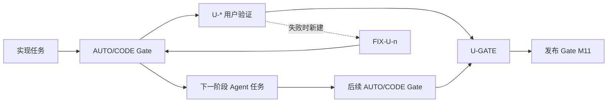

# AbyssalCraft 用户真人验证车道（User Validation Lane）

> 本文只管理必须由真人客户端完成的交互、视觉与听觉验收。代码实现、自动自测、双节点构建和专服验证仍由[总任务表](01-porting-task-plan.md)与[平行任务表](02-porting-parallel-tasks.md)管理。
>
> 状态：☐ 未完成 · ☑ 已完成 · ⛔ 被环境阻塞。用户任务不使用“部分完成”；一次矩阵过完才改为 ☑。

## 1. 无环规则

1. 所有 `U-*` 任务只依赖一个已经完成的 `*-AUTO-GATE` 或 `*-CODE-GATE`。
2. 任何 Agent 代码任务、自动 Gate、R4/R5/R6/R7 阶段解锁都不得依赖 `U-*`；用户验证只汇入最终 `U-GATE`，并由 `U-GATE` 阻塞发布 Gate M11。
3. `U-*` 不拥有生产源码、资源、注册接力文件或共享文档。每项证据独占 `run/validation/user/<U-ID>/`；协调 Agent 串行回写本文及两张任务表。
4. 用户发现缺陷时，新建 `FIX-<U-ID>-<n>` 交还原源码 owner。修复任务依赖对应自动 Gate，完成后重新运行该自动 Gate，再重测原 `U-*`；禁止让原实现任务依赖用户任务，避免环依赖。
5. 用户矩阵可以在其自动前置完成后随时执行，不必等待后续代码阶段；未执行不会阻塞其他 Agent 开工。
6. 同一工作区的 Stonecutter 切节点、`runData`、`build`、`runClient` 和联网矩阵由协调 Agent 串行调度，避免生成目录和运行世界互相覆盖。

## 2. 剩余用户矩阵

| ID | 状态 | 真人验收范围 | 自动前置 | 证据目录 | 映射任务 |
|---|---|---|---|---|---|
| U-CONTENT | ☐ | Forge/Neo 建材门、按钮、压板、树叶/原木；muck/thorn/草传播；四级工具实挖 | R1-Gate | `run/validation/user/U-CONTENT/` | T1.3c,T1.5c,T1.6c |
| U-WORLD | ☐ | 四维地形/天空、结构旋转与拼缝、动态 marker 玩法、长时生态及玩家 Portal 最终往返 | RR-WORLD-FIDELITY-AUTO,R4-CODE-GATE | `run/validation/user/U-WORLD/` | T5.2c-5.4c,T5.6c,T5.9b |
| U-R4 | ☐ | Portal 正反向/目标锚点/破坏/重启；Spellbook 与即时/蓄力卷轴；仪式成功失败、chant、祭品粒子与声音 | R4-AUTO-GATE | `run/validation/user/U-R4/` | 原 R4-LIVE-GATE,T5.7b live 片段 |
| U-NET | ☐ | Forge/Neo 23 消息真实客户端↔专服收发、线程/权限/方向；necrodata 死亡、重连和停服恢复 | RR-NET-AUTO | `run/validation/user/U-NET/` | T7.1c live 片段,T7.2c |
| U-GUI | ☐ | 现有五机器及 State Transformer、Rending、Energy、Facebook、Bag/Tablet/Spellbook；书页、HUD、Aklo、clientvars、5 keybind | RR-CLIENT-GUI-AUTO | `run/validation/user/U-GUI/` | T6.1b-e,T6.2c,T6.6e |
| U-FX | ☐ | 四维天空/雾；关键环境、实体、仪式、Boss 声音与字幕 | RR-CLIENT-FX-AUTO | `run/validation/user/U-FX/` | T6.3c,T6.5c |
| U-JEI | ☐ | 全分类、燃料、多输入/双输出、催化剂、点击区与配方转移；缺 JEI 启动负测 | RR-JEI-AUTO | `run/validation/user/U-JEI/` | TP.5b,TP.7b,T8.1c |
| U-SYSTEM | ☐ | research/书门控、五附魔、配置 GUI、Dread Plague、复活消费与重启、剩余系统交互 | RR-CLIENT-GUI-AUTO,RR-SYSTEM-AUTO | `run/validation/user/U-SYSTEM/` | T7.8c,T7.9b-c,T7.10c,T7.11c,T8.2c 的 live 片段 |
| U-FINAL | ☐ | 两节点全内容客户端回归：创造栏、放置、机器、GUI、实体、维度、仪式、法术、PE、JEI | R7b-GATE,U-CONTENT,U-WORLD,U-R4,U-NET,U-GUI,U-FX,U-JEI,U-SYSTEM | `run/validation/user/U-FINAL/` | T11.1 |

## 3. 用户验收协议

- 每个 `U-*` 由用户操作，验证协调 Agent 提供命令、测试世界和逐项检查表，并记录客户端/服务端日志、截图及重启前后关键字段。
- 用户只报告“通过”或具体可复现缺陷；不要求用户判断代码归属、修改源码或更新共享任务表。
- 一项中任一加载器失败，则该项保持 ☐。修复后只重跑受影响子矩阵及其必要回归，但最终勾选必须同时具备 Forge 与 NeoForge 证据。
- 临时命令、系统属性、fixture、验证类和测试世界在对应自动/用户矩阵结束后清零；生产 JAR 审计必须确认其不存在。

## 4. U-GATE

`U-GATE` 仅在 `U-CONTENT`、`U-WORLD`、`U-R4`、`U-NET`、`U-GUI`、`U-FX`、`U-JEI`、`U-SYSTEM`、`U-FINAL` 全部为 ☑ 时通过。它不解锁任何实现阶段，只与自动发布检查共同阻塞 M11。
